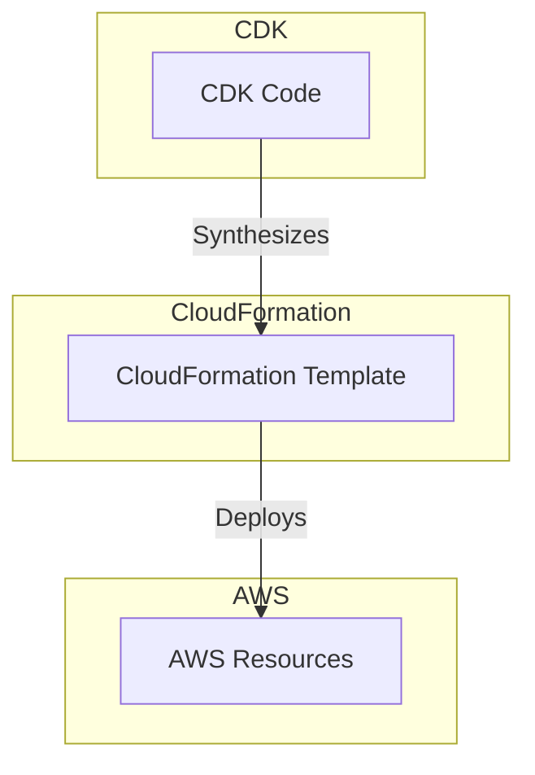
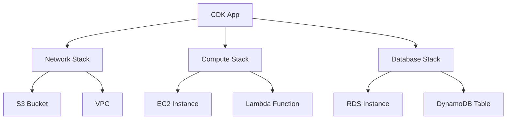

# AWS CDK Foundations

## Overview

The AWS Cloud Development Kit (CDK) is an open-source software development framework that allows developers to define cloud infrastructure using familiar programming languages such as TypeScript, JavaScript, Python, Go, Java, and C#. By leveraging the power of these high-level programming languages, AWS CDK enables developers to create reusable cloud components, called constructs, which can be composed together to build complex cloud applications.

## Learning Objectives

- Understand core CDK concepts and their relationship to CloudFormation
- Set up a development environment for AWS CDK
- Create and deploy your first CDK application
- Learn best practices for infrastructure as code

## Basic Concepts: Stacks, Constructs, and Apps

Understanding the core concepts of AWS CDK is crucial to effectively using the framework:

1. **Stacks**:

   - A stack is the fundamental deployment unit in AWS CDK
   - It represents a collection of AWS resources that you can manage as a single unit
   - When you deploy a stack, AWS CDK generates a CloudFormation template and uses it to provision and manage the resources
   - Stacks can be deployed, updated, and deleted, and they allow you to encapsulate and manage all the resources required for a specific application or environment

2. **Constructs**:

   - Constructs are the basic building blocks of AWS CDK applications
   - They are reusable cloud components that encapsulate AWS resources and their configurations
   - Constructs can range from low-level constructs, which directly represent AWS resources (like an S3 bucket or an EC2 instance), to high-level constructs, which represent complex architectures
   - Constructs can be composed together to form more complex constructs, promoting reuse and reducing the need to write boilerplate code

3. **Apps**:
   - An app in AWS CDK serves as a container for one or more stacks
   - It defines the scope of deployment and orchestrates the lifecycle of the stacks it contains
   - An app is instantiated in your main entry point file (e.g., `app.ts` or `app.py`), and you can define multiple stacks within the app to organize your resources logically and manage dependencies between them

[DIAGRAM: CDK Architecture Overview]

[DIAGRAM: Stack and Construct Hierarchy]

[DIAGRAM: State Management Flow]
This diagram requires AWS service icons and complex flow representation, so it will be created using draw.io:

1. Create a new diagram using the AWS Architecture 2023 template
2. Use the following symbols:
   - AWS CloudFormation icon
   - AWS Systems Manager icon for state management
   - AWS CloudWatch icon for monitoring
3. Layout:
   - Create a flowchart using AWS's standard flowchart shapes
   - Use diamond shapes for decision points
   - Use AWS's standard connector arrows
4. Add process boxes for:
   - Current State Check
   - Desired State Comparison
   - Change Detection
   - Resource Update
   - Rollback Process
5. Use AWS's standard color scheme for all elements

## Understanding AWS CloudFormation

AWS CloudFormation is the underlying service that AWS CDK uses to provision and manage AWS resources. CloudFormation allows you to define your infrastructure as code using JSON or YAML templates. These templates describe the resources and their configurations, and CloudFormation handles the provisioning, updating, and deletion of these resources in a predictable and orderly manner.

When you use AWS CDK:

- You write your infrastructure code in a high-level programming language
- CDK synthesizes this code into a CloudFormation template
- CloudFormation uses the template to deploy the specified resources

This approach provides several benefits:

- **Infrastructure as Code (IaC)**: Version control your infrastructure and apply software engineering practices
- **Repeatability**: Deploy infrastructure consistently, reducing human error
- **Automation**: Automate resource provisioning and management for better scalability

[DIAGRAM: State Management Flow]
Description: A detailed flowchart showing how CloudFormation manages infrastructure state. The diagram should:

1. Show the current state and desired state comparison process
2. Illustrate the change detection mechanism
3. Display the resource update flow
4. Show the state tracking and rollback capabilities
   Include decision points and feedback loops. Use AWS's standard color scheme with blue for AWS services and green for CDK components.

## State Management

AWS CloudFormation manages the state of your infrastructure by maintaining a record of the resources it has provisioned. This state management ensures that changes to your infrastructure are tracked and managed correctly. When you update a stack, CloudFormation:

- Compares the desired state (defined in your template) with the current state
- Makes only the necessary changes to achieve the desired state
- Helps prevent configuration drift and ensures infrastructure consistency

## Why CDK?

There are many options for deploying resources in AWS. Let's compare the main approaches:

**AWS CDK**:

- Use when you want to define infrastructure using familiar programming languages
- Ideal for developers who prefer writing code over configuration
- Enables code reuse and testing
- Abstracts CloudFormation complexity
- Provides high-level constructs for common patterns

**AWS Management Console**:

- Suitable for simple and ad-hoc tasks
- Good for beginners learning AWS services
- Less suitable for managing complex environments
- Difficult to version control and automate

**AWS CLI**:

- Powerful tool for scripting and automation
- Provides fine-grained control over AWS services
- Ideal for command-line operations
- Part of larger automation workflows

**AWS SDKs**:

- Best for programmatic access to AWS services
- Integrates AWS services into applications
- Automates complex workflows
- Primarily for runtime operations, not infrastructure definition

**AWS CloudFormation**:

- Uses JSON or YAML templates
- Provides robust state management
- Suitable for infrastructure as code
- Can be complex for large deployments
- CDK simplifies template creation

## Deployment Methods Comparison

| Characteristic          | AWS CDK                      | AWS Console | AWS CLI      | AWS SDK    | CloudFormation       |
| ----------------------- | ---------------------------- | ----------- | ------------ | ---------- | -------------------- |
| Development Approach    | Code (TypeScript/Python/etc) | UI          | CLI Commands | Code (SDK) | Template (YAML/JSON) |
| Learning Curve          | Very High                    | Very Low    | Very High    | Very High  | Moderate             |
| Reusability             | Very High                    | Low         | Moderate     | High       | High                 |
| Automation Capabilities | Very High                    | Low         | High         | High       | Very High            |
| State Management        | Excellent                    | Manual      | Manual       | Manual     | Excellent            |

## What's Next?

In the next section, we'll set up your development environment and create your first CDK application. You'll learn how to:

- Install and configure the CDK toolkit
- Initialize a new CDK project
- Define and deploy your first stack
- Validate your deployment

This hands-on experience will help solidify your understanding of the concepts covered in this introduction.
