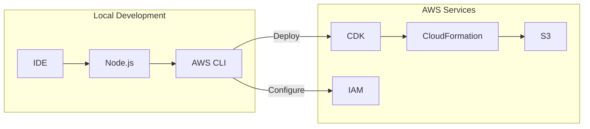
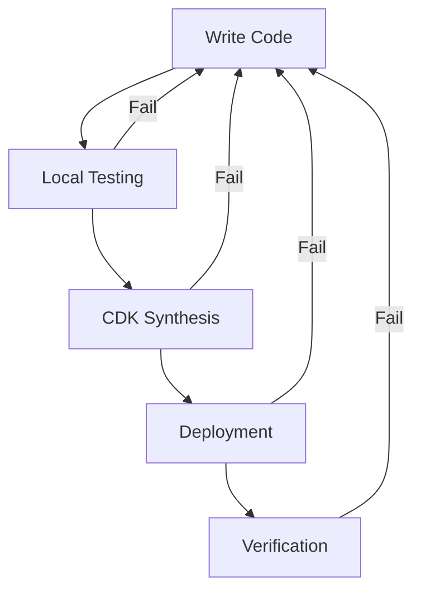

# Setting Up Your Development Environment

[DIAGRAM: Development Environment Setup]



## Prerequisites

Before starting this lab, ensure you have:

- An AWS account with appropriate permissions
- Node.js (version 18.x or later, 22.x LTS recommended) installed
- AWS CLI version 2 installed
- A code editor (VS Code recommended)

## Configure AWS Credentials

First, let's set up your AWS credentials using AWS IAM Identity Center (formerly AWS SSO):

1. **Configure AWS CLI with IAM Identity Center**:

   ```bash
   aws configure sso
   ```

   You'll need to provide:

   - SSO start URL (from your AWS administrator)
   - SSO Region
   - Default client Region
   - Default output format (json recommended)

2. **Verify Configuration**:

   ```bash
   aws sts get-caller-identity --profile your-profile-name
   ```

   This should display your AWS account ID, user ID, and ARN.

## Set Up Your CDK Environment

1. **Install the AWS CDK Toolkit**:

   ```bash
   npm install -g aws-cdk
   ```

   Verify the installation:

   ```bash
   cdk --version
   ```

2. **Bootstrap Your AWS Environment**:

   ```bash
   cdk bootstrap --profile your-profile-name
   ```

   This creates the necessary resources in your AWS account to deploy CDK applications.

## Create Your First CDK Project

1. **Initialize a New Project**:

   ```bash
   mkdir my-cdk-app
   cd my-cdk-app
   cdk init app --language typescript
   ```

2. **Install Dependencies**:
   ```bash
   npm install
   ```

## Project Structure Overview

Let's examine the key files created by CDK:

- `bin/my-cdk-app.ts`: Entry point for your CDK app
- `lib/my-cdk-app-stack.ts`: Main stack definition
- `cdk.json`: CDK configuration file
- `package.json`: Project dependencies and scripts
- `tsconfig.json`: TypeScript configuration

## Create Your First Stack

1. **Open `lib/my-cdk-app-stack.ts`** and replace its contents with:

   ```typescript
   import { Stack, StackProps, CfnOutput } from "aws-cdk-lib";
   import { Construct } from "constructs";

   export class MyCdkAppStack extends Stack {
     constructor(scope: Construct, id: string, props?: StackProps) {
       super(scope, id, props);

       // Add a CloudFormation output
       new CfnOutput(this, "MyFirstOutput", {
         value: "Hello, AWS CDK!",
         description: "A simple output to verify our CDK deployment",
         exportName: "MyFirstOutput",
       });
     }
   }
   ```

2. **Synthesize the CloudFormation Template**:

   ```bash
   cdk synth --profile your-profile-name
   ```

   This command generates the CloudFormation template from your CDK code. Review the output to see the YAML template that CDK created.

3. **Deploy the Stack**:

   ```bash
   cdk deploy --profile your-profile-name
   ```

   When prompted to approve security-related changes, review them and enter 'y' to proceed.

## Verify Your Deployment

1. **Check CloudFormation Console**:

   - Open the AWS Management Console
   - Navigate to CloudFormation
   - Find your stack in the list
   - Check the "Outputs" tab to see your "Hello, AWS CDK!" message

2. **Using AWS CLI**:
   ```bash
   aws cloudformation describe-stacks \
     --stack-name my-cdk-app \
     --query 'Stacks[0].Outputs[0].OutputValue' \
     --profile your-profile-name
   ```

## Validate Your CDK Environment

After deployment, verify your CDK setup is working correctly:

### 1. CDK Environment Check

```bash
# Check CDK version and environment
cdk doctor --profile your-profile-name

# List all stacks in your account
cdk list --profile your-profile-name

# Show stack differences (should show no changes after deployment)
cdk diff --profile your-profile-name
```

### 2. Bootstrap Verification

```bash
# Verify CDK bootstrap stack exists
aws cloudformation describe-stacks \
  --stack-name CDKToolkit \
  --profile your-profile-name

# Check S3 bucket for CDK assets
aws s3 ls | grep cdk
```

## Advanced Troubleshooting

### Common CDK Issues and Solutions

1. **CDK Version Mismatches**:

   ```bash
   # Check for version conflicts
   npm list aws-cdk

   # Update to latest CDK version
   npm update -g aws-cdk
   npm update
   ```

2. **Context Value Issues**:

   ```bash
   # Clear CDK context cache
   cdk context --clear

   # View current context
   cdk context
   ```

3. **Synthesis Errors**:

   ```bash
   # Get detailed synthesis output
   cdk synth --verbose --profile your-profile-name

   # Validate CloudFormation template
   aws cloudformation validate-template \
     --template-body file://cdk.out/MyCdkAppStack.template.json
   ```

### Environment-Specific Configuration

Add environment-specific settings to your CDK app:

```typescript
// In bin/my-cdk-app.ts
import * as cdk from 'aws-cdk-lib';
import { MyCdkAppStack } from '../lib/my-cdk-app-stack';

const app = new cdk.App();

// Development environment
new MyCdkAppStack(app, "MyCdkApp-Dev", {
  env: {
    account: process.env.CDK_DEFAULT_ACCOUNT,
    region: process.env.CDK_DEFAULT_REGION,
  },
  tags: {
    Environment: "Development",
    Project: "Workshop",
  },
});

// Production environment (commented out for workshop)
// new MyCdkAppStack(app, 'MyCdkApp-Prod', {
//   env: { account: 'PROD-ACCOUNT-ID', region: 'us-east-1' },
//   tags: { Environment: 'Production', Project: 'Workshop' }
// });
```

### CDK Best Practices

1. **Resource Naming** - Use consistent naming conventions:

   ```typescript
   // Use descriptive names with environment prefixes
   const bucket = new s3.Bucket(this, 'MyAppDataBucket', {
     bucketName: `myapp-data-${props.environment}`,
   });
   ```

2. **Implement CDK Aspects** for cross-cutting concerns:

   ```typescript
   import { IAspect, IConstruct } from "constructs";
   import { CfnResource, Aspects, Tag } from "aws-cdk-lib";

   class SecurityAspect implements IAspect {
     visit(node: IConstruct): void {
       if (node instanceof CfnResource) {
         // Add security tags to all resources
         Aspects.of(node).add(new Tag("SecurityLevel", "Workshop"));
       }
     }
   }

   // Apply to your stack
   Aspects.of(this).add(new SecurityAspect());
   ```

## Clean Up

When you're done experimenting, clean up your resources:

```bash
cdk destroy --profile your-profile-name
```

## Troubleshooting Tips

If you encounter issues:

1. **CDK Bootstrap Errors**:

   - Ensure you have sufficient IAM permissions
   - Check if the region is correctly specified
   - Verify your AWS credentials are properly configured

2. **Deployment Failures**:

   - Review the CloudFormation events in the AWS Console
   - Check your CDK code for syntax errors
   - Ensure all required dependencies are installed

3. **Permission Issues**:
   - Verify your IAM permissions
   - Check if your SSO session is still active
   - Try refreshing your SSO credentials

## Best Practices

1. **Version Control**:

   - Initialize a git repository for your CDK project
   - Create a `.gitignore` file (CDK generates this for you)
   - Commit your changes regularly

2. **Code Organization**:

   - Keep stacks focused and single-purpose
   - Use constructs to encapsulate reusable components
   - Comment your code appropriately

3. **Security**:
   - Review security changes before deployment
   - Follow the principle of least privilege
   - Use environment-specific configurations

## Next Steps

Now that you've created and deployed your first CDK application, you're ready to:

- Learn about more advanced CDK concepts
- Create more complex stacks
- Explore AWS service constructs
- Build reusable infrastructure patterns

In the next lab, we'll build on these foundations to create more sophisticated infrastructure components.

[DIAGRAM: CDK Development Workflow]


