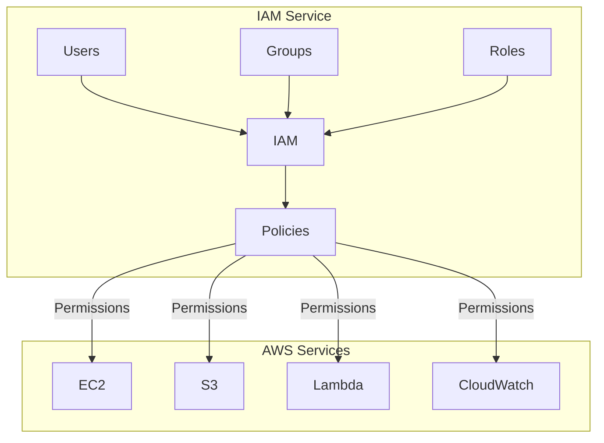
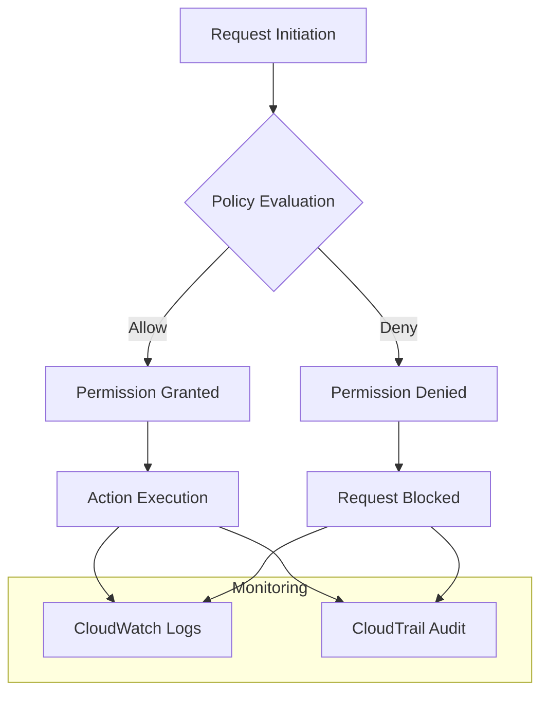

# Identity and Access Management (IAM)

## Overview

AWS Identity and Access Management (IAM) is a web service that helps you securely control access to AWS resources. With IAM, you can manage who (identity) or what (role) can access specific resources and how they can access them.

[DIAGRAM: IAM Overview]



## Learning Objectives

- Understand IAM core concepts and best practices
- Create and manage IAM roles and policies
- Implement the principle of least privilege
- Configure permissions for AWS services

## Core Concepts

### IAM Roles

An IAM role is an AWS identity with permission policies that determine what the identity can and cannot do in AWS. Unlike an IAM user, a role:

- Doesn't have permanent credentials
- Is assumable by anyone or anything that needs it
- Is ideal for granting temporary access to AWS resources

### IAM Policies

Policies are documents that define permissions. A policy typically includes:

- **Actions**: What actions are allowed or denied
- **Resources**: Which AWS resources the actions apply to
- **Effect**: Whether to allow or deny access
- **Conditions**: Optional circumstances under which the policy is in effect

### Example IAM Role

Here's a typical role that allows EC2 instances to read from an S3 bucket:

1. **Trust Policy** (defines who can assume the role):

```json
{
  "Version": "2012-10-17",
  "Statement": [
    {
      "Effect": "Allow",
      "Principal": {
        "Service": "ec2.amazonaws.com"
      },
      "Action": "sts:AssumeRole"
    }
  ]
}
```

2. **Permission Policy** (defines what the role can do):

```json
{
  "Version": "2012-10-17",
  "Statement": [
    {
      "Effect": "Allow",
      "Action": "s3:GetObject",
      "Resource": "arn:aws:s3:::example-bucket/*"
    }
  ]
}
```

## Policy Evaluation Logic

When IAM evaluates a request, it follows these rules:

1. **Default Deny**: By default, all requests are denied
2. **Explicit Allow**: An explicit allow in a policy overrides the default deny
3. **Explicit Deny**: An explicit deny in any policy overrides any allows

### Complex Policy Example

Here's a more sophisticated policy that demonstrates multiple permission types:

```json
{
  "Version": "2012-10-17",
  "Statement": [
    {
      "Effect": "Allow",
      "Action": "s3:ListAllMyBuckets",
      "Resource": "arn:aws:s3:::*"
    },
    {
      "Effect": "Allow",
      "Action": ["s3:GetObject", "s3:ListBucket"],
      "Resource": ["arn:aws:s3:::*"]
    },
    {
      "Effect": "Allow",
      "Action": ["s3:PutObject", "s3:GetObject", "s3:DeleteObject"],
      "Resource": "arn:aws:s3:::example-bucket/*"
    },
    {
      "Effect": "Deny",
      "Action": "s3:DeleteObject",
      "Resource": "arn:aws:s3:::restricted-bucket/*"
    }
  ]
}
```

This policy:

- Allows listing all S3 buckets
- Allows reading objects from any bucket
- Allows full access to objects in `example-bucket`
- Explicitly denies deleting objects in `restricted-bucket`

[DIAGRAM: IAM Permission Flow]



## Best Practices

1. **Principle of Least Privilege**

   - Grant only the permissions required for a task
   - Regularly review and remove unused permissions

2. **Use IAM Groups**

   - Assign permissions to groups rather than individual users
   - Manage permissions collectively for similar users

3. **Regular Rotation**

   - Rotate credentials regularly
   - Remove unused credentials and permissions

4. **Use MFA**

   - Enable multi-factor authentication
   - Especially important for privileged users

5. **Use IAM Roles**
   - Use roles for applications running on EC2
   - Avoid storing credentials in code or on instances

## What's Next

In the hands-on section, you'll:

- Create IAM roles and policies using AWS CDK
- Configure permissions for AWS services
- Test and validate IAM permissions
- Learn to troubleshoot common IAM issues
