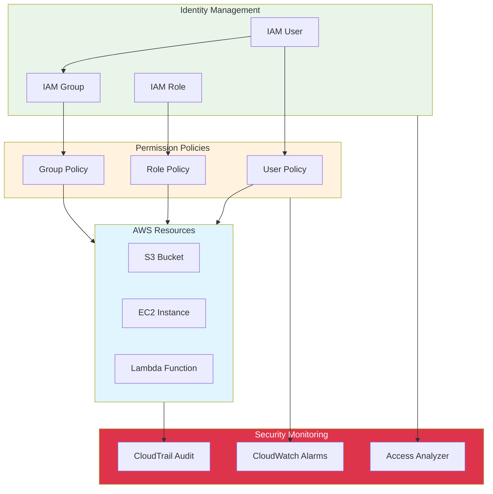

# Identity and Access Management (IAM)

## Overview

AWS Identity and Access Management (IAM) is a web service that helps you securely control access to AWS resources. With IAM, you can manage who (identity) or what (role) can access specific resources and how they can access them. This lab focuses on practical IAM implementation with monitoring, auditing, and troubleshooting capabilities.

[DIAGRAM: IAM Architecture Overview]

## Learning Objectives

After completing this lab, you will be able to:

- Understand IAM core concepts and best practices
- Create and manage IAM roles and policies
- Implement the principle of least privilege
- Configure permissions for AWS services
- Set up IAM monitoring and security alerts
- Use CloudTrail for access auditing
- Troubleshoot permission issues effectively
- Apply security monitoring best practices

## Architecture Overview

This lab implements a production-ready IAM setup with:

- Lambda function with least-privilege IAM role
- S3 bucket with proper access controls
- CloudTrail logging for all IAM actions
- CloudWatch alarms for security monitoring
- Access analysis and monitoring tools
- Comprehensive error handling and debugging

## Security Monitoring Features

1. **Access Tracking**

   - CloudTrail logs for all API calls
   - IAM action monitoring
   - Failed access attempt detection
   - Access pattern analysis

2. **Real-time Alerting**

   - Unusual access pattern alerts
   - Permission escalation detection
   - Failed authentication monitoring
   - Root account usage alerts

3. **Compliance and Auditing**
   - Complete audit trail of all actions
   - Permission change tracking
   - Resource access logging
   - Security compliance reporting

## Best Practices Covered

1. **Security**

   - Principle of least privilege
   - Regular permission auditing
   - Multi-factor authentication
   - Credential rotation

2. **Monitoring**

   - CloudTrail integration
   - Security event alerting
   - Access pattern analysis
   - Automated compliance checking

3. **Operations**
   - Error handling and debugging
   - Permission troubleshooting
   - Security incident response
   - Documentation and logging
