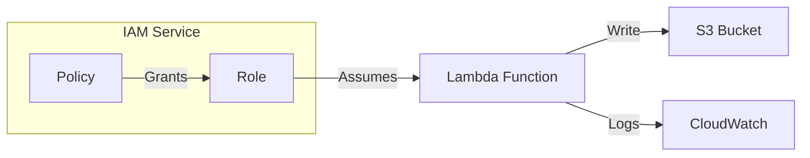
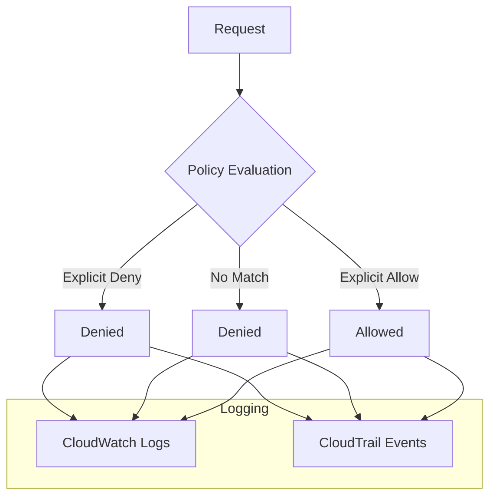

# IAM Permissions - Hands-on Lab

[DIAGRAM: IAM Hands-on Architecture]



## Prerequisites

- Completed the CDK Foundations lab
- AWS CDK installed and configured
- AWS CLI with appropriate permissions

## Lab Overview

In this lab, you'll:

1. Create an S3 bucket with a destroy policy
2. Create a Lambda function that writes to the bucket
3. Set up IAM roles and policies to manage permissions
4. Test and validate the permissions

## Step-by-Step Instructions

### 1. Update Your CDK Stack

Open your stack file and replace its contents with:

```typescript
import { CfnOutput, RemovalPolicy, Stack, StackProps } from "aws-cdk-lib";
import {
  Policy,
  PolicyStatement,
  Role,
  ServicePrincipal,
} from "aws-cdk-lib/aws-iam";
import { Code, Function, Runtime } from "aws-cdk-lib/aws-lambda";
import { Bucket } from "aws-cdk-lib/aws-s3";
import { Construct } from "constructs";

export class AwsFundamentalsWorkshopLabsStack extends Stack {
  constructor(scope: Construct, id: string, props?: StackProps) {
    super(scope, id, props);

    // Create an S3 bucket with a destroy policy
    const bucket = new Bucket(this, "MyBucket", {
      removalPolicy: RemovalPolicy.DESTROY,
      autoDeleteObjects: true,
    });

    // Define an IAM Role for Lambda
    const lambdaRole = new Role(this, "LambdaRole", {
      assumedBy: new ServicePrincipal("lambda.amazonaws.com"),
    });

    // Incorrect IAM Policy (missing s3:PutObject permission)
    const incorrectPolicy = new Policy(this, "IncorrectPolicy", {
      statements: [
        new PolicyStatement({
          actions: ["s3:GetObject"],
          resources: [bucket.bucketArn + "/*"],
        }),
      ],
    });

    // Attach the incorrect policy to the Lambda role
    lambdaRole.attachInlinePolicy(incorrectPolicy);

    // Create a Lambda function with inline code
    const lambdaFunction = new Function(this, "MyLambda", {
      runtime: Runtime.NODEJS_20_X,
      handler: "index.handler",
      code: Code.fromInline(`
        const { S3Client, PutObjectCommand } = require('@aws-sdk/client-s3');
        const s3Client = new S3Client();

        exports.handler = async function(event) {
          const params = {
            Bucket: process.env.BUCKET_NAME,
            Key: 'hello.txt',
            Body: 'Hello World',
            ContentType: 'text/plain'
          };
          try {
            await s3Client.send(new PutObjectCommand(params));
            return {
              statusCode: 200,
              body: 'File written!'
            };
          } catch (error) {
            console.error('Error:', error);
            return {
              statusCode: 500,
              body: 'Error writing file'
            };
          }
        }
      `),
      environment: {
        BUCKET_NAME: bucket.bucketName,
      },
      role: lambdaRole,
    });

    // Output the Lambda function name and bucket name
    new CfnOutput(this, "LambdaFunctionName", {
      value: lambdaFunction.functionName,
    });

    new CfnOutput(this, "BucketName", {
      value: bucket.bucketName,
    });
  }
}
```

### 2. Deploy the Stack

```bash
cdk deploy --profile your-profile-name
```

You'll see a security prompt like this:


Review the IAM changes carefully before confirming.

### 3. Test the Initial Setup

Let's invoke the Lambda function to see the permission error:

```bash
aws lambda invoke \
    --function-name FUNCTION_NAME \
    --payload '{}' \
    --cli-binary-format raw-in-base64-out \
    --profile your-profile-name \
    response.json
```

You should see an error because the Lambda function lacks the required `s3:PutObject` permission.

### 4. Fix the Permissions

Update the policy in your stack:

```typescript
// Correct IAM Policy
const correctPolicy = new Policy(this, "CorrectPolicy", {
  statements: [
    new PolicyStatement({
      actions: ["s3:GetObject", "s3:PutObject"],
      resources: [bucket.bucketArn + "/*"],
    }),
  ],
});

// Attach the correct policy to the Lambda role
lambdaRole.attachInlinePolicy(correctPolicy);
```

Deploy the updated stack:

```bash
cdk deploy --profile your-profile-name
```

### 5. Verify the Fix

Invoke the Lambda function again:

```bash
aws lambda invoke \
    --function-name FUNCTION_NAME \
    --payload '{}' \
    --cli-binary-format raw-in-base64-out \
    --profile your-profile-name \
    response.json
```

You should now see a successful response: `"File written!"`

## Understanding What Happened

1. **Initial Deployment**:

   - Created an S3 bucket
   - Created a Lambda function
   - Set up an IAM role with insufficient permissions

2. **Permission Error**:

   - Lambda couldn't write to S3
   - Error demonstrated the principle of least privilege

3. **Permission Fix**:
   - Added the required `s3:PutObject` permission
   - Demonstrated proper permission configuration

## Troubleshooting Tips

If you encounter issues:

1. **Permission Errors**:

   - Check the CloudWatch logs for the Lambda function
   - Review the IAM policy statements
   - Ensure the role is correctly attached to the Lambda

2. **Deployment Issues**:
   - Verify your AWS credentials
   - Check the CloudFormation events in the console
   - Ensure you have sufficient permissions to create IAM roles

## Clean Up

To avoid ongoing charges, clean up the resources:

```bash
cdk destroy --profile your-profile-name
```

## Next Steps

Now that you understand IAM permissions:

- Explore more complex IAM policies
- Learn about resource-based policies
- Practice the principle of least privilege
- Investigate AWS Organizations and SCPs

[DIAGRAM: Policy Evaluation Process]



## Creating IAM Resources

Now that we've configured IAM infrastructure, let's verify our setup:

```bash
# Deploy the IAM stack
cdk deploy IamStack --profile your-profile-name

# Test the IAM policies
aws sts get-caller-identity --profile your-profile-name

# List created IAM roles
aws iam list-roles --query 'Roles[?contains(RoleName, `Lambda`) || contains(RoleName, `EC2`)]' --profile your-profile-name
```

## Validation Steps

After completing this lab, verify that:

1. ✅ IAM roles created successfully
2. ✅ Policies attached to roles
3. ✅ Service principals configured correctly
4. ✅ Permissions working as expected
5. ✅ No excessive permissions granted

## Clean Up

```bash
cdk destroy IamStack --profile your-profile-name
```
