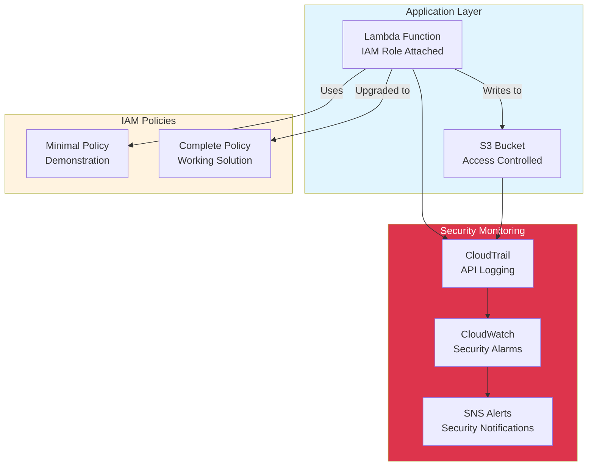

# IAM Permissions - Hands-on Lab

## Prerequisites

> Tip: Set the workshop region (Frankfurt)

```bash
export AWS_REGION=eu-central-1
```

> Tip: Set an AWS profile for this shell to avoid repeating profile flags

```bash
export AWS_PROFILE=your-profile-name
```

- Completed the CDK Foundations lab
- AWS CDK installed and configured
- AWS CLI with appropriate permissions

## Lab Overview

In this lab, you'll build a production-ready IAM setup with comprehensive monitoring and security features. You'll learn IAM fundamentals through practical examples while implementing security monitoring, auditing, and troubleshooting capabilities.

[DIAGRAM: IAM Lab Architecture]



## Step-by-Step Instructions

### 1. Create IAM Stack with Security Monitoring

Create a comprehensive IAM stack with monitoring capabilities:

```typescript
import * as cdk from "aws-cdk-lib"
import {
  CfnOutput,
  RemovalPolicy,
  Stack,
  StackProps,
  Duration,
} from "aws-cdk-lib"
import {
  Policy,
  PolicyStatement,
  Role,
  ServicePrincipal,
  Effect,
} from "aws-cdk-lib/aws-iam"
import { Code, Function, Runtime } from "aws-cdk-lib/aws-lambda"
import { Bucket } from "aws-cdk-lib/aws-s3"
import { Trail } from "aws-cdk-lib/aws-cloudtrail"
import { Alarm, Metric, TreatMissingData } from "aws-cdk-lib/aws-cloudwatch"
import { Topic } from "aws-cdk-lib/aws-sns"
import { EmailSubscription } from "aws-cdk-lib/aws-sns-subscriptions"
import { SnsAction } from "aws-cdk-lib/aws-cloudwatch-actions"
import { Construct } from "constructs"

export class IamStack extends Stack {
  constructor(scope: Construct, id: string, props?: StackProps) {
    super(scope, id, props)

    // Create S3 bucket for application data
    const bucket = new Bucket(this, "WorkshopBucket", {
      removalPolicy: RemovalPolicy.DESTROY,
      autoDeleteObjects: true,
      bucketName: `iam-workshop-${this.account}-${this.region}`,
    })

    // Create S3 bucket for CloudTrail logs
    const trailBucket = new Bucket(this, "CloudTrailBucket", {
      removalPolicy: RemovalPolicy.DESTROY,
      autoDeleteObjects: true,
      bucketName: `cloudtrail-iam-workshop-${this.account}-${this.region}`,
    })

    // Create SNS topic for security alerts
    const securityAlertTopic = new Topic(this, "SecurityAlerts", {
      displayName: "IAM Security Alerts",
    })

    // ⚠️ IMPORTANT: Replace YOUR_EMAIL_ADDRESS with your actual email address
    // You will receive security alerts at this email address
    securityAlertTopic.addSubscription(
      new EmailSubscription("YOUR_EMAIL_ADDRESS") // TODO: Replace with your actual email
    )

    // Create CloudTrail for auditing IAM actions
    const trail = new Trail(this, "IamAuditTrail", {
      bucket: trailBucket,
      trailName: "iam-workshop-audit-trail",
      includeGlobalServiceEvents: true,
      isMultiRegionTrail: true,
      enableFileValidation: true,
    })

    // Define Lambda execution role (initially with minimal permissions)
    const lambdaRole = new Role(this, "LambdaExecutionRole", {
      assumedBy: new ServicePrincipal("lambda.amazonaws.com"),
      description: "IAM role for Lambda function with least privilege access",
    })

    // Add CloudWatch Logs permissions (required for Lambda)
    lambdaRole.addToPolicy(
      new PolicyStatement({
        effect: Effect.ALLOW,
        actions: [
          "logs:CreateLogGroup",
          "logs:CreateLogStream",
          "logs:PutLogEvents",
        ],
        resources: [`arn:aws:logs:${this.region}:${this.account}:*`],
      })
    )

    // Start with minimal S3 permissions (this will cause an error initially)
    const minimalS3Policy = new Policy(this, "MinimalS3Policy", {
      statements: [
        new PolicyStatement({
          effect: Effect.ALLOW,
          actions: ["s3:GetObject"], // Missing s3:PutObject intentionally
          resources: [bucket.bucketArn + "/*"],
        }),
      ],
    })

    lambdaRole.attachInlinePolicy(minimalS3Policy)

    // Create Lambda function for testing IAM permissions
    const iamTestFunction = new Function(this, "IamTestFunction", {
      runtime: Runtime.NODEJS_22_X,
      handler: "index.handler",
      code: Code.fromInline(`
        const { S3Client, PutObjectCommand, GetObjectCommand } = require('@aws-sdk/client-s3');
        const s3Client = new S3Client({ region: process.env.AWS_REGION });

        exports.handler = async function(event) {
          const bucketName = process.env.BUCKET_NAME;
          const timestamp = new Date().toISOString();

          console.log('IAM Test Function invoked at:', timestamp);
          console.log('Testing IAM permissions for bucket:', bucketName);

          const operations = [];

          // Test 1: Try to write an object (this will fail initially)
          try {
            const putParams = {
              Bucket: bucketName,
              Key: \`test-\${timestamp}.txt\`,
              Body: \`IAM test file created at \${timestamp}\`,
              ContentType: 'text/plain'
            };

            console.log('Attempting to write object to S3...');
            await s3Client.send(new PutObjectCommand(putParams));
            operations.push({
              operation: 'PutObject',
              status: 'SUCCESS',
              key: putParams.Key
            });
            console.log('✅ Successfully wrote object to S3');

          } catch (error) {
            console.error('❌ Failed to write object to S3:', error.name, error.message);
            operations.push({
              operation: 'PutObject',
              status: 'FAILED',
              error: error.message,
              troubleshooting: {
                requiredPermission: 's3:PutObject',
                resourceArn: \`\${bucketName}/*\`,
                suggestion: 'Add s3:PutObject permission to Lambda role'
              }
            });
          }

          // Test 2: Try to read an object
          try {
            console.log('Attempting to read object from S3...');
            const getParams = {
              Bucket: bucketName,
              Key: 'test-file.txt'
            };

            await s3Client.send(new GetObjectCommand(getParams));
            operations.push({
              operation: 'GetObject',
              status: 'SUCCESS'
            });
            console.log('✅ Successfully read object from S3');

          } catch (error) {
            console.error('⚠️  Could not read object (this may be expected):', error.name);
            operations.push({
              operation: 'GetObject',
              status: 'FAILED',
              error: error.message,
              note: 'This may be expected if no objects exist'
            });
          }

          const response = {
            statusCode: operations.some(op => op.status === 'SUCCESS') ? 200 : 403,
            body: JSON.stringify({
              message: 'IAM permission test completed',
              timestamp,
              operations,
              summary: {
                total: operations.length,
                successful: operations.filter(op => op.status === 'SUCCESS').length,
                failed: operations.filter(op => op.status === 'FAILED').length
              }
            }, null, 2)
          };

          console.log('Test results:', JSON.stringify(response, null, 2));
          return response;
        }
      `),
      environment: {
        BUCKET_NAME: bucket.bucketName,
      },
      role: lambdaRole,
      timeout: Duration.seconds(30),
    })

    // CloudWatch alarms for security monitoring
    const failedPermissionAlarm = new Alarm(this, "FailedPermissionAlarm", {
      alarmName: "iam-workshop-failed-permissions",
      alarmDescription:
        "Alarm when Lambda function encounters permission errors",
      metric: iamTestFunction.metricErrors({
        period: Duration.minutes(5),
      }),
      threshold: 1,
      evaluationPeriods: 1,
      treatMissingData: TreatMissingData.NOT_BREACHING,
    })

    failedPermissionAlarm.addAlarmAction(new SnsAction(securityAlertTopic))

    // Alarm for unusual API activity (using CloudTrail metrics)
    const apiCallVolumeAlarm = new Alarm(this, "UnusualApiActivity", {
      alarmName: "iam-workshop-unusual-api-activity",
      alarmDescription: "Alert on unusual volume of API calls",
      metric: new Metric({
        namespace: "AWS/CloudTrailMetrics",
        metricName: "CallCount",
        dimensionsMap: {
          SourceIPAddress: "*",
        },
        period: Duration.minutes(5),
        statistic: "Sum",
      }),
      threshold: 100, // Adjust based on your normal usage
      evaluationPeriods: 2,
      treatMissingData: TreatMissingData.NOT_BREACHING,
    })

    apiCallVolumeAlarm.addAlarmAction(new SnsAction(securityAlertTopic))

    // Outputs for testing and monitoring
    new CfnOutput(this, "LambdaFunctionName", {
      value: iamTestFunction.functionName,
      description: "Lambda function name for IAM testing",
    })

    new CfnOutput(this, "BucketName", {
      value: bucket.bucketName,
      description: "S3 bucket name for testing access",
    })

    new CfnOutput(this, "CloudTrailArn", {
      value: trail.trailArn,
      description: "CloudTrail ARN for auditing IAM actions",
    })

    new CfnOutput(this, "SecurityAlertTopicArn", {
      value: securityAlertTopic.topicArn,
      description: "SNS topic ARN for security alerts",
    })

    new CfnOutput(this, "LambdaRoleArn", {
      value: lambdaRole.roleArn,
      description: "IAM role ARN used by Lambda function",
    })
  }
}
```

### 2. Deploy and Test Initial Setup (Permission Error)

Deploy the stack and test the initial permission configuration:

```bash
# Deploy the stack
cdk deploy IamStack

# Get function name for testing
export FUNCTION_NAME=$(aws cloudformation describe-stacks \
  --stack-name IamStack \
  --query 'Stacks[0].Outputs[?OutputKey==`LambdaFunctionName`].OutputValue' \
  --output text)

echo "Testing Lambda function: $FUNCTION_NAME"

# Test the function (this will show permission errors)
aws lambda invoke \
  --function-name $FUNCTION_NAME \
  --payload '{}' \
  --cli-binary-format raw-in-base64-out \
  response.json

# View the detailed response
cat response.json | jq .
```

### 3. Monitor Security Events

Set up monitoring to track IAM actions and security events:

```bash
# Subscribe to security alerts (replace with your email)
export ALERT_TOPIC=$(aws cloudformation describe-stacks \
  --stack-name IamStack \
  --query 'Stacks[0].Outputs[?OutputKey==`SecurityAlertTopicArn`].OutputValue' \
  --output text)

# ⚠️ IMPORTANT: Replace YOUR_EMAIL_ADDRESS with your actual email address
aws sns subscribe \
  --topic-arn $ALERT_TOPIC \
  --protocol email \
  --notification-endpoint YOUR_EMAIL_ADDRESS


# Check CloudTrail events for IAM actions
aws logs filter-log-events \
  --log-group-name CloudTrail/IamAuditTrail \
  --start-time $(date -d '10 minutes ago' +%s000) \
  --filter-pattern '{ ($.eventName = AssumeRole) || ($.eventName = PutObject) }' \


# Monitor Lambda function errors
aws logs filter-log-events \
  --log-group-name "/aws/lambda/$FUNCTION_NAME" \
  --start-time $(date -d '10 minutes ago' +%s000) \
  --filter-pattern 'ERROR' \

```

### 4. Analyze Permission Failures

Use CloudWatch and CloudTrail to understand permission failures:

```bash
# Check CloudWatch metrics for Lambda errors
aws cloudwatch get-metric-statistics \
  --namespace AWS/Lambda \
  --metric-name Errors \
  --dimensions Name=FunctionName,Value=$FUNCTION_NAME \
  --start-time $(date -u -d '1 hour ago' +%Y-%m-%dT%H:%M:%S) \
  --end-time $(date -u +%Y-%m-%dT%H:%M:%S) \
  --period 300 \
  --statistics Sum \


# Get detailed CloudTrail events for permission denials
aws logs filter-log-events \
  --log-group-name CloudTrail/IamAuditTrail \
  --start-time $(date -d '30 minutes ago' +%s000) \
  --filter-pattern '{ $.errorCode EXISTS }' \

```

### 5. Fix Permissions with Monitoring

Update your IAM policy to fix the permission issue while maintaining monitoring:

```typescript:lib/iam-stack.ts
// Replace the minimal policy with complete permissions
const completeS3Policy = new Policy(this, "CompleteS3Policy", {
  statements: [
    new PolicyStatement({
      effect: Effect.ALLOW,
      actions: [
        "s3:GetObject",
        "s3:PutObject",
        "s3:DeleteObject"
      ],
      resources: [bucket.bucketArn + "/*"],
    }),
    new PolicyStatement({
      effect: Effect.ALLOW,
      actions: ["s3:ListBucket"],
      resources: [bucket.bucketArn],
    }),
  ],
});

// Remove the old policy and attach the new one
lambdaRole.attachInlinePolicy(completeS3Policy);
```

Deploy the updated permissions:

```bash
# Deploy the updated stack
cdk deploy IamStack

# Test the function again
aws lambda invoke \
  --function-name $FUNCTION_NAME \
  --payload '{}' \
  --cli-binary-format raw-in-base64-out \
  response.json

# Check the successful response
cat response.json | jq .
```

### 6. Verify Security Monitoring

Confirm that your security monitoring is working:

```bash
# Check alarm status
aws cloudwatch describe-alarms \
  --alarm-names iam-workshop-failed-permissions \


# Verify CloudTrail is logging events
aws cloudtrail lookup-events \
  --lookup-attributes AttributeKey=EventName,AttributeValue=AssumeRole \
  --start-time $(date -d '1 hour ago' +%Y-%m-%d) \
  --end-time $(date +%Y-%m-%d) \


# Check S3 bucket contents
export BUCKET_NAME=$(aws cloudformation describe-stacks \
  --stack-name IamStack \
  --query 'Stacks[0].Outputs[?OutputKey==`BucketName`].OutputValue' \
  --output text)

aws s3 ls s3://$BUCKET_NAME
```

### 7. Load Test for Monitoring

Generate activity to test your monitoring setup:

```bash
# Create a load test script
cat > iam-load-test.sh << 'EOF'
#!/bin/bash
echo "Starting IAM monitoring load test..."

for i in {1..10}; do
  echo "Test iteration $i"
  aws lambda invoke \
    --function-name $FUNCTION_NAME \
    --payload '{}' \
    --cli-binary-format raw-in-base64-out \
    \
    /tmp/response$i.json &

  sleep 2
done

wait
echo "Load test completed. Check CloudWatch for metrics."
EOF

chmod +x iam-load-test.sh
./iam-load-test.sh
```

## Validation Steps

1. **IAM Configuration**

   - [ ] Lambda function has appropriate IAM role
   - [ ] Permissions follow least privilege principle
   - [ ] Function can access S3 successfully
   - [ ] CloudWatch logs permissions working

2. **Security Monitoring**

   - [ ] CloudTrail logging all IAM actions
   - [ ] CloudWatch alarms configured for errors
   - [ ] SNS alerts working for security events
   - [ ] Permission failures tracked and alerted

3. **Operational Readiness**
   - [ ] Error handling provides useful troubleshooting info
   - [ ] Monitoring captures all relevant security events
   - [ ] Audit trail available for compliance
   - [ ] Alert notifications reaching security team

## Troubleshooting Guide

### Common IAM Issues and Solutions

1. **Access Denied Errors**:

   ```bash
   # Check current policy attached to role
   aws iam list-attached-role-policies \
     --role-name YourLambdaRole \


   # Check inline policies
   aws iam list-role-policies \
     --role-name YourLambdaRole \

   ```

2. **Permission Escalation Detection**:

   ```bash
   # Look for privilege changes in CloudTrail
   aws logs filter-log-events \
     --log-group-name CloudTrail/IamAuditTrail \
     --filter-pattern '{ ($.eventName = AttachUserPolicy) || ($.eventName = AttachRolePolicy) || ($.eventName = PutUserPolicy) || ($.eventName = PutRolePolicy) }' \

   ```

3. **Monitoring Alert Verification**:
   ```bash
   # Test alarm by causing intentional errors
   aws lambda invoke \
     --function-name NonExistentFunction \
     --payload '{}' \
     \
     error-response.json || echo "Expected error for alarm testing"
   ```

## Security Best Practices Demonstrated

- **Principle of Least Privilege**: Started with minimal permissions
- **Continuous Monitoring**: Real-time security event tracking
- **Audit Trail**: Complete logging of all IAM actions
- **Proactive Alerting**: Automated notifications for security events
- **Error Analysis**: Comprehensive debugging and troubleshooting
- **Compliance Ready**: Full audit trail for regulatory requirements

## Clean Up

When finished with the lab:

```bash
# Clean up test files
rm -f response*.json iam-load-test.sh

# Destroy the stack
cdk destroy IamStack
```

This lab demonstrates production-ready IAM implementation with comprehensive security monitoring, giving you practical experience with both permissions management and security operations.
