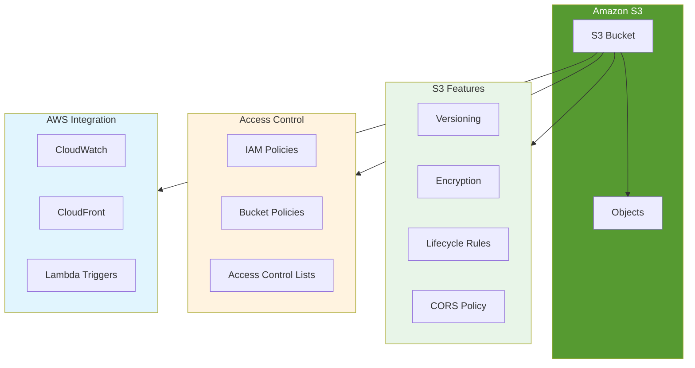

# Amazon S3 Basics

## Overview

Amazon Simple Storage Service (Amazon S3) is an object storage service offering industry-leading scalability, data availability, security, and performance. Organizations of all sizes can use S3 to store and protect any amount of data for various use cases, including websites, mobile applications, backup and restore, archive, enterprise applications, IoT devices, and big data analytics.

[DIAGRAM: S3 Architecture Overview]



## Learning Objectives

- Understand S3 core concepts and terminology
- Create and configure S3 buckets
- Manage objects within buckets
- Implement basic security controls
- Work with S3 programmatically using AWS CDK

## Core Concepts

### Buckets

- Containers for storing objects
- Names must be globally unique across all AWS accounts
- Created in a specific AWS Region
- Used to organize the Amazon S3 namespace at the highest level

### Objects

- Any file and optional metadata that describes the file
- Identified within a bucket by a unique key (name)
- Can be from 0 bytes to 5 terabytes in size
- Can be versioned for protection against accidental deletion

### Storage Classes

S3 offers different storage classes optimized for different use cases:

- **S3 Standard**: General-purpose storage for frequently accessed data
- **S3 Intelligent-Tiering**: Automatic cost optimization for data with changing access patterns
- **S3 Standard-IA**: For infrequently accessed data
- **S3 One Zone-IA**: For infrequently accessed data that doesn't require multi-AZ resilience
- **S3 Glacier**: Low-cost storage class for data archiving
- **S3 Glacier Deep Archive**: Lowest-cost storage class for long-term retention

### Access Control

S3 provides multiple ways to control access to your data:

1. **Bucket Policies**

   - Resource-based policies attached to buckets
   - Control access to all objects within a bucket
   - Written in JSON format

   Example bucket policy:

   ```json
   {
     "Version": "2012-10-17",
     "Statement": [
       {
         "Sid": "PublicReadForGetBucketObjects",
         "Effect": "Allow",
         "Principal": "*",
         "Action": "s3:GetObject",
         "Resource": "arn:aws:s3:::example-bucket/*"
       }
     ]
   }
   ```

2. **IAM Policies**

   - Identity-based policies attached to IAM users, groups, or roles
   - Control what actions IAM identities can perform on S3 resources

3. **Access Control Lists (ACLs)**
   - Legacy access control mechanism
   - Can be applied to buckets and objects
   - Limited in functionality compared to bucket policies

### Data Protection

S3 provides several features for protecting your data:

1. **Versioning**

   - Maintains multiple variants of objects
   - Protects against accidental deletions
   - Allows recovery of deleted objects

2. **Encryption**

   - Server-side encryption (SSE)
   - Client-side encryption
   - AWS KMS integration

3. **Access Logging**
   - Detailed records of requests made to a bucket
   - Useful for security and access auditing

### Common Use Cases

1. **Static Website Hosting**

   - Host static websites directly from S3
   - Configure custom domains
   - Integrate with CloudFront for global distribution

2. **Data Backup and Archive**

   - Reliable storage for backups
   - Different storage classes for cost optimization
   - Lifecycle policies for automatic archival

3. **Application Data Storage**

   - Store and retrieve application data
   - Integration with other AWS services
   - Scalable and highly available

4. **Data Lakes**
   - Central repository for structured and unstructured data
   - Analytics and big data processing
   - Integration with AWS analytics services

## Best Practices

1. **Naming and Organization**

   - Use meaningful, organized bucket names
   - Implement a consistent object key naming scheme
   - Use prefixes for logical grouping of objects

2. **Security**

   - Block all public access by default
   - Use bucket policies and IAM roles
   - Enable encryption at rest
   - Regularly audit access patterns

3. **Cost Optimization**

   - Choose appropriate storage classes
   - Implement lifecycle policies
   - Monitor and analyze usage patterns
   - Clean up unused resources

4. **Performance**
   - Use appropriate naming schemes for high request rates
   - Consider transfer acceleration for global access
   - Use multipart upload for large objects

## What's Next

In the hands-on section, you'll:

- Create and configure S3 buckets using AWS CDK
- Upload and manage objects
- Configure bucket policies and access controls
- Implement versioning and basic lifecycle rules
- Learn to work with S3 programmatically

[DIAGRAM: S3 Data Flow]

Instructions for draw.io:

1. Create a new diagram using the AWS Architecture 2023 template
2. Use the following AWS symbols from the symbol pack:
   - AWS S3 icon
   - AWS S3 Standard icon
   - AWS S3 Standard-IA icon
   - AWS S3 Glacier icon
   - AWS CloudWatch icon
   - AWS IAM icon
3. Layout:
   - Place S3 bucket at the center
   - Add storage classes on the right (Standard, Standard-IA, Glacier)
   - Add access patterns on the left (Console, CLI, SDK)
   - Add lifecycle management flow below
4. Use AWS's standard connector arrows to show:
   - Upload process
   - Storage transitions
   - Access patterns
   - Monitoring flow
5. Use AWS's standard color scheme:
   - Blue for AWS services
   - Green for storage classes
   - Gray for access patterns
6. Add clear labels for each component and flow
