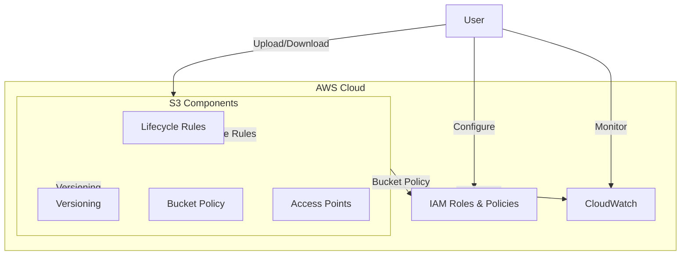
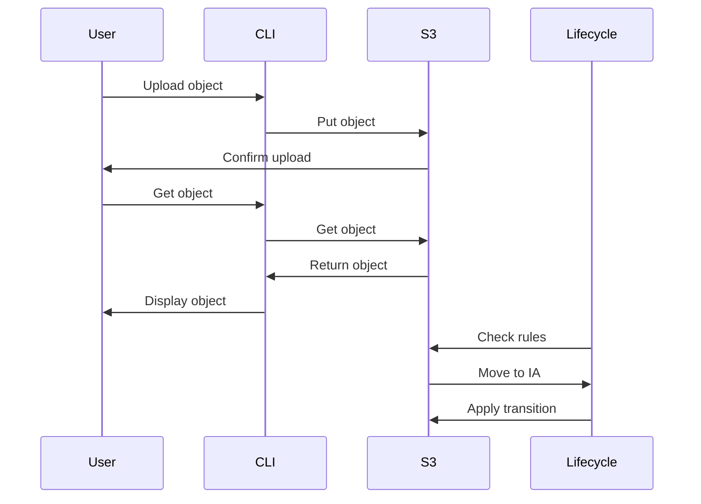

# S3 Basics - Hands-on Lab

[DIAGRAM: S3 Hands-on Architecture]



## Prerequisites

- Completed the CDK Foundations lab
- AWS CDK and CLI configured with appropriate permissions

## Lab Steps

### 1. Create an S3 Bucket with CDK

Update your stack file with the following code:

```typescript
import {
  CfnOutput,
  Duration,
  RemovalPolicy,
  Stack,
  StackProps,
} from "aws-cdk-lib";
import {
  Bucket,
  BucketEncryption,
  ObjectOwnership,
  StorageClass,
  BlockPublicAccess,
} from "aws-cdk-lib/aws-s3";
import { Construct } from "constructs";

export class AwsFundamentalsWorkshopLabsStack extends Stack {
  constructor(scope: Construct, id: string, props?: StackProps) {
    super(scope, id, props);

    // Create an S3 bucket with various configurations
    const bucket = new Bucket(this, "MyWorkshopBucket", {
      // Enable versioning for object version control
      versioned: true,

      // Enable encryption by default
      encryption: BucketEncryption.S3_MANAGED,

      // Configure lifecycle rules
      lifecycleRules: [
        {
          // Move objects to infrequent access tier after 30 days
          transitions: [
            {
              storageClass: StorageClass.INFREQUENT_ACCESS,
              transitionAfter: Duration.days(30),
            },
          ],
        },
      ],

      // Block all public access
      publicReadAccess: false,
      blockPublicAccess: BlockPublicAccess.BLOCK_ALL,

      // Ensure the bucket and its contents can be deleted when running cdk destroy
      removalPolicy: RemovalPolicy.DESTROY,
      autoDeleteObjects: true,

      // Use recommended settings for object ownership
      objectOwnership: ObjectOwnership.BUCKET_OWNER_PREFERRED,
    });

    // Output the bucket name for reference
    new CfnOutput(this, "BucketName", {
      value: bucket.bucketName,
      description: "The name of the S3 bucket",
    });
  }
}
```

Deploy the stack:

```bash
cdk deploy --profile your-profile-name
```

### 2. Interact with the Bucket

After deployment, let's interact with our bucket using the AWS CLI:

1. **Create a test file**:

```bash
echo "Hello, S3!" > test.txt
```

2. **Upload the file**:

```bash
aws s3 cp test.txt s3://BUCKET_NAME/test.txt --profile your-profile-name
```

3. **List bucket contents**:

```bash
aws s3 ls s3://BUCKET_NAME --profile your-profile-name
```

4. **Download the file**:

```bash
aws s3 cp s3://BUCKET_NAME/test.txt downloaded.txt --profile your-profile-name
```

### 3. Enable Versioning

Our bucket already has versioning enabled. Let's see it in action:

1. **Upload multiple versions**:

```bash
echo "Version 1" > test.txt
aws s3 cp test.txt s3://BUCKET_NAME/test.txt --profile your-profile-name

echo "Version 2" > test.txt
aws s3 cp test.txt s3://BUCKET_NAME/test.txt --profile your-profile-name
```

2. **List versions**:

```bash
aws s3api list-object-versions --bucket BUCKET_NAME --prefix test.txt --profile your-profile-name
```

### 4. Work with Lifecycle Rules

We've configured a lifecycle rule to move objects to STANDARD_IA storage class after 30 days. To verify this:

1. **Check object storage class**:

```bash
aws s3api head-object --bucket BUCKET_NAME --key test.txt --profile your-profile-name
```

2. **View lifecycle configuration**:

```bash
aws s3api get-bucket-lifecycle-configuration --bucket BUCKET_NAME --profile your-profile-name
```

### 5. Clean Up

When you're finished with this lab:

```bash
# Remove all objects from the bucket
aws s3 rm s3://BUCKET_NAME --recursive --profile your-profile-name

# Destroy the CDK stack
cdk destroy S3Stack --profile your-profile-name
```

## Validation Steps

After completing this lab, verify that:

1. ✅ S3 bucket created successfully
2. ✅ Bucket policy and CORS configured
3. ✅ Versioning enabled and working
4. ✅ Lifecycle rules applied
5. ✅ Objects uploaded and accessed via CLI
6. ✅ Encryption at rest enabled

## Troubleshooting

Common issues and solutions:

1. **Access Denied Errors**

   - Check IAM permissions
   - Verify bucket policy
   - Ensure correct bucket name

2. **Lifecycle Rules Not Working**

   - Check rule syntax
   - Verify object tags match rules
   - Allow time for rules to take effect

3. **Versioning Issues**
   - Confirm versioning is enabled
   - Check version IDs in responses
   - Verify delete markers

[DIAGRAM: S3 Operations Flow]


