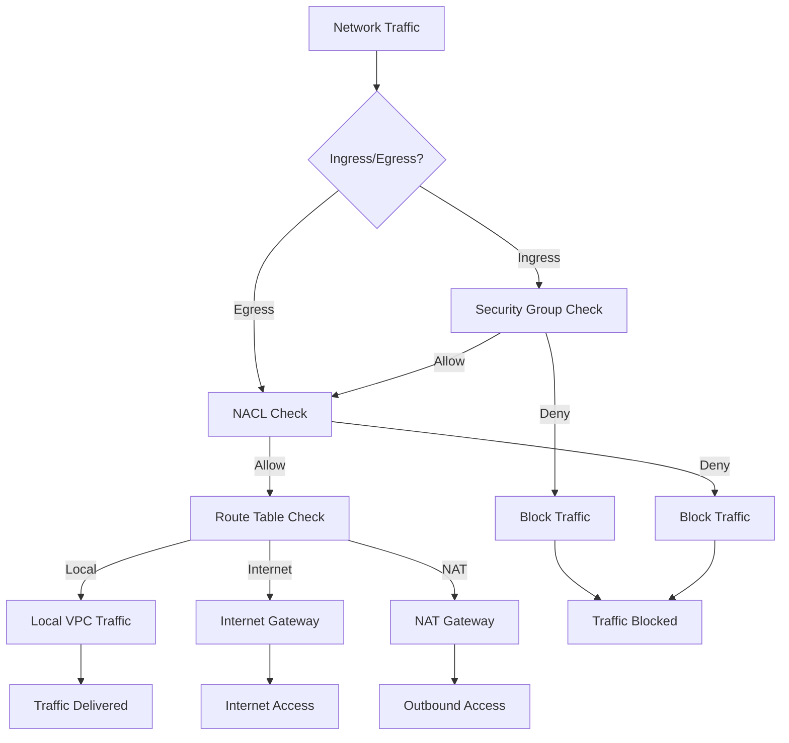

# VPC Networking with AWS CDK

## Overview

Amazon Virtual Private Cloud (VPC) is a service that lets you launch AWS resources in a logically isolated virtual network that you define. In this lab, you'll learn how to create and manage VPCs using AWS CDK.

[DIAGRAM: VPC Overview]

Instructions for draw.io:

1. Create a new diagram using the AWS Architecture 2023 template
2. Use the following AWS symbols from the symbol pack:
   - AWS VPC icon
   - AWS Subnet icon
   - AWS Route Table icon
   - AWS Internet Gateway icon
   - AWS NAT Gateway icon
   - AWS Security Group icon
   - AWS Network ACL icon
3. Layout:
   - Place VPC at the center
   - Add public and private subnets
   - Show route tables and gateways
   - Include security groups and NACLs
4. Use AWS's standard connector arrows to show:
   - Network flow
   - Security boundaries
   - Routing paths
5. Use AWS's standard color scheme:
   - Blue for AWS services
   - Green for public components
   - Red for private components
6. Add clear labels for each component

## Learning Objectives

- Understand VPC core concepts and components
- Design and implement a VPC with public and private subnets
- Configure routing and network access controls
- Implement security best practices for network architecture
- Use AWS CDK to create and manage VPC resources

## Core Concepts

### VPC Components

1. **Virtual Private Cloud (VPC)**

   - Logically isolated section of AWS Cloud
   - Defined IP address range (CIDR block)
   - Regional resource that can span multiple Availability Zones

2. **Subnets**

   - Segments of VPC IP address ranges
   - Created in specific Availability Zones
   - Can be public (internet-accessible) or private
   - Used to group resources based on security and operational needs

3. **Route Tables**

   - Control traffic flow between subnets
   - Define routes for network traffic
   - Associated with specific subnets

4. **Internet Gateway (IGW)**

   - Allows communication between VPC and internet
   - Provides a target for internet-routable traffic
   - Essential for public subnets

5. **NAT Gateway**
   - Allows private subnet resources to access internet
   - Prevents inbound connections from internet
   - Provides secure outbound connectivity

### Network Access Controls

1. **Security Groups**

   - Virtual firewalls for resources
   - Control inbound and outbound traffic
   - Stateful (return traffic automatically allowed)
   - Example:
     ```json
     {
       "Type": "AWS::EC2::SecurityGroup",
       "Properties": {
         "GroupDescription": "Allow web traffic",
         "SecurityGroupIngress": [
           {
             "IpProtocol": "tcp",
             "FromPort": 80,
             "ToPort": 80,
             "CidrIp": "0.0.0.0/0"
           }
         ]
       }
     }
     ```

2. **Network ACLs (NACLs)**
   - Network-level firewall for subnets
   - Control traffic in and out of subnets
   - Stateless (return traffic must be explicitly allowed)
   - Processed in order based on rule numbers

### IP Addressing and CIDR Blocks

1. **CIDR Notation**

   - Method for representing IP address ranges
   - Example: 10.0.0.0/16 (65,536 addresses)
   - Common VPC sizes:
     - /16: 65,536 addresses
     - /20: 4,096 addresses
     - /24: 256 addresses

2. **Subnet Sizing**
   - Plan for future growth
   - Reserve space for AWS services
   - Consider high availability requirements

### VPC Design Patterns

1. **Public-Private Architecture**

   ```
   VPC (10.0.0.0/16)
   ├── Public Subnet (10.0.1.0/24)
   │   ├── Internet Gateway
   │   └── Public Resources (Load Balancers, Bastion Hosts)
   └── Private Subnet (10.0.2.0/24)
       ├── NAT Gateway
       └── Private Resources (Applications, Databases)
   ```

2. **Multi-AZ Design**
   ```
   VPC (10.0.0.0/16)
   ├── AZ-1
   │   ├── Public Subnet (10.0.1.0/24)
   │   └── Private Subnet (10.0.2.0/24)
   └── AZ-2
       ├── Public Subnet (10.0.3.0/24)
       └── Private Subnet (10.0.4.0/24)
   ```

### Connectivity Options

1. **Internet Access**

   - Internet Gateway for public subnets
   - NAT Gateway for private subnets
   - Elastic IPs for static public addressing

2. **VPC Endpoints**

   - Connect to AWS services without internet
   - Interface endpoints (powered by PrivateLink)
   - Gateway endpoints (for S3 and DynamoDB)

3. **VPC Peering**
   - Connect VPCs together
   - Route traffic between VPCs
   - Works across regions and accounts

## Best Practices

1. **Security**

   - Use private subnets for sensitive resources
   - Implement least-privilege access controls
   - Enable VPC Flow Logs for monitoring
   - Use security groups as primary access control

2. **High Availability**

   - Deploy across multiple Availability Zones
   - Use redundant NAT Gateways
   - Implement fault-tolerant architectures

3. **IP Address Management**

   - Plan CIDR ranges carefully
   - Reserve space for future growth
   - Document IP address assignments
   - Use consistent subnet sizing

4. **Cost Optimization**
   - Use VPC endpoints where appropriate
   - Monitor NAT Gateway usage
   - Right-size CIDR blocks
   - Clean up unused resources

## What's Next

In the hands-on section, you'll:

- Create a VPC with public and private subnets
- Configure routing tables and internet access
- Set up security groups and NACLs
- Deploy resources across multiple Availability Zones
- Learn to troubleshoot common networking issues

[DIAGRAM: VPC Network Flow]



[DIAGRAM: VPC Components]

Instructions for draw.io:

1. Create a new diagram using the AWS Architecture 2023 template
2. Use the following AWS symbols from the symbol pack:
   - AWS VPC icon
   - AWS Subnet icon
   - AWS Route Table icon
   - AWS Internet Gateway icon
   - AWS NAT Gateway icon
   - AWS Security Group icon
   - AWS Network ACL icon
3. Layout:
   - Create a detailed component diagram
   - Show relationships between components
   - Include all networking elements
4. Use AWS's standard connector arrows to show:
   - Component relationships
   - Network flow
   - Security boundaries
5. Use AWS's standard color scheme for all elements
6. Add clear labels for each component and relationship
