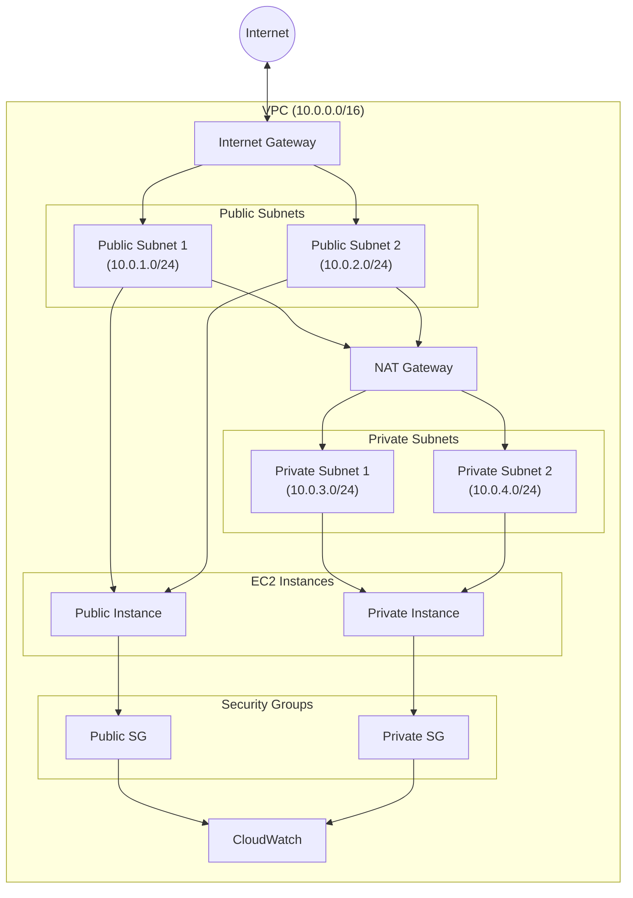
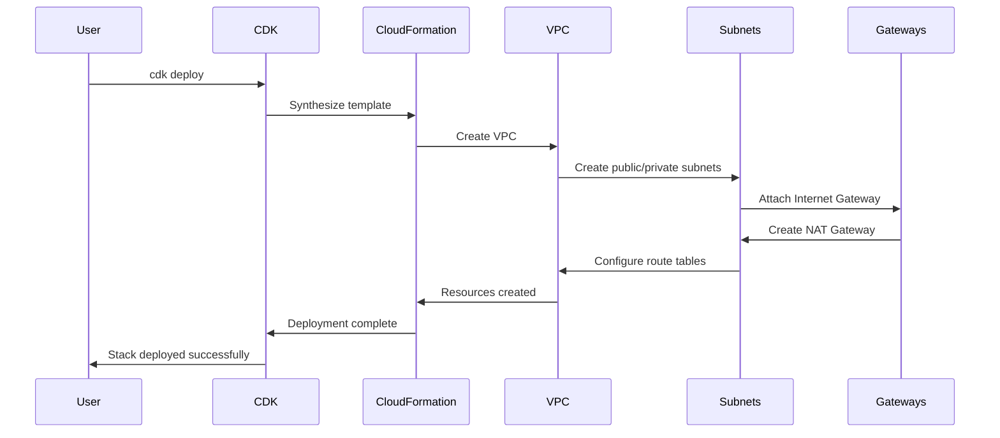

# VPC Networking - Hands-on Lab

[DIAGRAM: VPC Hands-on Architecture]



## Prerequisites

- Completed the CDK Foundations lab
- AWS CDK and CLI configured with appropriate permissions

## Lab Steps

### 1. Create a Multi-AZ VPC

Update your stack file with the following code:

```typescript
import { CfnOutput, Stack, StackProps } from "aws-cdk-lib";
import {
  Vpc,
  SubnetType,
  InstanceType,
  InstanceClass,
  InstanceSize,
  SecurityGroup,
  Peer,
  Port,
  Instance,
  MachineImage,
  UserData,
  GatewayVpcEndpointAwsService,
  FlowLog,
  FlowLogResourceType,
  FlowLogDestination,
} from "aws-cdk-lib/aws-ec2";
import * as logs from "aws-cdk-lib/aws-logs";
import { Construct } from "constructs";

export class AwsFundamentalsWorkshopLabsStack extends Stack {
  constructor(scope: Construct, id: string, props?: StackProps) {
    super(scope, id, props);

    // Create a VPC with public and private subnets across 2 AZs
    const vpc = new Vpc(this, "WorkshopVPC", {
      maxAzs: 2,
      natGateways: 1,
      subnetConfiguration: [
        {
          name: "Public",
          subnetType: SubnetType.PUBLIC,
          cidrMask: 24,
        },
        {
          name: "Private",
          subnetType: SubnetType.PRIVATE_WITH_EGRESS,
          cidrMask: 24,
        },
      ],
    });

    // Create security group for public instances
    const publicSG = new SecurityGroup(this, "PublicSecurityGroup", {
      vpc,
      description: "Security group for public instances",
      allowAllOutbound: true,
    });

    publicSG.addIngressRule(
      Peer.anyIpv4(),
      Port.tcp(80),
      "Allow HTTP access from anywhere"
    );

    // Create security group for private instances
    const privateSG = new SecurityGroup(this, "PrivateSecurityGroup", {
      vpc,
      description: "Security group for private instances",
      allowAllOutbound: true,
    });

    privateSG.addIngressRule(
      publicSG,
      Port.tcp(80),
      "Allow HTTP access from public security group"
    );

    // Create a public EC2 instance
    const publicInstance = new Instance(this, "PublicInstance", {
      vpc,
      vpcSubnets: {
        subnetType: SubnetType.PUBLIC,
      },
      instanceType: InstanceType.of(InstanceClass.T2, InstanceSize.MICRO),
      machineImage: MachineImage.latestAmazonLinux2(),
      securityGroup: publicSG,
    });

    // Create a private EC2 instance
    const privateInstance = new Instance(this, "PrivateInstance", {
      vpc,
      vpcSubnets: {
        subnetType: SubnetType.PRIVATE_WITH_EGRESS,
      },
      instanceType: InstanceType.of(InstanceClass.T2, InstanceSize.MICRO),
      machineImage: MachineImage.latestAmazonLinux2(),
      securityGroup: privateSG,
    });

    // Output the VPC ID
    new CfnOutput(this, "VpcId", {
      value: vpc.vpcId,
      description: "VPC ID",
    });

    // Output the public instance ID
    new CfnOutput(this, "PublicInstanceId", {
      value: publicInstance.instanceId,
      description: "Public Instance ID",
    });

    // Output the private instance ID
    new CfnOutput(this, "PrivateInstanceId", {
      value: privateInstance.instanceId,
      description: "Private Instance ID",
    });
  }
}
```

Deploy the stack:

```bash
cdk deploy --profile your-profile-name
```

### 2. Explore VPC Components

After deployment, explore your VPC in the AWS Console:

1. **Navigate to VPC Dashboard**

   - Go to the VPC service in AWS Console
   - Find your newly created VPC
   - Examine the following components:
     - Subnets
     - Route Tables
     - Internet Gateway
     - NAT Gateway

2. **Verify Subnet Configuration**
   - Confirm public subnets have route to Internet Gateway
   - Verify private subnets have route to NAT Gateway
   - Check CIDR ranges match expected values

### 3. Test Network Connectivity

Let's verify our network setup works as expected:

1. **Connect to Public Instance**

```bash
# Use AWS Systems Manager Session Manager
aws ssm start-session \
    --target your-public-instance-id \
    --profile your-profile-name
```

2. **Test Internet Connectivity**

```bash
# From public instance
ping 8.8.8.8
curl http://example.com
```

3. **Connect to Private Instance**

```bash
# Use Systems Manager again
aws ssm start-session \
    --target your-private-instance-id \
    --profile your-profile-name
```

4. **Test NAT Gateway**

```bash
# From private instance
ping 8.8.8.8
curl http://example.com
```

### 4. Implement VPC Endpoints

Add an S3 VPC Endpoint to allow private instances to access S3 without using the NAT Gateway:

```typescript
// Add to your stack
const s3Endpoint = vpc.addGatewayEndpoint("S3Endpoint", {
  service: GatewayVpcEndpointAwsService.S3,
});
```

### 5. Monitor VPC Traffic

Enable VPC Flow Logs to monitor network traffic:

```typescript
// Add to your stack
const logGroup = new logs.LogGroup(this, "VPCFlowLogs");

new ec2.FlowLog(this, "FlowLog", {
  resourceType: ec2.FlowLogResourceType.fromVpc(vpc),
  destination: ec2.FlowLogDestination.toCloudWatchLogs(logGroup),
});
```

### 6. Test Security Groups

Verify security group rules are working:

1. **Test Public Access**

```bash
# From your local machine
curl http://public-instance-ip
```

2. **Test Private Access**

```bash
# From public instance
curl http://private-instance-ip
```

## Validation Steps

After completing the lab, verify that:

1. ✅ VPC is created with correct CIDR range
2. ✅ Public and private subnets are created in multiple AZs
3. ✅ Internet Gateway is attached to VPC
4. ✅ NAT Gateway is created and working
5. ✅ Security groups are properly configured
6. ✅ Instances can access the internet as expected
7. ✅ VPC endpoints are working correctly

## Troubleshooting

Common issues and solutions:

1. **Connectivity Issues**

   - Check route tables
   - Verify security group rules
   - Confirm NAT Gateway is running
   - Test with ping and curl commands

2. **Instance Access Problems**

   - Verify Systems Manager setup
   - Check instance IAM roles
   - Confirm security group permissions
   - Review VPC endpoints

3. **Deployment Failures**
   - Check CDK synthesis output
   - Review CloudFormation events
   - Verify IAM permissions
   - Check resource limits

## Best Practices Demonstrated

This lab has implemented several AWS networking best practices:

1. **Security**

   - Isolated private subnets
   - Least privilege security groups
   - VPC Flow Logs for monitoring
   - Systems Manager for secure access

2. **High Availability**

   - Multi-AZ deployment
   - Redundant subnets
   - Resilient architecture

3. **Cost Optimization**
   - Single NAT Gateway
   - VPC Endpoints for AWS services
   - Appropriate instance sizes

## Next Steps

After completing this lab, you can:

- Implement more complex networking patterns
- Add additional VPC endpoints
- Configure VPC peering
- Implement transit gateways
- Set up site-to-site VPN

## VPC Operations Flow


