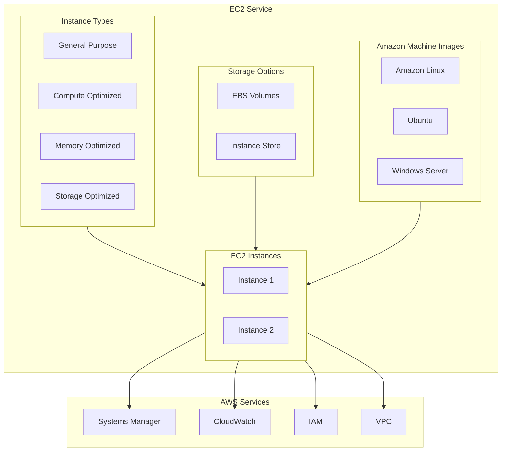
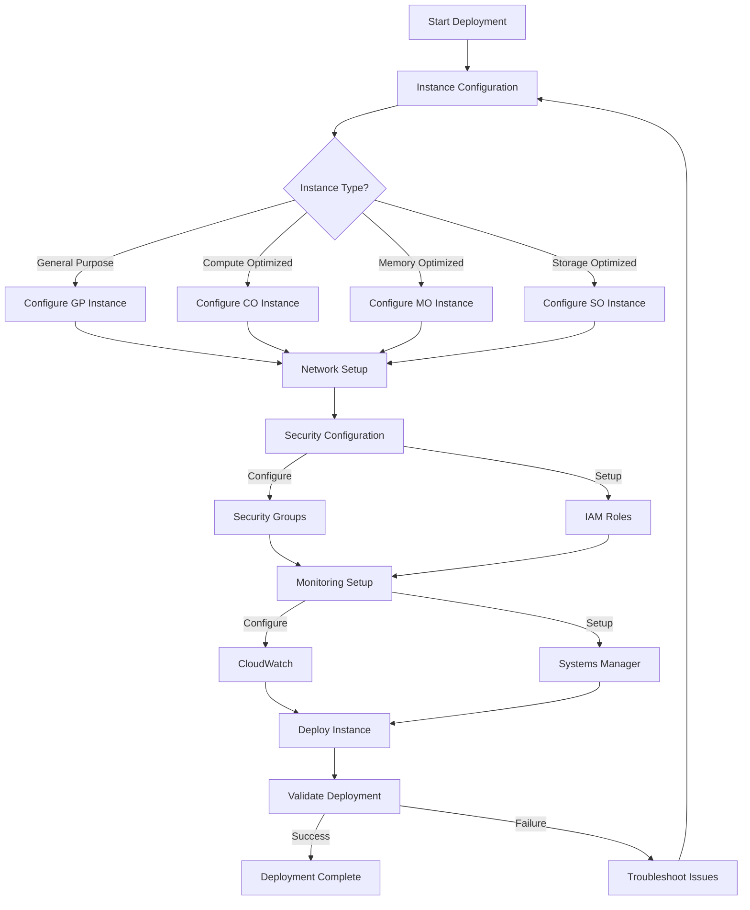

# EC2 Deployment with AWS CDK

## Overview

Amazon Elastic Compute Cloud (EC2) is a web service that provides resizable compute capacity in the cloud. In this lab, you'll learn how to deploy and manage EC2 instances using AWS CDK.

[DIAGRAM: EC2 Overview]



## Learning Objectives

- Understand EC2 instance types and their use cases
- Launch and configure EC2 instances
- Implement secure instance access using Systems Manager
- Manage EC2 instance storage
- Configure monitoring and logging
- Use AWS CDK to automate EC2 deployments

## Core Concepts

### Instance Types

EC2 offers various instance types optimized for different use cases:

1. **General Purpose (t3, t4g, m5)**

   - Balanced compute, memory, and networking
   - Ideal for web servers and development environments

2. **Compute Optimized (c5, c6)**

   - High-performance processors
   - Good for batch processing and high-traffic web servers

3. **Memory Optimized (r5, r6)**

   - Fast performance for workloads processing large datasets
   - Perfect for high-performance databases

4. **Storage Optimized (i3, d2)**
   - High, sequential read/write access to large datasets
   - Ideal for data warehousing and log processing

### Amazon Machine Images (AMI)

AMIs provide the information required to launch an instance:

1. **AWS-Provided AMIs**

   - Amazon Linux 2023
   - Ubuntu
   - Windows Server

2. **Custom AMIs**
   - Created from existing instances
   - Include your specific configurations
   - Enable consistent deployments

### Storage Options

EC2 offers multiple storage options:

1. **Amazon EBS Volumes**

   ```
   Instance
   ├── Root Volume
   │   └── Operating System
   └── Data Volumes
       ├── Application Files
       └── User Data
   ```

2. **Instance Store**

   - Temporary block-level storage
   - Data lost when instance stops
   - High I/O performance

3. **EBS Volume Types**
   - General Purpose (gp3)
   - Provisioned IOPS (io1, io2)
   - Throughput Optimized (st1)
   - Cold Storage (sc1)

### Instance Access and Security

1. **Systems Manager Session Manager**

   - Secure shell access without SSH keys
   - Audit logging of sessions
   - No inbound ports required

2. **Security Groups**
   - Virtual firewalls for instances
   - Control inbound and outbound traffic
   - Stateful packet filtering

### Instance Metadata and User Data

1. **Instance Metadata**

   - Data about your instance
   - Accessible from within instance
   - Example endpoint: 169.254.169.254/latest/meta-data/ (do not open directly)

2. **User Data**
   - Scripts run at instance launch
   - Configure instance at boot time
   - Example script:
   ```bash
   #!/bin/bash
   yum update -y
   yum install -y httpd
   systemctl start httpd
   systemctl enable httpd
   ```

### Monitoring and Logging

1. **CloudWatch Metrics**

   - CPU utilization
   - Network traffic
   - Disk I/O
   - Status checks

2. **CloudWatch Logs**
   - System logs
   - Application logs
   - Custom metrics

### Auto Scaling

1. **Launch Templates**

   - Instance configuration template
   - Version controlled
   - Reusable across different features

2. **Auto Scaling Groups**
   - Maintain instance count
   - Scale based on demand
   - Distribute across AZs

## Best Practices

1. **Instance Selection**

   - Choose right instance type for workload
   - Use latest generation instances
   - Consider cost vs performance

2. **Security**

   - Use security groups effectively
   - Implement least privilege access
   - Regular security patches
   - Use Systems Manager for access

3. **Storage**

   - Right EBS volume type for workload
   - Regular snapshots
   - Consider RAID for performance
   - Use instance store appropriately

4. **High Availability**

   - Deploy across multiple AZs
   - Use Auto Scaling Groups
   - Implement proper monitoring
   - Regular backups

5. **Cost Optimization**
   - Use Reserved Instances for steady state
   - Leverage Spot Instances where appropriate
   - Right-size instances
   - Monitor and adjust resources

## What's Next

In the hands-on section, you'll:

- Launch EC2 instances using AWS CDK
- Configure instance access and security
- Implement monitoring and logging
- Set up auto scaling
- Learn to troubleshoot common issues

[DIAGRAM: EC2 Deployment Flow]


