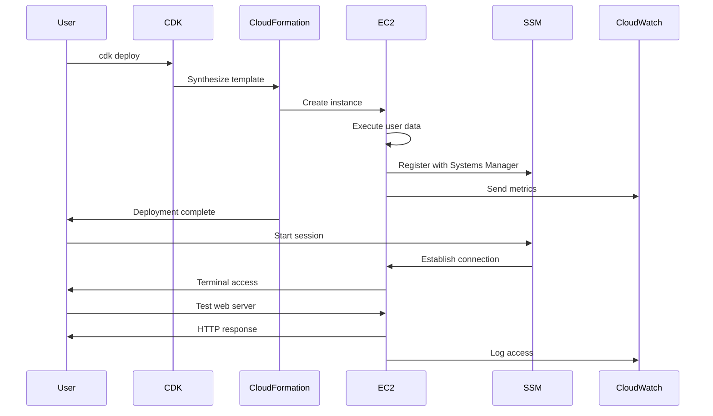

# EC2 Deployment - Hands-on Lab

## Prerequisites

> Tip: Set the workshop region (Frankfurt)
```bash
export AWS_REGION=eu-central-1
```

> Tip: Set an AWS profile for this shell to avoid repeating profile flags

```bash
export AWS_PROFILE=your-profile-name
```

Before starting this lab, ensure you have:

- Completed the VPC Networking lab
- AWS CDK and CLI configured with appropriate permissions
- Basic understanding of EC2 concepts

## Lab Steps

### 1. Create EC2 Instance

With our VPC infrastructure in place, let's create an EC2 instance:

```typescript
import * as ec2 from "aws-cdk-lib/aws-ec2"

const instance = new ec2.Instance(this, "WebServer", {
  vpc, // Using the VPC created below
  instanceType: ec2.InstanceType.of(
    ec2.InstanceClass.T3,
    ec2.InstanceSize.MICRO
  ),
  machineImage: ec2.MachineImage.latestAmazonLinux2023(),
  // ... rest of EC2 configuration
})
```

### 2. Create an EC2 Instance with CDK

Update your stack file with the following code:

```typescript
import * as cdk from "aws-cdk-lib"
import { CfnOutput, Duration, Stack, StackProps } from "aws-cdk-lib"
import {
  Instance,
  InstanceType,
  InstanceClass,
  InstanceSize,
  MachineImage,
  Vpc,
  SecurityGroup,
  Peer,
  Port,
  SubnetType,
  BlockDeviceVolume,
  EbsDeviceVolumeType,
  UserData,
} from "aws-cdk-lib/aws-ec2"
import { ManagedPolicy, Role, ServicePrincipal } from "aws-cdk-lib/aws-iam"
import { Construct } from "constructs"

export class AwsFundamentalsWorkshopLabsStack extends Stack {
  constructor(scope: Construct, id: string, props?: StackProps) {
    super(scope, id, props)

    // Create a new VPC for this lab (or import existing one)
    const vpc = new Vpc(this, "EC2LabVPC", {
      maxAzs: 2,
      natGateways: 1,
      subnetConfiguration: [
        {
          name: "Public",
          subnetType: SubnetType.PUBLIC,
          cidrMask: 24,
        },
        {
          name: "Private",
          subnetType: SubnetType.PRIVATE_WITH_EGRESS,
          cidrMask: 24,
        },
      ],
    })

    // Alternative: Use existing VPC (uncomment and replace with your VPC ID)
    // const vpc = Vpc.fromLookup(this, "ExistingVPC", {
    //   vpcId: "vpc-your-vpc-id-here",
    // });

    // Create security group
    const webServerSG = new SecurityGroup(this, "WebServerSG", {
      vpc,
      description: "Security group for web server",
      allowAllOutbound: true,
    })

    webServerSG.addIngressRule(
      Peer.anyIpv4(),
      Port.tcp(80),
      "Allow HTTP access"
    )

    // Create IAM role for Systems Manager (required for Session Manager access)
    const role = new Role(this, "EC2Role", {
      assumedBy: new ServicePrincipal("ec2.amazonaws.com"),
    })

    role.addManagedPolicy(
      ManagedPolicy.fromAwsManagedPolicyName("AmazonSSMManagedInstanceCore")
    )

    // Create user data script
    const userData = UserData.forLinux()
    userData.addCommands(
      "yum update -y",
      "yum install -y httpd",
      "systemctl start httpd",
      "systemctl enable httpd",
      'echo "<h1>Hello from EC2</h1>" > /var/www/html/index.html'
    )

    // Create EC2 instance
    const webServer = new Instance(this, "WebServer", {
      vpc,
      vpcSubnets: {
        subnetType: SubnetType.PUBLIC,
      },
      instanceType: InstanceType.of(InstanceClass.T3, InstanceSize.MICRO),
      machineImage: MachineImage.latestAmazonLinux2023(),
      securityGroup: webServerSG,
      role: role,
      userData: userData,
      blockDevices: [
        {
          deviceName: "/dev/xvda",
          volume: BlockDeviceVolume.ebs(8, {
            volumeType: EbsDeviceVolumeType.GP3,
            deleteOnTermination: true,
          }),
        },
      ],
    })

    // Add CloudWatch agent configuration
    webServer.userData.addCommands(
      "yum install -y amazon-cloudwatch-agent",
      "systemctl start amazon-cloudwatch-agent",
      "systemctl enable amazon-cloudwatch-agent"
    )

    // Output the instance ID
    new CfnOutput(this, "InstanceId", {
      value: webServer.instanceId,
      description: "EC2 Instance ID",
    })

    // Output the public IP
    new CfnOutput(this, "PublicIP", {
      value: webServer.instancePublicIp,
      description: "EC2 Instance Public IP",
    })
  }
}
```

Deploy the stack:

```bash
cdk deploy
```

### 2. Connect to Your Instance

Use AWS Systems Manager Session Manager to connect:

```bash
# Get instance ID from stack outputs
export INSTANCE_ID=$(aws cloudformation describe-stacks \
  --stack-name AwsFundamentalsWorkshopLabsStack \
  --query 'Stacks[0].Outputs[?OutputKey==`InstanceId`].OutputValue' \
  --output text)

aws ssm start-session \
    --target $INSTANCE_ID

```

### 3. Verify Web Server Setup

1. **Check Apache Status**:

```bash
sudo systemctl status httpd
```

2. **Test Local Access**:

```bash
curl http://localhost
```

3. **Test Public Access**:
   - Open a web browser
   - Navigate to your instance's public IP (from output)

### 4. Monitor Your Instance

1. **View CloudWatch Metrics**:

   - Navigate to CloudWatch in AWS Console
   - Find metrics under "EC2" namespace
   - Check CPU utilization, network traffic, etc.

2. **Check System Logs**:

```bash
# View Apache access logs
sudo tail -f /var/log/httpd/access_log

# View system logs
sudo tail -f /var/log/messages
```

### 5. Create a Custom AMI

1. **Prepare the Instance**:

```bash
# Clean up history and logs
sudo yum clean all
sudo rm -rf /var/log/*
history -c
```

2. **Create AMI using AWS CLI**:

```bash
aws ec2 create-image \
    --instance-id $INSTANCE_ID \
    --name "WebServer-AMI" \
    --description "Apache web server AMI" \

```

### 6. Test Instance Recovery

1. **Simulate a Failure**:

```bash
# Stop Apache service
sudo systemctl stop httpd
```

2. **Check System Status**:

```bash
# View service status
sudo systemctl status httpd

# Check system logs
sudo tail -f /var/log/messages
```

3. **Recover Service**:

```bash
# Start Apache service
sudo systemctl start httpd
```

## Validation Steps

After completing the lab, verify that:

1. ✅ Instance is running and accessible
2. ✅ Web server is functioning correctly
3. ✅ CloudWatch metrics are being collected
4. ✅ Systems Manager access is working
5. ✅ Security group rules are effective
6. ✅ Custom AMI was created successfully

## Troubleshooting

Common issues and solutions:

1. **Web Server Not Accessible**

   - Check security group rules
   - Verify Apache is running
   - Confirm instance is in public subnet
   - Check network ACLs

2. **Systems Manager Connection Issues**

   - Verify IAM role permissions
   - Check Systems Manager agent status
   - Ensure VPC endpoints are configured
   - Confirm instance has internet access

3. **CloudWatch Issues**
   - Check CloudWatch agent configuration
   - Verify IAM permissions
   - Review agent logs
   - Confirm metrics namespace

## Best Practices Demonstrated

This lab has implemented several EC2 best practices:

1. **Security**

   - Use of Systems Manager for access
   - Minimal security group rules
   - IAM roles for service access
   - Regular system updates
   - Note: For workshop simplicity, inbound rules may use 0.0.0.0/0. In production, restrict to known CIDR ranges or trusted security groups, and tighten egress.

2. **Monitoring**

   - CloudWatch metrics enabled
   - System logs collection
   - Service status monitoring
   - Performance tracking

3. **Operations**
   - Automated instance configuration
   - Custom AMI creation
   - Proper volume configuration
   - Service recovery procedures

## Next Steps

After completing this lab, you can:

- Implement auto scaling
- Add load balancing
- Configure backup strategies
- Implement more complex monitoring
- Create multi-instance architectures

## EC2 Operations Flow



## Clean Up

When you're finished with this lab, clean up the resources to avoid ongoing charges:

```bash
cdk destroy
```

This will remove:

- EC2 instance and associated resources
- VPC and networking components
- Security groups and IAM roles
- CloudWatch logs and monitoring
