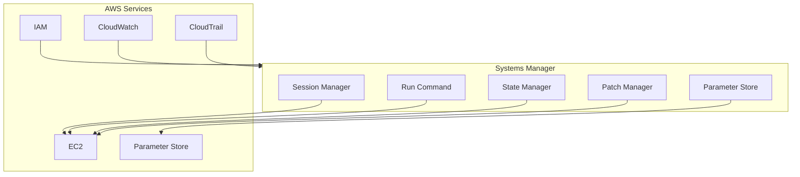
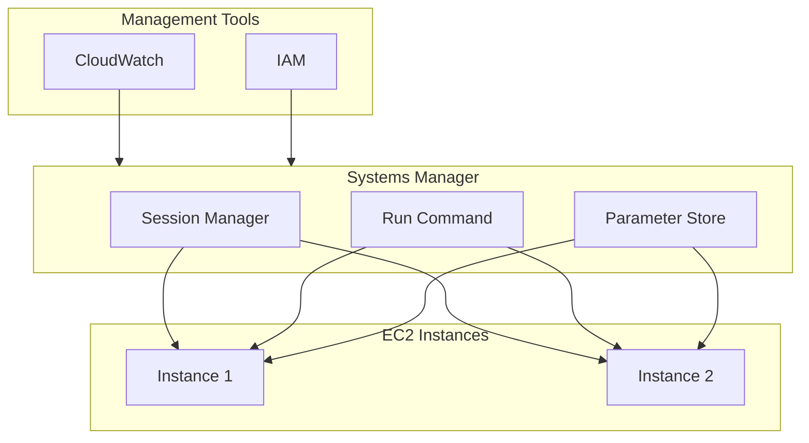

# AWS Systems Manager with CDK

## Overview

AWS Systems Manager is a collection of capabilities that helps you automate operational tasks across your AWS resources. In this lab, you'll learn how to use Systems Manager to manage your EC2 instances and automate operational tasks.

[DIAGRAM: Systems Manager Architecture Overview]



## Learning Objectives

- Understand Systems Manager core components
- Configure secure instance access using Session Manager
- Manage system configurations and patches
- Automate common maintenance tasks
- Monitor and maintain system compliance

## Core Concepts

### Systems Manager Components

1. **Session Manager**

   - Secure shell access without SSH keys
   - Browser-based terminal access
   - Audit logging of all sessions
   - No inbound ports required

2. **Parameter Store**

   - Centralized storage for configuration data
   - Hierarchical organization of parameters
   - Version tracking of values
   - Integration with other AWS services
     Example parameter hierarchy:

   ```
   /myapp/
   ├── prod/
   │   ├── backup-retention-days
   │   ├── log-level
   │   └── feature-flags
   └── dev/
       ├── backup-retention-days
       ├── log-level
       └── feature-flags
   ```

   Note: For sensitive data like passwords, API keys, or database credentials, use AWS Secrets Manager instead of Parameter Store. Secrets Manager provides additional security features specifically designed for secret management, including automatic rotation.

3. **Run Command**

   - Execute commands across multiple instances
   - No need for SSH access
   - Track command execution status
   - Integrate with CloudWatch Logs

4. **Patch Manager**

   - Automate patching process
   - Define patch baselines
   - Schedule patch deployments
   - Track compliance status

5. **State Manager**
   - Define and maintain consistent configurations
   - Automatically apply configurations
   - Track configuration compliance
   - Schedule regular configuration checks

### Systems Manager Setup

1. **IAM Requirements**

   - Instance role with SSM permissions
   - User permissions for SSM actions
     Example instance role policy:

   ```json
   {
     "Version": "2012-10-17",
     "Statement": [
       {
         "Effect": "Allow",
         "Action": [
           "ssm:UpdateInstanceInformation",
           "ssm:ListInstanceAssociations",
           "ssm:DescribeInstanceAssociations",
           "ssm:GetParameter",
           "ssm:GetParameters",
           "ssm:PutParameter",
           "ssm:StartSession",
           "ssm:TerminateSession",
           "ssm:ResumeSession",
           "ssm:DescribeSessions",
           "ssm:GetConnectionStatus"
         ],
         "Resource": "*"
       },
       {
         "Effect": "Allow",
         "Action": [
           "ec2messages:AcknowledgeMessage",
           "ec2messages:DeleteMessage",
           "ec2messages:FailMessage",
           "ec2messages:GetEndpoint",
           "ec2messages:GetMessages",
           "ec2messages:SendReply"
         ],
         "Resource": "*"
       }
     ]
   }
   ```

2. **Systems Manager Agent**
   - Pre-installed on AWS AMIs
   - Can be installed on on-premises servers
   - Regular updates for new features
   - Configuration options for proxy support

### Common Use Cases

1. **Secure Instance Access**

   ```
   User → AWS Console/CLI → Session Manager → EC2 Instance
   ```

   - No need for bastion hosts
   - All access logged in CloudTrail
   - Integration with IAM permissions

2. **Configuration Management**

   ```
   Parameter Store → Applications
   └── Storage of:
       ├── Application settings
       ├── Configuration flags
       ├── Environment variables
       └── Operational parameters
   ```

3. **Automated Maintenance**
   ```
   Systems Manager → Multiple Instances
   └── Automated tasks:
       ├── OS patching
       ├── Software updates
       ├── Configuration updates
       └── Compliance checks
   ```

## Best Practices

1. **Security**

   - Use IAM roles for instance access
   - Enable session logging
   - Implement least privilege access
   - Regular security patches

2. **Operations**

   - Use parameter hierarchies
   - Implement proper tagging
   - Regular maintenance windows
   - Monitor automation status

3. **Compliance**

   - Define patch baselines
   - Regular compliance scans
   - Automated remediation
   - Audit logging

4. **Cost Management**
   - Use automation to optimize resources
   - Schedule maintenance during off-hours
   - Monitor usage patterns
   - Clean up unused resources

## What's Next

In the hands-on section, you'll:

- Configure Systems Manager access
- Use Session Manager for instance access
- Work with Parameter Store
- Execute commands across instances
- Set up automated patching
- Monitor system compliance

[DIAGRAM: Systems Manager Operations Flow]


