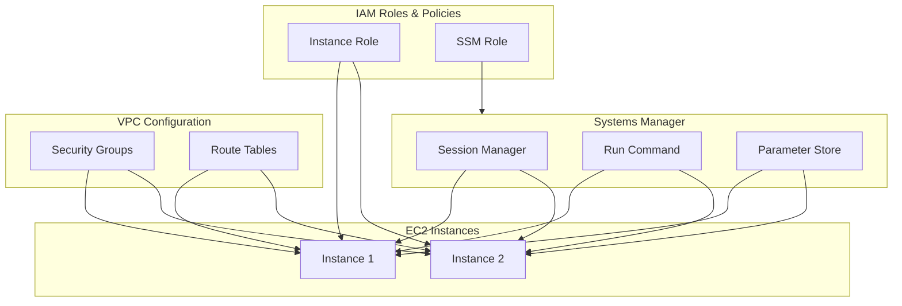
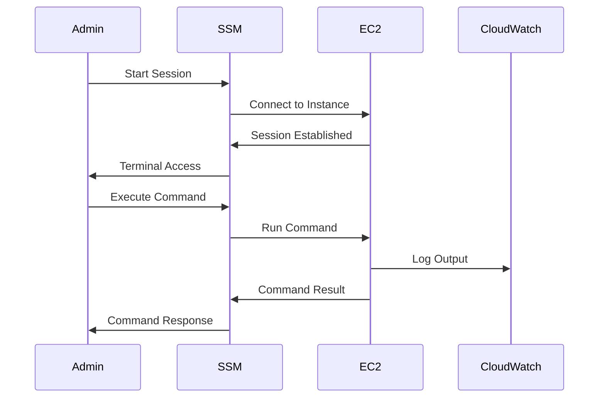

# Systems Manager - Hands-on Lab

[DIAGRAM: Systems Manager Hands-on Architecture]



Description: A detailed diagram showing the Systems Manager resources we'll create in this lab. The diagram should:

1. Show the complete architecture:
   - Systems Manager Components
   - EC2 Instances
   - IAM Roles
   - VPC Configuration
   - Parameter Store
2. Illustrate the relationships between components
3. Show the management patterns
4. Include example service integrations
   Use AWS's standard color scheme with blue for AWS services and green for Systems Manager components.

## Prerequisites

This lab builds on the EC2 deployment lab. Download the completed EC2 lab state to begin:

```bash
curl <S3_URL>/lab-180-completed.zip -o lab-180-completed.zip
unzip lab-180-completed.zip
cd lab-180-completed
npm install
```

## Lab Steps

### 1. Add Systems Manager Configuration

Now we'll add Systems Manager access to our existing EC2 instance:

```typescript
// Create role for Systems Manager
const role = new iam.Role(this, "SSMInstanceRole", {
  assumedBy: new iam.ServicePrincipal("ec2.amazonaws.com"),
  managedPolicies: [
    iam.ManagedPolicy.fromAwsManagedPolicyName("AmazonSSMManagedInstanceCore"),
  ],
});

// Update the existing EC2 instance with SSM role
instance.role.addManagedPolicy(
  iam.ManagedPolicy.fromAwsManagedPolicyName("AmazonSSMManagedInstanceCore")
);
```

### 2. Connect Using Session Manager

1. **Start a Session**:

```bash
aws ssm start-session \
    --target your-instance-id \
    --profile your-profile-name
```

2. **Verify System Status**:

```bash
# Check Systems Manager Agent status
systemctl status amazon-ssm-agent

# View agent logs
sudo tail -f /var/log/amazon/ssm/amazon-ssm-agent.log
```

### 3. Work with Parameter Store

1. **Read Parameters Using AWS CLI**:

```bash
# Get log level parameter
aws ssm get-parameter \
    --name "/myapp/dev/log-level" \
    --profile your-profile-name

# Get backup retention parameter
aws ssm get-parameter \
    --name "/myapp/dev/backup-retention-days" \
    --profile your-profile-name
```

2. **Read Parameters from EC2 Instance**:

```bash
# Install AWS CLI v2 if not present
curl "https://awscli.amazonaws.com/awscli-exe-linux-x86_64.zip" -o "awscliv2.zip"
unzip awscliv2.zip
sudo ./aws/install

# Get parameters
aws ssm get-parameter --name "/myapp/dev/log-level"
```

### 4. Use Run Command

1. **Execute a Simple Command**:

```bash
aws ssm send-command \
    --document-name "AWS-RunShellScript" \
    --parameters 'commands=["df -h"]' \
    --targets "Key=instanceids,Values=your-instance-id" \
    --profile your-profile-name
```

2. **Check Command Status**:

```bash
aws ssm list-commands \
    --profile your-profile-name
```

3. **View Command Output**:

```bash
aws ssm get-command-invocation \
    --command-id "command-id-from-previous-step" \
    --instance-id your-instance-id \
    --profile your-profile-name
```

### 5. Configure Session Logging

1. **Create CloudWatch Log Group**:

```typescript
import * as logs from "aws-cdk-lib/aws-logs";

// Add to your stack
const logGroup = new logs.LogGroup(this, "SessionLogs", {
  retention: logs.RetentionDays.ONE_WEEK,
});
```

2. **Enable Session Logging**:

```typescript
// Add to your stack
const sessionPolicy = new iam.PolicyDocument({
  statements: [
    new iam.PolicyStatement({
      actions: ["logs:PutLogEvents", "logs:CreateLogStream"],
      resources: [logGroup.logGroupArn],
    }),
  ],
});
```

## Validation Steps

After completing this lab, verify that:

1. ✅ EC2 instance appears in Systems Manager console
2. ✅ Session Manager connection works without SSH keys
3. ✅ Parameter Store parameters are accessible
4. ✅ Run Command executes successfully on target instances
5. ✅ CloudWatch logs capture session activity
6. ✅ IAM permissions are working correctly

## Troubleshooting

Common issues and solutions:

1. **Session Manager Connection Failed**

   - Check IAM role is attached to EC2 instance
   - Verify Systems Manager agent is running
   - Ensure VPC endpoints are configured (for private subnets)
   - Check security group allows outbound HTTPS (port 443)

2. **Parameter Store Access Denied**

   - Verify IAM permissions for parameter actions
   - Check parameter path and naming
   - Ensure correct region is specified
   - Validate parameter hierarchy permissions

3. **Run Command Not Working**
   - Check instance is showing as managed in SSM console
   - Verify command document exists and is valid
   - Check command syntax and parameters
   - Review CloudWatch Logs for error details

## Cleanup

When you're finished with this lab:

```bash
# Stop any running sessions (optional)
aws ssm describe-sessions \
  --state "Active" \
  --profile your-profile-name

# Remove any test parameters
aws ssm delete-parameter \
  --name "/myapp/dev/test-parameter" \
  --profile your-profile-name

# Destroy the CDK stack
cdk destroy SystemsManagerStack --profile your-profile-name
```

[DIAGRAM: Systems Manager Operations]


