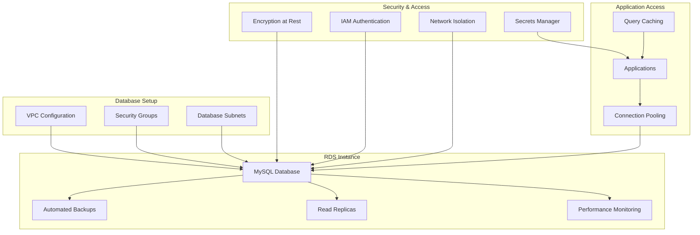
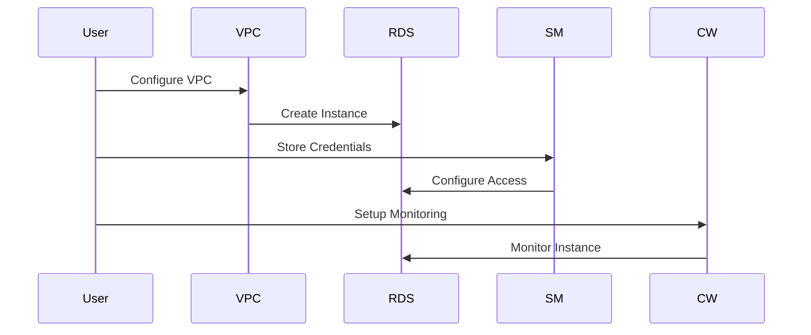

# RDS Basics - Hands-on Lab

## Prerequisites

- Completion of VPC Networking lab
- AWS CDK and AWS CLI configured
- Basic understanding of SQL
- MySQL client installed locally (for testing connections)

## Lab Overview

This lab demonstrates creating and managing relational databases using Amazon RDS. You'll deploy a MySQL database instance, configure security and networking, implement backup strategies, and connect applications securely.

[DIAGRAM: RDS Database Flow]



## Starting Point

This lab builds on the VPC networking lab. Download the completed VPC lab state to begin:

- Completed the VPC Networking lab
- AWS CDK and CLI configured with appropriate permissions  
- MySQL client installed locally (for testing connections)
- Basic understanding of relational databases

## Lab Steps

### 1. Create RDS Database

Add the required imports to your CDK stack:

```typescript
import * as cdk from "aws-cdk-lib";
import * as ec2 from "aws-cdk-lib/aws-ec2";
import * as rds from "aws-cdk-lib/aws-rds";
import * as secretsmanager from "aws-cdk-lib/aws-secretsmanager";
import { Construct } from "constructs";
```

Using our existing VPC infrastructure, let's create an RDS database:

```typescript
// Create security group for RDS
const dbSecurityGroup = new ec2.SecurityGroup(this, "DatabaseSecurityGroup", {
  vpc, // Using the existing VPC from lab 160
  description: "Security group for RDS database",
  allowAllOutbound: true,
});

// Create RDS instance
const database = new rds.DatabaseInstance(this, "Database", {
  engine: rds.DatabaseInstanceEngine.mysql({
    version: rds.MysqlEngineVersion.VER_8_0,
  }),
  vpc,
  vpcSubnets: {
    subnetType: ec2.SubnetType.PRIVATE_WITH_EGRESS,
  },
  securityGroups: [dbSecurityGroup],
  // ... rest of RDS configuration
});
```

### 2. Configure Database Access

After deployment, you'll need the following information:

- Database endpoint (from stack output)
- Database port (default: 3306)
- Master username (default: admin)
- Master password (generated automatically)

First, get the database endpoint and secret ARN from the stack outputs:

```bash
# Get database endpoint
export DATABASE_ENDPOINT=$(aws cloudformation describe-stacks \
  --stack-name RdsStack \
  --query 'Stacks[0].Outputs[?OutputKey==`DatabaseEndpoint`].OutputValue' \
  --output text \
  --profile your-profile-name)

# Get secret ARN
export SECRET_ARN=$(aws cloudformation describe-stacks \
  --stack-name RdsStack \
  --query 'Stacks[0].Outputs[?OutputKey==`DatabaseSecretArn`].OutputValue' \
  --output text \
  --profile your-profile-name)

echo "Database endpoint: $DATABASE_ENDPOINT"
echo "Secret ARN: $SECRET_ARN"
```

Retrieve the database password from Secrets Manager:

```bash
aws secretsmanager get-secret-value \
  --secret-id $SECRET_ARN \
  --query 'SecretString' \
  --output text \
  --profile your-profile-name
```

### 3. Connect to the Database

Using the MySQL client:

```bash
mysql -h $DATABASE_ENDPOINT -P 3306 -u admin -p
```

Create a test database and table:

```sql
CREATE DATABASE testdb;
USE testdb;

CREATE TABLE users (
    id INT AUTO_INCREMENT PRIMARY KEY,
    name VARCHAR(255),
    email VARCHAR(255)
);

INSERT INTO users (name, email) VALUES
    ('Test User', 'test@example.com');

SELECT * FROM users;
```

### 4. Enable Enhanced Monitoring

Add the following to your RDS stack:

```typescript:lib/rds-stack.ts
// ... existing imports ...
import * as iam from 'aws-cdk-lib/aws-iam';

// Inside the RdsStack constructor:
const monitoringRole = new iam.Role(this, 'MonitoringRole', {
  assumedBy: new iam.ServicePrincipal('monitoring.rds.amazonaws.com'),
  managedPolicies: [
    iam.ManagedPolicy.fromAwsManagedPolicyName('service-role/AmazonRDSEnhancedMonitoringRole'),
  ],
});

const database = new rds.DatabaseInstance(this, 'RdsInstance', {
  // ... existing configuration ...
  monitoringInterval: cdk.Duration.seconds(60),
  monitoringRole,
});
```

### 5. Create a Read Replica

Add this to your stack:

```typescript:lib/rds-stack.ts
// Inside the RdsStack constructor:
const readReplica = new rds.DatabaseInstanceReadReplica(this, 'ReadReplica', {
  sourceDatabaseInstance: database,
  instanceType: ec2.InstanceType.of(
    ec2.InstanceClass.BURSTABLE3,
    ec2.InstanceSize.MICRO
  ),
  vpc,
  vpcSubnets: {
    subnetType: ec2.SubnetType.PRIVATE_WITH_EGRESS,
  },
  securityGroups: [dbSecurityGroup],
});

new cdk.CfnOutput(this, 'ReadReplicaEndpoint', {
  value: readReplica.instanceEndpoint.hostname,
});
```

## Validation Steps

1. Database Connection

   - [ ] Successfully connected to the database
   - [ ] Created test database and table
   - [ ] Inserted and queried data

2. Monitoring

   - [ ] Enhanced monitoring metrics visible in CloudWatch
   - [ ] Database metrics showing in RDS console

3. Read Replica
   - [ ] Read replica status is "Available"
   - [ ] Can connect to read replica
   - [ ] Data replication working correctly

## Cleanup

To avoid ongoing charges:

```bash
cdk destroy --profile your-profile-name
```

## Troubleshooting

1. Connection Issues

   - Verify security group rules
   - Check VPC configuration
   - Ensure correct endpoint and credentials

2. Performance Issues

   - Monitor CloudWatch metrics
   - Check instance class sizing
   - Review connection count

3. Replication Issues
   - Check replication lag
   - Verify network connectivity
   - Review error logs

[DIAGRAM: RDS Setup Flow]


