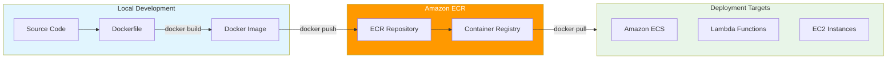

# ECR and Docker Basics with AWS CDK

## Overview

Amazon Elastic Container Registry (ECR) is a fully managed Docker container registry that makes it easy to store, manage, and deploy Docker container images. In this lab, you'll learn how to work with Docker and ECR using AWS CDK.

[DIAGRAM: ECR Docker Workflow]



## Learning Objectives

- Understand basic Docker concepts and commands
- Create and manage Docker images locally
- Work with Amazon ECR repositories
- Push and pull container images to/from ECR
- Implement ECR security best practices

## Core Concepts

### Docker Fundamentals

1. **Container Basics**

   ```
   ┌─────────────────────────┐
   │     Your Application    │
   ├─────────────────────────┤
   │      Dependencies      │
   ├─────────────────────────┤
   │   Container Runtime    │
   └─────────────────────────┘
   ```

   - Containers vs Virtual Machines
   - Docker architecture
   - Container lifecycle

2. **Docker Components**
   - Dockerfile
   - Images
   - Containers
   - Layers and caching
   - Docker CLI

### ECR Features

1. **Repository Management**

   - Private repositories
   - Public repositories (Amazon ECR Public Gallery)
   - Image versioning and tagging
   - Repository policies

2. **Security Features**

   - IAM integration
   - Encryption at rest (AWS KMS)
   - Image scanning
   - HTTPS/SSL encryption in transit

3. **Integration Capabilities**
   ```
   ┌─────────┐   ┌─────────┐   ┌─────────┐
   │  ECR    │──▶│  ECS    │   │  EKS    │
   └─────────┘   └─────────┘   └─────────┘
        │             │             │
        └─────────────┴─────────────┘
                     │
              AWS Services
   ```
   - Amazon ECS
   - Amazon EKS
   - AWS Lambda
   - AWS CodeBuild

### Image Lifecycle

1. **Build Process**

   ```
   Dockerfile    Image      Container
   ┌────────┐   ┌────────┐   ┌────────┐
   │        │──▶│        │──▶│        │
   └────────┘   └────────┘   └────────┘
   ```

   - Writing Dockerfiles
   - Building images
   - Testing locally

2. **Image Management**
   - Tagging strategies
   - Version control
   - Image cleanup
   - Lifecycle policies

### Authentication and Access

1. **Registry Authentication**

   - AWS CLI authentication
   - Docker login integration
   - Access tokens
   - Cross-account access

2. **Permission Management**
   - Repository policies
   - IAM roles and users
   - Resource-based policies

## Best Practices

1. **Security**

   - Use private repositories for sensitive images
   - Implement image scanning
   - Regular security updates
   - Proper access control
   - Use immutable tags

2. **Performance**

   - Optimize image sizes
   - Layer caching
   - Multi-stage builds
   - Regional considerations

3. **Operations**

   - Image tagging strategy
   - Lifecycle policies
   - Monitoring and logging
   - Backup procedures

4. **Cost Optimization**
   - Clean up unused images
   - Implement retention policies
   - Monitor storage usage
   - Use appropriate instance types for builds

## Prerequisites for Lab

- AWS CLI installed and configured
- Docker installed locally
- Basic command line familiarity
- AWS account with appropriate permissions

## What's Next

In the hands-on section, you'll:

- Set up Docker locally
- Create a simple application
- Build and test Docker images
- Create an ECR repository
- Push and pull images to/from ECR
- Implement security best practices

[DIAGRAM: Container Workflow]
