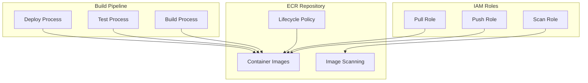
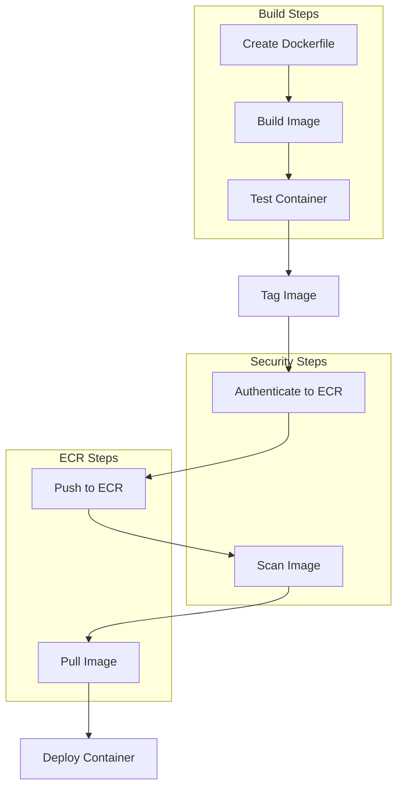

# ECR and Docker Basics - Hands-on Lab

[DIAGRAM: ECR Hands-on Architecture]



## Prerequisites

Create a new CDK project:

```bash
mkdir ecr-lab
cd ecr-lab
npx aws-cdk init app --language typescript
```

## Lab Steps

### 1. Create ECR Repository

Let's create an ECR repository to store our Docker images:

```typescript
import * as ecr from "aws-cdk-lib/aws-ecr";

const repository = new ecr.Repository(this, "MyRepository", {
  repositoryName: "my-app-repo",
  removalPolicy: cdk.RemovalPolicy.DESTROY,
  autoDeleteImages: true,
});
```

### 2. Create a Sample Application

Create a new directory for your application:

```bash
mkdir workshop-app
cd workshop-app
```

Create a simple Node.js application:

```javascript:workshop-app/app.js
const express = require('express');
const app = express();
const port = 3000;

app.get('/', (req, res) => {
  res.send('Hello from the workshop app!');
});

app.listen(port, () => {
  console.log(`App listening at http://localhost:${port}`);
});
```

Create a package.json:

```json:workshop-app/package.json
{
  "name": "workshop-app",
  "version": "1.0.0",
  "main": "app.js",
  "dependencies": {
    "express": "^4.17.1"
  }
}
```

### 3. Create Dockerfile

Create a Dockerfile in your application directory:

```dockerfile:workshop-app/Dockerfile
FROM node:22-alpine

WORKDIR /usr/src/app

COPY package*.json ./

RUN npm install

COPY . .

EXPOSE 3000

CMD [ "node", "app.js" ]
```

### 4. Build and Test Locally

Build the Docker image:

```bash
docker build -t workshop-app .
```

Run the container locally:

```bash
docker run -p 3000:3000 workshop-app
```

Test the application:

```bash
curl http://localhost:3000
```

### 5. Push to ECR

Authenticate Docker to ECR:

```bash
aws ecr get-login-password --region your-region --profile your-profile-name | \
  docker login --username AWS --password-stdin \
  your-account-id.dkr.ecr.your-region.amazonaws.com
```

Tag your image:

```bash
docker tag workshop-app:latest \
  your-account-id.dkr.ecr.your-region.amazonaws.com/workshop-app:latest
```

Push to ECR:

```bash
docker push your-account-id.dkr.ecr.your-region.amazonaws.com/workshop-app:latest
```

### 6. Implement Image Scanning

View scan results:

```bash
aws ecr describe-image-scan-findings \
  --repository-name workshop-app \
  --image-id imageTag=latest \
  --profile your-profile-name
```

### 7. Test Image Pull

Remove local image:

```bash
docker rmi your-account-id.dkr.ecr.your-region.amazonaws.com/workshop-app:latest
```

Pull from ECR:

```bash
docker pull your-account-id.dkr.ecr.your-region.amazonaws.com/workshop-app:latest
```

## Validation Steps

1. Local Development

   - [ ] Application builds successfully
   - [ ] Container runs locally
   - [ ] Can access application on port 3000

2. ECR Integration

   - [ ] Successfully authenticated to ECR
   - [ ] Image pushed to repository
   - [ ] Image scan completed
   - [ ] Can pull image from ECR

3. Security
   - [ ] Repository uses immutable tags
   - [ ] Image scanning enabled
   - [ ] Lifecycle policy applied

## Troubleshooting

1. Docker Build Issues

   - Check Docker daemon is running
   - Verify Dockerfile syntax
   - Check network connectivity

2. ECR Authentication

   - Verify AWS credentials
   - Check IAM permissions
   - Ensure correct region

3. Push/Pull Issues
   - Verify repository URI
   - Check image tags
   - Confirm network access

## Cleanup

Remove local resources:

```bash
docker rmi workshop-app
docker rmi your-account-id.dkr.ecr.your-region.amazonaws.com/workshop-app:latest
```

Destroy CDK stack:

```bash
cdk destroy EcrStack --profile your-profile-name
```

[DIAGRAM: Container Build Flow]



## Validation Steps

After completing this lab, verify that:

1. ✅ ECR repository created successfully
2. ✅ Docker image built and tagged locally
3. ✅ Authentication to ECR working
4. ✅ Image pushed to repository successfully
5. ✅ Image scan completed (if enabled)
6. ✅ Image pulled from ECR successfully

## Troubleshooting

Common issues and solutions:

1. **Docker Build Issues**

   - Check Dockerfile syntax and formatting
   - Verify base image is accessible
   - Ensure Docker daemon is running
   - Check for sufficient disk space

2. **ECR Authentication Problems**

   - Verify AWS CLI credentials are configured
   - Check IAM permissions for ECR actions
   - Ensure correct region is specified
   - Try refreshing authentication token

3. **Push/Pull Failures**

   - Verify repository URI is correct
   - Check image tags match exactly
   - Ensure network connectivity to ECR
   - Review IAM permissions for ECR operations

4. **Image Scanning Issues**
   - Check if scanning is enabled for repository
   - Allow time for scan to complete
   - Review scan results in ECR console
   - Check for known vulnerabilities

## Cleanup

When you're finished with this lab:

```bash
# Remove local Docker images
docker rmi workshop-app:latest
docker rmi your-account-id.dkr.ecr.your-region.amazonaws.com/my-app-repo:latest

# Remove all images from ECR repository (optional)
aws ecr list-images \
  --repository-name my-app-repo \
  --query 'imageIds[*]' \
  --output json \
  --profile your-profile-name | \
jq '.[] | "--image-ids imageDigest=" + .imageDigest' -r | \
xargs -I {} aws ecr batch-delete-image \
  --repository-name my-app-repo \
  --profile your-profile-name {}

# Destroy the CDK stack
cdk destroy --profile your-profile-name
```

Note: Deleting images from ECR is irreversible. Ensure you no longer need the images before cleanup.
