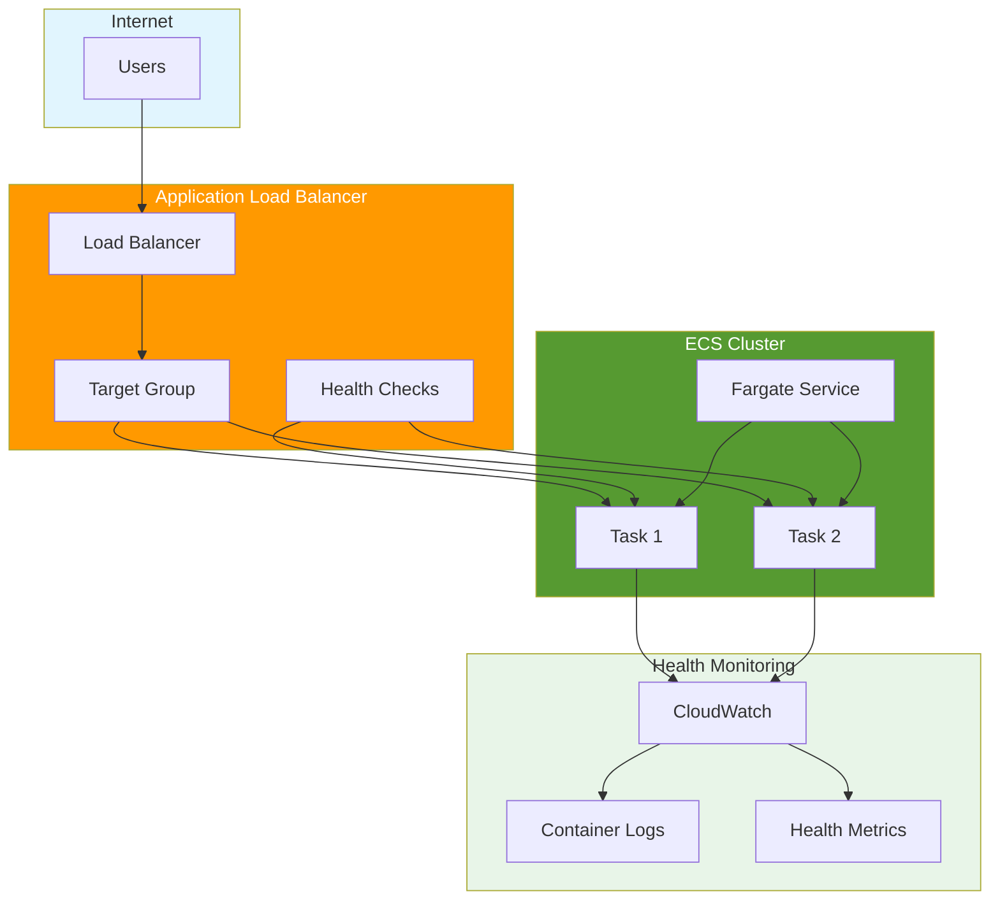
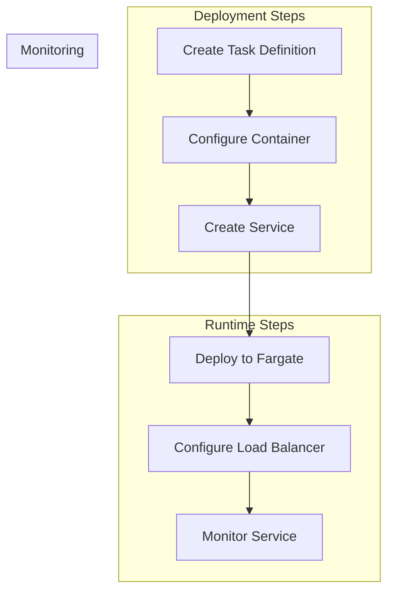

# ECS on Fargate with AWS CDK

## Overview

Amazon Elastic Container Service (ECS) is a fully managed container orchestration service that makes it easy to run, stop, and manage Docker containers on a cluster. Fargate is a serverless compute engine for containers that works with both ECS and EKS. In this lab, you'll learn how to deploy containers using ECS on Fargate with AWS CDK.

[DIAGRAM: ECS Overview]



## Learning Objectives

- Understand ECS core concepts and components
- Deploy containers using AWS Fargate
- Configure service discovery and load balancing
- **Set up Application Load Balancer for high availability**
- **Implement container health checks and monitoring**
- Implement logging and monitoring
- Manage container scaling and updates

## Core Concepts

### ECS Architecture

1. **Key Components**

   ```
   ┌─────────────────────────────────────┐
   │              ECS Cluster            │
   │  ┌─────────────┐   ┌─────────────┐ │
   │  │   Service   │   │   Service   │ │
   │  │ ┌─────────┐ │   │ ┌─────────┐ │ │
   │  │ │  Task   │ │   │ │  Task   │ │ │
   │  │ └─────────┘ │   │ └─────────┘ │ │
   │  └─────────────┘   └─────────────┘ │
   └─────────────────────────────────────┘
   ```

   - Clusters: Logical grouping of tasks
   - Services: Long-running task management
   - Tasks: Container instances
   - Task Definitions: Container blueprints

2. **Fargate Concepts**
   - Serverless container management
   - Task isolation
   - Resource allocation
   - Networking modes

### Task Definitions

1. **Configuration Components**

   - Container definitions
   - Resource requirements
   - Networking settings
   - Storage configurations
   - IAM roles

2. **Container Settings**
   ```yaml
   Container Definition
   ├── Image
   ├── CPU/Memory
   ├── Port mappings
   ├── Environment variables
   └── Logging configuration
   ```

### ECS Services

1. **Service Types**

   - Replica: Maintain desired count
   - Daemon: One task per instance
   - Tasks: One-off or scheduled

2. **Service Features**
   ```
   ┌────────────────┐
   │  ECS Service   │
   │  ┌──────────┐  │    ┌─────────────┐
   │  │  Tasks   │──┼───▶│  Application │
   │  └──────────┘  │    │Load Balancer │
   └────────────────┘    └─────────────┘
   ```
   - Load balancing
   - Auto scaling
   - Service discovery
   - Rolling updates

### Networking

1. **VPC Integration**

   ```
   ┌─────────────────────────┐
   │         VPC            │
   │  ┌─────┐    ┌─────┐   │
   │  │Task │    │Task │   │
   │  └─────┘    └─────┘   │
   │      │        │       │
   │   ┌─────────────┐     │
   │   │   Subnet    │     │
   │   └─────────────┘     │
   └─────────────────────────┘
   ```

   - Task networking
   - Security groups
   - Service discovery

2. **Load Balancing**
   - Application Load Balancer
   - Network Load Balancer
   - Service Discovery

### Monitoring and Logging

1. **CloudWatch Integration**

   - Container logs
   - Metrics
   - Alarms
   - Container Insights

2. **Observability**
   - AWS X-Ray integration
   - Service metrics
   - Health checks
   - Task-level monitoring

## Best Practices

1. **Security**

   - Use task execution roles
   - Implement least privilege
   - Enable container scanning
   - Network isolation
   - Secrets management

2. **Performance**

   - Right-size task resources
   - Optimize container images
   - Use service auto scaling
   - Cache dependencies
   - Health check configuration

3. **Cost Optimization**

   - Fargate Spot for non-critical workloads
   - Appropriate task sizing
   - Auto scaling policies
   - Resource monitoring
   - Capacity reservations

4. **Operations**
   - Use task definition versioning
   - Implement rolling updates
   - Monitor service health
   - Backup strategies
   - Disaster recovery planning

## Prerequisites for Lab

- Completed ECR-Docker Basics lab
- AWS CLI configured
- Docker basics understanding
- Basic networking knowledge
- AWS CDK setup

## What's Next

In the hands-on section, you'll:

- Create an ECS cluster
- Define task definitions
- Deploy services with Fargate
- **Configure Application Load Balancer with health checks**
- **Implement container health monitoring**
- Implement auto scaling
- Monitor your containers

[DIAGRAM: ECS Workflow]


