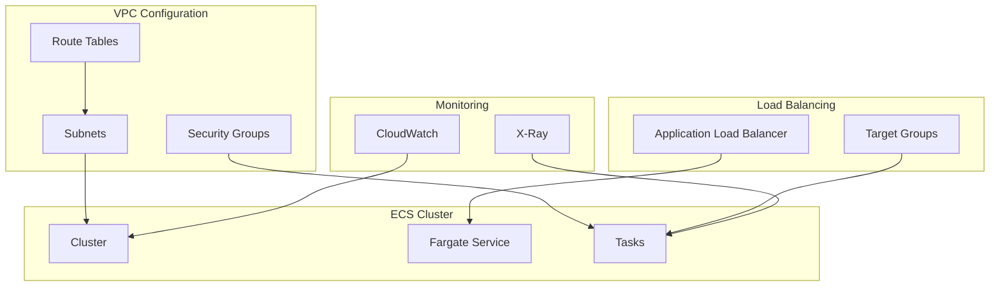
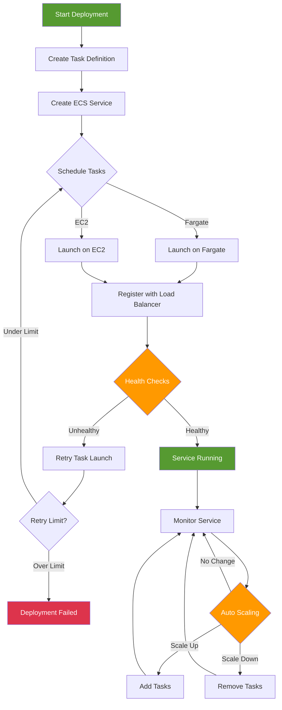

# ECS on Fargate - Hands-on Lab

[DIAGRAM: ECS Hands-on Architecture]



## Prerequisites

This lab builds on the ECR and Docker basics lab. Download the completed ECR lab state to begin:

```bash
curl <S3_URL>/lab-240-completed.zip -o lab-240-completed.zip
unzip lab-240-completed.zip
cd lab-240-completed
npm install
```

## Lab Steps

### 1. Create VPC for Fargate

First, let's create a VPC for our Fargate tasks:

```typescript
const vpc = new ec2.Vpc(this, "FargateVPC", {
  maxAzs: 2,
  subnetConfiguration: [
    {
      cidrMask: 24,
      name: "Public",
      subnetType: ec2.SubnetType.PUBLIC,
    },
    {
      cidrMask: 24,
      name: "Private",
      subnetType: ec2.SubnetType.PRIVATE_WITH_EGRESS,
    },
  ],
});
```

### 2. Create ECS Cluster and Fargate Service

Now we'll create an ECS cluster and Fargate service using our existing ECR repository:

```typescript
const cluster = new ecs.Cluster(this, "FargateCluster", {
  vpc,
});

const taskDefinition = new ecs.FargateTaskDefinition(this, "TaskDef", {
  memoryLimitMiB: 512,
  cpu: 256,
});

// Use the existing ECR repository from lab 240
taskDefinition.addContainer("MyContainer", {
  image: ecs.ContainerImage.fromEcrRepository(repository, "latest"),
  // ... container configuration
});

const service = new ecs.FargateService(this, "Service", {
  cluster,
  taskDefinition,
  // ... service configuration
});
```

### 3. Configure Auto Scaling

Add auto scaling to your service:

```typescript:lib/ecs-stack.ts
const scaling = service.autoScaleTaskCount({
  minCapacity: 2,
  maxCapacity: 4,
});

scaling.scaleOnCpuUtilization('CpuScaling', {
  targetUtilizationPercent: 70,
  scaleInCooldown: cdk.Duration.seconds(60),
  scaleOutCooldown: cdk.Duration.seconds(60),
});
```

### 4. Configure Service Discovery

Add service discovery to your ECS stack:

```typescript:lib/ecs-stack.ts
const namespace = new ecs.CloudMapNamespace(this, 'WorkshopNamespace', {
  vpc,
  name: 'workshop.local',
});

const serviceDiscovery = service.enableCloudMap({
  name: 'workshop-app',
  cloudMapNamespace: namespace,
});
```

### 5. Implement Container Health Checks

Add health check to your service:

```typescript:lib/ecs-stack.ts
taskDefinition.addContainer('MyContainer', {
  image: ecs.ContainerImage.fromEcrRepository(repository, 'latest'),
  healthCheck: {
    command: ['CMD-SHELL', 'curl -f http://localhost:3000/ || exit 1'],
    interval: cdk.Duration.seconds(30),
    timeout: cdk.Duration.seconds(5),
    retries: 3,
    startPeriod: cdk.Duration.seconds(60),
  },
});
```

### 6. Configure Enhanced Monitoring

Add Container Insights and X-Ray:

```typescript:lib/ecs-stack.ts
const xrayContainer = {
  image: ecs.ContainerImage.fromRegistry('amazon/aws-xray-daemon'),
  memoryLimitMiB: 256,
  cpu: 256,
  logging: new ecs.AwsLogDriver({
    streamPrefix: 'xray-daemon',
  }),
};

taskDef.addContainer('xray', xrayContainer);
```

### 7. Test the Deployment

Access your application:

```bash
# Get the Load Balancer DNS name
aws cloudformation describe-stacks \
  --stack-name EcsStack \
  --query 'Stacks[0].Outputs[?OutputKey==`LoadBalancerDNS`].OutputValue' \
  --output text \
  --profile your-profile-name
```

Test scaling:

```bash
# Generate load to test auto scaling
for i in {1..100}; do
  curl http://your-load-balancer-dns/
  sleep 1
done

# Monitor scaling activity
aws ecs describe-services \
  --cluster your-cluster-name \
  --services your-service-name \
  --profile your-profile-name

# Check CloudWatch metrics
aws cloudwatch get-metric-statistics \
  --namespace AWS/ECS \
  --metric-name CPUUtilization \
  --dimensions Name=ServiceName,Value=your-service-name Name=ClusterName,Value=your-cluster-name \
  --start-time $(date -u -d '1 hour ago' +%Y-%m-%dT%H:%M:%S) \
  --end-time $(date -u +%Y-%m-%dT%H:%M:%S) \
  --period 300 \
  --statistics Average \
  --profile your-profile-name
```

## Validation Steps

After completing this lab, verify that:

1. ✅ ECS cluster created successfully
2. ✅ Fargate service running with desired task count
3. ✅ Load balancer health checks passing
4. ✅ Application accessible via load balancer URL
5. ✅ Auto scaling policies configured and working
6. ✅ CloudWatch logs showing container output
7. ✅ Service discovery working (if configured)

## Troubleshooting

Common issues and solutions:

1. **Service Deployment Issues**

   - Check task definition for correct image URI
   - Verify IAM roles have required permissions
   - Check security group rules allow traffic
   - Review CloudWatch logs for container errors

2. **Load Balancer Issues**

   - Verify target group health check configuration
   - Check security groups allow load balancer traffic
   - Ensure health check path returns 200 status
   - Review load balancer target group targets

3. **Auto Scaling Problems**

   - Check CloudWatch metrics are being published
   - Verify scaling policies are correctly configured
   - Ensure sufficient capacity in service limits
   - Monitor scaling activities in console

4. **Network Connectivity Issues**
   - Check VPC configuration and routing
   - Verify security group inbound/outbound rules
   - Ensure subnet has internet access (if needed)
   - Check service discovery configuration

## Cleanup

When you're finished with this lab:

```bash
# Scale down service to 0 tasks
aws ecs update-service \
  --cluster your-cluster-name \
  --service your-service-name \
  --desired-count 0 \
  --profile your-profile-name

# Wait for tasks to stop
aws ecs wait services-stable \
  --cluster your-cluster-name \
  --services your-service-name \
  --profile your-profile-name

# Delete the service
aws ecs delete-service \
  --cluster your-cluster-name \
  --service your-service-name \
  --profile your-profile-name

# Destroy the CDK stack
cdk destroy EcsStack --profile your-profile-name
```

Note: Ensure all tasks are stopped before deleting the service to avoid lingering resources.

[DIAGRAM: ECS Deployment Flow]



## Creating ECS Resources

### 1. Create VPC for Fargate

First, let's create a VPC for our Fargate tasks:

```typescript
const vpc = new ec2.Vpc(this, "FargateVPC", {
  maxAzs: 2,
  subnetConfiguration: [
    {
      cidrMask: 24,
      name: "Public",
      subnetType: ec2.SubnetType.PUBLIC,
    },
    {
      cidrMask: 24,
      name: "Private",
      subnetType: ec2.SubnetType.PRIVATE_WITH_EGRESS,
    },
  ],
});
```

### 2. Create ECS Cluster and Fargate Service

Now we'll create an ECS cluster and Fargate service using our existing ECR repository:

```typescript
const cluster = new ecs.Cluster(this, "FargateCluster", {
  vpc,
});

const taskDefinition = new ecs.FargateTaskDefinition(this, "TaskDef", {
  memoryLimitMiB: 512,
  cpu: 256,
});

// Use the existing ECR repository from lab 240
taskDefinition.addContainer("MyContainer", {
  image: ecs.ContainerImage.fromEcrRepository(repository, "latest"),
  // ... container configuration
});

const service = new ecs.FargateService(this, "Service", {
  cluster,
  taskDefinition,
  // ... service configuration
});
```

### 3. Configure Auto Scaling

Add auto scaling to your service:

```typescript:lib/ecs-stack.ts
const scaling = service.autoScaleTaskCount({
  minCapacity: 2,
  maxCapacity: 4,
});

scaling.scaleOnCpuUtilization('CpuScaling', {
  targetUtilizationPercent: 70,
  scaleInCooldown: cdk.Duration.seconds(60),
  scaleOutCooldown: cdk.Duration.seconds(60),
});
```

### 4. Configure Service Discovery

Add service discovery to your ECS stack:

```typescript:lib/ecs-stack.ts
const namespace = new ecs.CloudMapNamespace(this, 'WorkshopNamespace', {
  vpc,
  name: 'workshop.local',
});

const serviceDiscovery = service.enableCloudMap({
  name: 'workshop-app',
  cloudMapNamespace: namespace,
});
```

### 5. Implement Container Health Checks

Add health check to your service:

```typescript:lib/ecs-stack.ts
taskDefinition.addContainer('MyContainer', {
  image: ecs.ContainerImage.fromEcrRepository(repository, 'latest'),
  healthCheck: {
    command: ['CMD-SHELL', 'curl -f http://localhost:3000/ || exit 1'],
    interval: cdk.Duration.seconds(30),
    timeout: cdk.Duration.seconds(5),
    retries: 3,
    startPeriod: cdk.Duration.seconds(60),
  },
});
```

### 6. Configure Enhanced Monitoring

Add Container Insights and X-Ray:

```typescript:lib/ecs-stack.ts
const xrayContainer = {
  image: ecs.ContainerImage.fromRegistry('amazon/aws-xray-daemon'),
  memoryLimitMiB: 256,
  cpu: 256,
  logging: new ecs.AwsLogDriver({
    streamPrefix: 'xray-daemon',
  }),
};

taskDef.addContainer('xray', xrayContainer);
```

### 7. Test the Deployment

Access your application:

```bash
# Get the Load Balancer DNS name
aws cloudformation describe-stacks \
  --stack-name EcsStack \
  --query 'Stacks[0].Outputs[?OutputKey==`LoadBalancerDNS`].OutputValue' \
  --output text \
  --profile your-profile-name
```

Test scaling:

```bash
# Generate load
for i in {1..100}; do
  curl http://your-load-balancer-dns/
  sleep 1
done
```
