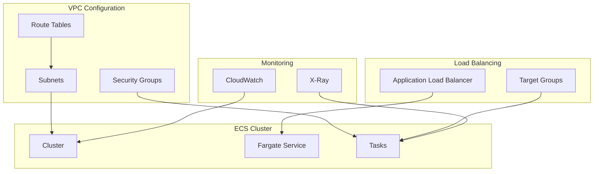
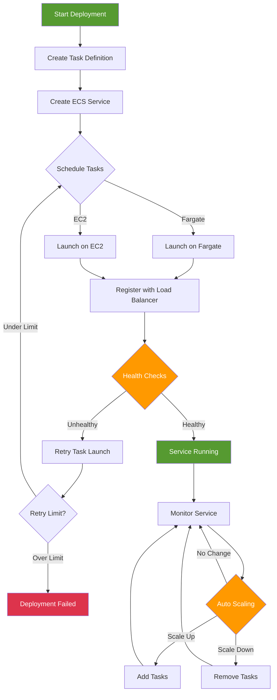

# ECS on Fargate - Hands-on Lab

[DIAGRAM: ECS Hands-on Architecture]



## Prerequisites

This lab builds on the ECR and Docker basics lab. Download the completed ECR lab state to begin:

- Completed the ECR and Docker Basics lab
- AWS CDK and CLI configured with appropriate permissions
- Docker installed and configured locally
- Basic understanding of containerization and microservices

## Lab Steps

### 1. Create VPC for Fargate

First, let's create a VPC for our Fargate tasks:

```typescript
const vpc = new ec2.Vpc(this, "FargateVPC", {
  maxAzs: 2,
  subnetConfiguration: [
    {
      cidrMask: 24,
      name: "Public",
      subnetType: ec2.SubnetType.PUBLIC,
    },
    {
      cidrMask: 24,
      name: "Private",
      subnetType: ec2.SubnetType.PRIVATE_WITH_EGRESS,
    },
  ],
});
```

### 2. Create ECS Cluster with Load Balancer

Now we'll create an ECS cluster, Fargate service, and Application Load Balancer:

```typescript
import * as cdk from "aws-cdk-lib";
import * as ec2 from "aws-cdk-lib/aws-ec2";
import * as ecs from "aws-cdk-lib/aws-ecs";
import * as elbv2 from "aws-cdk-lib/aws-elasticloadbalancingv2";
import * as ecr from "aws-cdk-lib/aws-ecr";
import * as logs from "aws-cdk-lib/aws-logs";
import { Construct } from "constructs";

export class EcsStack extends cdk.Stack {
  constructor(scope: Construct, id: string, props?: cdk.StackProps) {
    super(scope, id, props);

    // Create VPC for Fargate
    const vpc = new ec2.Vpc(this, "FargateVPC", {
      maxAzs: 2,
      subnetConfiguration: [
        {
          cidrMask: 24,
          name: "Public",
          subnetType: ec2.SubnetType.PUBLIC,
        },
        {
          cidrMask: 24,
          name: "Private",
          subnetType: ec2.SubnetType.PRIVATE_WITH_EGRESS,
        },
      ],
    });

    // Import existing ECR repository from lab 240
    const repository = ecr.Repository.fromRepositoryName(
      this,
      "ImportedRepo",
      "my-app-repo"
    );

    // Create ECS cluster
    const cluster = new ecs.Cluster(this, "FargateCluster", {
      vpc,
      enableFargateCapacityProviders: true,
    });

    // Create Application Load Balancer
    const loadBalancer = new elbv2.ApplicationLoadBalancer(this, "ALB", {
      vpc,
      internetFacing: true,
      loadBalancerName: "workshop-alb",
    });

    // Create security group for ALB
    const albSecurityGroup = new ec2.SecurityGroup(this, "ALBSecurityGroup", {
      vpc,
      description: "Security group for Application Load Balancer",
      allowAllOutbound: true,
    });

    albSecurityGroup.addIngressRule(
      ec2.Peer.anyIpv4(),
      ec2.Port.tcp(80),
      "Allow HTTP access from anywhere"
    );

    loadBalancer.addSecurityGroup(albSecurityGroup);

    // Create target group
    const targetGroup = new elbv2.ApplicationTargetGroup(this, "TargetGroup", {
      vpc,
      port: 3000,
      protocol: elbv2.ApplicationProtocol.HTTP,
      targetType: elbv2.TargetType.IP,
      healthCheckPath: "/health",
      healthCheckIntervalSeconds: 30,
      healthCheckTimeoutSeconds: 5,
      healthyThresholdCount: 2,
      unhealthyThresholdCount: 3,
    });

    // Add listener to load balancer
    const listener = loadBalancer.addListener("PublicListener", {
      port: 80,
      open: true,
      defaultTargetGroups: [targetGroup],
    });

    // Create task definition with health check
    const taskDefinition = new ecs.FargateTaskDefinition(this, "TaskDef", {
      memoryLimitMiB: 512,
      cpu: 256,
    });

    const container = taskDefinition.addContainer("MyContainer", {
      image: ecs.ContainerImage.fromEcrRepository(repository, "latest"),
      portMappings: [
        {
          containerPort: 3000,
          protocol: ecs.Protocol.TCP,
        },
      ],
      logging: ecs.LogDrivers.awsLogs({
        streamPrefix: "workshop-ecs",
        logRetention: logs.RetentionDays.ONE_WEEK,
      }),
      // Add health check (wget is available in Node Alpine images)
      healthCheck: {
        command: [
          "CMD-SHELL",
          "wget --no-verbose --tries=1 --spider http://localhost:3000/health || exit 1",
        ],
        interval: cdk.Duration.seconds(30),
        timeout: cdk.Duration.seconds(5),
        retries: 3,
        startPeriod: cdk.Duration.seconds(60),
      },
      environment: {
        PORT: "3000",
        NODE_ENV: "production",
      },
    });

    // Create Fargate service
    const service = new ecs.FargateService(this, "Service", {
      cluster,
      taskDefinition,
      desiredCount: 2,
      assignPublicIp: false, // Use private subnets
      vpcSubnets: {
        subnetType: ec2.SubnetType.PRIVATE_WITH_EGRESS,
      },
      healthCheckGracePeriod: cdk.Duration.seconds(60),
    });

    // Attach service to target group
    service.attachToApplicationTargetGroup(targetGroup);

    // Output the load balancer DNS name
    new cdk.CfnOutput(this, "LoadBalancerDNS", {
      value: loadBalancer.loadBalancerDnsName,
      description: "DNS name of the load balancer",
    });

    new cdk.CfnOutput(this, "LoadBalancerURL", {
      value: `http://${loadBalancer.loadBalancerDnsName}`,
      description: "URL of the application",
    });
  }
}
```

### 3. Update Your Application for Health Checks

Before deploying, update your Node.js application to include a health check endpoint:

```javascript:workshop-app/app.js
const express = require('express');
const app = express();
const port = process.env.PORT || 3000;

// Health check endpoint
app.get('/health', (req, res) => {
  res.status(200).json({
    status: 'healthy',
    timestamp: new Date().toISOString(),
    uptime: process.uptime()
  });
});

app.get('/', (req, res) => {
  res.send(`
    <h1>Hello from ECS Fargate!</h1>
    <p>Container ID: ${process.env.HOSTNAME}</p>
    <p>Time: ${new Date().toISOString()}</p>
    <p><a href="/health">Health Check</a></p>
  `);
});

app.listen(port, () => {
  console.log(`App listening at http://localhost:${port}`);
});
```

### 4. Test Load Balancer and Health Checks

#### Get Application URL

```bash
LOAD_BALANCER_URL=$(aws cloudformation describe-stacks \
  --stack-name EcsStack \
  --query 'Stacks[0].Outputs[?OutputKey==`LoadBalancerURL`].OutputValue' \
  --output text \
  --profile your-profile-name)

echo "Application URL: $LOAD_BALANCER_URL"
```

#### Test Application Access

```bash
# Test the main application
curl $LOAD_BALANCER_URL
```

```bash
# Test health check endpoint
curl $LOAD_BALANCER_URL/health
```

### 5. Configure Auto Scaling

Add auto scaling to your service:

```typescript:lib/ecs-stack.ts
const scaling = service.autoScaleTaskCount({
  minCapacity: 2,
  maxCapacity: 4,
});

scaling.scaleOnCpuUtilization('CpuScaling', {
  targetUtilizationPercent: 70,
  scaleInCooldown: cdk.Duration.seconds(60),
  scaleOutCooldown: cdk.Duration.seconds(60),
});
```

### 6. Configure Service Discovery

Add service discovery to your ECS stack:

```typescript:lib/ecs-stack.ts
const namespace = new ecs.CloudMapNamespace(this, 'WorkshopNamespace', {
  vpc,
  name: 'workshop.local',
});

const serviceDiscovery = service.enableCloudMap({
  name: 'workshop-app',
  cloudMapNamespace: namespace,
});
```


### 7. Configure Enhanced Monitoring

Add Container Insights and X-Ray:

```typescript:lib/ecs-stack.ts
const xrayContainer = {
  image: ecs.ContainerImage.fromRegistry('amazon/aws-xray-daemon'),
  memoryLimitMiB: 256,
  cpu: 256,
  logging: new ecs.AwsLogDriver({
    streamPrefix: 'xray-daemon',
  }),
};

taskDefinition.addContainer('xray', xrayContainer);
```

### 8. Test the Deployment

Access your application:

```bash
# Get the Load Balancer DNS name
aws cloudformation describe-stacks \
  --stack-name EcsStack \
  --query 'Stacks[0].Outputs[?OutputKey==`LoadBalancerDNS`].OutputValue' \
  --output text \
  --profile your-profile-name
```

Test scaling:

```bash
# Generate load
for i in {1..100}; do
  curl $LOAD_BALANCER_URL
  sleep 1
done
```

## Validation Steps

After completing this lab, verify that:

1. ✅ ECS cluster created successfully
2. ✅ Fargate service running with desired task count
3. ✅ Load balancer health checks passing
4. ✅ Application accessible via load balancer URL
5. ✅ Auto scaling policies configured and working
6. ✅ CloudWatch logs showing container output
7. ✅ Service discovery working (if configured)

## Troubleshooting

Common issues and solutions:

1. **Service Deployment Issues**

   - Check task definition for correct image URI
   - Verify IAM roles have required permissions
   - Check security group rules allow traffic
   - Review CloudWatch logs for container errors

2. **Load Balancer Issues**

   - Verify target group health check configuration
   - Check security groups allow load balancer traffic
   - Ensure health check path returns 200 status
   - Review load balancer target group targets

3. **Auto Scaling Problems**

   - Check CloudWatch metrics are being published
   - Verify scaling policies are correctly configured
   - Ensure sufficient capacity in service limits
   - Monitor scaling activities in console

4. **Network Connectivity Issues**
   - Check VPC configuration and routing
   - Verify security group inbound/outbound rules
   - Ensure subnet has internet access (if needed)
   - Check service discovery configuration

## Cleanup

When you're finished with this lab:

```bash
# Scale down service to 0 tasks
aws ecs update-service \
  --cluster your-cluster-name \
  --service your-service-name \
  --desired-count 0 \
  --profile your-profile-name

# Wait for tasks to stop
aws ecs wait services-stable \
  --cluster your-cluster-name \
  --services your-service-name \
  --profile your-profile-name

# Delete the service
aws ecs delete-service \
  --cluster your-cluster-name \
  --service your-service-name \
  --profile your-profile-name

# Destroy the CDK stack
cdk destroy --profile your-profile-name
```

Note: Ensure all tasks are stopped before deleting the service to avoid lingering resources.

[DIAGRAM: ECS Deployment Flow]



