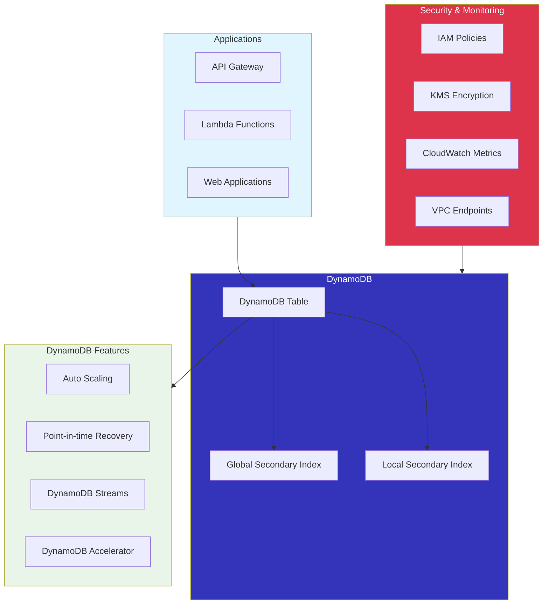
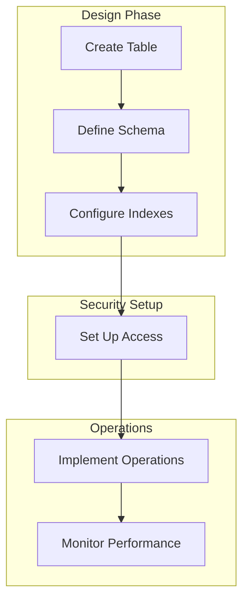

# DynamoDB Basics with AWS CDK

## Overview

Amazon DynamoDB is a fully managed NoSQL database service that provides fast and predictable performance with seamless scalability. In this lab, you'll learn how to create and manage DynamoDB tables using AWS CDK.

[DIAGRAM: DynamoDB Architecture Overview]



## Learning Objectives

- Understand DynamoDB's core concepts and data model
- Design efficient table structures and access patterns
- Implement basic CRUD operations
- Use indexes for efficient queries
- Manage capacity and scaling
- Implement best practices for cost optimization

## Core Concepts

### Data Model

1. **Tables, Items, and Attributes**

   ```
   Table
   ├── Item 1
   │   ├── Partition Key
   │   ├── Sort Key (optional)
   │   └── Attributes
   ├── Item 2
   │   ├── Partition Key
   │   ├── Sort Key (optional)
   │   └── Attributes
   └── ...
   ```

   - Tables: Collection of items
   - Items: Collection of attributes
   - Attributes: Fundamental data elements

2. **Primary Keys**
   - Simple Primary Key (Partition Key only)
   - Composite Primary Key (Partition Key + Sort Key)
   - Key design considerations

### Access Patterns

1. **Operations**

   ```
   ┌────────────┐
   │  Primary   │
   │    Key     │──┐
   └────────────┘  │    ┌────────────┐
                   ├───▶│   Query    │
   ┌────────────┐  │    └────────────┘
   │ Secondary  │  │
   │   Index    │──┘
   └────────────┘
   ```

   - GetItem
   - Query
   - Scan
   - BatchGetItem
   - TransactGetItems

2. **Data Manipulation**
   - PutItem
   - UpdateItem
   - DeleteItem
   - BatchWriteItem
   - TransactWriteItems

### Secondary Indexes

1. **Global Secondary Index (GSI)**

   ```
   Table                GSI
   ┌────┐             ┌────┐
   │ PK │──────┐      │ PK'│
   └────┘      │      └────┘
   ┌────┐      │      ┌────┐
   │ SK │      └─────▶│ SK'│
   └────┘             └────┘
   ```

   - Different partition key
   - Eventually consistent
   - Separate capacity units

2. **Local Secondary Index (LSI)**
   - Same partition key
   - Different sort key
   - Strong consistency option
   - Shares capacity units

### Capacity Modes

1. **Provisioned Capacity**

   - Read Capacity Units (RCU)
   - Write Capacity Units (WCU)
   - Auto-scaling options
   - Reserved capacity

2. **On-Demand Capacity**
   - Pay-per-request
   - Auto-scales instantly
   - No capacity planning
   - Higher per-request cost

### Data Types

1. **Scalar Types**

   - String
   - Number
   - Binary
   - Boolean
   - Null

2. **Complex Types**
   - List
   - Map
   - Set (String, Number, Binary)

### Consistency Models

1. **Read Consistency**
   ```
   Write Request
        │
        ▼
   ┌──────────┐
   │ Primary  │
   │  Node    │
   └──────────┘
        │
        ▼
   ┌──────────┐  ┌──────────┐  ┌──────────┐
   │ Replica  │  │ Replica  │  │ Replica  │
   │  Node    │  │  Node    │  │  Node    │
   └──────────┘  └──────────┘  └──────────┘
        │             │             │
        ▼             ▼             ▼
   Eventually     Eventually     Strongly
   Consistent     Consistent     Consistent
   (Any Node)     (Any Node)    (All Nodes)
   ```
   - Eventually Consistent Reads
   - Strongly Consistent Reads
   - Consistency trade-offs

## Best Practices

1. **Table Design**

   - One table design
   - Avoid hot keys
   - Efficient key distribution
   - Future-proof schema

2. **Performance**

   - Use batch operations
   - Parallel scanning
   - Appropriate consistency level
   - Efficient queries

3. **Cost Optimization**

   - Choose appropriate capacity mode
   - Use auto-scaling
   - Monitor usage patterns
   - Implement TTL

4. **Security**
   - Use IAM roles
   - Encrypt at rest
   - VPC endpoints
   - Access logging

## Prerequisites for Lab

- AWS CLI configured
- Basic understanding of NoSQL concepts
- AWS CDK setup
- Basic JavaScript/TypeScript knowledge

## What's Next

In the hands-on section, you'll:

- Create DynamoDB tables
- Implement CRUD operations
- Use secondary indexes
- Configure capacity and scaling
- Monitor performance
- Implement best practices

[DIAGRAM: DynamoDB Operations Flow]


