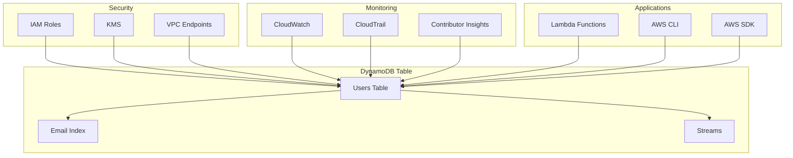

# DynamoDB Basics - Hands-on Lab

[DIAGRAM: DynamoDB Hands-on Architecture]



## Prerequisites

Create a new CDK project:

```bash
mkdir dynamodb-lab
cd dynamodb-lab
npx aws-cdk init app --language typescript
```

## Lab Steps

### 1. Create DynamoDB Table

Let's create a DynamoDB table with a composite key and GSI:

```typescript
import * as dynamodb from "aws-cdk-lib/aws-dynamodb";

const table = new dynamodb.Table(this, "UsersTable", {
  partitionKey: { name: "userId", type: dynamodb.AttributeType.STRING },
  sortKey: { name: "email", type: dynamodb.AttributeType.STRING },
  billingMode: dynamodb.BillingMode.PAY_PER_REQUEST,
  removalPolicy: cdk.RemovalPolicy.DESTROY,
});

// Add GSI for email lookup
table.addGlobalSecondaryIndex({
  indexName: "EmailIndex",
  partitionKey: { name: "email", type: dynamodb.AttributeType.STRING },
  projectionType: dynamodb.ProjectionType.ALL,
});
```

### 2. Create Test Data Script

Create a new file `scripts/populate-table.ts`:

```typescript:scripts/populate-table.ts
import { DynamoDB } from '@aws-sdk/client-dynamodb';
import { DynamoDBDocument } from '@aws-sdk/lib-dynamodb';

const dynamodb = new DynamoDB({});
const docClient = DynamoDBDocument.from(dynamodb);

async function populateTable() {
  const tableName = process.env.TABLE_NAME;

  const users = [
    {
      userId: 'user1',
      email: 'user1@example.com',
      name: 'User One',
      age: 25,
      address: {
        street: '123 Main St',
        city: 'Seattle',
        country: 'USA'
      },
      interests: ['reading', 'hiking']
    },
    {
      userId: 'user2',
      email: 'user2@example.com',
      name: 'User Two',
      age: 30,
      address: {
        street: '456 Pine St',
        city: 'Portland',
        country: 'USA'
      },
      interests: ['gaming', 'cooking']
    }
  ];

  for (const user of users) {
    try {
      await docClient.put({
        TableName: tableName,
        Item: user
      });
      console.log(`Added user: ${user.userId}`);
    } catch (error) {
      console.error(`Error adding user ${user.userId}:`, error);
    }
  }
}

populateTable();
```

Run the script:

```bash
TABLE_NAME=$(aws cloudformation describe-stacks \
  --stack-name DynamoDBStack \
  --query 'Stacks[0].Outputs[?OutputKey==`TableName`].OutputValue' \
  --output text \
  --profile your-profile-name)

ts-node scripts/populate-table.ts
```

### 3. Implement CRUD Operations

Create a new file `scripts/crud-operations.ts`:

```typescript:scripts/crud-operations.ts
import { DynamoDB } from '@aws-sdk/client-dynamodb';
import { DynamoDBDocument } from '@aws-sdk/lib-dynamodb';

const dynamodb = new DynamoDB({});
const docClient = DynamoDBDocument.from(dynamodb);
const tableName = process.env.TABLE_NAME;

async function demonstrateCRUD() {
  // Create
  const newUser = {
    userId: 'user3',
    email: 'user3@example.com',
    name: 'User Three',
    age: 35
  };

  await docClient.put({
    TableName: tableName,
    Item: newUser
  });
  console.log('Created new user:', newUser);

  // Read
  const result = await docClient.get({
    TableName: tableName,
    Key: {
      userId: 'user3',
      email: 'user3@example.com'
    }
  });
  console.log('Read user:', result.Item);

  // Update
  await docClient.update({
    TableName: tableName,
    Key: {
      userId: 'user3',
      email: 'user3@example.com'
    },
    UpdateExpression: 'set age = :age',
    ExpressionAttributeValues: {
      ':age': 36
    }
  });
  console.log('Updated user age');

  // Query using GSI
  const queryResult = await docClient.query({
    TableName: tableName,
    IndexName: 'EmailIndex',
    KeyConditionExpression: 'email = :email',
    ExpressionAttributeValues: {
      ':email': 'user3@example.com'
    }
  });
  console.log('Query result:', queryResult.Items);

  // Delete
  await docClient.delete({
    TableName: tableName,
    Key: {
      userId: 'user3',
      email: 'user3@example.com'
    }
  });
  console.log('Deleted user');
}

demonstrateCRUD();
```

Run the CRUD operations:

```bash
ts-node scripts/crud-operations.ts
```

### 4. Implement Batch Operations

Create a new file `scripts/batch-operations.ts`:

```typescript:scripts/batch-operations.ts
import { DynamoDB } from '@aws-sdk/client-dynamodb';
import { DynamoDBDocument } from '@aws-sdk/lib-dynamodb';

const dynamodb = new DynamoDB({});
const docClient = DynamoDBDocument.from(dynamodb);
const tableName = process.env.TABLE_NAME;

async function demonstrateBatchOperations() {
  // BatchWrite
  const users = Array.from({ length: 25 }, (_, i) => ({
    userId: `batchUser${i}`,
    email: `batch${i}@example.com`,
    name: `Batch User ${i}`,
    age: 20 + i
  }));

  // Split into chunks of 25 (DynamoDB batch write limit)
  for (let i = 0; i < users.length; i += 25) {
    const batch = users.slice(i, i + 25);
    await docClient.batchWrite({
      RequestItems: {
        [tableName]: batch.map(user => ({
          PutRequest: { Item: user }
        }))
      }
    });
  }
  console.log('Batch write complete');

  // BatchGet
  const keys = users.slice(0, 5).map(user => ({
    userId: user.userId,
    email: user.email
  }));

  const batchGet = await docClient.batchGet({
    RequestItems: {
      [tableName]: {
        Keys: keys
      }
    }
  });
  console.log('Batch get results:', batchGet.Responses[tableName]);
}

demonstrateBatchOperations();
```

Run the batch operations:

```bash
ts-node scripts/batch-operations.ts
```

## Validation Steps

After completing this lab, verify that:

1. ✅ DynamoDB table created successfully
2. ✅ Global Secondary Index working
3. ✅ Data populated in table
4. ✅ CRUD operations working via CLI
5. ✅ Performance monitoring enabled
6. ✅ Backup configuration applied

## Troubleshooting

Common issues and solutions:

1. **Table Access Issues**

   - Check IAM permissions
   - Verify table exists
   - Confirm correct region

2. **GSI Problems**

   - Check index status
   - Verify key schema
   - Allow time for creation

3. **Performance Issues**
   - Monitor consumed capacity
   - Check hot partitions
   - Review query patterns

## Cleanup

When you're finished with this lab:

```bash
# Empty the table (if needed)
aws dynamodb scan --table-name UsersTable --projection-expression "userId,email" --profile your-profile-name | \
  jq -r '.Items[] | [.userId.S, .email.S] | @tsv' | \
  while read userId email; do
    aws dynamodb delete-item \
      --table-name UsersTable \
      --key "{\"userId\":{\"S\":\"$userId\"},\"email\":{\"S\":\"$email\"}}" \
      --profile your-profile-name
  done

# Destroy the CDK stack
cdk destroy DynamoDBStack --profile your-profile-name
```
