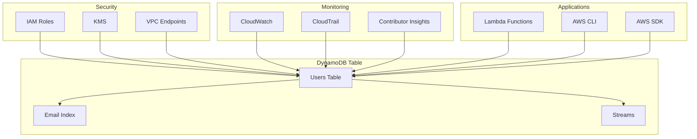

# DynamoDB Basics - Hands-on Lab

[DIAGRAM: DynamoDB Hands-on Architecture]



## Prerequisites

Create a new CDK project:

```bash
mkdir dynamodb-lab
cd dynamodb-lab
npx aws-cdk init app --language typescript

# Install required AWS SDK packages
npm install @aws-sdk/client-dynamodb @aws-sdk/lib-dynamodb
npm install --save-dev @types/node ts-node
```

## Lab Steps

### 1. Create DynamoDB Table with TTL

Let's create a DynamoDB table with TTL support and proper indexing:

```typescript
import * as cdk from "aws-cdk-lib";
import * as dynamodb from "aws-cdk-lib/aws-dynamodb";
import { Construct } from "constructs";

export class DynamodbLabStack extends cdk.Stack {
  constructor(scope: Construct, id: string, props?: cdk.StackProps) {
    super(scope, id, props);

    const table = new dynamodb.Table(this, "UsersTable", {
      partitionKey: { name: "userId", type: dynamodb.AttributeType.STRING },
      sortKey: { name: "email", type: dynamodb.AttributeType.STRING },
      billingMode: dynamodb.BillingMode.PAY_PER_REQUEST,
      removalPolicy: cdk.RemovalPolicy.DESTROY,

      // Enable TTL for automatic data expiration
      timeToLiveAttribute: "ttl",

      // Enable point-in-time recovery
      pointInTimeRecovery: true,
    });

    // Add GSI for email lookup
    table.addGlobalSecondaryIndex({
      indexName: "EmailIndex",
      partitionKey: { name: "email", type: dynamodb.AttributeType.STRING },
      projectionType: dynamodb.ProjectionType.ALL,
    });

    // Add GSI for status-based queries
    table.addGlobalSecondaryIndex({
      indexName: "StatusIndex",
      partitionKey: { name: "status", type: dynamodb.AttributeType.STRING },
      sortKey: { name: "createdAt", type: dynamodb.AttributeType.STRING },
      projectionType: dynamodb.ProjectionType.ALL,
    });

    // Output table name
    new cdk.CfnOutput(this, "TableName", {
      value: table.tableName,
      description: "DynamoDB table name",
    });
  }
}
```

### 2. Implement Query Patterns

Create a new file `scripts/query-patterns.ts`:

```typescript:scripts/query-patterns.ts
import { DynamoDB } from '@aws-sdk/client-dynamodb';
import { DynamoDBDocument } from '@aws-sdk/lib-dynamodb';

const dynamodb = new DynamoDB({});
const docClient = DynamoDBDocument.from(dynamodb);
const tableName = process.env.TABLE_NAME;

async function demonstrateQueryPatterns() {
  console.log('=== DynamoDB Query Patterns Demo ===\n');

  // Pattern 1: Get single item by primary key
  console.log('1. Get single item by primary key:');
  try {
    const result = await docClient.get({
      TableName: tableName,
      Key: {
        userId: 'user1',
        email: 'user1@example.com'
      }
    });
    console.log('Result:', result.Item);
  } catch (error) {
    console.error('Error:', error.message);
  }

  // Pattern 2: Query all items for a user
  console.log('\n2. Query all emails for a user:');
  try {
    const result = await docClient.query({
      TableName: tableName,
      KeyConditionExpression: 'userId = :userId',
      ExpressionAttributeValues: {
        ':userId': 'user1'
      }
    });
    console.log('Results:', result.Items);
    console.log('Count:', result.Count);
  } catch (error) {
    console.error('Error:', error.message);
  }

  // Pattern 3: Query with filter expression
  console.log('\n3. Query users with age filter:');
  try {
    const result = await docClient.query({
      TableName: tableName,
      KeyConditionExpression: 'userId = :userId',
      FilterExpression: 'age > :minAge',
      ExpressionAttributeValues: {
        ':userId': 'user1',
        ':minAge': 25
      }
    });
    console.log('Filtered results:', result.Items);
  } catch (error) {
    console.error('Error:', error.message);
  }

  // Pattern 4: Query using GSI
  console.log('\n4. Query by email using GSI:');
  try {
    const result = await docClient.query({
      TableName: tableName,
      IndexName: 'EmailIndex',
      KeyConditionExpression: 'email = :email',
      ExpressionAttributeValues: {
        ':email': 'user1@example.com'
      }
    });
    console.log('GSI results:', result.Items);
  } catch (error) {
    console.error('Error:', error.message);
  }

  // Pattern 5: Query by status with sort
  console.log('\n5. Query active users sorted by creation date:');
  try {
    const result = await docClient.query({
      TableName: tableName,
      IndexName: 'StatusIndex',
      KeyConditionExpression: '#status = :status',
      ExpressionAttributeNames: {
        '#status': 'status'
      },
      ExpressionAttributeValues: {
        ':status': 'active'
      },
      ScanIndexForward: false, // Sort descending (newest first)
      Limit: 10
    });
    console.log('Status query results:', result.Items);
  } catch (error) {
    console.error('Error:', error.message);
  }

  // Pattern 6: Conditional update
  console.log('\n6. Conditional update:');
  try {
    await docClient.update({
      TableName: tableName,
      Key: {
        userId: 'user1',
        email: 'user1@example.com'
      },
      UpdateExpression: 'SET #status = :newStatus, lastModified = :timestamp',
      ConditionExpression: '#status = :currentStatus',
      ExpressionAttributeNames: {
        '#status': 'status'
      },
      ExpressionAttributeValues: {
        ':newStatus': 'premium',
        ':currentStatus': 'active',
        ':timestamp': new Date().toISOString()
      }
    });
    console.log('Conditional update successful');
  } catch (error) {
    console.error('Conditional update failed:', error.message);
  }
}

demonstrateQueryPatterns();
```

### 3. Implement TTL Examples

Create a new file `scripts/ttl-examples.ts`:

```typescript:scripts/ttl-examples.ts
import { DynamoDB } from '@aws-sdk/client-dynamodb';
import { DynamoDBDocument } from '@aws-sdk/lib-dynamodb';

const dynamodb = new DynamoDB({});
const docClient = DynamoDBDocument.from(dynamodb);
const tableName = process.env.TABLE_NAME;

async function demonstrateTTL() {
  console.log('=== DynamoDB TTL Examples ===\n');

  const now = Math.floor(Date.now() / 1000); // Current time in seconds

  // Example 1: Session data that expires in 1 hour
  const sessionData = {
    userId: 'session-user',
    email: 'session@example.com',
    name: 'Session User',
    type: 'session',
    sessionToken: 'abc123',
    ttl: now + (60 * 60), // Expires in 1 hour
    createdAt: new Date().toISOString(),
    status: 'active'
  };

  // Example 2: Temporary user that expires in 24 hours
  const tempUser = {
    userId: 'temp-user',
    email: 'temp@example.com',
    name: 'Temporary User',
    type: 'temporary',
    ttl: now + (24 * 60 * 60), // Expires in 24 hours
    createdAt: new Date().toISOString(),
    status: 'trial'
  };

  // Example 3: Cache entry that expires in 5 minutes
  const cacheEntry = {
    userId: 'cache-entry',
    email: 'cache@example.com',
    name: 'Cache Entry',
    type: 'cache',
    cachedData: { result: 'expensive computation result' },
    ttl: now + (5 * 60), // Expires in 5 minutes
    createdAt: new Date().toISOString(),
    status: 'cached'
  };

  // Example 4: Permanent user (no TTL)
  const permanentUser = {
    userId: 'permanent-user',
    email: 'permanent@example.com',
    name: 'Permanent User',
    type: 'permanent',
    // No TTL attribute - this item won't expire
    createdAt: new Date().toISOString(),
    status: 'active'
  };

  try {
    // Insert all examples
    await docClient.put({ TableName: tableName, Item: sessionData });
    console.log('✅ Session data added (expires in 1 hour)');

    await docClient.put({ TableName: tableName, Item: tempUser });
    console.log('✅ Temporary user added (expires in 24 hours)');

    await docClient.put({ TableName: tableName, Item: cacheEntry });
    console.log('✅ Cache entry added (expires in 5 minutes)');

    await docClient.put({ TableName: tableName, Item: permanentUser });
    console.log('✅ Permanent user added (no expiration)');

    // Query to show different types
    console.log('\n📊 Current items by type:');

    const types = ['session', 'temporary', 'cache', 'permanent'];
    for (const type of types) {
      const result = await docClient.scan({
        TableName: tableName,
        FilterExpression: '#type = :type',
        ExpressionAttributeNames: { '#type': 'type' },
        ExpressionAttributeValues: { ':type': type }
      });
      console.log(`${type}: ${result.Count} items`);
    }

    // Show TTL values
    console.log('\n⏰ TTL Information:');
    const allItems = await docClient.scan({
      TableName: tableName,
      ProjectionExpression: 'userId, email, #type, ttl, createdAt',
      ExpressionAttributeNames: { '#type': 'type' }
    });

    allItems.Items?.forEach(item => {
      const ttlDate = item.ttl ? new Date(item.ttl * 1000).toLocaleString() : 'Never';
      console.log(`${item.userId} (${item.type}): Expires ${ttlDate}`);
    });

  } catch (error) {
    console.error('Error:', error);
  }
}

demonstrateTTL();
```

### 4. Advanced Query Commands

#### Set Environment Variables

```bash
export TABLE_NAME=$(aws cloudformation describe-stacks \
  --stack-name DynamodbLabStack \
  --query 'Stacks[0].Outputs[?OutputKey==`TableName`].OutputValue' \
  --output text \
  --profile your-profile-name)

echo "Table name: $TABLE_NAME"
```

#### Run Query Pattern Scripts

```bash
# Run query patterns demo
ts-node scripts/query-patterns.ts
```

```bash
# Run TTL examples
ts-node scripts/ttl-examples.ts
```

#### Basic Query Operations

**Get single item:**

```bash
aws dynamodb get-item \
  --table-name $TABLE_NAME \
  --key '{"userId":{"S":"user1"},"email":{"S":"user1@example.com"}}' \
  --profile your-profile-name
```

**Query all items for a user:**

```bash
aws dynamodb query \
  --table-name $TABLE_NAME \
  --key-condition-expression "userId = :uid" \
  --expression-attribute-values '{":uid":{"S":"user1"}}' \
  --profile your-profile-name
```

**Query with age filter:**

```bash
aws dynamodb query \
  --table-name $TABLE_NAME \
  --key-condition-expression "userId = :uid" \
  --filter-expression "age > :age" \
  --expression-attribute-values '{":uid":{"S":"user1"},":age":{"N":"25"}}' \
  --profile your-profile-name
```

#### Global Secondary Index Queries

**Query using EmailIndex:**

```bash
aws dynamodb query \
  --table-name $TABLE_NAME \
  --index-name EmailIndex \
  --key-condition-expression "email = :email" \
  --expression-attribute-values '{":email":{"S":"user1@example.com"}}' \
  --profile your-profile-name
```

#### TTL Monitoring

**Check items expiring soon:**

```bash
NEXT_HOUR=$(($(date +%s) + 3600))

aws dynamodb scan \
  --table-name $TABLE_NAME \
  --filter-expression "ttl BETWEEN :now AND :next_hour" \
  --expression-attribute-values "{\":now\":{\"N\":\"$(date +%s)\"},\":next_hour\":{\"N\":\"$NEXT_HOUR\"}}" \
  --profile your-profile-name
```

**List all TTL values:**

```bash
aws dynamodb scan \
  --table-name $TABLE_NAME \
  --projection-expression "userId, email, #type, ttl" \
  --expression-attribute-names '{"#type":"type"}' \
  --profile your-profile-name
```

## Validation Steps

After completing this lab, verify that:

1. ✅ DynamoDB table created successfully
2. ✅ Global Secondary Index working
3. ✅ Data populated in table
4. ✅ CRUD operations working via CLI
5. ✅ Performance monitoring enabled
6. ✅ Backup configuration applied

## Troubleshooting

Common issues and solutions:

1. **Table Access Issues**

   - Check IAM permissions
   - Verify table exists
   - Confirm correct region

2. **GSI Problems**

   - Check index status
   - Verify key schema
   - Allow time for creation

3. **Performance Issues**
   - Monitor consumed capacity
   - Check hot partitions
   - Review query patterns

## Cleanup

When you're finished with this lab:

```bash
# Empty the table (if needed)
aws dynamodb scan --table-name $TABLE_NAME --projection-expression "userId,email" --profile your-profile-name | \
  jq -r '.Items[] | [.userId.S, .email.S] | @tsv' | \
  while read userId email; do
    aws dynamodb delete-item \
      --table-name $TABLE_NAME \
      --key "{\"userId\":{\"S\":\"$userId\"},\"email\":{\"S\":\"$email\"}}" \
      --profile your-profile-name
  done

# Destroy the CDK stack
cdk destroy --profile your-profile-name
```
