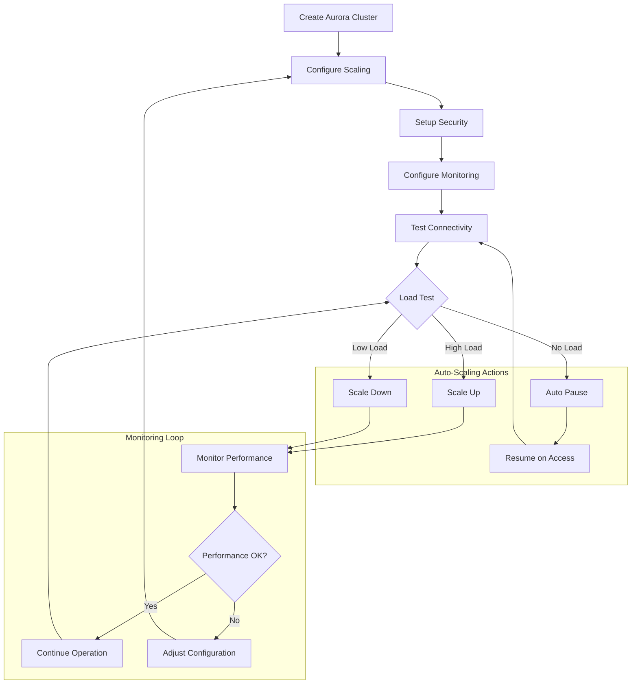

# Aurora Serverless with AWS CDK

## Overview

Amazon Aurora Serverless is an on-demand, auto-scaling configuration for Amazon Aurora that automatically starts up, shuts down, and scales capacity up or down based on your application's needs. In this lab, you'll learn how to create and manage Aurora Serverless databases using AWS CDK.

[DIAGRAM: Aurora Overview]

Instructions for draw.io:

1. Create a new diagram using the AWS Architecture 2023 template
2. Use the following AWS symbols from the symbol pack:
   - AWS Aurora icon
   - AWS VPC icon
   - AWS CloudWatch icon
   - AWS KMS icon
   - AWS Secrets Manager icon
   - AWS IAM icon
3. Layout:
   - Place Aurora cluster at the center
   - Add VPC and security groups
   - Show monitoring and encryption
   - Include scaling components
4. Use AWS's standard connector arrows to show:
   - Network connections
   - Security relationships
   - Monitoring flow
   - Scaling triggers
5. Use AWS's standard color scheme:
   - Blue for AWS services
   - Green for database components
   - Gray for infrastructure elements
6. Add clear labels for each component

## Learning Objectives

- Understand Aurora Serverless architecture and benefits
- Create and configure an Aurora Serverless cluster
- Implement auto-scaling and capacity management
- Configure security and connectivity
- Monitor and optimize performance
- Implement backup and recovery strategies

## Core Concepts

### Aurora Serverless Architecture

1. **Components**

   ```
   ┌─────────────────────────────────┐
   │     Aurora Serverless Cluster   │
   │                                 │
   │  ┌───────────┐   ┌───────────┐ │
   │  │ Capacity  │   │ Scaling   │ │
   │  │  Units    │◄──┤  Events   │ │
   │  └───────────┘   └───────────┘ │
   │         ▲                      │
   │         │                      │
   │  ┌───────────────────────┐     │
   │  │    Data API Layer     │     │
   │  └───────────────────────┘     │
   │         │                      │
   │         ▼                      │
   │  ┌──────────┐  ┌──────────┐   │
   │  │ Compute  │  │ Compute  │   │
   │  │  Node 1  │  │  Node 2  │   │
   │  └──────────┘  └──────────┘   │
   │         │             │        │
   │         └─────────────┘        │
   │                │               │
   │         ┌──────────┐          │
   │         │ Storage  │          │
   │         │  Layer   │          │
   │         └──────────┘          │
   └─────────────────────────────────┘
   ```

   - Capacity Units (ACUs)
   - Scaling configuration
   - Data API
   - Connection management
   - Distributed compute nodes
   - Shared storage layer

2. **Auto-scaling**
   - Minimum and maximum ACUs
   - Scale-up and scale-down triggers
   - Scaling timeout
   - Zero capacity (pause)

### Database Configuration

1. **Cluster Settings**

   ```
   Cluster
   ├── Engine Version
   ├── Capacity Range
   ├── Scaling Configuration
   ├── Timeout Action
   └── Network Configuration
   ```

   - Engine choice (MySQL/PostgreSQL)
   - Capacity configuration
   - Network settings
   - Parameter groups

2. **Connectivity Options**
   - Data API
   - Traditional database connections
   - VPC endpoints
   - Connection pooling

### Security Features

1. **Access Control**

   ```
   ┌────────────┐
   │ IAM Auth   │
   └────────────┘
         ▲
         │
   ┌────────────┐    ┌────────────┐
   │  Secrets   │◄───┤ Database   │
   │  Manager   │    │ Credentials│
   └────────────┘    └────────────┘
   ```

   - IAM authentication
   - Security groups
   - SSL/TLS encryption
   - Secrets management

2. **Data Protection**
   - Encryption at rest
   - Encryption in transit
   - Backup encryption
   - Audit logging

### Monitoring and Operations

1. **Performance Monitoring**

   - CloudWatch metrics
   - Performance Insights
   - Enhanced monitoring
   - Scaling events

2. **Operational Tasks**
   - Backup and restore
   - Point-in-time recovery
   - Cluster maintenance
   - Version upgrades

## Best Practices

1. **Cost Optimization**

   - Right-size capacity range
   - Use pause capability
   - Monitor usage patterns
   - Optimize connection handling

2. **Performance**

   - Configure appropriate scaling
   - Use connection pooling
   - Optimize queries
   - Monitor scaling events

3. **Security**

   - Use IAM authentication
   - Implement least privilege
   - Enable encryption
   - Regular auditing

4. **High Availability**
   - Multi-AZ deployment
   - Backup strategy
   - Disaster recovery plan
   - Monitoring and alerting

## Prerequisites for Lab

- AWS CLI configured
- Basic understanding of relational databases
- Familiarity with SQL
- AWS CDK setup
- MySQL or PostgreSQL client installed

## What's Next

In the hands-on section, you'll:

- Create an Aurora Serverless cluster
- Configure auto-scaling
- Connect using Data API
- Implement security best practices
- Monitor performance
- Test scaling behavior

## Aurora Serverless Operations Flow


