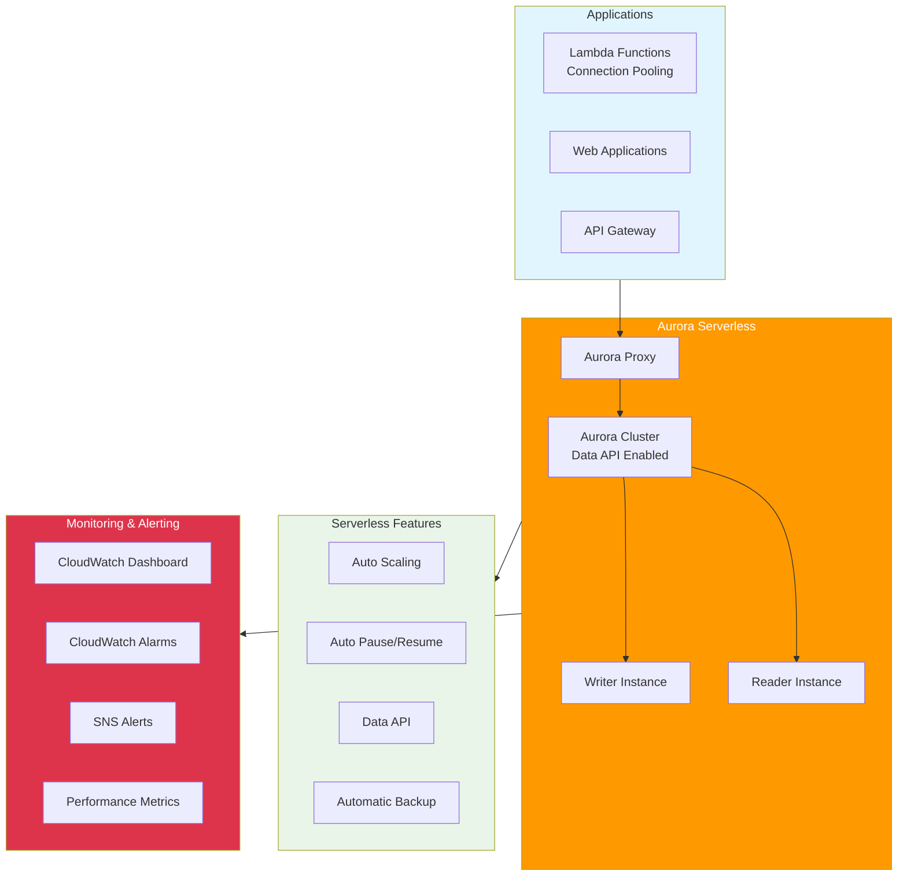

# Aurora Serverless with AWS CDK

## Overview

Amazon Aurora Serverless is an on-demand, auto-scaling configuration for Amazon Aurora that automatically starts up, shuts down, and scales capacity up or down based on your application's needs. In this lab, you'll learn how to create and manage Aurora Serverless databases using AWS CDK with production-ready monitoring, connection pooling, and operational best practices.

[DIAGRAM: Aurora Serverless Architecture]

## Learning Objectives

After completing this lab, you will be able to:

- Understand Aurora Serverless architecture and benefits
- Create and configure an Aurora Serverless cluster
- Implement efficient connection pooling with Lambda
- Configure auto-scaling and capacity management
- Set up comprehensive monitoring and alerting
- Use the Data API for serverless database operations
- Monitor and optimize performance
- Implement backup and recovery strategies

## Architecture Overview

This lab implements a production-ready Aurora Serverless setup with:

- Aurora MySQL cluster with auto-scaling
- Data API for connection-less database access
- Lambda functions with efficient connection pooling
- CloudWatch monitoring and alerting
- SNS notifications for operational events
- Performance dashboard for real-time monitoring
- Automated backup and recovery

## Best Practices Covered

1. **Connection Management**

   - Data API usage for serverless applications
   - Connection pooling strategies
   - Efficient Lambda database access
   - Connection limits and timeouts

2. **Monitoring & Operations**

   - CloudWatch alarms for performance
   - Real-time dashboard monitoring
   - Alert notifications via SNS
   - Performance trend analysis

3. **Cost Optimization**

   - Auto-pause for idle clusters
   - Capacity unit optimization
   - Usage pattern monitoring
   - Scaling configuration tuning

4. **Security & Reliability**
   - VPC isolation
   - Secrets Manager integration
   - Backup and recovery planning
   - High availability configuration

## Prerequisites for Lab

- AWS CLI configured with appropriate permissions
- AWS CDK setup and bootstrapped
- Basic understanding of relational databases
- Familiarity with SQL and database operations
- Node.js and npm installed

## What's Next

In the hands-on section, you'll:

- Create an Aurora Serverless cluster with monitoring
- Configure Lambda functions with connection pooling
- Set up CloudWatch dashboards and alarms
- Implement Data API operations
- Test auto-scaling behavior
- Monitor performance metrics
- Configure alert notifications

## What's Next

In the hands-on section, you'll:

- Create an Aurora Serverless v2 cluster
- Configure auto-scaling parameters
- Implement Data API connections
- Set up monitoring and alerts
- Test serverless scaling behavior
- Explore cost optimization features
