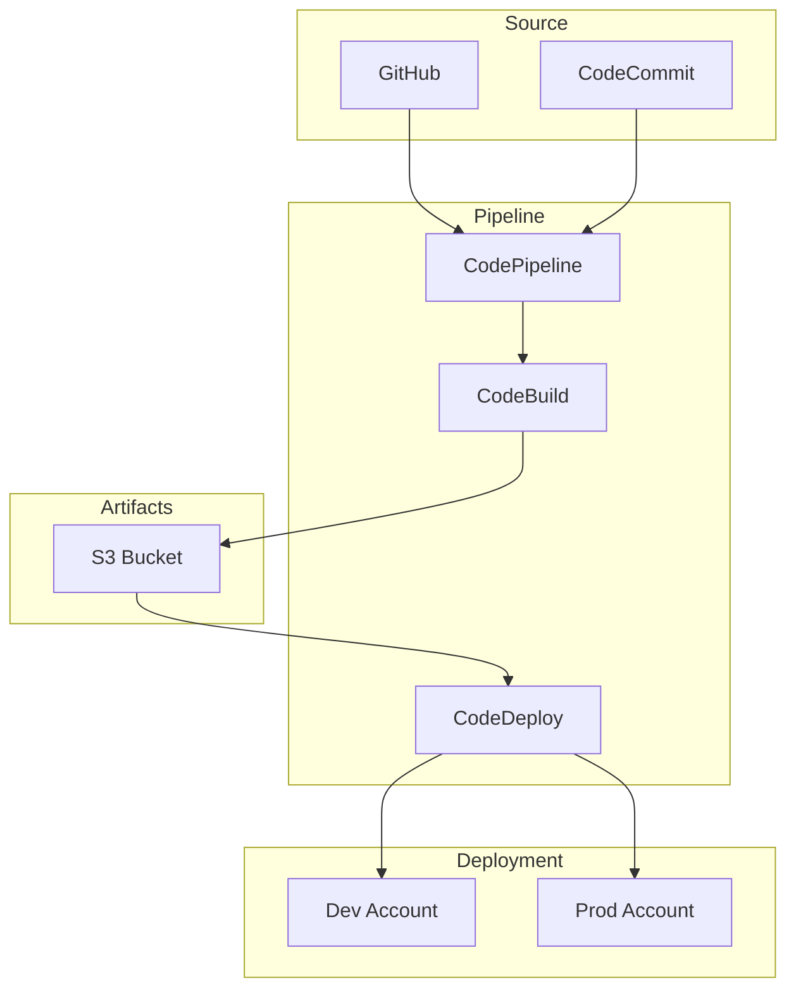
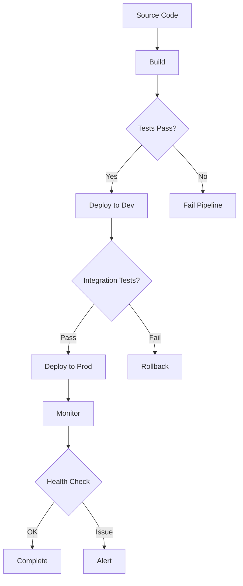

# CICD Infrastructure with CDK Pipelines

## Overview

AWS CDK Pipelines enables you to create continuous delivery pipelines that deploy your AWS CDK applications across AWS accounts and regions. This lab introduces CDK Pipelines concepts and demonstrates how to set up an automated deployment pipeline for your infrastructure.

[DIAGRAM: CI/CD Overview]



## Learning Objectives

- Understand CDK Pipelines architecture and concepts
- Create self-mutating deployment pipelines
- Implement multi-stage deployments
- Configure pipeline security and testing
- Manage infrastructure changes through CI/CD
- Implement best practices for infrastructure deployment

## Core Concepts

### CDK Pipelines Architecture

1. **Pipeline Components**

   ```
   ┌─────────────────────────────────────────┐
   │              CDK Pipeline               │
   │                                         │
   │  ┌─────────┐  ┌────────┐  ┌─────────┐  │
   │  │ Source  │─▶│ Synth  │─▶│ Deploy  │  │
   │  └─────────┘  └────────┘  └─────────┘  │
   │       │           │            │        │
   │       ▼           ▼            ▼        │
   │  ┌─────────┐  ┌────────┐  ┌─────────┐  │
   │  │ GitHub/ │  │  CDK   │  │  Stage  │  │
   │  │ CodeCmmt│  │ Synth  │  │ Deploy  │  │
   │  └─────────┘  └────────┘  └─────────┘  │
   │       │           ▲            │        │
   │       └───────────┼────────────┘        │
   │                   │                     │
   │            Self-Mutation                │
   └─────────────────────────────────────────┘
   ```

   - Source stage
   - Build and synthesis
   - Deployment stages
   - Self-mutation (updates pipeline itself)

2. **Pipeline Stages**
   ```
   Development → Testing → Staging → Production
        │          │         │          │
        └──────────┴─────────┴──────────┘
              Stage Approvals
   ```
   - Environment configuration
   - Approval gates
   - Testing integration
   - Cross-account deployment

### Security and Compliance

1. **Access Control**

   ```
   ┌────────────┐    ┌────────────┐
   │ Pipeline   │    │  Deploy    │
   │   Role     │───▶│   Role     │
   └────────────┘    └────────────┘
         │                 │
         ▼                 ▼
   ┌────────────┐    ┌────────────┐
   │  Source    │    │  Target    │
   │  Account   │    │  Account   │
   └────────────┘    └────────────┘
   ```

   - IAM roles and policies
   - Cross-account permissions
   - Secrets management
   - Audit logging

2. **Security Best Practices**
   - Least privilege access
   - Environment isolation
   - Secure artifact storage
   - Compliance validation

### Testing and Validation

1. **Test Types**

   ```
   Unit Tests ─▶ Integration Tests ─▶ Security Tests
        │              │                   │
        └──────────────┴───────────────────┘
                Security Scanning
   ```

   - Unit testing
   - Integration testing
   - Security testing
   - Compliance checking

2. **Validation Steps**
   - Asset validation
   - Configuration testing
   - Deployment testing
   - Rollback procedures

### Pipeline Management

1. **Change Management**

   ```
   Feature Branch
        │
        ▼
   Pull Request ──▶ Main Branch ──▶ Pipeline
        │               │             │
    CI Testing     CD Testing    Deployment
   ```

   - Version control
   - Change tracking
   - Approval workflows
   - Rollback procedures

2. **Monitoring and Logging**
   - Pipeline metrics
   - Deployment logs
   - Alert configuration
   - Audit trails

## Best Practices

1. **Pipeline Design**

   - Modular architecture
   - Reusable components
   - Environment separation
   - Clear stage progression

2. **Security**

   - Secure secrets handling
   - Role-based access
   - Audit logging
   - Compliance checks

3. **Testing**

   - Automated testing
   - Security scanning
   - Configuration validation
   - Deployment verification

4. **Operations**
   - Monitoring setup
   - Alert configuration
   - Documentation
   - Recovery procedures

## Prerequisites for Lab

- AWS CDK installed
- GitHub or AWS CodeCommit repository
- AWS CLI configured
- Basic TypeScript knowledge
- Understanding of CI/CD concepts

## What's Next

In the hands-on section, you'll:

- Create a CDK pipeline
- Configure multi-stage deployments
- Implement testing and validation
- Set up cross-account deployments
- Configure security and monitoring
- Implement best practices

[DIAGRAM: CI/CD Workflow]


