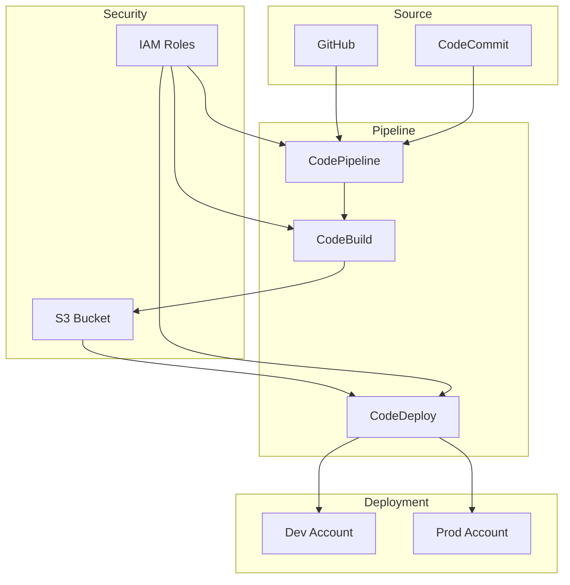
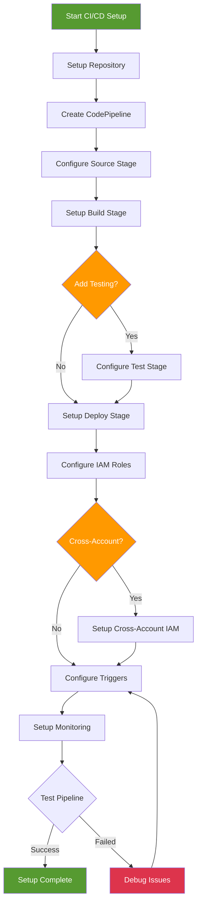

# CI/CD Infrastructure - Hands-on Lab

[DIAGRAM: CI/CD Hands-on Architecture]



## Prerequisites

> Tip: Set the workshop region (Frankfurt)
```bash
export AWS_REGION=eu-central-1
```

> Tip: Set an AWS profile for this shell to avoid repeating profile flags
```bash
export AWS_PROFILE=your-profile-name
```


- AWS CDK and AWS CLI configured
- GitHub account
- Multiple AWS accounts for testing (recommended)
- Basic TypeScript knowledge

## Lab Steps

### 1. GitHub Repository Setup

1. Create a new GitHub repository:

   - Go to GitHub.com and sign in
   - Click "New repository"
   - Name it "workshop-pipeline"
   - Initialize with a README
   - Add `.gitignore` for Node

2. Create AWS CodeStar Connection:

   - Go to AWS Developer Tools Console
   - Select "Settings" → "Connections"
   - Click "Create connection"
   - Select "GitHub"
   - Name the connection "workshop-github"
   - Click "Connect to GitHub"
   - Follow the GitHub authorization process
   - Note the Connection ARN once completed

3. Initialize local repository:

```bash
# Clone your new repository (replace YOUR_GITHUB_USERNAME with your actual GitHub username)
git clone https://github.com/YOUR_GITHUB_USERNAME/workshop-pipeline.git
cd workshop-pipeline

# Initialize CDK project
cdk init app --language typescript

# Install dependencies
npm install aws-cdk-lib constructs
```

### 2. Create Pipeline Infrastructure

Create a new file `lib/pipeline-stack.ts`:

```typescript:lib/pipeline-stack.ts
import * as cdk from 'aws-cdk-lib';
import * as pipelines from 'aws-cdk-lib/pipelines';
import { Construct } from 'constructs';

export class PipelineStack extends cdk.Stack {
  constructor(scope: Construct, id: string, props?: cdk.StackProps) {
    super(scope, id, props);

    const pipeline = new pipelines.CodePipeline(this, 'Pipeline', {
      pipelineName: 'WorkshopPipeline',
      synth: new pipelines.ShellStep('Synth', {
        input: pipelines.CodePipelineSource.connection('YOUR_GITHUB_USERNAME/workshop-pipeline', 'main', {
          connectionArn: 'YOUR_CONNECTION_ARN'  // Replace with your actual Connection ARN from step 1
        }),
        commands: [
          'npm ci',
          'npm run build',
          'npx cdk synth'
        ]
      })
    });

    // Add application stages
    pipeline.addStage(new ApplicationStage(this, 'Dev', {
      env: {
        account: process.env.CDK_DEFAULT_ACCOUNT,
        region: process.env.CDK_DEFAULT_REGION
      }
    }));
  }
}

class ApplicationStage extends cdk.Stage {
  constructor(scope: Construct, id: string, props?: cdk.StageProps) {
    super(scope, id, props);

    // Add your application stacks here
    new cdk.Stack(this, 'ApplicationStack');
  }
}
```

Update your `bin/workshop-pipeline.ts`:

```typescript:bin/workshop-pipeline.ts
#!/usr/bin/env node
import 'source-map-support/register';
import * as cdk from 'aws-cdk-lib';
import { PipelineStack } from '../lib/pipeline-stack';

const app = new cdk.App();
new PipelineStack(app, 'PipelineStack', {
  env: {
    account: process.env.CDK_DEFAULT_ACCOUNT,
    region: process.env.CDK_DEFAULT_REGION,
  },
});
```

### 3. Initial Deployment

1. Commit and push your changes:

```bash
git add .
git commit -m "Initial pipeline setup"
git push origin main
```

2. Deploy the pipeline:

```bash
cdk deploy
```

### 4. Configure Testing and Validation

Create a new file `lib/pipeline-testing.ts`:

```typescript:lib/pipeline-testing.ts
import * as pipelines from 'aws-cdk-lib/pipelines';

export function addTestingStage(pipeline: pipelines.CodePipeline, stage: pipelines.StageDeployment) {
  stage.addPre(new pipelines.ShellStep('UnitTest', {
    commands: [
      'npm ci',
      'npm run test'
    ],
  }));

  stage.addPost(new pipelines.ShellStep('IntegrationTest', {
    commands: [
      'npm ci',
      'npm run integration'
    ],
    envFromCfnOutputs: {
      // Map CloudFormation outputs to environment variables
      // API_ENDPOINT: stage.stackOutputs['ApiEndpoint'],  // Example - replace with actual stack output
    },
  }));
}
```

### 5. Add Production Stage with Approval

Update `lib/pipeline-stack.ts`:

```typescript:lib/pipeline-stack.ts
// Inside PipelineStack constructor after Dev stage

const prod = pipeline.addStage(new ApplicationStage(this, 'Prod', {
  env: {
    account: process.env.PROD_ACCOUNT,
    region: process.env.CDK_DEFAULT_REGION
  }
}), {
  pre: [
    new pipelines.ManualApprovalStep('PromoteToProd')
  ]
});
```

### 6. Add Security Scanning

Create a new file `lib/security-checks.ts`:

```typescript:lib/security-checks.ts
import * as pipelines from 'aws-cdk-lib/pipelines';

export function addSecurityChecks(pipeline: pipelines.CodePipeline, stage: pipelines.StageDeployment) {
  stage.addPre(new pipelines.ShellStep('SecurityScan', {
    commands: [
      'npm audit',
      'npm run cdk-nag'
    ],
  }));
}
```

### 7. Configure Cross-Account Deployment

Create a new file `lib/cross-account-role.ts`:

```typescript:lib/cross-account-role.ts
import * as cdk from 'aws-cdk-lib';
import * as iam from 'aws-cdk-lib/aws-iam';
import { Construct } from 'constructs';

export class CrossAccountRole extends cdk.Stack {
  constructor(scope: Construct, id: string, props?: cdk.StackProps) {
    super(scope, id, props);

    new iam.Role(this, 'DeploymentRole', {
      assumedBy: new iam.AccountPrincipal(process.env.PIPELINE_ACCOUNT),
      roleName: 'CDKDeploymentRole',
      managedPolicies: [
        iam.ManagedPolicy.fromAwsManagedPolicyName('AdministratorAccess'), // Note: Scope this down in production
      ],
    });
  }
}
```

### 8. Implement Wave Deployments

Update `lib/pipeline-stack.ts`:

```typescript:lib/pipeline-stack.ts
// Inside PipelineStack constructor

const wave = pipeline.addWave('RegionalDeployment');

wave.addStage(new ApplicationStage(this, 'US', {
  env: { region: 'us-east-1' }
}));

wave.addStage(new ApplicationStage(this, 'EU', {
  env: { region: 'eu-west-1' }
}));
```

### 9. Add Monitoring and Alerts

Create a new file `lib/pipeline-monitoring.ts`:

```typescript:lib/pipeline-monitoring.ts
import * as cdk from 'aws-cdk-lib';
import * as cloudwatch from 'aws-cdk-lib/aws-cloudwatch';
import * as actions from 'aws-cdk-lib/aws-cloudwatch-actions';
import * as sns from 'aws-cdk-lib/aws-sns';
import { Construct } from 'constructs';

export class PipelineMonitoring extends Construct {
  constructor(scope: Construct, id: string) {
    super(scope, id);

    const topic = new sns.Topic(this, 'PipelineAlerts');

    // Pipeline failure metric
    const failureMetric = new cloudwatch.Metric({
      namespace: 'AWS/CodePipeline',
      metricName: 'FailedPipeline',
      dimensionsMap: {
        PipelineName: 'WorkshopPipeline'
      },
    });

    // Create alarm
    new cloudwatch.Alarm(this, 'PipelineFailureAlarm', {
      metric: failureMetric,
      threshold: 1,
      evaluationPeriods: 1,
      alarmDescription: 'Pipeline execution failed',
    }).addAlarmAction(new actions.SnsAction(topic));
  }
}
```

## Deploy and Monitor Pipeline

Deploy the CI/CD infrastructure:

```bash
# Deploy the pipeline stack
cdk deploy PipelineStack

# Check pipeline status
aws codepipeline get-pipeline-state \
  --name WorkshopPipeline \
 

# Monitor first execution
aws codepipeline get-pipeline-execution \
  --pipeline-name WorkshopPipeline \
  --pipeline-execution-id $(aws codepipeline list-pipeline-executions \
    --pipeline-name WorkshopPipeline \
    --max-items 1 \
    --query 'pipelineExecutionSummaries[0].pipelineExecutionId' \
    --output text \
   ) \
 
```

## Validation Steps

After completing this lab, verify that:

1. ✅ CodePipeline created successfully
2. ✅ GitHub connection working
3. ✅ CodeBuild project configured
4. ✅ IAM roles and permissions set up
5. ✅ S3 artifacts bucket created
6. ✅ Pipeline execution triggered by commits

## Troubleshooting

Common issues and solutions:

1. **GitHub Connection Issues**

   - Verify connection status in console
   - Check GitHub permissions
   - Ensure repository exists

2. **Build Failures**

   - Check CodeBuild logs
   - Verify buildspec.yml syntax
   - Check IAM permissions

3. **Deployment Issues**
   - Review CloudFormation events
   - Check target account permissions
   - Verify cross-account roles

## Cleanup

```bash
# Stop any running pipeline executions
aws codepipeline stop-pipeline-execution \
  --pipeline-name WorkshopPipeline \
  --abandon \
 

# Destroy the CDK stack
cdk destroy PipelineStack
```

[DIAGRAM: CI/CD Setup Flow]


