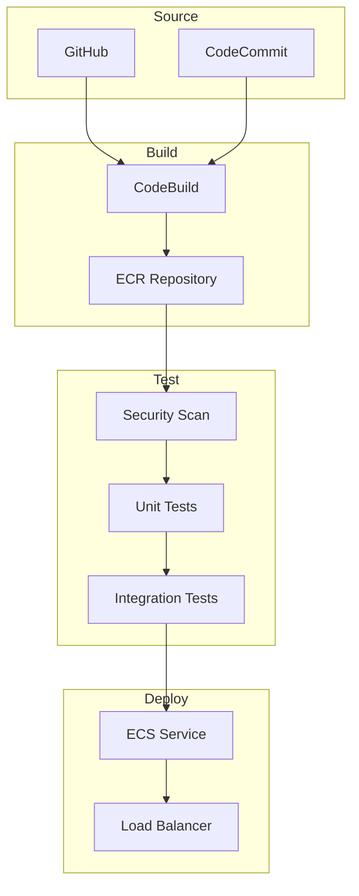
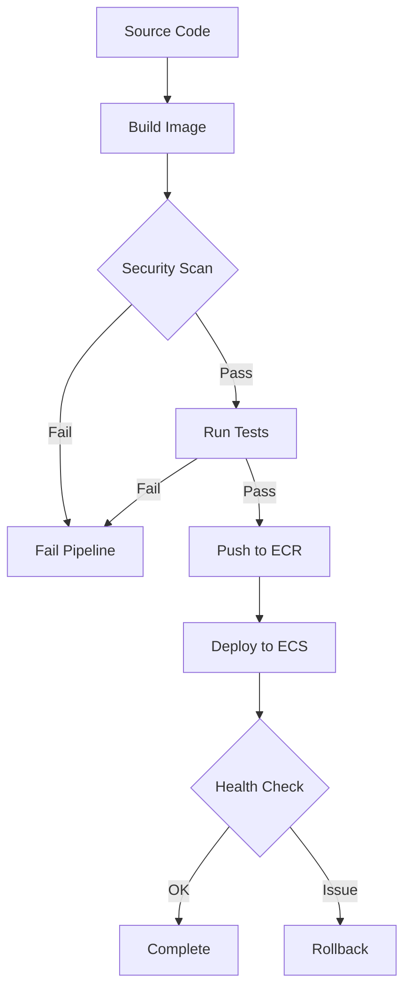

# CICD for Containers

## Overview

This lab demonstrates how to build a continuous integration and continuous deployment (CI/CD) pipeline for containerized applications using AWS services. You'll learn how to automate the building, testing, and deployment of container images to Amazon ECS using AWS CodePipeline, CodeBuild, and ECR.

[DIAGRAM: Container CI/CD Overview]



## Learning Objectives

- Create an automated pipeline for container builds
- Implement container testing strategies
- Manage container image versions and tags
- Deploy containers to ECS with rolling updates and health checks
- Monitor container deployments
- Implement security scanning for containers

## Core Concepts

### Container Pipeline Architecture

1. **Pipeline Components**

   ```
   ┌─────────────┐   ┌─────────────┐   ┌─────────────┐   ┌─────────────┐
   │   Source    │   │    Build    │   │    Test     │   │   Deploy    │
   │   (GitHub)  │──▶│ (CodeBuild) │──▶│ (CodeBuild) │──▶│    (ECS)    │
   └─────────────┘   └─────────────┘   └─────────────┘   └─────────────┘
          │                 │                 │                  │
          ▼                 ▼                 ▼                  ▼
   ┌─────────────┐   ┌─────────────┐   ┌─────────────┐   ┌─────────────┐
   │  Git Repo   │   │     ECR     │   │  Test Reports│   │ ECS Service │
   └─────────────┘   └─────────────┘   └─────────────┘   └─────────────┘
   ```

   - Source control integration
   - Container build automation
   - Image repository management
   - Automated deployment

2. **Build Process**
   ```
   Dockerfile     Container     Security     ECR
   ┌─────────┐   ┌─────────┐   ┌─────────┐   ┌─────────┐
   │  Build  │──▶│  Test   │──▶│  Scan   │──▶│  Push   │
   └─────────┘   └─────────┘   └─────────┘   └─────────┘
   ```
   - Multi-stage builds
   - Layer optimization
   - Security scanning
   - Version tagging

### Testing Strategy

1. **Container Tests**

   ```
   Unit Tests → Integration Tests → Security Tests
        │            │                  │
        └────────────┴──────────────────┘
             Container Health Checks
   ```

   - Unit testing
   - Integration testing
   - Security scanning
   - Health checks

2. **Test Environment**
   - Local testing
   - CI environment
   - Staging environment
   - Production validation

### Deployment Strategy

1. **Blue-Green Deployment**

   ```
   Blue Environment    Green Environment
   ┌──────────────┐   ┌──────────────┐
   │   Current    │   │     New      │
   │   Version    │   │   Version    │
   └──────────────┘   └──────────────┘
          │                  │
          └──────────┬──────┘
                     ▼
            Load Balancer
   ```

   - Zero downtime
   - Quick rollback
   - Traffic shifting
   - Health validation

2. **Deployment Monitoring**
   - Service metrics
   - Container logs
   - Application traces
   - Deployment events

### Security Controls

1. **Image Security**

   ```
   Base Image → Dependencies → Application → Runtime
        │            │             │           │
        └────────────┴─────────────┴───────────┘
                 Security Scanning
   ```

   - Base image scanning
   - Dependency checks
   - Runtime security
   - Compliance validation

2. **Access Control**
   - Registry permissions
   - Deployment roles
   - Secrets management
   - Network security

## Best Practices

1. **Container Build**

   - Use multi-stage builds
   - Minimize layer count
   - Cache dependencies
   - Version control base images

2. **Security**

   - Regular security scans
   - Immutable tags
   - Least privilege access
   - Secrets management

3. **Testing**

   - Automated testing
   - Integration testing
   - Performance testing
   - Security validation

4. **Operations**
   - Monitoring setup
   - Log aggregation
   - Alert configuration
   - Backup procedures

## Prerequisites for Lab

- Completed ECR-Docker Basics lab
- Completed ECS on Fargate lab
- Completed CICD Infrastructure lab
- GitHub repository
- AWS CLI configured

## What's Next

In the hands-on section, you'll:

- Set up a container build pipeline
- Implement automated testing
- Configure security scanning
- Deploy to ECS with blue-green deployment
- Monitor container deployments
- Implement best practices

[DIAGRAM: Container CI/CD Workflow]


