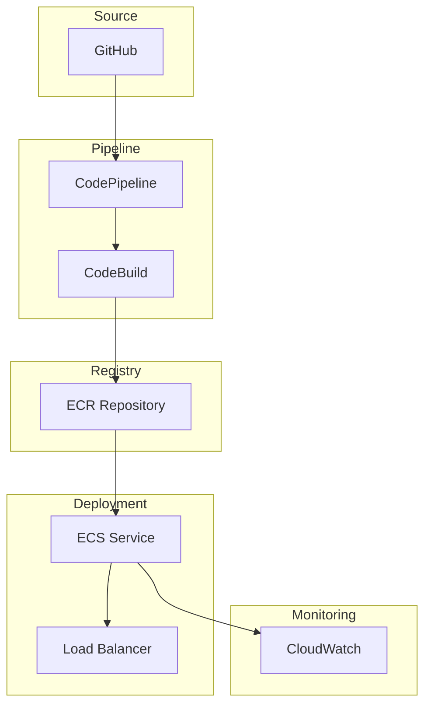
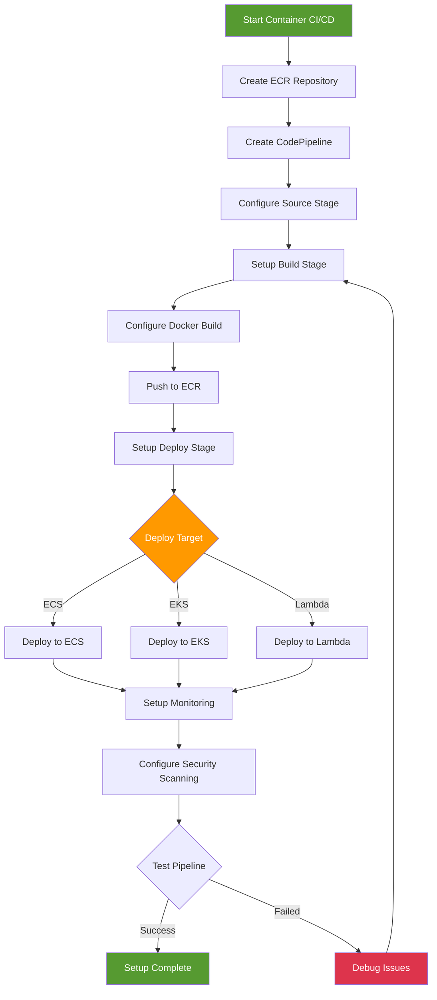

# CI/CD for Containers - Hands-on Lab

[DIAGRAM: Container CI/CD Hands-on Architecture]



## Prerequisites

- Completed ECR-Docker Basics lab
- Completed ECS on Fargate lab
- GitHub account and repository
- AWS CDK and AWS CLI configured

## Lab Steps

### 1. Create Container Pipeline Infrastructure

Create a new file `lib/container-pipeline-stack.ts`:

```typescript:lib/container-pipeline-stack.ts
import * as cdk from 'aws-cdk-lib';
import * as ecr from 'aws-cdk-lib/aws-ecr';
import * as codebuild from 'aws-cdk-lib/aws-codebuild';
import * as codepipeline from 'aws-cdk-lib/aws-codepipeline';
import * as codepipeline_actions from 'aws-cdk-lib/aws-codepipeline-actions';
import * as ecs from 'aws-cdk-lib/aws-ecs';
import * as ecs_patterns from 'aws-cdk-lib/aws-ecs-patterns';
import { Construct } from 'constructs';

export class ContainerPipelineStack extends cdk.Stack {
  constructor(scope: Construct, id: string, props?: cdk.StackProps) {
    super(scope, id, props);

    // Create ECR Repository
    const repository = new ecr.Repository(this, 'Repository', {
      repositoryName: 'workshop-app',
      imageScanOnPush: true,
      removalPolicy: cdk.RemovalPolicy.DESTROY,
    });

    // Create CodeBuild Project
    const buildProject = new codebuild.PipelineProject(this, 'BuildProject', {
      environment: {
        buildImage: codebuild.LinuxBuildImage.STANDARD_7_0,
        privileged: true,
      },
      environmentVariables: {
        REPOSITORY_URI: {
          value: repository.repositoryUri,
        },
      },
      buildSpec: codebuild.BuildSpec.fromObject({
        version: '0.2',
        phases: {
          pre_build: {
            commands: [
              'aws ecr get-login-password --region $AWS_DEFAULT_REGION | docker login --username AWS --password-stdin $REPOSITORY_URI',
              'COMMIT_HASH=$(echo $CODEBUILD_RESOLVED_SOURCE_VERSION | cut -c 1-7)',
              'IMAGE_TAG=${COMMIT_HASH:=latest}',
            ],
          },
          build: {
            commands: [
              'docker build -t $REPOSITORY_URI:$IMAGE_TAG .',
              'docker tag $REPOSITORY_URI:$IMAGE_TAG $REPOSITORY_URI:latest',
            ],
          },
          post_build: {
            commands: [
              'echo "Container built successfully with health checks enabled"',
              'echo "Checking for security scan results..."',
              'aws ecr describe-image-scan-findings --repository-name workshop-app --image-id imageTag=$IMAGE_TAG || true',
              'docker push $REPOSITORY_URI:$IMAGE_TAG',
              'docker push $REPOSITORY_URI:latest',
              'echo "::set-output name=image::$REPOSITORY_URI:$IMAGE_TAG"',
            ],
          },
        },
      }),
    });

    repository.grantPullPush(buildProject);

    // Create Pipeline
    const pipeline = new codepipeline.Pipeline(this, 'Pipeline', {
      pipelineName: 'ContainerPipeline',
    });

    // Add Source Stage
    const sourceOutput = new codepipeline.Artifact();
    const sourceAction = new codepipeline_actions.GitHubSourceAction({
      actionName: 'GitHub',
      owner: 'your-github-username',
      repo: 'your-repo-name',
      branch: 'main',
      oauthToken: cdk.SecretValue.secretsManager('github-token'),
      output: sourceOutput,
    });

    pipeline.addStage({
      stageName: 'Source',
      actions: [sourceAction],
    });

    // Add Build Stage
    const buildOutput = new codepipeline.Artifact();
    const buildAction = new codepipeline_actions.CodeBuildAction({
      actionName: 'BuildAndPush',
      project: buildProject,
      input: sourceOutput,
      outputs: [buildOutput],
    });

    pipeline.addStage({
      stageName: 'Build',
      actions: [buildAction],
    });

    // Create ECS Cluster and Service
    const cluster = new ecs.Cluster(this, 'Cluster', {
      vpc: new cdk.aws_ec2.Vpc(this, 'Vpc', { maxAzs: 2 }),
    });

    const service = new ecs_patterns.ApplicationLoadBalancedFargateService(this, 'Service', {
      cluster,
      taskImageOptions: {
        image: ecs.ContainerImage.fromEcrRepository(repository, 'latest'),
        containerPort: 3000,
      },
      desiredCount: 2,
      publicLoadBalancer: true,
    });

    // Add Deploy Stage
    const deployAction = new codepipeline_actions.EcsDeployAction({
      actionName: 'Deploy',
      service: service.service,
      imageFile: buildOutput.atPath('imageDefinitions.json'),
    });

    pipeline.addStage({
      stageName: 'Deploy',
      actions: [deployAction],
    });

    // Outputs
    new cdk.CfnOutput(this, 'PipelineUrl', {
      value: `https://${cdk.Stack.of(this).region}.console.aws.amazon.com/codesuite/codepipeline/pipelines/${pipeline.pipelineName}/view`,
    });

    new cdk.CfnOutput(this, 'ServiceUrl', {
      value: service.loadBalancer.loadBalancerDnsName,
    });
  }
}
```

### 2. Set Up Application Files

1. Create a simple Express.js application:

```typescript:src/app.ts
import express from 'express';

const app = express();
const port = 3000;

app.get('/', (req, res) => {
  res.json({ message: 'Hello from containerized app!' });
});

// Add health check endpoint for container monitoring
app.get('/health', (req, res) => {
  res.status(200).json({
    status: 'healthy',
    timestamp: new Date().toISOString(),
    uptime: process.uptime()
  });
});

app.listen(port, () => {
  console.log(`Server running on port ${port}`);
});
```

2. Create production-ready Dockerfile with health checks:

```dockerfile:Dockerfile
# Build stage
FROM node:22-alpine as builder
WORKDIR /app
COPY package*.json ./
RUN npm ci
COPY . .
RUN npm run build

# Production stage
FROM node:22-alpine
WORKDIR /app

# Install curl for health checks
RUN apk add --no-cache curl

COPY package*.json ./
RUN npm ci --production
COPY --from=builder /app/dist ./dist

EXPOSE 3000

# Add container health check for monitoring
HEALTHCHECK --interval=30s --timeout=3s --start-period=5s --retries=3 \
  CMD curl -f http://localhost:3000/health || exit 1

CMD ["node", "dist/app.js"]
```

3. Create test configuration:

```typescript:test/app.test.ts
import request from 'supertest';
import { app } from '../src/app';

describe('App', () => {
  it('should return hello message', async () => {
    const response = await request(app).get('/');
    expect(response.status).toBe(200);
    expect(response.body.message).toBe('Hello from containerized app!');
  });
});
```

### 3. Configure GitHub Integration

1. Store GitHub token in Secrets Manager:

```bash
aws secretsmanager create-secret \
  --name github-token \
  --secret-string your-github-token \
  --profile your-profile-name
```

2. Update repository settings:

- Go to your GitHub repository
- Add AWS CodeBuild webhook
- Configure branch protection rules

### 4. Deploy Pipeline

1. Deploy the stack:

```bash
cdk deploy ContainerPipelineStack --profile your-profile-name
```

2. Trigger initial pipeline run:

```bash
git add .
git commit -m "Initial container app setup"
git push origin main
```

### 5. Monitor Deployment

1. Check pipeline status:

```bash
aws codepipeline get-pipeline-state \
  --name ContainerPipeline \
  --profile your-profile-name
```

2. View container logs:

```bash
aws logs get-log-events \
  --log-group-name /aws/codebuild/BuildProject \
  --log-stream-name latest \
  --profile your-profile-name
```

## Validation Steps

1. Pipeline Setup

   - [ ] Pipeline created successfully
   - [ ] GitHub integration working
   - [ ] Build project configured
   - [ ] ECR repository created with scan-on-push enabled

2. Build Process

   - [ ] Container builds successfully with health checks
   - [ ] Security scan results displayed (if any vulnerabilities found)
   - [ ] Health check endpoint accessible
   - [ ] Image pushed to ECR with proper tags

3. Deployment
   - [ ] ECS service running with health checks
   - [ ] Container health status showing as healthy
   - [ ] Application accessible via load balancer
   - [ ] Health check logs available in CloudWatch

## Troubleshooting

1. Build Issues

   - Check CodeBuild logs
   - Verify Dockerfile
   - Check ECR permissions
   - Review build environment

2. Deployment Issues

   - Check ECS events
   - Verify task definition
   - Review service logs
   - Check security groups

3. Pipeline Issues
   - Check GitHub webhook
   - Verify IAM roles
   - Review stage logs
   - Check artifacts

## Cleanup

Remove the stack:

```bash
cdk destroy ContainerPipelineStack --profile your-profile-name
```

[DIAGRAM: Container CI/CD Setup Flow]



## Creating Container CI/CD Resources

Deploy the container CI/CD infrastructure:

```bash
# Deploy the container pipeline stack
cdk deploy ContainerPipelineStack --profile your-profile-name

# Check pipeline status
aws codepipeline get-pipeline-state \
  --name ContainerPipeline \
  --profile your-profile-name

# Monitor first build
aws codebuild list-builds-for-project \
  --project-name $(aws cloudformation describe-stacks \
    --stack-name ContainerPipelineStack \
    --query 'Stacks[0].Outputs[?contains(OutputKey, `BuildProject`)].OutputValue' \
    --output text) \
  --profile your-profile-name

# Check ECS service deployment
aws ecs describe-services \
  --cluster $(aws cloudformation describe-stacks \
    --stack-name ContainerPipelineStack \
    --query 'Stacks[0].Outputs[?contains(OutputKey, `Cluster`)].OutputValue' \
    --output text) \
  --services $(aws cloudformation describe-stacks \
    --stack-name ContainerPipelineStack \
    --query 'Stacks[0].Outputs[?contains(OutputKey, `Service`)].OutputValue' \
    --output text) \
  --profile your-profile-name
```

## Final Validation

After completing this lab, verify that:

1. ✅ Container pipeline created successfully
2. ✅ ECR repository configured with security scanning
3. ✅ CodeBuild project building images with health checks
4. ✅ ECS service deploying containers
5. ✅ Load balancer health checks passing
6. ✅ Security scan results visible in build logs
7. ✅ Application health endpoint responding

## Next Steps

After completing this lab, you can:

- Implement multi-stage deployments (dev/staging/prod)
- Add automated testing in the pipeline
- Configure blue/green deployments
- Implement container monitoring with CloudWatch Container Insights
- Add notification alerts for pipeline failures
