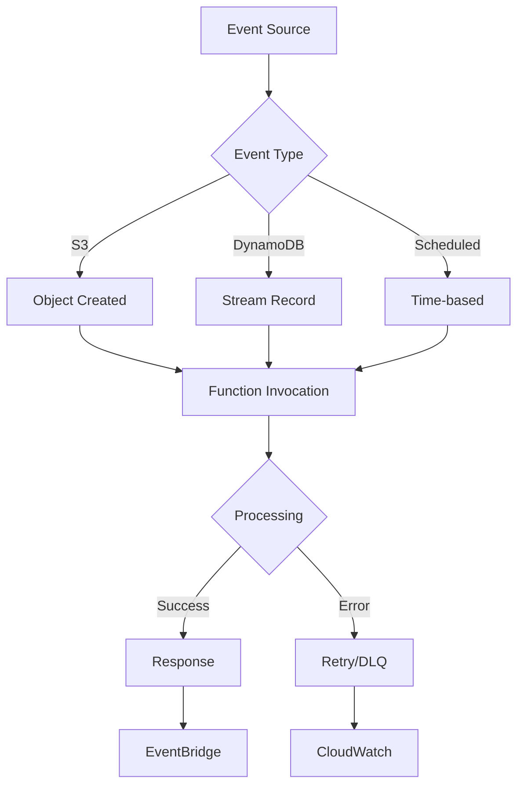

# Lambda and Event Triggers

## Overview

AWS Lambda lets you run code without provisioning or managing servers. This lab introduces Lambda functions and their integration with various AWS event sources, demonstrating how to build event-driven architectures using serverless computing.

[DIAGRAM: Lambda Overview]

Instructions for draw.io:

1. Create a new diagram using the AWS Architecture 2023 template
2. Use the following AWS symbols from the symbol pack:
   - AWS Lambda icon
   - AWS IAM icon
   - AWS VPC icon
   - AWS CloudWatch icon
   - AWS S3 icon
   - AWS DynamoDB icon
   - AWS SNS icon
   - AWS SQS icon
3. Layout:
   - Place Lambda function at the center
   - Add event sources on the left (S3, DynamoDB, SNS, SQS)
   - Place IAM roles and VPC configuration on the right
   - Add CloudWatch integration below
4. Use AWS's standard connector arrows to show relationships
5. Add event flow visualization with streams
6. Use AWS's standard color scheme:
   - Blue for AWS services
   - Green for Lambda components
   - Gray for infrastructure elements

## Learning Objectives

- Understand Lambda function basics and event-driven architecture
- Create and deploy Lambda functions using CDK
- Configure various event triggers and sources
- Implement error handling and retries
- Monitor Lambda function performance
- Manage Lambda function security and permissions

## Core Concepts

### Lambda Function Basics

1. **Function Components**

   ```
   ┌─────────────────────────────┐
   │      Lambda Function        │
   │                             │
   │  ┌─────────┐   ┌────────┐  │
   │  │ Handler │   │ Runtime │  │
   │  └─────────┘   └────────┘  │
   │                             │
   │  ┌─────────┐   ┌────────┐  │
   │  │ Memory  │   │Timeout │  │
   │  └─────────┘   └────────┘  │
   └─────────────────────────────┘
   ```

   - Handler function
   - Runtime environment
   - Memory allocation
   - Execution timeout

2. **Execution Context**
   - Cold starts
   - Warm starts
   - Function lifecycle
   - Environment variables

### Event Sources

1. **AWS Service Events**

   ```
   Event Sources          Lambda
   ┌──────────┐        ┌─────────┐
   │ S3       │───────▶│         │
   └──────────┘        │         │
   ┌──────────┐        │ Function│
   │ DynamoDB │───────▶│         │
   └──────────┘        │         │
   ┌──────────┐        │         │
   │ SNS      │───────▶│         │
   └──────────┘        └─────────┘
   ```

   - S3 events
   - DynamoDB Streams
   - SNS notifications
   - SQS messages
   - API Gateway
   - EventBridge rules

2. **Event Types**
   ```
   Synchronous    Asynchronous    Stream-based
   ┌─────────┐    ┌─────────┐    ┌─────────┐
   │ Request │    │  Event  │    │ Records │
   │Response │    │ Process │    │ Process │
   └─────────┘    └─────────┘    └─────────┘
   ```
   - Synchronous invocation
   - Asynchronous invocation
   - Stream processing

### Error Handling

1. **Error Types**

   ```
   ┌────────────────┐
   │    Errors      │
   │  ┌─────────┐   │
   │  │Function │   │
   │  │ Errors  │   │
   │  └─────────┘   │
   │  ┌─────────┐   │
   │  │ Service │   │
   │  │ Errors  │   │
   │  └─────────┘   │
   └────────────────┘
   ```

   - Function errors
   - Service errors
   - Timeout errors
   - Permission errors

2. **Retry Behavior**
   - Retry policies
   - Dead Letter Queues
   - Destination configuration
   - Error handling patterns

### Monitoring and Logging

1. **CloudWatch Integration**

   ```
   Lambda         CloudWatch
   ┌─────────┐   ┌─────────┐
   │Function │──▶│ Metrics │
   └─────────┘   └─────────┘
        │        ┌─────────┐
        └───────▶│  Logs   │
                 └─────────┘
   ```

   - Metrics collection
   - Log groups
   - Alarms
   - Dashboards

2. **X-Ray Tracing**
   - Trace analysis
   - Service maps
   - Performance insights
   - Debugging tools

## Best Practices

1. **Function Design**

   - Single responsibility
   - Efficient code
   - Resource optimization
   - Error handling

2. **Security**

   - IAM roles
   - Environment variables
   - VPC configuration
   - Secrets management

3. **Performance**

   - Memory configuration
   - Concurrent execution
   - Cold start optimization
   - Code efficiency

4. **Monitoring**
   - Logging strategy
   - Metric collection
   - Alert configuration
   - Cost tracking

## Prerequisites for Lab

- AWS CDK installed
- AWS CLI configured
- Basic Node.js knowledge
- Understanding of event-driven architecture

## What's Next

In the hands-on section, you'll:

- Create Lambda functions
- Configure various event triggers
- Implement error handling
- Set up monitoring and logging
- Deploy using CDK
- Test different event patterns

[DIAGRAM: Lambda Event Flow]


