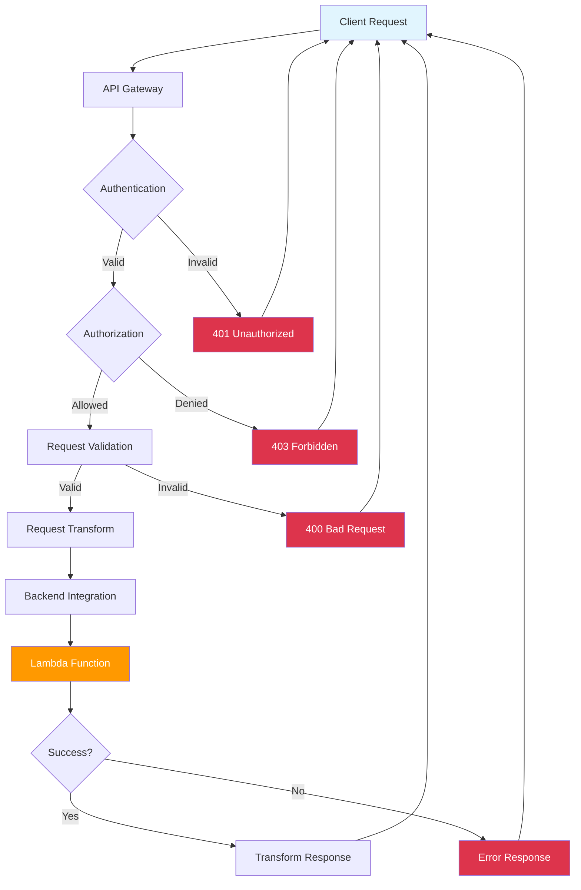

# API Gateway Integration with AWS CDK

## Overview

Amazon API Gateway is a fully managed service that makes it easy for developers to create, publish, maintain, monitor, and secure APIs at any scale. In this lab, you'll learn how to create and manage APIs using API Gateway with AWS CDK.

[DIAGRAM: API Gateway Overview]

```mermaid
flowchart TB
    subgraph "Client Applications"
        WEB[Web Application]
        MOBILE[Mobile App]
        IOT[IoT Devices]
        B2B[Partner APIs]
    end

    subgraph "API Gateway Multi-API Architecture"
        subgraph "API Types"
            REST[REST API<br/>Regional/Edge]
            HTTP[HTTP API<br/>Lower Latency]
            WS[WebSocket API<br/>Real-time]
        end

        subgraph "Authentication & Authorization"
            COGNITO[Cognito User Pool<br/>User Authentication]
            IAM[IAM Roles<br/>Service Authentication]
            LAMBDA_AUTH[Lambda Authorizer<br/>Custom Auth]
            JWT[JWT Authorizer<br/>Token Validation]
        end

        subgraph "Request Processing"
            VALIDATION[Request Validation<br/>JSON Schema]
            TRANSFORM[Request/Response<br/>Mapping Templates]
            THROTTLE[Throttling<br/>Rate Limiting]
            CACHE[Response Caching<br/>Edge Optimization]
        end

        subgraph "Integration Types"
            LAMBDA_PROXY[Lambda Proxy<br/>Integration]
            LAMBDA_CUSTOM[Lambda Custom<br/>Integration]
            HTTP_PROXY[HTTP Proxy<br/>Integration]
            AWS_SERVICE[AWS Service<br/>Integration]
            MOCK[Mock Integration<br/>Testing]
        end
    end

    subgraph "Backend Services"
        subgraph "Compute"
            LAMBDA[Lambda Functions]
            EC2[EC2 Services]
            ECS[ECS Containers]
        end

        subgraph "Data Services"
            DDB[(DynamoDB)]
            RDS[(RDS Database)]
            S3[(S3 Storage)]
        end

        subgraph "External Services"
            EXTERNAL[External APIs]
            SAAS[SaaS Services]
        end
    end

    subgraph "Monitoring & Security"
        WAF[AWS WAF<br/>Protection]
        SHIELD[AWS Shield<br/>DDoS Protection]
        CW[CloudWatch<br/>Monitoring]
        XRAY[X-Ray<br/>Tracing]
        LOGS[CloudWatch Logs<br/>Access Logs]
    end

    %% Client Connections
    WEB --> REST
    MOBILE --> HTTP
    IOT --> WS
    B2B --> REST

    %% Authentication Flow
    REST --> COGNITO
    REST --> IAM
    HTTP --> JWT
    WS --> LAMBDA_AUTH

    %% Request Processing
    REST --> VALIDATION
    HTTP --> TRANSFORM
    WS --> THROTTLE
    REST --> CACHE

    %% Integrations
    VALIDATION --> LAMBDA_PROXY
    TRANSFORM --> LAMBDA_CUSTOM
    THROTTLE --> HTTP_PROXY
    CACHE --> AWS_SERVICE
    LAMBDA_AUTH --> MOCK

    %% Backend Connections
    LAMBDA_PROXY --> LAMBDA
    LAMBDA_CUSTOM --> LAMBDA
    HTTP_PROXY --> EC2
    AWS_SERVICE --> DDB
    LAMBDA --> RDS
    LAMBDA --> S3
    HTTP_PROXY --> EXTERNAL
    LAMBDA --> SAAS

    %% Security & Monitoring
    REST -.-> WAF
    HTTP -.-> SHIELD
    WS -.-> CW
    LAMBDA --> XRAY
    REST --> LOGS

    %% Styling
    classDef client fill:#ff9900,stroke:#232F3E,stroke-width:2px,color:#232F3E
    classDef api fill:#569a31,stroke:#232F3E,stroke-width:2px,color:white
    classDef auth fill:#4B9CD3,stroke:#232F3E,stroke-width:2px,color:white
    classDef processing fill:#8C4FFF,stroke:#232F3E,stroke-width:2px,color:white
    classDef backend fill:#FF6B6B,stroke:#232F3E,stroke-width:2px,color:white
    classDef monitoring fill:#F39C12,stroke:#232F3E,stroke-width:2px,color:#232F3E

    class WEB,MOBILE,IOT,B2B client
    class REST,HTTP,WS api
    class COGNITO,IAM,LAMBDA_AUTH,JWT auth
    class VALIDATION,TRANSFORM,THROTTLE,CACHE,LAMBDA_PROXY,LAMBDA_CUSTOM,HTTP_PROXY,AWS_SERVICE,MOCK processing
    class LAMBDA,EC2,ECS,DDB,RDS,S3,EXTERNAL,SAAS backend
    class WAF,SHIELD,CW,XRAY,LOGS monitoring
```

<!-- 🔄 TEMPORARY MERMAID DIAGRAM - REPLACE WITH MANUAL DRAW.IO: lab_380_api_gateway_multi_api_architecture.drawio.svg -->



<!-- 🔄 END TEMPORARY DIAGRAM -->

## Learning Objectives

- Understand API Gateway concepts and features
- Create and configure REST APIs
- Implement Lambda integrations
- Set up request/response mapping
- Configure API security
- Monitor API performance
- Implement best practices for API design

[DIAGRAM: API Gateway Request Processing Flow]



## Core Concepts

### API Gateway Architecture

1. **API Components**

   ```
   ┌─────────────────────────────────────┐
   │            API Gateway              │
   │                                     │
   │  ┌─────────┐  ┌──────┐  ┌───────┐  │
   │  │Resource │─▶│Method│─▶│Backend│  │
   │  └─────────┘  └──────┘  └───────┘  │
   │                                     │
   │  ┌─────────┐  ┌──────┐  ┌───────┐  │
   │  │  Stage  │  │Models│  │Usage  │  │
   │  └─────────┘  └──────┘  └───────┘  │
   └─────────────────────────────────────┘
   ```

   - Resources and methods
   - Stages and deployments
   - Models and mappings
   - Backend integrations

2. **Request Flow**
   ```
   Client Request
        │
        ▼
   Authorization
        │
        ▼
   Request Validation
        │
        ▼
   Request Transform
        │
        ▼
   Backend Integration
        │
        ▼
   Response Transform
        │
        ▼
   Client Response
   ```

### Integration Types

1. **Lambda Integration**

   ```
   API Gateway        Lambda
   ┌──────────┐    ┌─────────┐
   │ Method   │───▶│Function │
   └──────────┘    └─────────┘
        │              │
        └──────────────┘
       Response Return
   ```

   - Proxy integration
   - Custom integration
   - Function invocation
   - Error handling

2. **Other Integrations**
   - HTTP endpoints
   - AWS services
   - Mock integrations
   - VPC Link

### Security Features

1. **Authentication & Authorization**

   ```
   ┌────────────┐
   │   Client   │
   └────────────┘
         │
         ▼
   ┌────────────┐    ┌────────────┐
   │   Auth     │───▶│   IAM/     │
   │ Authorizer │    │  Cognito   │
   └────────────┘    └────────────┘
         │
         ▼
   ┌────────────┐
   │    API     │
   └────────────┘
   ```

   - IAM roles/policies
   - Lambda authorizers
   - Cognito integration
   - API keys

2. **Security Controls**
   - CORS configuration
   - WAF integration
   - SSL/TLS settings
   - Resource policies

### Monitoring and Performance

1. **CloudWatch Integration**

   ```
   API Gateway     CloudWatch
   ┌──────────┐   ┌──────────┐
   │Execution │──▶│ Metrics  │
   └──────────┘   └──────────┘
        │         ┌──────────┐
        └────────▶│   Logs   │
                  └──────────┘
   ```

   - Access logging
   - Execution logging
   - Metrics collection
   - Dashboard creation

2. **Performance Features**
   - Caching
   - Throttling
   - Stage variables
   - Content encoding

## Best Practices

1. **API Design**

   - RESTful principles
   - Resource naming
   - Method selection
   - Response formatting

2. **Security**

   - Authentication
   - Authorization
   - Encryption
   - Rate limiting

3. **Performance**

   - Caching strategy
   - Response optimization
   - Error handling
   - Timeout configuration

4. **Operations**
   - Versioning
   - Monitoring
   - Documentation
   - Testing strategy

## Prerequisites for Lab

- Completed Lambda and Event Triggers lab
- AWS CDK installed
- AWS CLI configured
- Basic understanding of REST APIs
- Postman or similar API testing tool

## What's Next

In the hands-on section, you'll:

- Create a REST API
- Configure Lambda integration
- Implement authentication
- Set up monitoring
- Test API endpoints
- Deploy to multiple stages
