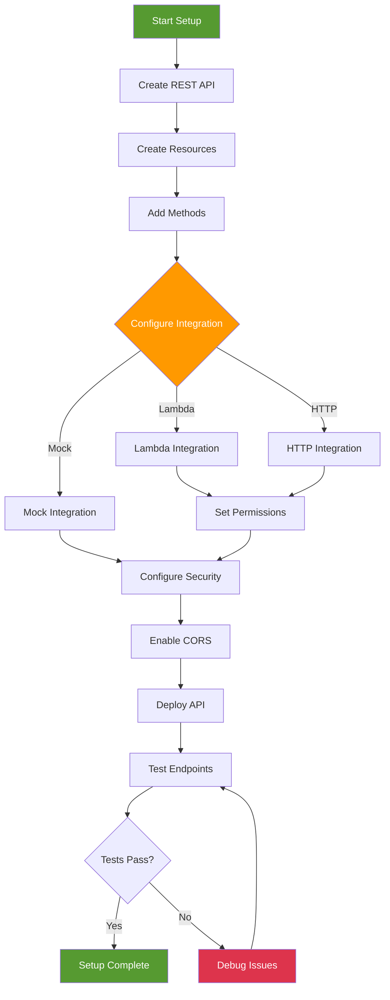
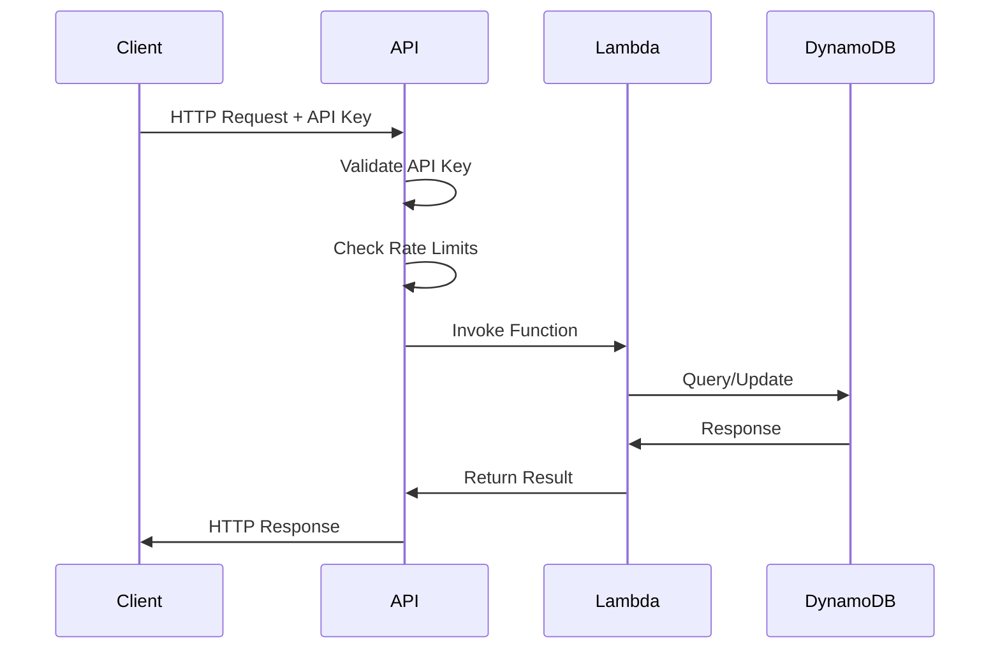

# API Gateway Integration - Hands-on Lab

[DIAGRAM: API Gateway Hands-on Architecture]
Instructions for draw.io:

1. Create a new diagram using the AWS Architecture 2023 template
2. Use the following AWS symbols from the symbol pack:
   - AWS API Gateway icon
   - AWS Lambda icon
   - AWS DynamoDB icon
   - AWS IAM icon
   - AWS CloudWatch icon
3. Layout:
   - Place API Gateway at the center
   - Add Lambda functions on the left
   - Place DynamoDB on the right
   - Show security components above
4. Use AWS's standard connector arrows to show data flow
5. Add clear labels for each component
6. Use AWS's standard color scheme:
   - Blue for AWS services
   - Green for API Gateway components
   - Gray for infrastructure elements

## Prerequisites

> Tip: Set an AWS profile for this shell to avoid repeating profile flags
```bash
export AWS_PROFILE=your-profile-name
```


- AWS CDK and AWS CLI configured
- Postman or similar API testing tool
- Node.js installed
- Basic understanding of REST APIs

## Lab Steps

### 1. Create API Infrastructure

Create a new file `lib/api-stack.ts`:

```typescript:lib/api-stack.ts
import * as cdk from 'aws-cdk-lib';
import * as apigateway from 'aws-cdk-lib/aws-apigateway';
import * as lambda from 'aws-cdk-lib/aws-lambda';
import * as dynamodb from 'aws-cdk-lib/aws-dynamodb';
import { Construct } from 'constructs';

export class ApiStack extends cdk.Stack {
  constructor(scope: Construct, id: string, props?: cdk.StackProps) {
    super(scope, id, props);

    // Create DynamoDB table
    const table = new dynamodb.Table(this, 'ItemsTable', {
      partitionKey: { name: 'id', type: dynamodb.AttributeType.STRING },
      billingMode: dynamodb.BillingMode.PAY_PER_REQUEST,
      removalPolicy: cdk.RemovalPolicy.DESTROY,
    });

    // Create Lambda functions
    const getItemsFunction = new lambda.Function(this, 'GetItemsFunction', {
      runtime: lambda.Runtime.NODEJS_22_X,
      handler: 'index.handler',
      code: lambda.Code.fromAsset('src/get-items'),
      environment: {
        TABLE_NAME: table.tableName,
      },
    });

    const createItemFunction = new lambda.Function(this, 'CreateItemFunction', {
      runtime: lambda.Runtime.NODEJS_22_X,
      handler: 'index.handler',
      code: lambda.Code.fromAsset('src/create-item'),
      environment: {
        TABLE_NAME: table.tableName,
      },
    });

    // Grant permissions
    table.grantReadData(getItemsFunction);
    table.grantWriteData(createItemFunction);

    // Create API Gateway
    const api = new apigateway.RestApi(this, 'ItemsApi', {
      restApiName: 'Items Service',
      description: 'This is a simple API Gateway with Lambda integration',
      deployOptions: {
        stageName: 'dev',
        metricsEnabled: true,
        loggingLevel: apigateway.MethodLoggingLevel.INFO,
        dataTraceEnabled: true,
      },
      defaultCorsPreflightOptions: {
        allowOrigins: apigateway.Cors.ALL_ORIGINS,
        allowMethods: apigateway.Cors.ALL_METHODS,
      },
    });

    // Create API resources and methods
    const items = api.root.addResource('items');

    items.addMethod('GET', new apigateway.LambdaIntegration(getItemsFunction, {
      proxy: true,
      requestTemplates: {
        'application/json': '{ "statusCode": 200 }',
      },
    }));

    items.addMethod('POST', new apigateway.LambdaIntegration(createItemFunction, {
      proxy: true,
      requestTemplates: {
        'application/json': '{ "statusCode": 200 }',
      },
    }));

    // Add API key requirement
    const plan = api.addUsagePlan('UsagePlan', {
      name: 'Basic',
      throttle: {
        rateLimit: 10,
        burstLimit: 2,
      },
    });

    const key = api.addApiKey('ApiKey');
    plan.addApiKey(key);
    plan.addApiStage({
      stage: api.deploymentStage,
    });

    // Outputs
    new cdk.CfnOutput(this, 'ApiUrl', {
      value: api.url,
    });

    new cdk.CfnOutput(this, 'ApiKey', {
      value: key.keyId,
    });
  }
}
```

### 2. Create Lambda Function Handlers

1. Create GET items handler:

```typescript:src/get-items/index.ts
import { APIGatewayProxyEvent, APIGatewayProxyResult } from 'aws-lambda';
import { DynamoDBClient } from '@aws-sdk/client-dynamodb';
import { DynamoDBDocumentClient, ScanCommand } from '@aws-sdk/lib-dynamodb';

const ddbClient = new DynamoDBClient({});
const docClient = DynamoDBDocumentClient.from(ddbClient);

export const handler = async (event: APIGatewayProxyEvent): Promise<APIGatewayProxyResult> => {
  try {
    const result = await docClient.send(new ScanCommand({
      TableName: process.env.TABLE_NAME,
    }));

    return {
      statusCode: 200,
      headers: {
        'Content-Type': 'application/json',
        'Access-Control-Allow-Origin': '*',
      },
      body: JSON.stringify({
        items: result.Items,
      }),
    };
  } catch (error) {
    console.error('Error fetching items:', error);
    return {
      statusCode: 500,
      headers: {
        'Content-Type': 'application/json',
        'Access-Control-Allow-Origin': '*',
      },
      body: JSON.stringify({
        message: 'Error fetching items',
      }),
    };
  }
};
```

2. Create POST item handler:

```typescript:src/create-item/index.ts
import { APIGatewayProxyEvent, APIGatewayProxyResult } from 'aws-lambda';
import { DynamoDBClient } from '@aws-sdk/client-dynamodb';
import { DynamoDBDocumentClient, PutCommand } from '@aws-sdk/lib-dynamodb';
import { randomUUID } from 'crypto';

const ddbClient = new DynamoDBClient({});
const docClient = DynamoDBDocumentClient.from(ddbClient);

export const handler = async (event: APIGatewayProxyEvent): Promise<APIGatewayProxyResult> => {
  try {
    const requestBody = JSON.parse(event.body || '{}');
    const item = {
      id: randomUUID(),
      ...requestBody,
      createdAt: new Date().toISOString(),
    };

    await docClient.send(new PutCommand({
      TableName: process.env.TABLE_NAME,
      Item: item,
    }));

    return {
      statusCode: 201,
      headers: {
        'Content-Type': 'application/json',
        'Access-Control-Allow-Origin': '*',
      },
      body: JSON.stringify({
        message: 'Item created successfully',
        item,
      }),
    };
  } catch (error) {
    console.error('Error creating item:', error);
    return {
      statusCode: 500,
      headers: {
        'Content-Type': 'application/json',
        'Access-Control-Allow-Origin': '*',
      },
      body: JSON.stringify({
        message: 'Error creating item',
      }),
    };
  }
};
```

### 3. Deploy and Test

1. Deploy the stack:

```bash
cdk deploy ApiStack
```

2. Get API key value:

```bash
export API_KEY=$(aws apigateway get-api-key \
  --api-key $(aws cloudformation describe-stacks \
    --stack-name ApiStack \
    --query 'Stacks[0].Outputs[?OutputKey==`ApiKey`].OutputValue' \
    --output text \
   ) \
  --include-value \
  --query 'value' \
  --output text \
 )

echo "API Key: $API_KEY"
```

3. Test the API:

```bash
# Get API URL from CloudFormation outputs
export API_URL=$(aws cloudformation describe-stacks \
  --stack-name ApiStack \
  --query 'Stacks[0].Outputs[?OutputKey==`ApiUrl`].OutputValue' \
  --output text \
 )

# Test GET endpoint
curl -X GET $API_URL/items \
  -H "x-api-key: $API_KEY"

# Test POST endpoint
curl -X POST $API_URL/items \
  -H "Content-Type: application/json" \
  -H "x-api-key: $API_KEY" \
  -d '{"name": "Test Item", "description": "This is a test item"}'
```

## Validation Steps

1. API Configuration

   - [ ] API created successfully
   - [ ] Lambda integration working
   - [ ] CORS configured
   - [ ] API key working

2. Endpoints

   - [ ] GET endpoint returning items
   - [ ] POST endpoint creating items
   - [ ] Error handling working
   - [ ] CORS headers present

3. Security
   - [ ] API key required
   - [ ] Throttling working
   - [ ] IAM permissions correct
   - [ ] CloudWatch logs available

## Troubleshooting

1. API Issues

   - Check API Gateway logs
   - Verify Lambda permissions
   - Check CORS configuration
   - Review API key setup

2. Lambda Issues

   - Check CloudWatch logs
   - Verify environment variables
   - Check IAM roles
   - Test function locally

3. Integration Issues
   - Review integration type
   - Check mapping templates
   - Verify response format
   - Check timeout settings

## Cleanup

Remove the stack:

```bash
cdk destroy ApiStack
```

[DIAGRAM: API Gateway Setup Flow]



### 4. Advanced API Configuration

You can further customize your API with additional features:

```bash
# Get the API Gateway ID from the console or use:
aws apigateway get-rest-apis

# View API usage metrics
aws logs get-metric-filter \
  --log-group-name API-Gateway-Execution-Logs \

```

[DIAGRAM: API Gateway Request Flow]



## API Gateway Implementation

<!-- Removed placeholder: diagram defined below -->

```mermaid
flowchart TD
    subgraph "Client Layer"
        CLIENT[Client Application]
    end

    subgraph "API Gateway Complete Implementation"
        subgraph "Edge Layer"
            CLOUDFRONT[CloudFront<br/>Global CDN]
            EDGE[API Gateway<br/>Edge Optimized]
        end

        subgraph "API Endpoints"
            ROOT[/ Root Resource]
            USERS[/users Resource]
            ORDERS[/orders Resource]
            PRODUCTS[/products Resource]
        end

        subgraph "HTTP Methods & Integration"
            GET_USERS[GET /users<br/>Lambda Integration]
            POST_USER[POST /users<br/>Lambda Integration]
            GET_USER[GET /users/{id}<br/>Lambda Integration]
            PUT_USER[PUT /users/{id}<br/>Lambda Integration]
            DELETE_USER[DELETE /users/{id}<br/>Lambda Integration]

            GET_ORDERS[GET /orders<br/>DynamoDB Direct]
            POST_ORDER[POST /orders<br/>Step Functions]

            GET_PRODUCTS[GET /products<br/>S3 Integration]
            POST_PRODUCT[POST /products<br/>Lambda + DynamoDB]
        end

        subgraph "Request/Response Pipeline"
            AUTH_CHECK[Cognito Authorizer]
            VALIDATION[Request Validation<br/>JSON Schema]
            MAPPING[Request Mapping<br/>VTL Templates]
            RATE_LIMIT[Throttling<br/>10,000 req/sec]
            RESPONSE_MAP[Response Mapping<br/>VTL Templates]
        end
    end

    subgraph "Backend Implementation"
        subgraph "Lambda Functions"
            USER_LAMBDA[User Management<br/>Lambda Function]
            PRODUCT_LAMBDA[Product Catalog<br/>Lambda Function]
        end

        subgraph "Data Layer"
            USER_DDB[(Users Table<br/>DynamoDB)]
            ORDER_DDB[(Orders Table<br/>DynamoDB)]
            PRODUCT_S3[(Product Images<br/>S3 Bucket)]
        end

        subgraph "Workflow Services"
            ORDER_SF[Order Processing<br/>Step Functions]
            INVENTORY_LAMBDA[Inventory Check<br/>Lambda]
            PAYMENT_LAMBDA[Payment Processing<br/>Lambda]
        end
    end

    subgraph "Cross-Cutting Concerns"
        subgraph "Security"
            COGNITO[Cognito User Pool]
            WAF_RULES[WAF Rules<br/>SQL Injection<br/>XSS Protection]
        end

        subgraph "Monitoring"
            API_LOGS[API Gateway<br/>Access Logs]
            LAMBDA_LOGS[Lambda<br/>Function Logs]
            XRAY_TRACE[X-Ray<br/>Distributed Tracing]
            CW_METRICS[CloudWatch<br/>Custom Metrics]
        end
    end

    %% Request Flow
    CLIENT --> CLOUDFRONT
    CLOUDFRONT --> EDGE
    EDGE --> ROOT

    ROOT --> USERS
    ROOT --> ORDERS
    ROOT --> PRODUCTS

    %% User Management Flow
    USERS --> GET_USERS
    USERS --> POST_USER
    USERS --> GET_USER
    USERS --> PUT_USER
    USERS --> DELETE_USER

    %% Order Management Flow
    ORDERS --> GET_ORDERS
    ORDERS --> POST_ORDER

    %% Product Management Flow
    PRODUCTS --> GET_PRODUCTS
    PRODUCTS --> POST_PRODUCT

    %% Security Pipeline
    GET_USERS --> AUTH_CHECK
    AUTH_CHECK --> VALIDATION
    VALIDATION --> MAPPING
    MAPPING --> RATE_LIMIT

    %% Backend Integrations
    GET_USERS --> USER_LAMBDA
    POST_USER --> USER_LAMBDA
    USER_LAMBDA --> USER_DDB

    GET_ORDERS --> ORDER_DDB
    POST_ORDER --> ORDER_SF
    ORDER_SF --> INVENTORY_LAMBDA
    ORDER_SF --> PAYMENT_LAMBDA
    INVENTORY_LAMBDA --> ORDER_DDB

    GET_PRODUCTS --> PRODUCT_S3
    POST_PRODUCT --> PRODUCT_LAMBDA
    PRODUCT_LAMBDA --> PRODUCT_S3

    %% Response Pipeline
    USER_LAMBDA --> RESPONSE_MAP
    ORDER_DDB --> RESPONSE_MAP
    RESPONSE_MAP --> CLIENT

    %% Security Integration
    AUTH_CHECK -.-> COGNITO
    EDGE -.-> WAF_RULES

    %% Monitoring Integration
    EDGE --> API_LOGS
    USER_LAMBDA --> LAMBDA_LOGS
    ORDER_SF --> XRAY_TRACE
    RATE_LIMIT --> CW_METRICS

    %% Styling
    classDef client fill:#ff9900,stroke:#232F3E,stroke-width:2px,color:#232F3E
    classDef api fill:#569a31,stroke:#232F3E,stroke-width:2px,color:white
    classDef lambda fill:#4B9CD3,stroke:#232F3E,stroke-width:2px,color:white
    classDef data fill:#8C4FFF,stroke:#232F3E,stroke-width:2px,color:white
    classDef security fill:#dd344c,stroke:#232F3E,stroke-width:2px,color:white
    classDef monitoring fill:#F39C12,stroke:#232F3E,stroke-width:2px,color:#232F3E

    class CLIENT client
    class CLOUDFRONT,EDGE,ROOT,USERS,ORDERS,PRODUCTS,GET_USERS,POST_USER,GET_USER,PUT_USER,DELETE_USER,GET_ORDERS,POST_ORDER,GET_PRODUCTS,POST_PRODUCT api
    class USER_LAMBDA,PRODUCT_LAMBDA,INVENTORY_LAMBDA,PAYMENT_LAMBDA lambda
    class USER_DDB,ORDER_DDB,PRODUCT_S3,ORDER_SF data
    class AUTH_CHECK,VALIDATION,MAPPING,RATE_LIMIT,RESPONSE_MAP,COGNITO,WAF_RULES security
    class API_LOGS,LAMBDA_LOGS,XRAY_TRACE,CW_METRICS monitoring
```

<!-- End diagram section -->
