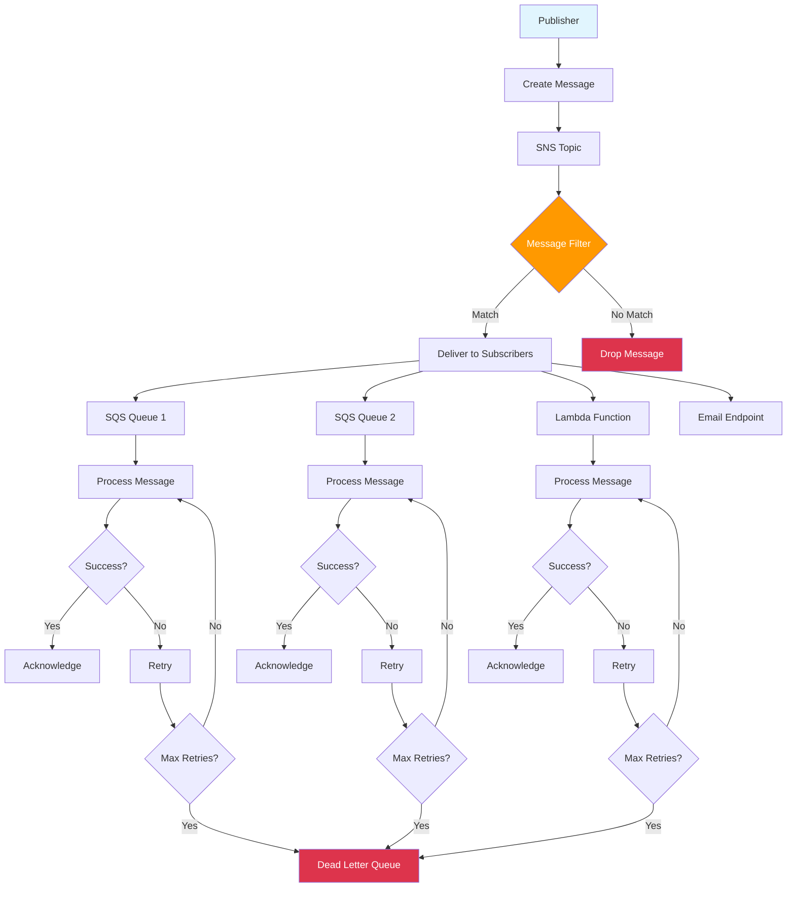

# SNS and SQS with AWS CDK

## Overview

Amazon Simple Notification Service (SNS) and Amazon Simple Queue Service (SQS) are fully managed messaging services that enable you to decouple and scale microservices, distributed systems, and serverless applications. In this lab, you'll learn how to create and manage messaging systems using SNS and SQS with AWS CDK.

[DIAGRAM: Messaging Overview]

```mermaid
flowchart TB
    subgraph "Message Producers"
        WEB_APP[Web Application<br/>User Actions]
        MOBILE_APP[Mobile App<br/>Push Events]
        IOT_DEVICES[IoT Devices<br/>Sensor Data]
        BATCH_JOB[Batch Jobs<br/>Scheduled Tasks]
        API_GATEWAY[API Gateway<br/>Webhook Events]
    end

    subgraph "Amazon SNS - Pub/Sub Messaging"
        subgraph "SNS Topics"
            TOPIC_ORDERS[Order Events Topic<br/>workshop-order-events]
            TOPIC_ALERTS[System Alerts Topic<br/>workshop-system-alerts]
            TOPIC_NOTIFICATIONS[User Notifications Topic<br/>workshop-user-notifications]
            TOPIC_ANALYTICS[Analytics Events Topic<br/>workshop-analytics]
        end

        subgraph "Message Filtering"
            FILTER_URGENT[Message Filter<br/>priority = urgent]
            FILTER_REGION[Message Filter<br/>region = us-east-1]
            FILTER_TYPE[Message Filter<br/>event_type = order_*]
            FILTER_CUSTOMER[Message Filter<br/>customer_tier = premium]
        end

        subgraph "SNS Features"
            FANOUT[Fan-out Pattern<br/>1:N Delivery]
            FIFO_SNS[FIFO Topics<br/>Ordered Delivery]
            DLQ_SNS[SNS Dead Letter Queue<br/>Failed Deliveries]
            REPLAY[Message Replay<br/>Archive & Replay]
        end
    end

    subgraph "Amazon SQS - Queue Processing"
        subgraph "Standard Queues"
            QUEUE_ORDERS[Order Processing Queue<br/>workshop-order-processing]
            QUEUE_EMAILS[Email Queue<br/>workshop-email-queue]
            QUEUE_AUDIT[Audit Queue<br/>workshop-audit-queue]
            QUEUE_ANALYTICS[Analytics Queue<br/>workshop-analytics-queue]
        end

        subgraph "FIFO Queues"
            QUEUE_PAYMENTS[Payment Processing<br/>workshop-payments.fifo]
            QUEUE_INVENTORY[Inventory Updates<br/>workshop-inventory.fifo]
        end

        subgraph "Queue Features"
            VISIBILITY[Visibility Timeout<br/>30 seconds]
            RETENTION[Message Retention<br/>14 days max]
            DLQ_SQS[Dead Letter Queue<br/>Failed Processing]
            BATCH[Batch Operations<br/>Up to 10 messages]
        end
    end

    subgraph "Message Consumers & Processors"
        subgraph "Lambda Functions"
            LAMBDA_ORDER[Order Processor<br/>Lambda Function]
            LAMBDA_EMAIL[Email Sender<br/>Lambda Function]
            LAMBDA_AUDIT[Audit Logger<br/>Lambda Function]
            LAMBDA_ANALYTICS[Analytics Processor<br/>Lambda Function]
            LAMBDA_PAYMENT[Payment Handler<br/>Lambda Function]
        end

        subgraph "External Services"
            EMAIL_SERVICE[Email Service<br/>SES/External SMTP]
            SMS_SERVICE[SMS Service<br/>SNS SMS]
            WEBHOOK_EXTERNAL[External Webhooks<br/>Partner APIs]
            MOBILE_PUSH[Mobile Push<br/>SNS Mobile Push]
        end

        subgraph "Data Stores"
            DDB_ORDERS[(DynamoDB<br/>Orders Table)]
            S3_ANALYTICS[(S3 Bucket<br/>Analytics Data)]
            RDS_AUDIT[(RDS Database<br/>Audit Logs)]
        end
    end

    subgraph "Cross-Service Integration"
        subgraph "Event-Driven Patterns"
            EVENT_BRIDGE[EventBridge<br/>Event Routing]
            STEP_FUNCTIONS[Step Functions<br/>Workflow Orchestration]
            KINESIS[Kinesis Streams<br/>Real-time Processing]
        end

        subgraph "Monitoring & Observability"
            CW_METRICS[CloudWatch<br/>Metrics & Alarms]
            CW_LOGS[CloudWatch Logs<br/>Message Tracking]
            XRAY[X-Ray<br/>Distributed Tracing]
            CW_INSIGHTS[CloudWatch Insights<br/>Message Analytics]
        end
    end

    %% Message Flow - Producers to SNS
    WEB_APP --> TOPIC_ORDERS
    MOBILE_APP --> TOPIC_NOTIFICATIONS
    IOT_DEVICES --> TOPIC_ANALYTICS
    BATCH_JOB --> TOPIC_ALERTS
    API_GATEWAY --> TOPIC_ORDERS

    %% SNS to SQS Fan-out
    TOPIC_ORDERS --> FILTER_TYPE
    TOPIC_ALERTS --> FILTER_URGENT
    TOPIC_NOTIFICATIONS --> FILTER_CUSTOMER
    TOPIC_ANALYTICS --> FILTER_REGION

    FILTER_TYPE --> QUEUE_ORDERS
    FILTER_TYPE --> QUEUE_AUDIT
    FILTER_URGENT --> QUEUE_EMAILS
    FILTER_CUSTOMER --> QUEUE_EMAILS
    FILTER_REGION --> QUEUE_ANALYTICS

    %% FIFO Message Flow
    TOPIC_ORDERS --> QUEUE_PAYMENTS
    TOPIC_ORDERS --> QUEUE_INVENTORY

    %% SNS Direct Subscriptions
    TOPIC_NOTIFICATIONS --> EMAIL_SERVICE
    TOPIC_NOTIFICATIONS --> SMS_SERVICE
    TOPIC_ALERTS --> WEBHOOK_EXTERNAL
    TOPIC_NOTIFICATIONS --> MOBILE_PUSH

    %% SQS to Lambda Processing
    QUEUE_ORDERS --> LAMBDA_ORDER
    QUEUE_EMAILS --> LAMBDA_EMAIL
    QUEUE_AUDIT --> LAMBDA_AUDIT
    QUEUE_ANALYTICS --> LAMBDA_ANALYTICS
    QUEUE_PAYMENTS --> LAMBDA_PAYMENT

    %% Lambda to Data Stores
    LAMBDA_ORDER --> DDB_ORDERS
    LAMBDA_ANALYTICS --> S3_ANALYTICS
    LAMBDA_AUDIT --> RDS_AUDIT

    %% Cross-Service Integration
    LAMBDA_ORDER --> EVENT_BRIDGE
    EVENT_BRIDGE --> STEP_FUNCTIONS
    LAMBDA_ANALYTICS --> KINESIS

    %% Dead Letter Queue Flow
    QUEUE_ORDERS -.->|Failed| DLQ_SQS
    TOPIC_ORDERS -.->|Failed| DLQ_SNS

    %% Monitoring Integration
    TOPIC_ORDERS --> CW_METRICS
    QUEUE_ORDERS --> CW_LOGS
    LAMBDA_ORDER --> XRAY
    FANOUT --> CW_INSIGHTS

    %% Styling
    classDef producer fill:#ff9900,stroke:#232F3E,stroke-width:2px,color:#232F3E
    classDef sns fill:#569a31,stroke:#232F3E,stroke-width:2px,color:white
    classDef sqs fill:#4B9CD3,stroke:#232F3E,stroke-width:2px,color:white
    classDef consumer fill:#8C4FFF,stroke:#232F3E,stroke-width:2px,color:white
    classDef external fill:#F39C12,stroke:#232F3E,stroke-width:2px,color:#232F3E
    classDef monitoring fill:#dd344c,stroke:#232F3E,stroke-width:2px,color:white

    class WEB_APP,MOBILE_APP,IOT_DEVICES,BATCH_JOB,API_GATEWAY producer
    class TOPIC_ORDERS,TOPIC_ALERTS,TOPIC_NOTIFICATIONS,TOPIC_ANALYTICS,FILTER_URGENT,FILTER_REGION,FILTER_TYPE,FILTER_CUSTOMER,FANOUT,FIFO_SNS,DLQ_SNS,REPLAY sns
    class QUEUE_ORDERS,QUEUE_EMAILS,QUEUE_AUDIT,QUEUE_ANALYTICS,QUEUE_PAYMENTS,QUEUE_INVENTORY,VISIBILITY,RETENTION,DLQ_SQS,BATCH sqs
    class LAMBDA_ORDER,LAMBDA_EMAIL,LAMBDA_AUDIT,LAMBDA_ANALYTICS,LAMBDA_PAYMENT consumer
    class EMAIL_SERVICE,SMS_SERVICE,WEBHOOK_EXTERNAL,MOBILE_PUSH,DDB_ORDERS,S3_ANALYTICS,RDS_AUDIT,EVENT_BRIDGE,STEP_FUNCTIONS,KINESIS external
    class CW_METRICS,CW_LOGS,XRAY,CW_INSIGHTS monitoring
```

<!-- 🔄 TEMPORARY MERMAID DIAGRAM - REPLACE WITH MANUAL DRAW.IO: lab_400_sns_sqs_complex_messaging_overview.drawio.svg -->



<!-- 🔄 END TEMPORARY DIAGRAM -->

## Learning Objectives

- Understand SNS and SQS core concepts
- Create and configure SNS topics and subscriptions
- Set up SQS queues with different configurations
- Implement message filtering
- Handle dead-letter queues
- Monitor messaging patterns
- Implement best practices for messaging

## Core Concepts

### SNS Architecture

1. **Topic Structure**

   ```
   ┌─────────────────────┐
   │     SNS Topic      │
   │                     │
   │  ┌───────────────┐  │
   │  │  Publishers   │  │
   │  └───────────────┘  │
   │         │           │
   │         ▼           │
   │  ┌───────────────┐  │
   │  │ Subscribers   │  │
   │  └───────────────┘  │
   └─────────────────────┘
   ```

   - Topics
   - Publishers
   - Subscribers
   - Message filtering

2. **Message Flow**
   ```
   Publisher → Topic → Message Filter → Subscribers
      │         │           │             │
      └─────────┴───────────┴─────────────┘
              Message Attributes
   ```

### SQS Components

1. **Queue Types**

   ```
   Standard Queue           FIFO Queue
   ┌──────────┐           ┌──────────┐
   │ At-least │           │ Exactly  │
   │  once    │           │  once    │
   └──────────┘           └──────────┘
        │                      │
        │     ┌──────────┐    │
        └────▶│Messages  │◀───┘
              └──────────┘
   ```

   - Standard queues
   - FIFO queues
   - Message attributes
   - Visibility timeout

2. **Queue Processing**
   ```
   Producer → Queue → Consumer
                │
                ▼
         Dead Letter Queue
   ```
   - Message retention
   - Delivery delays
   - Redrive policies
   - Batch operations

### Integration Patterns

1. **Fanout Pattern**

   ```
   SNS Topic
      │
      ├─────► SQS Queue 1
      │
      ├─────► SQS Queue 2
      │
      └─────► SQS Queue 3
   ```

   - Message distribution
   - Parallel processing
   - Workload isolation
   - Error handling

2. **Message Filtering**
   ```
   Message         Filter Policy     Subscriber
   ┌────────┐     ┌──────────┐     ┌─────────┐
   │Attrs   │────▶│Condition │────▶│Queue/   │
   └────────┘     └──────────┘     │Endpoint │
                                   └─────────┘
   ```
   - Attribute-based
   - Policy conditions
   - Subscription filters
   - Message routing

### Monitoring and Operations

1. **CloudWatch Integration**

   ```
   Metrics        Alarms         Actions
   ┌────────┐    ┌────────┐    ┌────────┐
   │Queue   │───▶│Threshold│───▶│Notify  │
   │Metrics │    │Breach   │    │Scale   │
   └────────┘    └────────┘    └────────┘
   ```

   - Queue metrics
   - Topic metrics
   - Alarm configuration
   - Operational insights

2. **Dead Letter Queues**
   ```
   Source Queue    Max Receives    DLQ
   ┌──────────┐    ┌─────────┐    ┌──────────┐
   │Messages  │───▶│Exceeded │───▶│Failed    │
   └──────────┘    └─────────┘    │Messages  │
                                  └──────────┘
   ```
   - Failed message handling
   - Retry policies
   - Message investigation
   - Reprocessing strategies

## Best Practices

1. **Message Design**

   - Message structure
   - Attribute usage
   - Size limitations
   - Versioning

2. **Security**

   - Access policies
   - Encryption
   - Authentication
   - Authorization

3. **Performance**

   - Batch processing
   - Concurrent processing
   - Timeout configuration
   - Scaling considerations

4. **Reliability**
   - Error handling
   - Dead-letter queues
   - Retry strategies
   - Monitoring

## Prerequisites for Lab

- AWS CDK installed
- AWS CLI configured
- Basic understanding of messaging patterns
- Node.js installed

## What's Next

In the hands-on section, you'll:

- Create SNS topics
- Configure SQS queues
- Implement message filtering
- Set up dead-letter queues
- Monitor message flow
- Test different messaging patterns

[DIAGRAM: Messaging Processing Flow]


