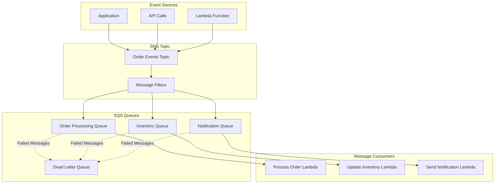
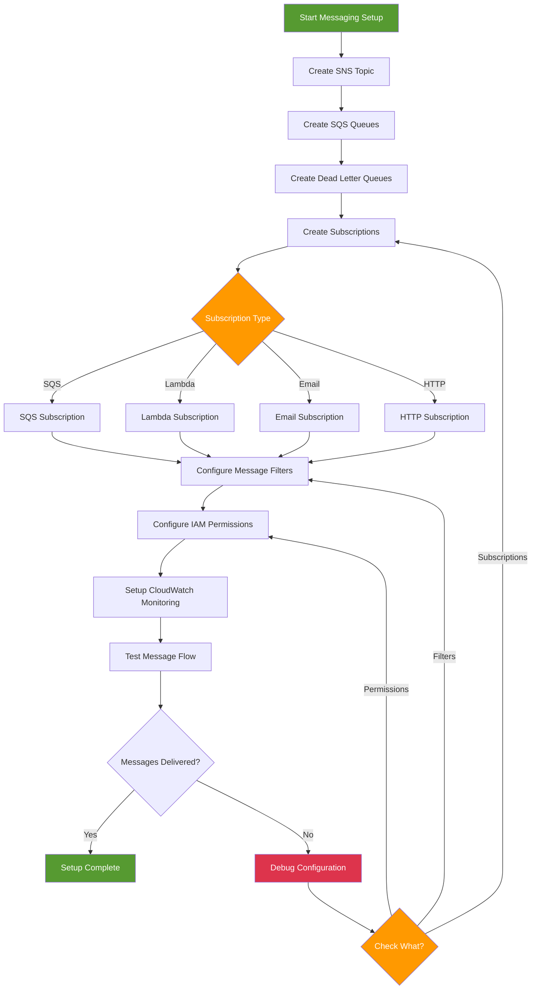

# SNS and SQS - Hands-on Lab

## Prerequisites

- AWS CDK and AWS CLI configured
- Node.js installed
- Basic understanding of messaging patterns
- Completed IAM lab

## Lab Overview

This lab demonstrates building a messaging architecture using Amazon SNS (Simple Notification Service) and SQS (Simple Queue Service). You'll create topics, queues, implement message filtering, and handle dead letter queues.

[DIAGRAM: Messaging Flow]



[DIAGRAM: Messaging Hands-on Architecture]
Instructions for draw.io:

1. Create a new diagram using the AWS Architecture 2023 template
2. Use the following AWS symbols from the symbol pack:
   - AWS SNS icon for topics
   - AWS SQS icon for queues
   - AWS Lambda icon for functions
   - AWS CloudWatch icon for monitoring
   - AWS IAM icon for permissions
3. Layout:
   - Place SNS topics at the top
   - Add SQS queues below topics
   - Place Lambda functions at the bottom
   - Add DLQ connections with red arrows
   - Show IAM roles and policies on the right
4. Use AWS's standard connector arrows to show message flow
5. Add message filter icons next to SNS topics
6. Use AWS's standard color scheme:
   - Blue for AWS services
   - Green for messaging components
   - Red for error paths
   - Gray for infrastructure elements

Description: A detailed diagram showing the messaging resources we'll create in this lab. The diagram should:

1. Show the complete architecture:
   - SNS Topics
   - SQS Queues
   - Lambda Functions
   - Dead Letter Queues
   - Message Filters
2. Illustrate the relationships between components
3. Show the messaging patterns
4. Include example service integrations
   Use AWS's standard color scheme with blue for AWS services and green for messaging components.

[DIAGRAM: Messaging Setup Flow]



## SNS and SQS Implementation

<!-- 🔄 TEMPORARY MERMAID DIAGRAM - REPLACE WITH MANUAL DRAW.IO: lab_400_sns_sqs_multi_service_implementation.drawio.svg -->

```mermaid
flowchart TD
    subgraph "E-Commerce Application Implementation"
        subgraph "Order Processing Workflow"
            ORDER_API[Order API<br/>API Gateway + Lambda]

            ORDER_TOPIC[SNS Topic<br/>workshop-order-events<br/>arn:aws:sns:us-east-1:123456789012:workshop-order-events]

            subgraph "Order Event Types"
                EVENT_CREATED[OrderCreated<br/>message_type: order.created]
                EVENT_UPDATED[OrderUpdated<br/>message_type: order.updated]
                EVENT_CANCELLED[OrderCancelled<br/>message_type: order.cancelled]
                EVENT_SHIPPED[OrderShipped<br/>message_type: order.shipped]
            end
        end

        subgraph "Message Filtering & Routing"
            subgraph "SNS Subscription Filters"
                FILTER_PAYMENTS[Payment Filter<br/>message_type = order.created<br/>OR order.updated]
                FILTER_INVENTORY[Inventory Filter<br/>message_type = order.created<br/>OR order.cancelled]
                FILTER_SHIPPING[Shipping Filter<br/>message_type = order.created<br/>AND status = confirmed]
                FILTER_NOTIFICATIONS[Notification Filter<br/>message_type IN [order.created,<br/>order.shipped, order.cancelled]]
            end
        end

        subgraph "SQS Queue Implementation"
            subgraph "Processing Queues"
                PAYMENT_QUEUE[Payment Processing Queue<br/>workshop-payment-processing<br/>VisibilityTimeout: 60s<br/>MaxReceiveCount: 3]

                INVENTORY_QUEUE[Inventory Update Queue<br/>workshop-inventory-updates.fifo<br/>ContentBasedDeduplication: true<br/>FifoThroughputLimit: perMessageGroupId]

                SHIPPING_QUEUE[Shipping Queue<br/>workshop-shipping-requests<br/>DelaySeconds: 300<br/>MessageRetentionPeriod: 1209600]

                NOTIFICATION_QUEUE[Notification Queue<br/>workshop-notifications<br/>BatchSize: 10<br/>MaxBatchingWindowInSeconds: 5]
            end

            subgraph "Dead Letter Queues"
                PAYMENT_DLQ[Payment DLQ<br/>workshop-payment-dlq<br/>MaxReceiveCount: 0]

                INVENTORY_DLQ[Inventory DLQ<br/>workshop-inventory-dlq.fifo<br/>Same settings as main queue]

                SHIPPING_DLQ[Shipping DLQ<br/>workshop-shipping-dlq<br/>Alarm on message count > 0]
            end
        end

        subgraph "Lambda Function Processors"
            subgraph "Business Logic Functions"
                PAYMENT_LAMBDA[Payment Processor<br/>Function: workshop-payment-processor<br/>Timeout: 60s<br/>Reserved Concurrency: 10]

                INVENTORY_LAMBDA[Inventory Manager<br/>Function: workshop-inventory-manager<br/>Timeout: 30s<br/>EventSourceMapping: FIFO Queue]

                SHIPPING_LAMBDA[Shipping Coordinator<br/>Function: workshop-shipping-coordinator<br/>Timeout: 45s<br/>Batch Size: 5]

                NOTIFICATION_LAMBDA[Notification Sender<br/>Function: workshop-notification-sender<br/>Timeout: 15s<br/>Batch Size: 10]
            end
        end

        subgraph "Data Persistence & External Services"
            subgraph "Database Updates"
                ORDERS_TABLE[(DynamoDB Orders Table<br/>PK: order_id<br/>GSI: customer_id-timestamp)]

                INVENTORY_TABLE[(DynamoDB Inventory Table<br/>PK: product_id<br/>Attributes: stock_count, reserved)]

                PAYMENTS_TABLE[(DynamoDB Payments Table<br/>PK: payment_id<br/>SK: order_id)]
            end

            subgraph "External Integrations"
                PAYMENT_GATEWAY[Payment Gateway<br/>Stripe/PayPal API<br/>Webhook Response]

                SHIPPING_API[Shipping Provider<br/>FedEx/UPS API<br/>Tracking Integration]

                EMAIL_SERVICE[Email Service<br/>SES Templates<br/>Customer Communications]

                SMS_SERVICE[SMS Notifications<br/>SNS SMS<br/>Order Status Updates]
            end
        end
    end

    subgraph "Message Flow & Error Handling"
        subgraph "Success Flows"
            SUCCESS_FLOW[Successful Processing<br/>Message Deleted from Queue]
            RETRY_FLOW[Retry Logic<br/>Exponential Backoff<br/>Max 3 Attempts]
        end

        subgraph "Error Scenarios"
            PAYMENT_FAIL[Payment Failure<br/>Invalid Card/Insufficient Funds]
            INVENTORY_FAIL[Inventory Failure<br/>Out of Stock/SKU Not Found]
            SHIPPING_FAIL[Shipping Failure<br/>Invalid Address/Service Unavailable]
            NOTIFICATION_FAIL[Notification Failure<br/>Invalid Email/SMS Limit]
        end
    end

    %% Order Processing Flow
    ORDER_API --> ORDER_TOPIC
    ORDER_TOPIC --> EVENT_CREATED
    ORDER_TOPIC --> EVENT_UPDATED
    ORDER_TOPIC --> EVENT_CANCELLED
    ORDER_TOPIC --> EVENT_SHIPPED

    %% Message Filtering
    EVENT_CREATED --> FILTER_PAYMENTS
    EVENT_CREATED --> FILTER_INVENTORY
    EVENT_CREATED --> FILTER_SHIPPING
    EVENT_CREATED --> FILTER_NOTIFICATIONS

    EVENT_UPDATED --> FILTER_PAYMENTS
    EVENT_CANCELLED --> FILTER_INVENTORY
    EVENT_SHIPPED --> FILTER_NOTIFICATIONS

    %% Queue Routing
    FILTER_PAYMENTS --> PAYMENT_QUEUE
    FILTER_INVENTORY --> INVENTORY_QUEUE
    FILTER_SHIPPING --> SHIPPING_QUEUE
    FILTER_NOTIFICATIONS --> NOTIFICATION_QUEUE

    %% Lambda Processing
    PAYMENT_QUEUE --> PAYMENT_LAMBDA
    INVENTORY_QUEUE --> INVENTORY_LAMBDA
    SHIPPING_QUEUE --> SHIPPING_LAMBDA
    NOTIFICATION_QUEUE --> NOTIFICATION_LAMBDA

    %% Database Operations
    PAYMENT_LAMBDA --> ORDERS_TABLE
    PAYMENT_LAMBDA --> PAYMENTS_TABLE
    INVENTORY_LAMBDA --> INVENTORY_TABLE
    SHIPPING_LAMBDA --> ORDERS_TABLE

    %% External Service Integration
    PAYMENT_LAMBDA --> PAYMENT_GATEWAY
    SHIPPING_LAMBDA --> SHIPPING_API
    NOTIFICATION_LAMBDA --> EMAIL_SERVICE
    NOTIFICATION_LAMBDA --> SMS_SERVICE

    %% Error Handling & DLQ
    PAYMENT_QUEUE -.->|Max Retries Exceeded| PAYMENT_DLQ
    INVENTORY_QUEUE -.->|Processing Failure| INVENTORY_DLQ
    SHIPPING_QUEUE -.->|Service Unavailable| SHIPPING_DLQ

    %% Error Scenarios
    PAYMENT_LAMBDA -.->|Failure| PAYMENT_FAIL
    INVENTORY_LAMBDA -.->|Failure| INVENTORY_FAIL
    SHIPPING_LAMBDA -.->|Failure| SHIPPING_FAIL
    NOTIFICATION_LAMBDA -.->|Failure| NOTIFICATION_FAIL

    %% Success & Retry Flows
    PAYMENT_LAMBDA --> SUCCESS_FLOW
    PAYMENT_FAIL --> RETRY_FLOW
    RETRY_FLOW -.->|Max Attempts| PAYMENT_DLQ

    %% Styling
    classDef api fill:#ff9900,stroke:#232F3E,stroke-width:2px,color:#232F3E
    classDef sns fill:#569a31,stroke:#232F3E,stroke-width:2px,color:white
    classDef sqs fill:#4B9CD3,stroke:#232F3E,stroke-width:2px,color:white
    classDef lambda fill:#8C4FFF,stroke:#232F3E,stroke-width:2px,color:white
    classDef database fill:#F39C12,stroke:#232F3E,stroke-width:2px,color:#232F3E
    classDef external fill:#1ABC9C,stroke:#232F3E,stroke-width:2px,color:#232F3E
    classDef error fill:#dd344c,stroke:#232F3E,stroke-width:2px,color:white

    class ORDER_API api
    class ORDER_TOPIC,EVENT_CREATED,EVENT_UPDATED,EVENT_CANCELLED,EVENT_SHIPPED,FILTER_PAYMENTS,FILTER_INVENTORY,FILTER_SHIPPING,FILTER_NOTIFICATIONS sns
    class PAYMENT_QUEUE,INVENTORY_QUEUE,SHIPPING_QUEUE,NOTIFICATION_QUEUE,PAYMENT_DLQ,INVENTORY_DLQ,SHIPPING_DLQ sqs
    class PAYMENT_LAMBDA,INVENTORY_LAMBDA,SHIPPING_LAMBDA,NOTIFICATION_LAMBDA lambda
    class ORDERS_TABLE,INVENTORY_TABLE,PAYMENTS_TABLE database
    class PAYMENT_GATEWAY,SHIPPING_API,EMAIL_SERVICE,SMS_SERVICE,SUCCESS_FLOW,RETRY_FLOW external
    class PAYMENT_FAIL,INVENTORY_FAIL,SHIPPING_FAIL,NOTIFICATION_FAIL error
```

<!-- 🔄 END TEMPORARY DIAGRAM -->

## Lab Steps

### 1. Create Messaging Infrastructure

Create a new file `lib/messaging-stack.ts`:

```typescript:lib/messaging-stack.ts
import * as cdk from 'aws-cdk-lib';
import * as sns from 'aws-cdk-lib/aws-sns';
import * as sqs from 'aws-cdk-lib/aws-sqs';
import * as subscriptions from 'aws-cdk-lib/aws-sns-subscriptions';
import * as lambda from 'aws-cdk-lib/aws-lambda';
import { Construct } from 'constructs';

export class MessagingStack extends cdk.Stack {
  constructor(scope: Construct, id: string, props?: cdk.StackProps) {
    super(scope, id, props);

    // Create SNS Topic
    const topic = new sns.Topic(this, 'WorkshopTopic', {
      displayName: 'Workshop Notification Topic',
    });

    // Create Standard Queue
    const standardQueue = new sqs.Queue(this, 'StandardQueue', {
      visibilityTimeout: cdk.Duration.seconds(30),
      retentionPeriod: cdk.Duration.days(7),
    });

    // Create FIFO Queue
    const fifoQueue = new sqs.Queue(this, 'FifoQueue', {
      fifo: true,
      contentBasedDeduplication: true,
      visibilityTimeout: cdk.Duration.seconds(30),
      retentionPeriod: cdk.Duration.days(7),
    });

    // Create Dead Letter Queue
    const dlq = new sqs.Queue(this, 'DeadLetterQueue', {
      retentionPeriod: cdk.Duration.days(14),
    });

    // Create Filtered Queue
    const filteredQueue = new sqs.Queue(this, 'FilteredQueue', {
      visibilityTimeout: cdk.Duration.seconds(30),
      deadLetterQueue: {
        queue: dlq,
        maxReceiveCount: 3,
      },
    });

    // Subscribe queues to topic
    topic.addSubscription(new subscriptions.SqsSubscription(standardQueue));
    topic.addSubscription(new subscriptions.SqsSubscription(filteredQueue, {
      filterPolicy: {
        messageType: sns.SubscriptionFilter.stringFilter({
          allowlist: ['important'],
        }),
      },
    }));

    // Create Lambda function to process messages
    const processorFunction = new lambda.Function(this, 'ProcessorFunction', {
      runtime: lambda.Runtime.NODEJS_22_X,
      handler: 'index.handler',
      code: lambda.Code.fromAsset('src/processor'),
      environment: {
        STANDARD_QUEUE_URL: standardQueue.queueUrl,
        FIFO_QUEUE_URL: fifoQueue.queueUrl,
      },
    });

    // Grant permissions
    standardQueue.grantConsumeMessages(processorFunction);
    fifoQueue.grantConsumeMessages(processorFunction);
    topic.grantPublish(processorFunction);

    // Outputs
    new cdk.CfnOutput(this, 'TopicArn', {
      value: topic.topicArn,
    });

    new cdk.CfnOutput(this, 'StandardQueueUrl', {
      value: standardQueue.queueUrl,
    });

    new cdk.CfnOutput(this, 'FifoQueueUrl', {
      value: fifoQueue.queueUrl,
    });

    new cdk.CfnOutput(this, 'FilteredQueueUrl', {
      value: filteredQueue.queueUrl,
    });

    new cdk.CfnOutput(this, 'DlqUrl', {
      value: dlq.queueUrl,
    });
  }
}
```

### 2. Create Message Processor

Create a new file `src/processor/index.ts`:

```typescript:src/processor/index.ts
import { SQSEvent, SQSHandler } from 'aws-lambda';
import { SQSClient, DeleteMessageCommand } from '@aws-sdk/client-sqs';
import { SNSClient, PublishCommand } from '@aws-sdk/client-sns';

const sqs = new SQSClient({});
const sns = new SNSClient({});

export const handler: SQSHandler = async (event: SQSEvent) => {
  for (const record of event.Records) {
    try {
      console.log('Processing message:', record.body);

      // Process message based on custom logic
      const message = JSON.parse(record.body);

      // Example: Forward processed messages to SNS
      if (message.forward) {
        await sns.send(new PublishCommand({
          TopicArn: message.topicArn,
          Message: JSON.stringify({
            original: message,
            processedAt: new Date().toISOString(),
          }),
          MessageAttributes: {
            messageType: {
              DataType: 'String',
              StringValue: message.type || 'default',
            },
          },
        }));
      }

      // Delete processed message
      // Note: In real implementation, you would get the queue URL from the event source ARN
      // or pass it as an environment variable specific to each queue
      console.log('Message processed successfully:', record.messageId);

    } catch (error) {
      console.error('Error processing message:', error);
      throw error; // Let Lambda retry or send to DLQ
    }
  }
};
```

### 3. Deploy and Test

1. Deploy the stack:

```bash
cdk deploy MessagingStack --profile your-profile-name
```

## Cleanup

When you're finished with this lab, clean up the resources to avoid ongoing charges:

```bash
# Purge all queues first
aws sqs purge-queue \
  --queue-url $(aws cloudformation describe-stacks \
    --stack-name MessagingStack \
    --query 'Stacks[0].Outputs[?OutputKey==`StandardQueueUrl`].OutputValue' \
    --output text) \
  --profile your-profile-name

aws sqs purge-queue \
  --queue-url $(aws cloudformation describe-stacks \
    --stack-name MessagingStack \
    --query 'Stacks[0].Outputs[?OutputKey==`FifoQueueUrl`].OutputValue' \
    --output text) \
  --profile your-profile-name

# Destroy the CDK stack
cdk destroy MessagingStack --profile your-profile-name
```

This will remove:

- SNS topics and subscriptions
- SQS queues and dead letter queues
- Lambda functions and IAM roles
- CloudWatch logs and metrics
