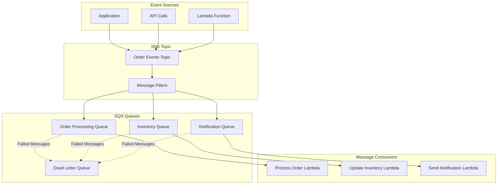

# SNS and SQS - Hands-on Lab

## Prerequisites

- AWS CDK and AWS CLI configured
- Node.js installed
- Basic understanding of messaging patterns
- Completed IAM lab

## Lab Overview

This lab demonstrates building a messaging architecture using Amazon SNS (Simple Notification Service) and SQS (Simple Queue Service). You'll create topics, queues, implement message filtering, and handle dead letter queues.

[DIAGRAM: Messaging Flow]



[DIAGRAM: Messaging Hands-on Architecture]
Instructions for draw.io:

1. Create a new diagram using the AWS Architecture 2023 template
2. Use the following AWS symbols from the symbol pack:
   - AWS SNS icon for topics
   - AWS SQS icon for queues
   - AWS Lambda icon for functions
   - AWS CloudWatch icon for monitoring
   - AWS IAM icon for permissions
3. Layout:
   - Place SNS topics at the top
   - Add SQS queues below topics
   - Place Lambda functions at the bottom
   - Add DLQ connections with red arrows
   - Show IAM roles and policies on the right
4. Use AWS's standard connector arrows to show message flow
5. Add message filter icons next to SNS topics
6. Use AWS's standard color scheme:
   - Blue for AWS services
   - Green for messaging components
   - Red for error paths
   - Gray for infrastructure elements

Description: A detailed diagram showing the messaging resources we'll create in this lab. The diagram should:

1. Show the complete architecture:
   - SNS Topics
   - SQS Queues
   - Lambda Functions
   - Dead Letter Queues
   - Message Filters
2. Illustrate the relationships between components
3. Show the messaging patterns
4. Include example service integrations
   Use AWS's standard color scheme with blue for AWS services and green for messaging components.

[DIAGRAM: Messaging Setup Flow]
Instructions for draw.io:

1. Create a new diagram using the AWS Architecture 2023 template
2. Use the following AWS symbols from the symbol pack:
   - AWS SNS icon
   - AWS SQS icon
   - AWS Lambda icon
   - AWS CloudWatch icon
   - AWS IAM icon
3. Layout:
   - Create a flowchart using AWS's standard flowchart shapes
   - Use diamond shapes for decision points
   - Use AWS's standard connector arrows
4. Add process boxes for:
   - Topic Creation
   - Queue Configuration
   - Subscription Setup
   - Integration Configuration
   - Security Setup
5. Use AWS's standard color scheme for all elements
6. Add clear labels for each step in the flow

Description: A sequence diagram showing how the messaging setup will work in our lab. The diagram should:

1. Show the setup flow:
   - Topic creation
   - Queue configuration
   - Subscription setup
   - Integration configuration
2. Include the specific operations we perform in the lab
3. Show how different components interact
4. Illustrate the messaging patterns
   Use AWS's standard color scheme and include clear labels for each step.

## Lab Steps

### 1. Create Messaging Infrastructure

Create a new file `lib/messaging-stack.ts`:

```typescript:lib/messaging-stack.ts
import * as cdk from 'aws-cdk-lib';
import * as sns from 'aws-cdk-lib/aws-sns';
import * as sqs from 'aws-cdk-lib/aws-sqs';
import * as subscriptions from 'aws-cdk-lib/aws-sns-subscriptions';
import * as lambda from 'aws-cdk-lib/aws-lambda';
import { Construct } from 'constructs';

export class MessagingStack extends cdk.Stack {
  constructor(scope: Construct, id: string, props?: cdk.StackProps) {
    super(scope, id, props);

    // Create SNS Topic
    const topic = new sns.Topic(this, 'WorkshopTopic', {
      displayName: 'Workshop Notification Topic',
    });

    // Create Standard Queue
    const standardQueue = new sqs.Queue(this, 'StandardQueue', {
      visibilityTimeout: cdk.Duration.seconds(30),
      retentionPeriod: cdk.Duration.days(7),
    });

    // Create FIFO Queue
    const fifoQueue = new sqs.Queue(this, 'FifoQueue', {
      fifo: true,
      contentBasedDeduplication: true,
      visibilityTimeout: cdk.Duration.seconds(30),
      retentionPeriod: cdk.Duration.days(7),
    });

    // Create Dead Letter Queue
    const dlq = new sqs.Queue(this, 'DeadLetterQueue', {
      retentionPeriod: cdk.Duration.days(14),
    });

    // Create Filtered Queue
    const filteredQueue = new sqs.Queue(this, 'FilteredQueue', {
      visibilityTimeout: cdk.Duration.seconds(30),
      deadLetterQueue: {
        queue: dlq,
        maxReceiveCount: 3,
      },
    });

    // Subscribe queues to topic
    topic.addSubscription(new subscriptions.SqsSubscription(standardQueue));
    topic.addSubscription(new subscriptions.SqsSubscription(filteredQueue, {
      filterPolicy: {
        messageType: sns.SubscriptionFilter.stringFilter({
          allowlist: ['important'],
        }),
      },
    }));

    // Create Lambda function to process messages
    const processorFunction = new lambda.Function(this, 'ProcessorFunction', {
      runtime: lambda.Runtime.NODEJS_18_X,
      handler: 'index.handler',
      code: lambda.Code.fromAsset('src/processor'),
      environment: {
        STANDARD_QUEUE_URL: standardQueue.queueUrl,
        FIFO_QUEUE_URL: fifoQueue.queueUrl,
      },
    });

    // Grant permissions
    standardQueue.grantConsumeMessages(processorFunction);
    fifoQueue.grantConsumeMessages(processorFunction);
    topic.grantPublish(processorFunction);

    // Outputs
    new cdk.CfnOutput(this, 'TopicArn', {
      value: topic.topicArn,
    });

    new cdk.CfnOutput(this, 'StandardQueueUrl', {
      value: standardQueue.queueUrl,
    });

    new cdk.CfnOutput(this, 'FifoQueueUrl', {
      value: fifoQueue.queueUrl,
    });

    new cdk.CfnOutput(this, 'FilteredQueueUrl', {
      value: filteredQueue.queueUrl,
    });

    new cdk.CfnOutput(this, 'DlqUrl', {
      value: dlq.queueUrl,
    });
  }
}
```

### 2. Create Message Processor

Create a new file `src/processor/index.ts`:

```typescript:src/processor/index.ts
import { SQSEvent, SQSHandler } from 'aws-lambda';
import { SQSClient, DeleteMessageCommand } from '@aws-sdk/client-sqs';
import { SNSClient, PublishCommand } from '@aws-sdk/client-sns';

const sqs = new SQSClient({});
const sns = new SNSClient({});

export const handler: SQSHandler = async (event: SQSEvent) => {
  for (const record of event.Records) {
    try {
      console.log('Processing message:', record.body);

      // Process message based on custom logic
      const message = JSON.parse(record.body);

      // Example: Forward processed messages to SNS
      if (message.forward) {
        await sns.send(new PublishCommand({
          TopicArn: message.topicArn,
          Message: JSON.stringify({
            original: message,
            processedAt: new Date().toISOString(),
          }),
          MessageAttributes: {
            messageType: {
              DataType: 'String',
              StringValue: message.type || 'default',
            },
          },
        }));
      }

      // Delete processed message
      await sqs.send(new DeleteMessageCommand({
        QueueUrl: process.env[`${message.queueType}_QUEUE_URL`],
        ReceiptHandle: record.receiptHandle,
      }));

    } catch (error) {
      console.error('Error processing message:', error);
      throw error; // Let Lambda retry or send to DLQ
    }
  }
};
```

### 3. Deploy and Test

1. Deploy the stack:

```bash
cdk deploy MessagingStack --profile your-profile-name
```

2. Send test messages:

Create a test script `scripts/send-messages.ts`:

```typescript:scripts/send-messages.ts
import { SNSClient, PublishCommand } from '@aws-sdk/client-sns';
import { SQSClient, SendMessageCommand } from '@aws-sdk/client-sqs';

const sns = new SNSClient({});
const sqs = new SQSClient({});

async function sendTestMessages() {
  const topicArn = process.env.TOPIC_ARN;
  const fifoQueueUrl = process.env.FIFO_QUEUE_URL;

  // Send SNS message
  await sns.send(new PublishCommand({
    TopicArn: topicArn,
    Message: JSON.stringify({
      text: 'Test message',
      timestamp: new Date().toISOString(),
    }),
    MessageAttributes: {
      'messageType': {
        DataType: 'String',
        StringValue: 'important',
      },
    },
  }));
  console.log('Sent SNS message');

  // Send FIFO message
  await sqs.send(new SendMessageCommand({
    QueueUrl: fifoQueueUrl,
    MessageBody: JSON.stringify({
      text: 'FIFO test message',
      timestamp: new Date().toISOString(),
    }),
    MessageGroupId: 'testGroup',
    MessageDeduplicationId: Date.now().toString(),
  }));
  console.log('Sent FIFO message');
}

sendTestMessages();
```

Run the test script:

```bash
export TOPIC_ARN=$(aws cloudformation describe-stacks \
  --stack-name MessagingStack \
  --query 'Stacks[0].Outputs[?OutputKey==`TopicArn`].OutputValue' \
  --output text \
  --profile your-profile-name)

export FIFO_QUEUE_URL=$(aws cloudformation describe-stacks \
  --stack-name MessagingStack \
  --query 'Stacks[0].Outputs[?OutputKey==`FifoQueueUrl`].OutputValue' \
  --output text \
  --profile your-profile-name)

ts-node scripts/send-messages.ts
```

### 4. Monitor Messages

Check queue metrics:

```bash
# View messages in standard queue
aws sqs get-queue-attributes \
  --queue-url $STANDARD_QUEUE_URL \
  --attribute-names ApproximateNumberOfMessages \
  --profile your-profile-name

# Check DLQ
aws sqs get-queue-attributes \
  --queue-url $DLQ_URL \
  --attribute-names ApproximateNumberOfMessages \
  --profile your-profile-name
```

## Validation Steps

1. Infrastructure Setup

   - [ ] SNS topic created
   - [ ] SQS queues created
   - [ ] Lambda function deployed
   - [ ] Permissions configured

2. Message Flow

   - [ ] SNS messages delivered
   - [ ] FIFO ordering maintained
   - [ ] Message filtering working
   - [ ] DLQ capturing failures

3. Processing
   - [ ] Lambda processing messages
   - [ ] Messages being deleted
   - [ ] Error handling working
   - [ ] CloudWatch logs available

## Troubleshooting

1. Message Delivery

   - Check subscription status
   - Verify IAM permissions
   - Review message attributes
   - Check queue settings

2. Processing Issues

   - Check Lambda logs
   - Verify queue visibility timeout
   - Review DLQ messages
   - Check function timeout

3. Performance
   - Monitor queue depth
   - Check processing times
   - Review throttling metrics
   - Verify scaling behavior

## Cleanup

Remove the stack:

```bash
cdk destroy MessagingStack --profile your-profile-name
```
