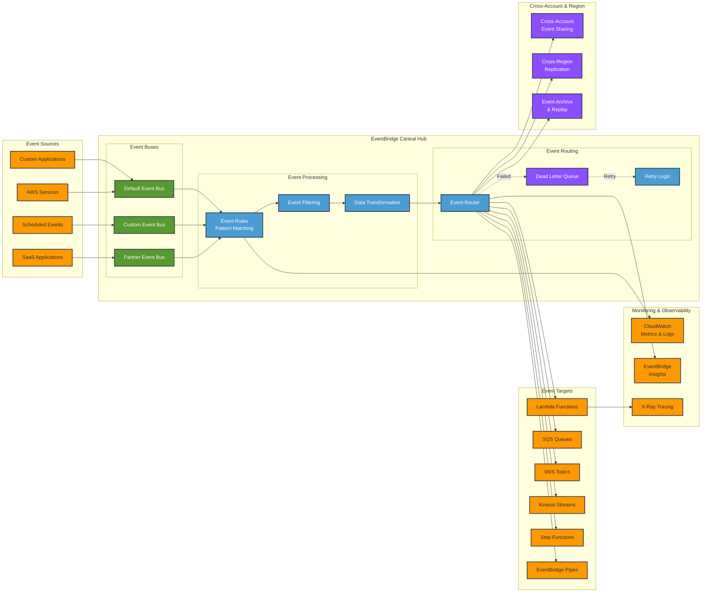
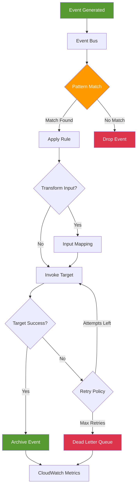

# EventBridge

## Overview

Amazon EventBridge is a serverless event bus service that makes it easy to connect applications together using data from your own applications, integrated Software-as-a-Service (SaaS) applications, and AWS services. This lab demonstrates how to use EventBridge to build event-driven architectures.

[DIAGRAM: EventBridge Overview]

<!-- Removed placeholder: diagram defined below -->



<!-- End diagram section -->

## Learning Objectives

- Understand EventBridge concepts and components
- Create and manage event buses
- Define event patterns and rules
- Configure event targets
- Implement event filtering
- Monitor and debug event flows
- Apply best practices for event-driven architectures

## Core Concepts

### EventBridge Architecture

1. **Event Bus Components**

   ```
   ┌─────────────┐     ┌─────────────┐    ┌─────────────┐
   │   Event     │     │    Event    │    │   Event     │
   │  Sources    │────▶│    Bus      │───▶│  Targets    │
   └─────────────┘     └─────────────┘    └─────────────┘
         │                    │                  │
         │             ┌──────┴──────┐           │
         └────────────▶│    Rules    │◀──────────┘
                       └─────────────┘
   ```

   - Event buses
   - Event sources
   - Event targets
   - Rules and patterns

2. **Event Structure**
   ```json
   {
     "version": "0",
     "id": "event-id",
     "detail-type": "type",
     "source": "source",
     "account": "account",
     "time": "timestamp",
     "region": "region",
     "detail": {
       "key": "value"
     }
   }
   ```

### Event Rules and Patterns

1. **Rule Components**

   ```
   Rule
   ├── Event Pattern
   │   ├── Source
   │   ├── Detail Type
   │   └── Detail
   └── Targets
       ├── Primary Target
       └── Dead Letter Queue
   ```

   - Pattern matching
   - Content filtering
   - Target configuration
   - Error handling

2. **Pattern Types**
   ```
   ┌────────────────┐
   │ Event Patterns │
   │  ┌─────────┐   │
   │  │ Prefix  │   │
   │  │ Match   │   │
   │  └─────────┘   │
   │  ┌─────────┐   │
   │  │ Exact   │   │
   │  │ Match   │   │
   │  └─────────┘   │
   └────────────────┘
   ```
   - Prefix matching
   - Exact matching
   - Pattern arrays
   - Nested patterns

### Event Targets

1. **Target Types**

   ```
   EventBridge Rule
         │
         ├─────► Lambda Functions
         │
         ├─────► SQS Queues
         │
         ├─────► SNS Topics
         │
         ├─────► Step Functions
         │
         └─────► API Destinations
   ```

   - AWS services
   - API destinations
   - Event buses
   - Third-party services

2. **Target Configuration**
   - Input transformation
   - Retry policies
   - Dead-letter queues
   - Permissions

### Monitoring and Debugging

1. **CloudWatch Integration**

   ```
   Events        Metrics       Alarms
   ┌────────┐   ┌────────┐   ┌─────────┐
   │Archive │   │Invoked │   │Failure  │
   │Replay  │──▶│Success │──▶│Threshold│
   └────────┘   │Failed  │   └─────────┘
                └────────┘
   ```

   - Event archiving
   - Event replay
   - Metrics and logs
   - Alarm configuration

2. **Troubleshooting Tools**
   - Event patterns tester
   - CloudWatch logs
   - API tracking
   - Error handling

## Best Practices

1. **Event Design**

   - Schema definition
   - Versioning strategy
   - Content structure
   - Metadata usage

2. **Security**

   - Resource policies
   - IAM roles
   - Event encryption
   - Access control

3. **Performance**

   - Rule optimization
   - Target selection
   - Retry configuration
   - Throughput management

4. **Operations**
   - Monitoring setup
   - Logging strategy
   - Error handling
   - Disaster recovery

## Prerequisites for Lab

- AWS CDK installed
- AWS CLI configured
- Basic understanding of event-driven architecture
- Completed SNS and SQS lab

## What's Next

In the hands-on section, you'll:

- Create event buses
- Configure event rules
- Set up event targets
- Implement event patterns
- Monitor event flows
- Test event delivery

[DIAGRAM: EventBridge Processing Flow]


