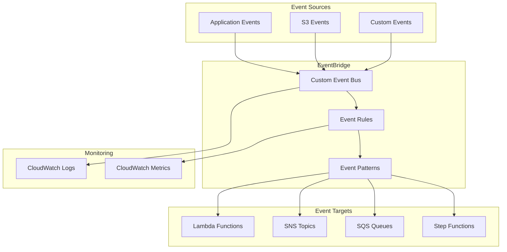
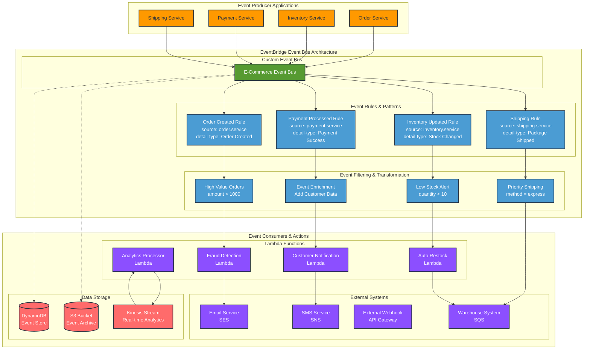

# EventBridge - Hands-on Lab

## Prerequisites

> Tip: Set the workshop region (Frankfurt)
```bash
export AWS_REGION=eu-central-1
```

> Tip: Set an AWS profile for this shell to avoid repeating profile flags

```bash
export AWS_PROFILE=your-profile-name
```

- AWS CDK and AWS CLI configured
- Node.js installed
- Completed SNS and SQS lab

## Lab Overview

This lab demonstrates building event-driven architectures using Amazon EventBridge. You'll create custom event buses, rules, and integrate with various AWS services for event routing and processing.

[DIAGRAM: EventBridge Flow]



[DIAGRAM: EventBridge Implementation]
Instructions for draw.io:

1. Create a new diagram using the AWS Architecture 2023 template
2. Use the following AWS symbols from the symbol pack:
   - AWS EventBridge icon
   - AWS Lambda icon
   - AWS SNS icon
   - AWS SQS icon
   - AWS CloudWatch icon
   - AWS IAM icon
3. Layout:
   - Place EventBridge at the center
   - Add event sources on the left
   - Place targets (Lambda, SNS, SQS) on the right
   - Add CloudWatch monitoring at the bottom
   - Show IAM roles and policies on the right
4. Use AWS's standard connector arrows to show event flow
5. Add event rule visualization with filters
6. Use AWS's standard color scheme:
   - Blue for AWS services
   - Green for event components
   - Gray for infrastructure elements

## EventBridge Implementation

<!-- End of diagram overview -->



<!-- End diagram section -->

## Lab Steps

### 1. Create EventBridge Infrastructure

Create a new file `lib/eventbridge-stack.ts`:

```typescript:lib/eventbridge-stack.ts
import * as cdk from 'aws-cdk-lib';
import * as events from 'aws-cdk-lib/aws-events';
import * as targets from 'aws-cdk-lib/aws-events-targets';
import * as lambda from 'aws-cdk-lib/aws-lambda';
import * as sqs from 'aws-cdk-lib/aws-sqs';
import * as sns from 'aws-cdk-lib/aws-sns';
import * as subscriptions from 'aws-cdk-lib/aws-sns-subscriptions';
import * as cloudwatch from 'aws-cdk-lib/aws-cloudwatch';
import { Construct } from 'constructs';

export class EventBridgeStack extends cdk.Stack {
  constructor(scope: Construct, id: string, props?: cdk.StackProps) {
    super(scope, id, props);

    // Create Custom Event Bus
    const customBus = new events.EventBus(this, 'CustomEventBus', {
      eventBusName: 'workshop-bus',
    });

    // Create Dead Letter Queue
    const dlq = new sqs.Queue(this, 'DeadLetterQueue', {
      retentionPeriod: cdk.Duration.days(14),
    });

    // Create SNS Topic for notifications and alerts
    const notificationTopic = new sns.Topic(this, 'NotificationTopic');
    const alertTopic = new sns.Topic(this, 'AlertTopic', {
      displayName: 'EventBridge Alerts',
    });

    // Create Lambda function to process events
    const processorFunction = new lambda.Function(this, 'ProcessorFunction', {
      runtime: lambda.Runtime.NODEJS_22_X,
      handler: 'index.handler',
      code: lambda.Code.fromAsset('src/processor'),
      environment: {
        TOPIC_ARN: notificationTopic.topicArn,
      },
    });

    // Grant permissions
    notificationTopic.grantPublish(processorFunction);

    // Create Rules with enhanced error handling
    const highPriorityRule = new events.Rule(this, 'HighPriorityRule', {
      eventBus: customBus,
      ruleName: 'high-priority-events',
      description: 'Rule for high priority events with monitoring',
      eventPattern: {
        source: ['workshop.events'],
        detailType: ['transaction'],
        detail: {
          priority: ['high'],
        },
      },
      targets: [new targets.LambdaFunction(processorFunction, {
        deadLetterQueue: dlq,
        maxEventAge: cdk.Duration.hours(2),
        retryAttempts: 2,
      })],
    });

    const allEventsRule = new events.Rule(this, 'AllEventsRule', {
      eventBus: customBus,
      ruleName: 'all-events-logging',
      description: 'Rule for logging all events',
      eventPattern: {
        source: ['workshop.events'],
      },
      targets: [new targets.SqsQueue(dlq)],
    });

    // Archive events for replay capability
    const eventArchive = new events.Archive(this, 'EventArchive', {
      sourceEventBus: customBus,
      archiveName: 'workshop-archive',
      description: 'Archive for workshop events with replay capability',
      retention: cdk.Duration.days(30),
      eventPattern: {
        source: ['workshop.events'],
      },
    });

    // CloudWatch alarms for monitoring
    const failedEventAlarm = new cloudwatch.Alarm(this, 'FailedEventAlarm', {
      alarmName: 'workshop-eventbridge-failed-events',
      alarmDescription: 'Alarm when EventBridge events fail to process',
      metric: new cloudwatch.Metric({
        namespace: 'AWS/Events',
        metricName: 'FailedInvocations',
        dimensionsMap: {
          RuleName: highPriorityRule.ruleName,
        },
      }),
      threshold: 1,
      evaluationPeriods: 1,
      treatMissingData: cloudwatch.TreatMissingData.NOT_BREACHING,
    });

    const lambdaErrorAlarm = new cloudwatch.Alarm(this, 'LambdaErrorAlarm', {
      alarmName: 'workshop-event-processor-errors',
      alarmDescription: 'Alarm when event processor Lambda has errors',
      metric: processorFunction.metricErrors(),
      threshold: 3,
      evaluationPeriods: 2,
      treatMissingData: cloudwatch.TreatMissingData.NOT_BREACHING,
    });

    const dlqAlarm = new cloudwatch.Alarm(this, 'DeadLetterQueueAlarm', {
      alarmName: 'workshop-eventbridge-dlq-messages',
      alarmDescription: 'Alarm when messages appear in EventBridge DLQ',
      metric: dlq.metricApproximateNumberOfVisibleMessages(),
      threshold: 1,
      evaluationPeriods: 1,
      treatMissingData: cloudwatch.TreatMissingData.NOT_BREACHING,
    });

    // Send alarms to SNS topic
    failedEventAlarm.addAlarmAction(new cloudwatch.SnsAction(alertTopic));
    lambdaErrorAlarm.addAlarmAction(new cloudwatch.SnsAction(alertTopic));
    dlqAlarm.addAlarmAction(new cloudwatch.SnsAction(alertTopic));

    // Outputs
    new cdk.CfnOutput(this, 'EventBusName', {
      value: customBus.eventBusName,
    });

    new cdk.CfnOutput(this, 'EventBusArn', {
      value: customBus.eventBusArn,
    });

    new cdk.CfnOutput(this, 'DlqUrl', {
      value: dlq.queueUrl,
    });

    new cdk.CfnOutput(this, 'TopicArn', {
      value: notificationTopic.topicArn,
    });

    new cdk.CfnOutput(this, 'AlertTopicArn', {
      value: alertTopic.topicArn,
      description: 'Subscribe to this topic for EventBridge alerts',
    });

    new cdk.CfnOutput(this, 'ArchiveName', {
      value: eventArchive.archiveName,
      description: 'Use this archive name for event replay in AWS Console',
    });
  }
}
```

### 2. Create Event Processor

Create a new file `src/processor/index.ts`:

```typescript:src/processor/index.ts
import { EventBridgeEvent } from 'aws-lambda';
import { SNSClient, PublishCommand } from '@aws-sdk/client-sns';

const sns = new SNSClient({});

export const handler = async (event: EventBridgeEvent<string, any>): Promise<void> => {
  console.log('Received event:', JSON.stringify(event, null, 2));

  try {
    // Process the event based on type
    if (event['detail-type'] === 'transaction') {
      await processTransaction(event);
    }

    // Send notification
    await sns.send(new PublishCommand({
      TopicArn: process.env.TOPIC_ARN,
      Message: JSON.stringify({
        eventId: event.id,
        processedAt: new Date().toISOString(),
        detail: event.detail,
      }),
      MessageAttributes: {
        eventType: {
          DataType: 'String',
          StringValue: event['detail-type'],
        },
      },
    }));

  } catch (error) {
    console.error('Error processing event:', error);
    throw error;
  }
};

async function processTransaction(event: EventBridgeEvent<string, any>): Promise<void> {
  // Add your transaction processing logic here
  console.log('Processing transaction:', event.detail);
}
```

### 3. Deploy and Test

1. Deploy the stack:

```bash
cdk deploy EventBridgeStack
```

2. Create a test script `scripts/send-events.ts`:

```typescript:scripts/send-events.ts
import { EventBridgeClient, PutEventsCommand } from '@aws-sdk/client-eventbridge';

const eventbridge = new EventBridgeClient({});

async function sendTestEvents() {
  const eventBusName = process.env.EVENT_BUS_NAME;

  const events = [
    {
      Source: 'workshop.events',
      DetailType: 'transaction',
      Detail: JSON.stringify({
        transactionId: '123',
        amount: 100,
        priority: 'high',
        timestamp: new Date().toISOString(),
      }),
    },
    {
      Source: 'workshop.events',
      DetailType: 'transaction',
      Detail: JSON.stringify({
        transactionId: '456',
        amount: 50,
        priority: 'low',
        timestamp: new Date().toISOString(),
      }),
    },
  ];

  try {
    const result = await eventbridge.send(new PutEventsCommand({
      Entries: events.map(event => ({
        ...event,
        EventBusName: eventBusName,
      })),
    }));

    console.log('Events sent:', result);
  } catch (error) {
    console.error('Error sending events:', error);
  }
}

sendTestEvents();
```

3. Run the test script:

```bash
export EVENT_BUS_NAME=$(aws cloudformation describe-stacks \
  --stack-name EventBridgeStack \
  --query 'Stacks[0].Outputs[?OutputKey==`EventBusName`].OutputValue' \
  --output text \
 )

ts-node scripts/send-events.ts
```

### 4. Monitor and Test Your EventBridge Setup

#### Subscribe to Alert Notifications

```bash
# Subscribe to security and operational alerts
aws sns subscribe \
  --topic-arn $(aws cloudformation describe-stacks \
    --stack-name EventBridgeStack \
    --query 'Stacks[0].Outputs[?OutputKey==`AlertTopicArn`].OutputValue' \
    --output text) \
  --protocol email \
  --notification-endpoint YOUR_EMAIL_ADDRESS \

```

#### Test Event Processing

```bash
# Set up environment
export EVENT_BUS_NAME=$(aws cloudformation describe-stacks \
  --stack-name EventBridgeStack \
  --query 'Stacks[0].Outputs[?OutputKey==`EventBusName`].OutputValue' \
  --output text \
 )

# Test normal event processing
ts-node scripts/send-events.ts
```

#### Test Error Handling

```bash
# Send invalid event to test error handling
aws events put-events \
  --entries Source=workshop.events,DetailType=invalid-test,Detail='{"test":"error"}' \
  --event-bus-name $EVENT_BUS_NAME \


# Check if alarm triggers (may take a few minutes)
aws cloudwatch describe-alarms \
  --alarm-names workshop-eventbridge-failed-events \

```

#### Monitor Event Flow

```bash
# Check Lambda function logs
aws logs tail /aws/lambda/EventBridgeStack-ProcessorFunction \
  --follow \


# Check DLQ for failed events
aws sqs receive-message \
  --queue-url $(aws cloudformation describe-stacks \
    --stack-name EventBridgeStack \
    --query 'Stacks[0].Outputs[?OutputKey==`DlqUrl`].OutputValue' \
    --output text) \

```

## Validation Steps

1. **Infrastructure Setup**

   - [ ] Event bus created successfully
   - [ ] Rules configured with proper patterns
   - [ ] Lambda function deployed and accessible
   - [ ] Dead letter queue configured
   - [ ] CloudWatch alarms active
   - [ ] SNS alert topic ready

2. **Event Processing**

   - [ ] Events routing to correct targets
   - [ ] Rules matching expected patterns
   - [ ] Lambda function processing events
   - [ ] Notifications sending properly
   - [ ] Error events routing to DLQ

3. **Monitoring and Alerting**

   - [ ] CloudWatch logs capturing all events
   - [ ] Events being archived for replay
   - [ ] Failed events triggering alarms
   - [ ] Alert notifications working
   - [ ] Metrics visible in CloudWatch console

4. **Error Handling**
   - [ ] Retry logic functioning on failures
   - [ ] DLQ capturing unprocessable events
   - [ ] Timeouts preventing hung executions
   - [ ] Graceful degradation on service issues

## Troubleshooting

1. Event Delivery

   - Check event bus metrics
   - Verify rule patterns
   - Review target permissions
   - Check CloudWatch logs

2. Processing Issues

   - Check Lambda logs
   - Verify IAM roles
   - Review DLQ messages
   - Check SNS delivery

3. Performance
   - Monitor invocation metrics
   - Check throttling
   - Review error rates
   - Verify timeouts

## Cleanup

Remove the stack:

```bash
cdk destroy EventBridgeStack
```
