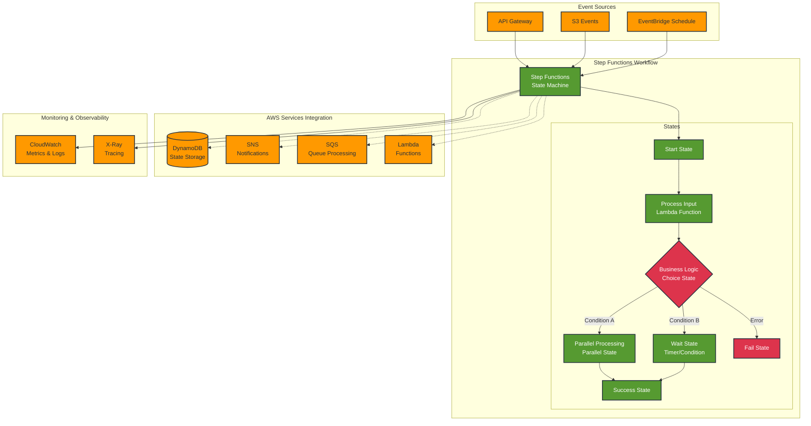
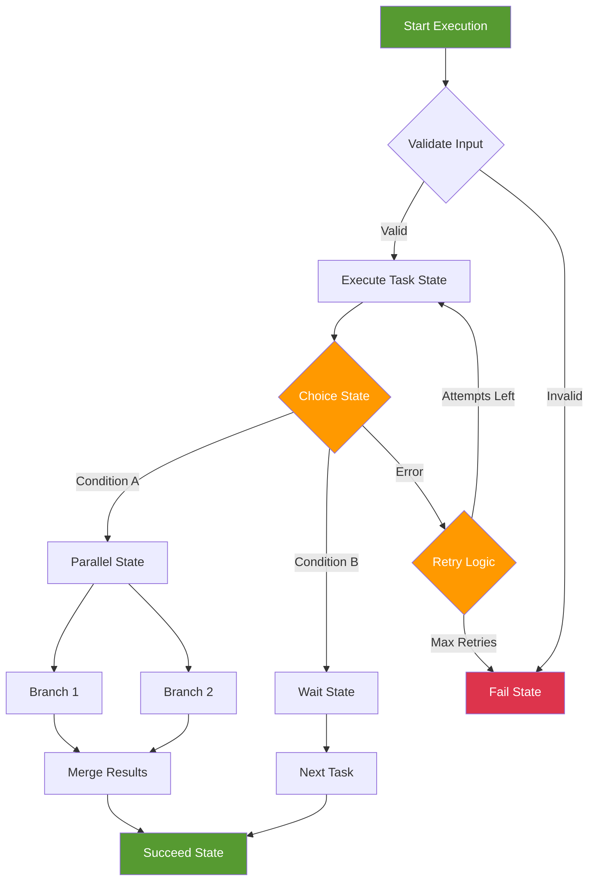

# Step Functions

## Overview

AWS Step Functions is a serverless workflow service that lets you coordinate multiple AWS services into serverless workflows. This lab demonstrates how to create, manage, and monitor state machines for orchestrating complex business processes and application workflows.

[DIAGRAM: Step Functions Overview]

<!-- Removed placeholder: diagram defined below -->



<!-- End diagram section -->

## Learning Objectives

- Understand Step Functions concepts and components
- Create and manage state machines
- Implement different state types
- Handle errors and retries
- Integrate with AWS services
- Monitor workflow executions
- Implement best practices for workflow design

## Core Concepts

### State Machine Architecture

1. **Components**

   ```
   ┌─────────────────────────────────┐
   │         State Machine           │
   │                                 │
   │  ┌─────────┐    ┌──────────┐   │
   │  │ States  │───▶│Transitions│   │
   │  └─────────┘    └──────────┘   │
   │                                 │
   │  ┌─────────┐    ┌──────────┐   │
   │  │ Input   │───▶│ Output   │   │
   │  └─────────┘    └──────────┘   │
   └─────────────────────────────────┘
   ```

   - States
   - Transitions
   - Input/Output processing
   - Error handling

2. **Workflow Types**
   ```
   Standard           Express
   ┌──────────┐     ┌──────────┐
   │Long-lived│     │Short-lived│
   │Auditable │     │High-volume│
   └──────────┘     └──────────┘
   ```

### State Types

1. **Task States**

   ```
   ┌─────────────┐
   │Task State   │
   │  ┌───────┐  │
   │  │Lambda │  │
   │  └───────┘  │
   │  ┌───────┐  │
   │  │Service│  │
   │  └───────┘  │
   └─────────────┘
   ```

   - Lambda functions
   - AWS services
   - Activity tasks
   - Integration patterns

2. **Flow Control States**
   ```
   Choice      Parallel     Map
   ┌────┐     ┌────────┐   ┌────────┐
   │ If │     │Branch 1│   │Iterator│
   │Then│     │Branch 2│   │States  │
   │Else│     │Branch 3│   │        │
   └────┘     └────────┘   └────────┘
   ```
   - Choice
   - Parallel
   - Map
   - Wait
   - Pass

### Error Handling

1. **Error Types**

   ```
   ┌────────────────┐
   │Error Handling  │
   │  ┌─────────┐   │
   │  │ Retry   │   │
   │  └─────────┘   │
   │  ┌─────────┐   │
   │  │ Catch   │   │
   │  └─────────┘   │
   └────────────────┘
   ```

   - State errors
   - Task failures
   - Timeouts
   - Custom errors

2. **Recovery Patterns**
   - Retry policies
   - Catch states
   - Fallback logic
   - Compensation

### Monitoring and Debugging

1. **CloudWatch Integration**

   ```
   Execution      Metrics      Logs
   ┌────────┐    ┌────────┐   ┌────────┐
   │History │───▶│Success │──▶│Details │
   │Events  │    │Failed  │   │Errors  │
   └────────┘    └────────┘   └────────┘
   ```

   - Execution history
   - Metrics
   - Logging
   - Tracing

2. **Debugging Tools**
   - Visual workflow
   - Step-by-step execution
   - Input/output data
   - Error information

## Best Practices

1. **Workflow Design**

   - State granularity
   - Error handling
   - Input/output management
   - State organization

2. **Security**

   - IAM roles
   - Service integration
   - Data encryption
   - Access control

3. **Performance**

   - Parallel processing
   - Timeout configuration
   - Resource allocation
   - State optimization

4. **Operations**
   - Monitoring setup
   - Logging strategy
   - Version control
   - Testing approach

## Prerequisites for Lab

- AWS CDK installed
- AWS CLI configured
- Basic understanding of state machines
- Completed Lambda and Event Triggers lab

## What's Next

In the hands-on section, you'll:

- Create state machines
- Implement different state types
- Configure error handling
- Set up service integrations
- Monitor executions
- Test workflows

[DIAGRAM: Step Functions Execution Flow]


