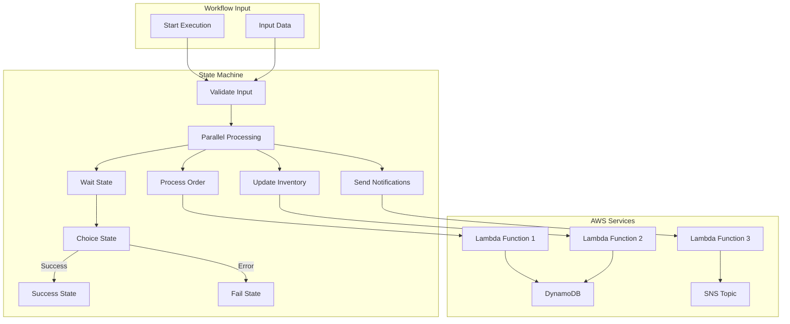
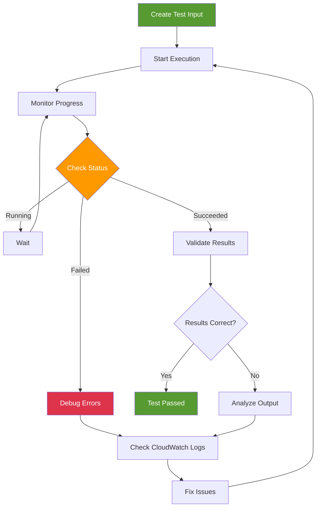

# Step Functions - Hands-on Lab

## Prerequisites

> Tip: Set an AWS profile for this shell to avoid repeating profile flags

```bash
export AWS_PROFILE=your-profile-name
```

- AWS CDK and AWS CLI configured
- Node.js installed
- Completed Lambda and Event Triggers lab

## Lab Overview

This lab demonstrates building serverless workflows using AWS Step Functions. You'll create state machines that orchestrate Lambda functions, handle errors, and implement complex business logic with parallel and sequential processing.

[DIAGRAM: Step Functions Workflow]



[DIAGRAM: Step Functions Implementation]
Instructions for draw.io:

1. Create a new diagram using the AWS Architecture 2023 template
2. Use the following AWS symbols from the symbol pack:
   - AWS Step Functions icon
   - AWS Lambda icon
   - AWS DynamoDB icon
   - AWS SNS icon
   - AWS CloudWatch icon
   - AWS IAM icon
3. Layout:
   - Place Step Functions state machine at the center
   - Add Lambda functions around the state machine
   - Place DynamoDB and SNS as service integrations
   - Add CloudWatch monitoring at the bottom
   - Show IAM roles and policies on the right
4. Use AWS's standard connector arrows to show workflow flow
5. Add state transition visualization
6. Use AWS's standard color scheme:
   - Blue for AWS services
   - Green for workflow components
   - Gray for infrastructure elements

## Step Functions Implementation

```mermaid
flowchart TD
    subgraph "Detailed State Machine Implementation"
        START[Start: ValidateInput]

        subgraph "Input Processing"
            VALIDATE[Validate Request<br/>Lambda Function]
            TRANSFORM[Transform Data<br/>Lambda Function]
        end

        subgraph "Business Logic"
            CHOICE{Order Type?}

            subgraph "Standard Processing"
                INVENTORY[Check Inventory<br/>DynamoDB Query]
                PAYMENT[Process Payment<br/>External API]
                SHIP[Schedule Shipping<br/>Lambda + SQS]
            end

            subgraph "Express Processing"
                PRIORITY[Priority Queue<br/>SQS FIFO]
                EXPRESS[Express Handler<br/>Lambda Function]
            end
        end

        subgraph "Completion Flow"
            PARALLEL[Parallel State]
            NOTIFY[Send Notification<br/>SNS Topic]
            AUDIT[Audit Trail<br/>DynamoDB Put]
            METRICS[Update Metrics<br/>CloudWatch]
            SUCCESS[Success State]
        end

        subgraph "Error Handling"
            RETRY[Retry Logic<br/>Exponential Backoff]
            DLQ[Dead Letter Queue<br/>SQS]
            FAIL[Fail State<br/>Error Notification]
        end
    end

    %% Flow
    START --> VALIDATE
    VALIDATE --> TRANSFORM
    TRANSFORM --> CHOICE

    CHOICE -->|Standard| INVENTORY
    CHOICE -->|Express| PRIORITY

    INVENTORY --> PAYMENT
    PAYMENT --> SHIP
    SHIP --> PARALLEL

    PRIORITY --> EXPRESS
    EXPRESS --> PARALLEL

    PARALLEL --> NOTIFY
    PARALLEL --> AUDIT
    PARALLEL --> METRICS

    NOTIFY --> SUCCESS
    AUDIT --> SUCCESS
    METRICS --> SUCCESS

    %% Error Flows
    VALIDATE -.->|Error| RETRY
    PAYMENT -.->|Error| RETRY
    RETRY -.->|Max Attempts| DLQ
    DLQ --> FAIL

    %% Styling
    classDef aws fill:#ff9900,stroke:#232F3E,stroke-width:2px,color:#232F3E
    classDef success fill:#569a31,stroke:#232F3E,stroke-width:2px,color:white
    classDef error fill:#dd344c,stroke:#232F3E,stroke-width:2px,color:white
    classDef processing fill:#4B9CD3,stroke:#232F3E,stroke-width:2px,color:white

    class VALIDATE,TRANSFORM,INVENTORY,PAYMENT,SHIP,EXPRESS,NOTIFY,AUDIT,METRICS processing
    class START,PARALLEL,SUCCESS success
    class CHOICE,RETRY,DLQ,FAIL error
    class PRIORITY aws
```

<!-- End of diagram overview -->



<!-- End diagram section -->

## Lab Steps

### 1. Create Step Functions Infrastructure

Create a new file `lib/stepfunctions-stack.ts`:

```typescript:lib/stepfunctions-stack.ts
import * as cdk from 'aws-cdk-lib';
import * as sfn from 'aws-cdk-lib/aws-stepfunctions';
import * as tasks from 'aws-cdk-lib/aws-stepfunctions-tasks';
import * as lambda from 'aws-cdk-lib/aws-lambda';
import * as dynamodb from 'aws-cdk-lib/aws-dynamodb';
import * as sns from 'aws-cdk-lib/aws-sns';
import { Construct } from 'constructs';

export class StepFunctionsStack extends cdk.Stack {
  constructor(scope: Construct, id: string, props?: cdk.StackProps) {
    super(scope, id, props);

    // Create DynamoDB table
    const table = new dynamodb.Table(this, 'OrdersTable', {
      partitionKey: { name: 'orderId', type: dynamodb.AttributeType.STRING },
      billingMode: dynamodb.BillingMode.PAY_PER_REQUEST,
      removalPolicy: cdk.RemovalPolicy.DESTROY,
    });

    // Create SNS topic for notifications
    const notificationTopic = new sns.Topic(this, 'NotificationTopic');

    // Create Lambda functions
    const validateOrderFunction = new lambda.Function(this, 'ValidateOrder', {
      runtime: lambda.Runtime.NODEJS_22_X,
      handler: 'index.handler',
      code: lambda.Code.fromAsset('src/validate-order'),
    });

    const processPaymentFunction = new lambda.Function(this, 'ProcessPayment', {
      runtime: lambda.Runtime.NODEJS_22_X,
      handler: 'index.handler',
      code: lambda.Code.fromAsset('src/process-payment'),
      environment: {
        TABLE_NAME: table.tableName,
        TOPIC_ARN: notificationTopic.topicArn,
      },
    });

    const updateInventoryFunction = new lambda.Function(this, 'UpdateInventory', {
      runtime: lambda.Runtime.NODEJS_22_X,
      handler: 'index.handler',
      code: lambda.Code.fromAsset('src/update-inventory'),
    });

    // Grant permissions
    table.grantWriteData(processPaymentFunction);
    notificationTopic.grantPublish(processPaymentFunction);

    // Create Step Functions state machine
    const validateOrder = new tasks.LambdaInvoke(this, 'Validate Order', {
      lambdaFunction: validateOrderFunction,
      resultPath: '$.validationResult',
    });

    const processPayment = new tasks.LambdaInvoke(this, 'Process Payment', {
      lambdaFunction: processPaymentFunction,
      resultPath: '$.paymentResult',
    });

    const updateInventory = new tasks.LambdaInvoke(this, 'Update Inventory', {
      lambdaFunction: updateInventoryFunction,
      resultPath: '$.inventoryResult',
    });

    const orderFailed = new sfn.Fail(this, 'Order Failed', {
      cause: 'Order Processing Failed',
      error: 'OrderError',
    });

    const orderSucceeded = new sfn.Succeed(this, 'Order Succeeded');

    // Create state machine definition
    const definition = validateOrder
      .next(new sfn.Choice(this, 'Is Order Valid?')
        .when(sfn.Condition.booleanEquals('$.validationResult.Payload.isValid', true),
          processPayment
            .next(new sfn.Choice(this, 'Is Payment Successful?')
              .when(sfn.Condition.booleanEquals('$.paymentResult.Payload.success', true),
                updateInventory
                  .next(orderSucceeded))
              .otherwise(orderFailed)))
        .otherwise(orderFailed));

    // Create state machine
    const stateMachine = new sfn.StateMachine(this, 'OrderProcessing', {
      definition,
      timeout: cdk.Duration.minutes(5),
      tracingEnabled: true,
    });

    // Outputs
    new cdk.CfnOutput(this, 'StateMachineArn', {
      value: stateMachine.stateMachineArn,
    });

    new cdk.CfnOutput(this, 'TableName', {
      value: table.tableName,
    });

    new cdk.CfnOutput(this, 'TopicArn', {
      value: notificationTopic.topicArn,
    });
  }
}
```

### 2. Create Lambda Functions

1. Create validate order function:

```typescript:src/validate-order/index.ts
export const handler = async (event: any): Promise<any> => {
  console.log('Validating order:', event);

  // Add your validation logic here
  const isValid = event.orderAmount && event.orderAmount > 0;

  return {
    isValid,
    reason: isValid ? 'Order is valid' : 'Invalid order amount',
  };
};
```

2. Create process payment function:

```typescript:src/process-payment/index.ts
import { DynamoDBClient } from '@aws-sdk/client-dynamodb';
import { DynamoDBDocumentClient, PutCommand } from '@aws-sdk/lib-dynamodb';
import { SNSClient, PublishCommand } from '@aws-sdk/client-sns';

const ddbClient = new DynamoDBClient({});
const docClient = DynamoDBDocumentClient.from(ddbClient);
const sns = new SNSClient({});

export const handler = async (event: any): Promise<any> => {
  console.log('Processing payment:', event);

  try {
    // Process payment logic here
    const success = Math.random() > 0.2; // Simulate payment failure 20% of the time

    if (success) {
      // Save order to DynamoDB
      await docClient.send(new PutCommand({
        TableName: process.env.TABLE_NAME,
        Item: {
          orderId: event.orderId,
          amount: event.orderAmount,
          timestamp: new Date().toISOString(),
        },
      }));

      // Send notification
      await sns.send(new PublishCommand({
        TopicArn: process.env.TOPIC_ARN,
        Message: JSON.stringify({
          orderId: event.orderId,
          status: 'PAYMENT_PROCESSED',
          amount: event.orderAmount,
        }),
      }));
    }

    return {
      success,
      transactionId: success ? Date.now().toString() : null,
      message: success ? 'Payment processed' : 'Payment failed',
    };
  } catch (error) {
    console.error('Payment processing error:', error);
    throw error;
  }
};
```

3. Create update inventory function:

```typescript:src/update-inventory/index.ts
export const handler = async (event: any): Promise<any> => {
  console.log('Updating inventory:', event);

  // Add your inventory update logic here
  const success = true;

  return {
    success,
    updatedAt: new Date().toISOString(),
  };
};
```

### 3. Deploy and Test

1. Deploy the stack:

```bash
cdk deploy StepFunctionsStack
```

2. Create a test execution script `scripts/start-execution.ts`:

```typescript:scripts/start-execution.ts
import { SFNClient, StartExecutionCommand } from '@aws-sdk/client-sfn';

const sfn = new SFNClient({});

async function startExecution() {
  const stateMachineArn = process.env.STATE_MACHINE_ARN;

  const input = {
    orderId: Date.now().toString(),
    orderAmount: 100,
    items: ['item1', 'item2'],
  };

  try {
    const command = new StartExecutionCommand({
      stateMachineArn,
      input: JSON.stringify(input),
    });

    const response = await sfn.send(command);
    console.log('Execution started:', response);
  } catch (error) {
    console.error('Error starting execution:', error);
  }
}

startExecution();
```

3. Run test execution:

[DIAGRAM: Step Functions Testing Flow]



### 4. Monitor Execution

1. Check execution status in AWS Console:

   - Go to Step Functions console
   - Select your state machine
   - View execution history and visual workflow

2. Check CloudWatch logs:

```bash
aws logs get-log-events \
  --log-group-name /aws/lambda/ValidateOrder \
  --log-stream-name $(aws logs describe-log-streams \
    --log-group-name /aws/lambda/ValidateOrder \
    --order-by LastEventTime \
    --descending \
    --limit 1 \
    --query 'logStreams[0].logStreamName' \
    --output text) \

```

## Validation Steps

1. State Machine Setup

   - [ ] State machine created
   - [ ] Lambda functions deployed
   - [ ] DynamoDB table created
   - [ ] SNS topic configured

2. Workflow Execution

   - [ ] State transitions working
   - [ ] Error handling functioning
   - [ ] Data passing between states
   - [ ] Notifications sending

3. Monitoring
   - [ ] Execution history visible
   - [ ] CloudWatch logs available
   - [ ] X-Ray traces working
   - [ ] Metrics recorded

## Troubleshooting

1. State Machine Issues

   - Check IAM roles
   - Review state machine definition
   - Verify service integrations
   - Check execution history

2. Lambda Issues

   - Check function logs
   - Verify environment variables
   - Review error messages
   - Test functions individually

3. Integration Issues
   - Check permissions
   - Verify service endpoints
   - Review data formats
   - Test service connections

## Cleanup

Remove the stack:

```bash
cdk destroy StepFunctionsStack
```
