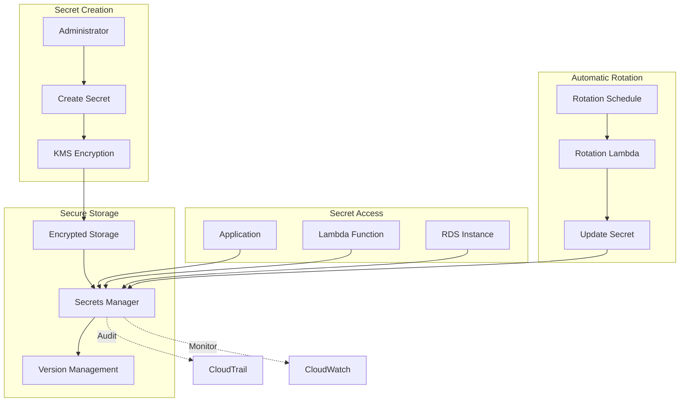

# AWS Secrets Manager - Hands-on Lab

## Prerequisites

- AWS CDK and AWS CLI configured
- Basic understanding of secrets management
- Completed IAM lab

## Lab Overview

This lab demonstrates secure secrets management using AWS Secrets Manager. You'll create secrets, implement automatic rotation, and show how applications can securely retrieve secrets without hardcoding sensitive information.

[DIAGRAM: Secrets Management Flow]



[DIAGRAM: Secrets Manager Implementation]
Instructions for draw.io:

1. Create a new diagram using the AWS Architecture 2023 template
2. Use the following AWS symbols from the symbol pack:
   - AWS Secrets Manager icon
   - AWS KMS icon
   - AWS IAM icon
   - AWS Lambda icon
   - AWS RDS icon
   - AWS CloudWatch icon
3. Layout:
   - Place Secrets Manager at the center
   - Add KMS and IAM on the left
   - Place Lambda functions and RDS on the right
   - Show CloudWatch monitoring below
4. Use AWS's standard connector arrows to show relationships
5. Add secret flow visualization with encryption
6. Use AWS's standard color scheme:
   - Blue for AWS services
   - Green for Secrets Manager components
   - Gray for infrastructure elements

## Lab Steps

### 1. Create Secrets Manager Infrastructure

Create a new file `lib/secrets-manager-stack.ts`:

```typescript:lib/secrets-manager-stack.ts
import * as cdk from 'aws-cdk-lib';
import * as secretsmanager from 'aws-cdk-lib/aws-secretsmanager';
import * as lambda from 'aws-cdk-lib/aws-lambda';
import * as iam from 'aws-cdk-lib/aws-iam';
import * as rds from 'aws-cdk-lib/aws-rds';
import { Construct } from 'constructs';

export class SecretsManagerStack extends cdk.Stack {
  constructor(scope: Construct, id: string, props?: cdk.StackProps) {
    super(scope, id, props);

    // Create a basic secret
    const apiKeySecret = new secretsmanager.Secret(this, 'ApiKeySecret', {
      description: 'API Key for external service',
      generateSecretString: {
        secretStringTemplate: JSON.stringify({ username: 'api-user' }),
        generateStringKey: 'api_key',
        excludeCharacters: '{}[]()\'"/\\',
      },
    });

    // Create a database instance
    const database = new rds.DatabaseInstance(this, 'Database', {
      engine: rds.DatabaseInstanceEngine.mysql({
        version: rds.MysqlEngineVersion.VER_8_0,
      }),
      instanceType: cdk.aws_ec2.InstanceType.of(
        cdk.aws_ec2.InstanceClass.BURSTABLE3,
        cdk.aws_ec2.InstanceSize.MICRO,
      ),
      vpc: new cdk.aws_ec2.Vpc(this, 'VPC', {
        maxAzs: 2,
      }),
      databaseName: 'myapp',
      credentials: rds.Credentials.fromGeneratedSecret('admin'),
      removalPolicy: cdk.RemovalPolicy.DESTROY,
    });

    // Create Lambda function to demonstrate secret access
    const secretsFunction = new lambda.Function(this, 'SecretsFunction', {
      runtime: lambda.Runtime.NODEJS_18_X,
      handler: 'index.handler',
      code: lambda.Code.fromAsset('src/secrets-function'),
      environment: {
        API_SECRET_ARN: apiKeySecret.secretArn,
        DB_SECRET_ARN: database.secret?.secretArn || '',
      },
    });

    // Grant read access to secrets
    apiKeySecret.grantRead(secretsFunction);
    database.secret?.grantRead(secretsFunction);

    // Outputs
    new cdk.CfnOutput(this, 'ApiSecretArn', {
      value: apiKeySecret.secretArn,
    });

    new cdk.CfnOutput(this, 'DbSecretArn', {
      value: database.secret?.secretArn || 'No secret created',
    });

    new cdk.CfnOutput(this, 'FunctionName', {
      value: secretsFunction.functionName,
    });
  }
}
```

### 2. Create Lambda Function

Create a new file `src/secrets-function/index.ts`:

```typescript:src/secrets-function/index.ts
import {
  SecretsManagerClient,
  GetSecretValueCommand
} from '@aws-sdk/client-secrets-manager';

const secretsManager = new SecretsManagerClient({});

export const handler = async (event: any): Promise<any> => {
  try {
    // Get API Key secret
    const apiSecretResponse = await secretsManager.send(
      new GetSecretValueCommand({
        SecretId: process.env.API_SECRET_ARN,
      })
    );

    // Get DB secret
    const dbSecretResponse = await secretsManager.send(
      new GetSecretValueCommand({
        SecretId: process.env.DB_SECRET_ARN,
      })
    );

    const apiSecret = JSON.parse(apiSecretResponse.SecretString || '{}');
    const dbSecret = JSON.parse(dbSecretResponse.SecretString || '{}');

    return {
      statusCode: 200,
      body: JSON.stringify({
        message: 'Secrets retrieved successfully',
        apiUsername: apiSecret.username,
        dbUsername: dbSecret.username,
        // Never log actual secret values in production
      }),
    };
  } catch (error) {
    console.error('Error retrieving secrets:', error);
    throw error;
  }
};
```

### 3. Deploy and Test

1. Deploy the stack:

```bash
cdk deploy SecretsManagerStack --profile your-profile-name
```

2. Create a test script `scripts/test-secrets.ts`:

```typescript:scripts/test-secrets.ts
import { LambdaClient, InvokeCommand } from '@aws-sdk/client-lambda';

const lambda = new LambdaClient({});

async function testSecrets() {
  const functionName = process.env.FUNCTION_NAME;

  try {
    const command = new InvokeCommand({
      FunctionName: functionName,
      Payload: JSON.stringify({}),
    });

    const response = await lambda.send(command);
    const payload = new TextDecoder().decode(response.Payload);
    console.log('Lambda response:', payload);
  } catch (error) {
    console.error('Error invoking Lambda:', error);
  }
}

testSecrets();
```

3. Run the test:

```bash
export FUNCTION_NAME=$(aws cloudformation describe-stacks \
  --stack-name SecretsManagerStack \
  --query 'Stacks[0].Outputs[?OutputKey==`FunctionName`].OutputValue' \
  --output text \
  --profile your-profile-name)

ts-node scripts/test-secrets.ts
```

### 4. Configure Secret Rotation

1. Enable automatic rotation for the API key secret:

```typescript:lib/secrets-manager-stack.ts
// Add to the stack after creating apiKeySecret
const rotationFunction = new lambda.Function(this, 'RotationFunction', {
  runtime: lambda.Runtime.NODEJS_18_X,
  handler: 'index.handler',
  code: lambda.Code.fromAsset('src/rotation-function'),
  environment: {
    SECRET_ARN: apiKeySecret.secretArn,
  },
});

apiKeySecret.addRotationSchedule('RotationSchedule', {
  rotationLambda: rotationFunction,
  automaticallyAfter: cdk.Duration.days(30),
});
```

2. Create rotation function `src/rotation-function/index.ts`:

[DIAGRAM: Secrets Manager Rotation]
Instructions for draw.io:

1. Create a new diagram using the AWS Architecture 2023 template
2. Use the following AWS symbols from the symbol pack:
   - AWS Secrets Manager icon
   - AWS Lambda icon
   - AWS KMS icon
   - AWS CloudWatch icon
3. Layout:
   - Create a flowchart using AWS's standard flowchart shapes
   - Use diamond shapes for decision points
   - Use AWS's standard connector arrows
4. Add process boxes for:
   - Secret Creation
   - Secret Testing
   - Secret Update
   - Rotation Completion
5. Use AWS's standard color scheme for all elements
6. Add clear labels for each step in the flow

## Validation Steps

1. Secret Creation

   - [ ] API key secret created
   - [ ] Database secret created
   - [ ] Secrets visible in AWS Console

2. Secret Access

   - [ ] Lambda function can retrieve secrets
   - [ ] Proper IAM permissions configured
   - [ ] Secret values properly parsed

3. Secret Rotation
   - [ ] Rotation schedule configured
   - [ ] Rotation function deployed
   - [ ] Test rotation manually

## Troubleshooting

1. Secret Access Issues

   - Check IAM roles and policies
   - Verify environment variables
   - Check Lambda execution role
   - Review CloudWatch logs

2. Rotation Issues

   - Check rotation function logs
   - Verify rotation IAM permissions
   - Review rotation status
   - Check rotation schedule

3. Database Connection Issues
   - Verify VPC configuration
   - Check security groups
   - Test database connectivity
   - Review secret format

## Cleanup

Remove the stack:

```bash
cdk destroy SecretsManagerStack --profile your-profile-name
```

Note: Ensure all secrets are no longer in use before cleanup.
