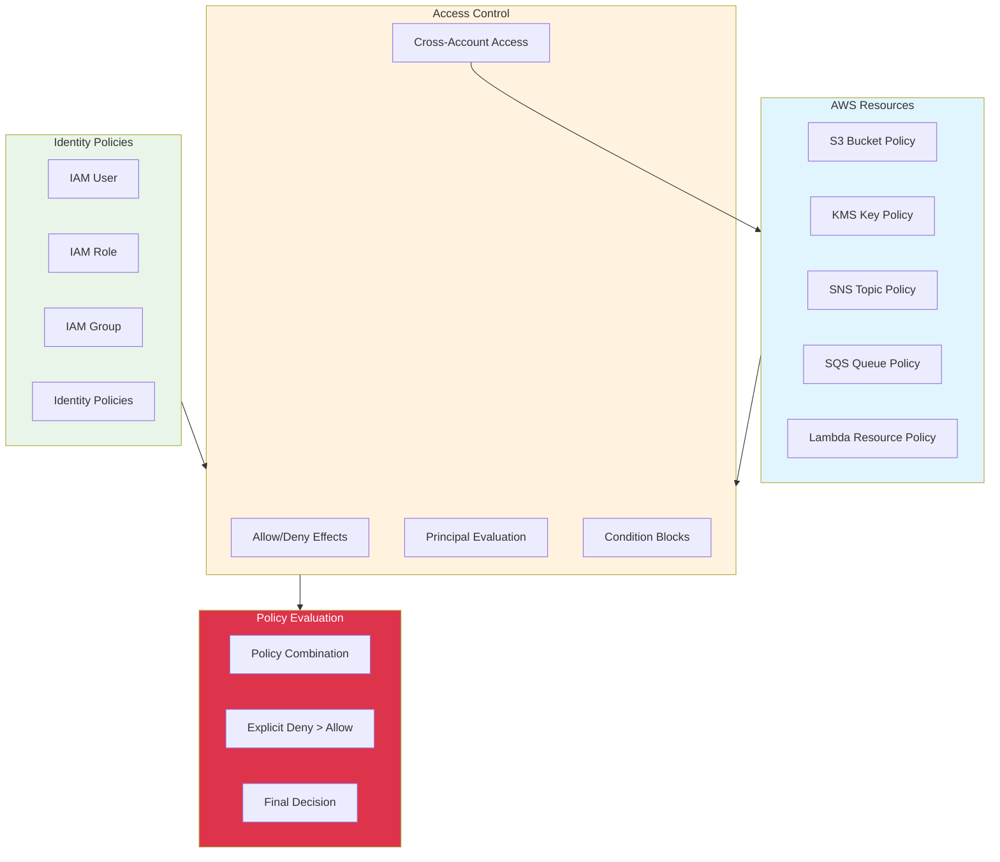

# AWS Resource Policies - Introduction

## Overview

Resource-based policies are IAM policies attached directly to AWS resources, controlling who can access the resource and what actions they can perform. This lab focuses on implementing and managing resource policies across various AWS services, understanding the differences between identity-based and resource-based policies, and applying best practices for secure resource access control.

[DIAGRAM: Resource Policies Architecture]

## Learning Objectives

After completing this lab, you will be able to:

- Understand the difference between identity-based and resource-based policies
- Create and manage resource policies for various AWS services
- Implement cross-account access using resource policies
- Apply principle of least privilege in resource policy design
- Use policy conditions for fine-grained access control
- Troubleshoot resource policy issues
- Monitor and audit resource policy changes

## Core Concepts

### 1. Policy Types and Structure

- **Identity-based vs Resource-based Policies**
  - Identity policies: Attached to IAM users, groups, or roles
  - Resource policies: Attached directly to resources
- **Policy Elements**
  - Effect, Principal, Action, Resource, Condition
  - Policy variables and wildcards
  - Version control and policy size limits

### 2. Common Resource Policy Use Cases

- **S3 Bucket Policies**
  - Public access control
  - Cross-account access
  - VPC endpoint restrictions
- **KMS Key Policies**

  - Key administrators
  - Key users
  - Cross-account key usage

- **SNS/SQS Policies**

  - Message publishing permissions
  - Subscription management
  - Cross-account messaging

- **Lambda Function Policies**
  - Function invocation control
  - Cross-account access
  - Service-to-function permissions

### 3. Cross-Account Access

- **Trust Relationships**

  - Principal specification
  - External ID usage
  - Assuming roles across accounts

- **Permission Boundaries**
  - Limiting delegated permissions
  - Managing access scope
  - Policy evaluation logic

### 4. Security Controls

- **Condition Keys**

  - IP address restrictions
  - VPC endpoint constraints
  - Time-based access
  - MFA requirements

- **Policy Evaluation**
  - Multiple policy evaluation
  - Explicit deny precedence
  - Permission boundaries impact

## Best Practices

### Security

- Follow principle of least privilege
- Use explicit denies where needed
- Implement condition keys for additional security
- Regular policy review and updates
- Use AWS Organizations SCPs for broader controls

### Operations

- Document policy changes
- Use policy versioning
- Implement change control processes
- Regular policy validation
- Monitor policy usage

### Compliance

- Regular compliance reviews
- Audit logging configuration
- Policy documentation
- Access reviews
- Compliance reporting

## Prerequisites

Before starting this lab, ensure you have:

- Completed the IAM lab
- Basic understanding of JSON policy structure
- AWS CDK installed and configured
- AWS CLI installed and configured
- Multiple AWS accounts for cross-account scenarios (optional)

## What's Next

In the hands-on portion of this lab, you will:

1. Create and manage S3 bucket policies
2. Implement KMS key policies
3. Configure SNS/SQS resource policies
4. Set up cross-account access
5. Use policy conditions for access control
6. Monitor and audit policy changes
7. Troubleshoot policy issues
