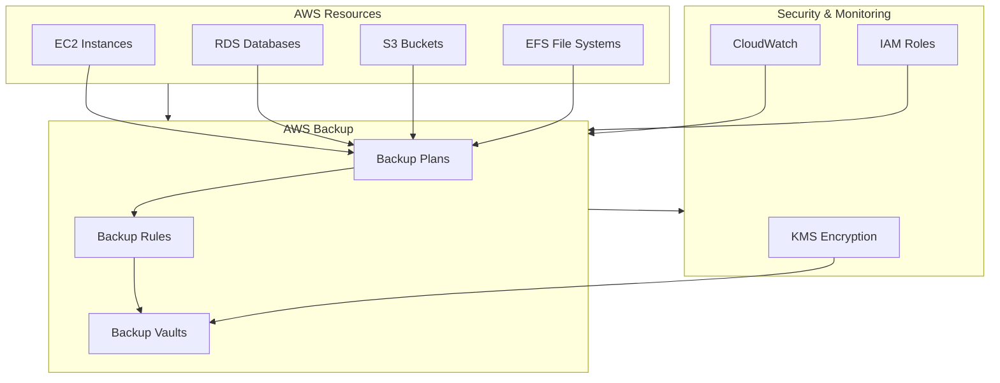

# AWS Backup - Introduction

## Overview

AWS Backup is a fully managed service that makes it easy to centralize and automate data protection across AWS services. This lab will guide you through implementing AWS Backup to protect various AWS resources, configure backup policies, implement backup plans, and manage recovery points.

## AWS Backup Overview

[DIAGRAM: AWS Backup Architecture]

## Learning Objectives

After completing this lab, you will be able to:

- Create and manage backup plans
- Configure backup policies and rules
- Protect different AWS resources using AWS Backup
- Implement backup strategies with different frequencies and retention periods
- Restore resources from backup
- Monitor backup activities and compliance
- Implement cross-region and cross-account backup strategies
- Use AWS Backup Audit Manager

## Core Concepts

### 1. Backup Components

- **Backup Plans**

  - Define backup schedules
  - Specify retention periods
  - Configure lifecycle rules
  - Set backup copy rules

- **Backup Rules**

  - Resource selection
  - Frequency settings
  - Backup windows
  - Lifecycle management

- **Recovery Points**
  - Backup snapshots
  - Continuous backups
  - Point-in-time recovery
  - Cold storage transitions

### 2. Supported Resources

- **Compute**

  - EC2 instances
  - EBS volumes
  - VMware workloads

- **Storage**

  - EFS file systems
  - FSx file systems
  - S3 buckets

- **Database**
  - RDS databases
  - Aurora clusters
  - DynamoDB tables

### 3. Advanced Features

- **Cross-Region Backup**

  - Geographic redundancy
  - Disaster recovery
  - Compliance requirements

- **Cross-Account Backup**

  - Organization-wide backup
  - Centralized management
  - Multi-account strategies

- **Backup Audit Manager**
  - Compliance reporting
  - Control evaluation
  - Framework management

### 4. Security and Compliance

- **Access Control**

  - IAM roles and policies
  - Resource-based policies
  - Service-linked roles

- **Encryption**
  - KMS integration
  - At-rest encryption
  - In-transit encryption

## Best Practices

### Backup Strategy

- Implement appropriate backup frequencies
- Define proper retention periods
- Use tags for resource organization
- Configure lifecycle management
- Implement cross-region copies
- Test recovery procedures

### Security

- Use encryption for all backups
- Implement least privilege access
- Regular access reviews
- Monitor backup activities
- Enable AWS Backup Audit Manager
- Configure AWS Organizations integration

### Operations

- Monitor backup jobs
- Set up notifications
- Regular testing of restores
- Document recovery procedures
- Maintain backup inventory
- Review backup reports

### Cost Management

- Implement lifecycle policies
- Monitor storage usage
- Clean up unused backups
- Use cold storage where appropriate
- Regular cost analysis
- Optimize retention periods

## Prerequisites

Before starting this lab, ensure you have:

- AWS CDK installed and configured
- AWS CLI installed and configured
- Basic understanding of AWS services
- Completed the IAM lab
- Resources to backup (EC2, RDS, etc.)

## What's Next

In the hands-on portion of this lab, you will:

1. Create a backup plan with multiple rules
2. Configure resource selection using tags
3. Implement cross-region backup
4. Set up backup notifications
5. Perform a test restore
6. Monitor backup activities
7. Use AWS Backup Audit Manager
