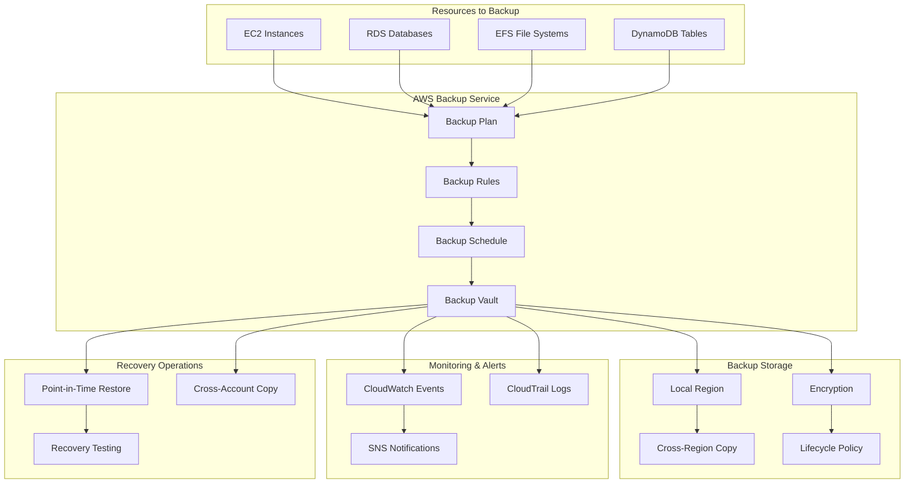

# AWS Backup - Hands-on Lab

## Prerequisites

> Tip: Set the workshop region (Frankfurt)
```bash
export AWS_REGION=eu-central-1
```

> Tip: Set an AWS profile for this shell to avoid repeating profile flags

```bash
export AWS_PROFILE=your-profile-name
```

Before starting this lab, ensure you have:

- AWS CDK and AWS CLI configured
- Resources to backup (EC2, RDS, etc.)
- Completed IAM lab

## Lab Overview

This lab demonstrates automated backup strategies using AWS Backup. You'll create backup plans, configure backup vaults, implement cross-region backup, and set up monitoring and notifications for backup operations.

[DIAGRAM: Backup Operations Flow]



## Lab Steps

### 1. Create AWS Backup Infrastructure

Create a new file `lib/backup-stack.ts`:

```typescript:lib/backup-stack.ts
import * as cdk from 'aws-cdk-lib';
import * as backup from 'aws-cdk-lib/aws-backup';
import * as iam from 'aws-cdk-lib/aws-iam';
import * as kms from 'aws-cdk-lib/aws-kms';
import * as sns from 'aws-cdk-lib/aws-sns';
import * as subscriptions from 'aws-cdk-lib/aws-sns-subscriptions';
import * as events from 'aws-cdk-lib/aws-events';
import * as targets from 'aws-cdk-lib/aws-events-targets';
import * as ec2 from 'aws-cdk-lib/aws-ec2';
import * as rds from 'aws-cdk-lib/aws-rds';
import { Construct } from 'constructs';

export class AwsBackupStack extends cdk.Stack {
  constructor(scope: Construct, id: string, props?: cdk.StackProps) {
    super(scope, id, props);

    // Create KMS key for backup encryption
    const backupKey = new kms.Key(this, 'BackupKey', {
      enableKeyRotation: true,
      description: 'KMS key for AWS Backup encryption',
    });

    // Create SNS topic for backup notifications
    const backupTopic = new sns.Topic(this, 'BackupNotifications', {
      displayName: 'AWS Backup Notifications',
    });

    backupTopic.addSubscription(
      new subscriptions.EmailSubscription('YOUR_EMAIL_ADDRESS') // Replace with your email
    );

    // Create backup vault with encryption
    const backupVault = new backup.BackupVault(this, 'BackupVault', {
      backupVaultName: 'workshop-backup-vault',
      encryptionKey: backupKey,
      notificationTopic: backupTopic,
      notificationEvents: [
        backup.BackupVaultEvents.BACKUP_JOB_STARTED,
        backup.BackupVaultEvents.BACKUP_JOB_COMPLETED,
        backup.BackupVaultEvents.BACKUP_JOB_FAILED,
        backup.BackupVaultEvents.RESTORE_JOB_STARTED,
        backup.BackupVaultEvents.RESTORE_JOB_COMPLETED,
        backup.BackupVaultEvents.RESTORE_JOB_FAILED,
      ],
    });

    // Create cross-region backup vault
    const crossRegionVault = new backup.BackupVault(this, 'CrossRegionVault', {
      backupVaultName: 'workshop-cross-region-vault',
      encryptionKey: backupKey,
    });

    // Create backup plan with multiple rules
    const backupPlan = new backup.BackupPlan(this, 'BackupPlan', {
      backupPlanName: 'workshop-backup-plan',
      backupVault,
    });

    // Daily backup rule
    backupPlan.addRule(new backup.BackupPlanRule({
      ruleName: 'DailyBackups',
      scheduleExpression: events.Schedule.cron({
        hour: '2',
        minute: '0',
      }),
      startWindow: cdk.Duration.hours(1),
      completionWindow: cdk.Duration.hours(2),
      deleteAfter: cdk.Duration.days(30),
      moveToColdStorageAfter: cdk.Duration.days(7),
      copyActions: [
        {
          destinationBackupVault: crossRegionVault,
          deleteAfter: cdk.Duration.days(14),
          moveToColdStorageAfter: cdk.Duration.days(3),
        },
      ],
    }));

    // Weekly backup rule with longer retention
    backupPlan.addRule(new backup.BackupPlanRule({
      ruleName: 'WeeklyBackups',
      scheduleExpression: events.Schedule.cron({
        weekDay: 'SUN',
        hour: '3',
        minute: '0',
      }),
      startWindow: cdk.Duration.hours(2),
      completionWindow: cdk.Duration.hours(4),
      deleteAfter: cdk.Duration.days(365),
      moveToColdStorageAfter: cdk.Duration.days(30),
    }));

    // Create sample resources to backup
    const vpc = new ec2.Vpc(this, 'BackupVpc', {
      maxAzs: 2,
    });

    const instance = new ec2.Instance(this, 'BackupInstance', {
      vpc,
      instanceType: ec2.InstanceType.of(
        ec2.InstanceClass.T3,
        ec2.InstanceSize.MICRO
      ),
      machineImage: ec2.MachineImage.latestAmazonLinux2023(),
      vpcSubnets: {
        subnetType: ec2.SubnetType.PUBLIC,
      },
    });

    // Tag instance for backup selection
    cdk.Tags.of(instance).add('BackupEnabled', 'true');

    const database = new rds.DatabaseInstance(this, 'BackupDatabase', {
      engine: rds.DatabaseInstanceEngine.mysql({
        version: rds.MysqlEngineVersion.VER_8_0,
      }),
      instanceType: ec2.InstanceType.of(
        ec2.InstanceClass.BURSTABLE3,
        ec2.InstanceSize.MICRO,
      ),
      vpc,
      credentials: rds.Credentials.fromGeneratedSecret('admin'),
      removalPolicy: cdk.RemovalPolicy.DESTROY,
    });

    // Tag database for backup selection
    cdk.Tags.of(database).add('BackupEnabled', 'true');

    // Create backup selection using tags
    backupPlan.addSelection('ResourceSelection', {
      selectionName: 'tagged-resources',
      resources: [
        backup.BackupResource.fromTag('BackupEnabled', 'true'),
      ],
      allowRestores: true,
    });

    // Create EventBridge rules for backup monitoring
    const backupJobFailedRule = new events.Rule(this, 'BackupJobFailedRule', {
      description: 'Monitor for failed backup jobs',
      eventPattern: {
        source: ['aws.backup'],
        detailType: ['Backup Job State Change'],
        detail: {
          state: ['FAILED', 'ABORTED'],
        },
      },
    });

    backupJobFailedRule.addTarget(new targets.SnsTopic(backupTopic));

    const restoreJobCompletedRule = new events.Rule(this, 'RestoreJobCompletedRule', {
      description: 'Monitor for completed restore jobs',
      eventPattern: {
        source: ['aws.backup'],
        detailType: ['Restore Job State Change'],
        detail: {
          state: ['COMPLETED'],
        },
      },
    });

    restoreJobCompletedRule.addTarget(new targets.SnsTopic(backupTopic));

    // Outputs
    new cdk.CfnOutput(this, 'BackupVaultName', {
      value: backupVault.backupVaultName,
    });

    new cdk.CfnOutput(this, 'BackupPlanId', {
      value: backupPlan.backupPlanId,
    });

    new cdk.CfnOutput(this, 'InstanceId', {
      value: instance.instanceId,
    });

    new cdk.CfnOutput(this, 'DatabaseIdentifier', {
      value: database.instanceIdentifier,
    });

    new cdk.CfnOutput(this, 'NotificationTopicArn', {
      value: backupTopic.topicArn,
    });
  }
}
```

### 2. Create Test Scripts

1. Create a script to monitor backup jobs:

```typescript:scripts/monitor-backups.ts
import {
  BackupClient,
  ListBackupJobsCommand,
  DescribeBackupJobCommand
} from '@aws-sdk/client-backup';

const backup = new BackupClient({});

async function monitorBackups() {
  try {
    // List recent backup jobs
    const response = await backup.send(new ListBackupJobsCommand({
      ByCreationDateAfter: new Date(Date.now() - 24 * 60 * 60 * 1000), // Last 24 hours
    }));

    console.log('Recent backup jobs:');
    for (const job of response.BackupJobs || []) {
      console.log(`
        Job ID: ${job.BackupJobId}
        Resource: ${job.ResourceArn}
        State: ${job.State}
        Created: ${job.CreationDate}
        Completed: ${job.CompletionDate}
        Size: ${job.BackupSizeInBytes} bytes
      `);

      // Get detailed job information
      if (job.BackupJobId) {
        const details = await backup.send(new DescribeBackupJobCommand({
          BackupJobId: job.BackupJobId,
        }));

        if (details.BackupJobId) {
          console.log(`  Progress: ${details.PercentDone}%`);
          if (details.StatusMessage) {
            console.log(`  Status: ${details.StatusMessage}`);
          }
        }
      }
    }
  } catch (error) {
    console.error('Error monitoring backups:', error);
  }
}

monitorBackups();
```

2. Create a script to test restore operations:

```typescript:scripts/test-restore.ts
import {
  BackupClient,
  ListRecoveryPointsCommand,
  StartRestoreJobCommand
} from '@aws-sdk/client-backup';

const backup = new BackupClient({});

async function testRestore() {
  const backupVaultName = process.env.BACKUP_VAULT_NAME;

  try {
    // List available recovery points
    const response = await backup.send(new ListRecoveryPointsCommand({
      BackupVaultName: backupVaultName,
    }));

    if (!response.RecoveryPoints?.length) {
      console.log('No recovery points found');
      return;
    }

    const latestRecoveryPoint = response.RecoveryPoints[0];
    console.log(`Found recovery point: ${latestRecoveryPoint.RecoveryPointArn}`);

    // Note: In a real scenario, you would specify proper restore parameters
    console.log('Recovery point details:');
    console.log(`  Created: ${latestRecoveryPoint.CreationDate}`);
    console.log(`  Resource: ${latestRecoveryPoint.ResourceArn}`);
    console.log(`  Size: ${latestRecoveryPoint.BackupSizeInBytes} bytes`);
    console.log(`  Status: ${latestRecoveryPoint.Status}`);

    // Restore job would be started here in a real scenario
    console.log('To start a restore job, use AWS Console or specify restore parameters');

  } catch (error) {
    console.error('Error testing restore:', error);
  }
}

testRestore();
```

### 3. Deploy and Test

1. Deploy the stack:

```bash
cdk deploy AwsBackupStack
```

2. Set environment variables:

```bash
export BACKUP_VAULT_NAME=$(aws cloudformation describe-stacks \
  --stack-name AwsBackupStack \
  --query 'Stacks[0].Outputs[?OutputKey==`BackupVaultName`].OutputValue' \
  --output text \
 )

export BACKUP_PLAN_ID=$(aws cloudformation describe-stacks \
  --stack-name AwsBackupStack \
  --query 'Stacks[0].Outputs[?OutputKey==`BackupPlanId`].OutputValue' \
  --output text \
 )
```

3. Test the backup system:

```bash
# Monitor backup jobs
ts-node scripts/monitor-backups.ts

# Check backup plan
aws backup get-backup-plan \
  --backup-plan-id $BACKUP_PLAN_ID \


# List recovery points
aws backup list-recovery-points \
  --backup-vault-name $BACKUP_VAULT_NAME \


# Test restore (list available points)
ts-node scripts/test-restore.ts
```

## Validation Steps

1. Backup Configuration

   - [ ] Backup plan created successfully
   - [ ] Backup vault configured with encryption
   - [ ] Resource selection working
   - [ ] Cross-region backup configured

2. Backup Operations

   - [ ] Scheduled backups running
   - [ ] Backup jobs completing successfully
   - [ ] Recovery points created
   - [ ] Lifecycle policies working

3. Monitoring and Notifications
   - [ ] SNS notifications working
   - [ ] EventBridge rules triggering
   - [ ] CloudWatch integration active
   - [ ] Backup job monitoring functional

## Troubleshooting

1. Backup Issues

   - Check IAM service roles
   - Verify backup vault permissions
   - Review backup plan configuration
   - Check resource tags

2. Notification Issues

   - Verify SNS topic subscriptions
   - Check EventBridge rule patterns
   - Review notification settings
   - Test topic permissions

3. Cross-Region Issues
   - Verify destination vault exists
   - Check cross-region permissions
   - Review KMS key policies
   - Monitor copy jobs

## Cleanup

When you're finished with this lab:

```bash
# Stop all backup jobs (if any are running)
aws backup list-backup-jobs \
  --by-state RUNNING \
  --query 'BackupJobs[].BackupJobId' \
  --output table \


# Delete recovery points (optional - they have retention policies)
aws backup list-recovery-points \
  --backup-vault-name $BACKUP_VAULT_NAME \
  --query 'RecoveryPoints[].RecoveryPointArn' \
  --output table \


# Destroy the CDK stack
cdk destroy AwsBackupStack
```

Note: Recovery points may need to be manually deleted if you want immediate cleanup, as they follow retention policies.
