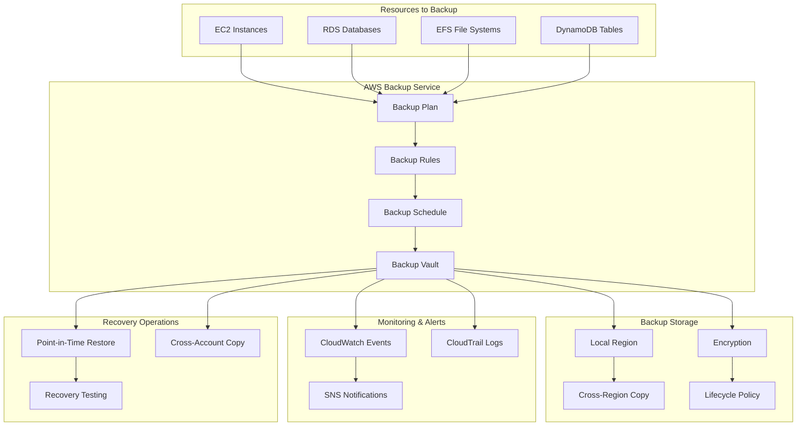

# AWS Backup - Hands-on Lab

## Prerequisites

Before starting this lab, ensure you have:

- AWS CDK and AWS CLI configured
- Resources to backup (EC2, RDS, etc.)
- Completed IAM lab

## Lab Overview

This lab demonstrates automated backup strategies using AWS Backup. You'll create backup plans, configure backup vaults, implement cross-region backup, and set up monitoring and notifications for backup operations.

[DIAGRAM: Backup Operations Flow]



## Prerequisites

Before starting this lab, ensure you have:

- AWS CDK and AWS CLI configured
- Resources to backup (EC2, RDS, etc.)
- Completed IAM lab

## Lab Overview

This lab demonstrates automated backup strategies using AWS Backup. You'll create backup plans, configure backup vaults, implement cross-region backup, and set up monitoring and notifications for backup operations.

[DIAGRAM: Backup Operations Flow]


## Prerequisites

Before starting this lab, ensure you have:

- AWS CDK and AWS CLI configured
- Resources to backup (EC2, RDS, etc.)
- Completed IAM lab

## Lab Overview

This lab demonstrates automated backup strategies using AWS Backup. You'll create backup plans, configure backup vaults, implement cross-region backup, and set up monitoring and notifications for backup operations.

[DIAGRAM: Backup Operations Flow]


## Prerequisites

Before starting this lab, ensure you have:

- AWS CDK and AWS CLI configured
- Resources to backup (EC2, RDS, etc.)
- Completed IAM lab

## Lab Overview

This lab demonstrates automated backup strategies using AWS Backup. You'll create backup plans, configure backup vaults, implement cross-region backup, and set up monitoring and notifications for backup operations.

[DIAGRAM: Backup Operations Flow]


## Prerequisites

Before starting this lab, ensure you have:

- AWS CDK and AWS CLI configured
- Resources to backup (EC2, RDS, etc.)
- Completed IAM lab

## Lab Overview

This lab demonstrates automated backup strategies using AWS Backup. You'll create backup plans, configure backup vaults, implement cross-region backup, and set up monitoring and notifications for backup operations.

[DIAGRAM: Backup Operations Flow]


## Prerequisites

Before starting this lab, ensure you have:

- AWS CDK and AWS CLI configured
- Resources to backup (EC2, RDS, etc.)
- Completed IAM lab

## Lab Overview

This lab demonstrates automated backup strategies using AWS Backup. You'll create backup plans, configure backup vaults, implement cross-region backup, and set up monitoring and notifications for backup operations.

[DIAGRAM: Backup Operations Flow]


## Prerequisites

Before starting this lab, ensure you have:

- AWS CDK and AWS CLI configured
- Resources to backup (EC2, RDS, etc.)
- Completed IAM lab

## Lab Overview

This lab demonstrates automated backup strategies using AWS Backup. You'll create backup plans, configure backup vaults, implement cross-region backup, and set up monitoring and notifications for backup operations.

[DIAGRAM: Backup Operations Flow]


## Prerequisites

Before starting this lab, ensure you have:

- AWS CDK and AWS CLI configured
- Resources to backup (EC2, RDS, etc.)
- Completed IAM lab

## Lab Overview

This lab demonstrates automated backup strategies using AWS Backup. You'll create backup plans, configure backup vaults, implement cross-region backup, and set up monitoring and notifications for backup operations.

[DIAGRAM: Backup Operations Flow]


## Prerequisites

Before starting this lab, ensure you have:

- AWS CDK and AWS CLI configured
- Resources to backup (EC2, RDS, etc.)
- Completed IAM lab

## Lab Overview

This lab demonstrates automated backup strategies using AWS Backup. You'll create backup plans, configure backup vaults, implement cross-region backup, and set up monitoring and notifications for backup operations.

[DIAGRAM: Backup Operations Flow]


## Prerequisites

Before starting this lab, ensure you have:

- AWS CDK and AWS CLI configured
- Resources to backup (EC2, RDS, etc.)
- Completed IAM lab

## Lab Overview

This lab demonstrates automated backup strategies using AWS Backup. You'll create backup plans, configure backup vaults, implement cross-region backup, and set up monitoring and notifications for backup operations.

[DIAGRAM: Backup Operations Flow]


## Prerequisites

Before starting this lab, ensure you have:

- AWS CDK and AWS CLI configured
- Resources to backup (EC2, RDS, etc.)
- Completed IAM lab

## Lab Overview

This lab demonstrates automated backup strategies using AWS Backup. You'll create backup plans, configure backup vaults, implement cross-region backup, and set up monitoring and notifications for backup operations.

[DIAGRAM: Backup Operations Flow]


## Prerequisites

Before starting this lab, ensure you have:

- AWS CDK and AWS CLI configured
- Resources to backup (EC2, RDS, etc.)
- Completed IAM lab

## Lab Overview

This lab demonstrates automated backup strategies using AWS Backup. You'll create backup plans, configure backup vaults, implement cross-region backup, and set up monitoring and notifications for backup operations.

[DIAGRAM: Backup Operations Flow]


## Prerequisites

Before starting this lab, ensure you have:

- AWS CDK and AWS CLI configured
- Resources to backup (EC2, RDS, etc.)
- Completed IAM lab

## Lab Overview

This lab demonstrates automated backup strategies using AWS Backup. You'll create backup plans, configure backup vaults, implement cross-region backup, and set up monitoring and notifications for backup operations.

[DIAGRAM: Backup Operations Flow]


## Prerequisites

Before starting this lab, ensure you have:

- AWS CDK and AWS CLI configured
- Resources to backup (EC2, RDS, etc.)
- Completed IAM lab

## Lab Overview

This lab demonstrates automated backup strategies using AWS Backup. You'll create backup plans, configure backup vaults, implement cross-region backup, and set up monitoring and notifications for backup operations.

[DIAGRAM: Backup Operations Flow]


## Prerequisites

Before starting this lab, ensure you have:

- AWS CDK and AWS CLI configured
- Resources to backup (EC2, RDS, etc.)
- Completed IAM lab

## Lab Overview

This lab demonstrates automated backup strategies using AWS Backup. You'll create backup plans, configure backup vaults, implement cross-region backup, and set up monitoring and notifications for backup operations.

[DIAGRAM: Backup Operations Flow]


## Prerequisites

Before starting this lab, ensure you have:

- AWS CDK and AWS CLI configured
- Resources to backup (EC2, RDS, etc.)
- Completed IAM lab

## Lab Overview

This lab demonstrates automated backup strategies using AWS Backup. You'll create backup plans, configure backup vaults, implement cross-region backup, and set up monitoring and notifications for backup operations.

[DIAGRAM: Backup Operations Flow]


## Prerequisites

Before starting this lab, ensure you have:

- AWS CDK and AWS CLI configured
- Resources to backup (EC2, RDS, etc.)
- Completed IAM lab

## Lab Overview

This lab demonstrates automated backup strategies using AWS Backup. You'll create backup plans, configure backup vaults, implement cross-region backup, and set up monitoring and notifications for backup operations.

[DIAGRAM: Backup Operations Flow]


## Prerequisites

Before starting this lab, ensure you have:

- AWS CDK and AWS CLI configured
- Resources to backup (EC2, RDS, etc.)
- Completed IAM lab

## Lab Overview

This lab demonstrates automated backup strategies using AWS Backup. You'll create backup plans, configure backup vaults, implement cross-region backup, and set up monitoring and notifications for backup operations.

[DIAGRAM: Backup Operations Flow]


## Prerequisites

Before starting this lab, ensure you have:

- AWS CDK and AWS CLI configured
- Resources to backup (EC2, RDS, etc.)
- Completed IAM lab

## Lab Overview

This lab demonstrates automated backup strategies using AWS Backup. You'll create backup plans, configure backup vaults, implement cross-region backup, and set up monitoring and notifications for backup operations.

[DIAGRAM: Backup Operations Flow]


## Prerequisites

Before starting this lab, ensure you have:

- AWS CDK and AWS CLI configured
- Resources to backup (EC2, RDS, etc.)
- Completed IAM lab

## Lab Overview

This lab demonstrates automated backup strategies using AWS Backup. You'll create backup plans, configure backup vaults, implement cross-region backup, and set up monitoring and notifications for backup operations.

[DIAGRAM: Backup Operations Flow]


## Prerequisites

Before starting this lab, ensure you have:

- AWS CDK and AWS CLI configured
- Resources to backup (EC2, RDS, etc.)
- Completed IAM lab

## Lab Overview

This lab demonstrates automated backup strategies using AWS Backup. You'll create backup plans, configure backup vaults, implement cross-region backup, and set up monitoring and notifications for backup operations.

[DIAGRAM: Backup Operations Flow]

```mermaid
flowchart TD
    subgraph Resources["Resources to Backup"]
        EC2[EC2 Instances]
        RDS[RDS Databases]
        EFS[EFS File Systems]
        DDB[DynamoDB Tables]
    end

    subgraph Backup["AWS Backup Service"]
        PLAN[Backup Plan]
        VAULT[Backup Vault]
        RULE[Backup Rules]
        SCHEDULE[Backup Schedule]
    end

    subgraph Storage["Backup Storage"]
        LOCAL[Local Region]
        CROSS[Cross-Region Copy]
        ENCRYPT[Encryption]
        LIFECYCLE[Lifecycle Policy]
    end

    subgraph Monitoring["Monitoring & Alerts"]
        CW[CloudWatch Events]
        SNS[SNS Notifications]
        LOGS[CloudTrail Logs]
    end

    subgraph Recovery["Recovery Operations"]
        RESTORE[Point-in-Time Restore]
        CLONE[Cross-Account Copy]
        TEST[Recovery Testing]
    end

    EC2 --> PLAN
    RDS --> PLAN
    EFS --> PLAN
    DDB --> PLAN

    PLAN --> RULE
    RULE --> SCHEDULE
    SCHEDULE --> VAULT

    VAULT --> LOCAL
    LOCAL --> CROSS
    VAULT --> ENCRYPT
    ENCRYPT --> LIFECYCLE

    VAULT --> CW
    CW --> SNS
    VAULT --> LOGS

    VAULT --> RESTORE
    VAULT --> CLONE
    RESTORE --> TEST
```

## Prerequisites

Before starting this lab, ensure you have:

- AWS CDK and AWS CLI configured
- Resources to backup (EC2, RDS, etc.)
- Completed IAM lab

## Lab Overview

This lab demonstrates automated backup strategies using AWS Backup. You'll create backup plans, configure backup vaults, implement cross-region backup, and set up monitoring and notifications for backup operations.

[DIAGRAM: Backup Operations Flow]

```mermaid
flowchart TD
    subgraph Resources["Resources to Backup"]
        EC2[EC2 Instances]
        RDS[RDS Databases]
        EFS[EFS File Systems]
        DDB[DynamoDB Tables]
    end

    subgraph Backup["AWS Backup Service"]
        PLAN[Backup Plan]
        VAULT[Backup Vault]
        RULE[Backup Rules]
        SCHEDULE[Backup Schedule]
    end

    subgraph Storage["Backup Storage"]
        LOCAL[Local Region]
        CROSS[Cross-Region Copy]
        ENCRYPT[Encryption]
        LIFECYCLE[Lifecycle Policy]
    end

    subgraph Monitoring["Monitoring & Alerts"]
        CW[CloudWatch Events]
        SNS[SNS Notifications]
        LOGS[CloudTrail Logs]
    end

    subgraph Recovery["Recovery Operations"]
        RESTORE[Point-in-Time Restore]
        CLONE[Cross-Account Copy]
        TEST[Recovery Testing]
    end

    EC2 --> PLAN
    RDS --> PLAN
    EFS --> PLAN
    DDB --> PLAN

    PLAN --> RULE
    RULE --> SCHEDULE
    SCHEDULE --> VAULT

    VAULT --> LOCAL
    LOCAL --> CROSS
    VAULT --> ENCRYPT
    ENCRYPT --> LIFECYCLE

    VAULT --> CW
    CW --> SNS
    VAULT --> LOGS

    VAULT --> RESTORE
    VAULT --> CLONE
    RESTORE --> TEST
```

## Prerequisites

Before starting this lab, ensure you have:

- AWS CDK and AWS CLI configured
- Resources to backup (EC2, RDS, etc.)
- Completed IAM lab

## Lab Overview

This lab demonstrates automated backup strategies using AWS Backup. You'll create backup plans, configure backup vaults, implement cross-region backup, and set up monitoring and notifications for backup operations.

[DIAGRAM: Backup Operations Flow]

```mermaid
flowchart TD
    subgraph Resources["Resources to Backup"]
        EC2[EC2 Instances]
        RDS[RDS Databases]
        EFS[EFS File Systems]
        DDB[DynamoDB Tables]
    end

    subgraph Backup["AWS Backup Service"]
        PLAN[Backup Plan]
        VAULT[Backup Vault]
        RULE[Backup Rules]
        SCHEDULE[Backup Schedule]
    end

    subgraph Storage["Backup Storage"]
        LOCAL[Local Region]
        CROSS[Cross-Region Copy]
        ENCRYPT[Encryption]
        LIFECYCLE[Lifecycle Policy]
    end

    subgraph Monitoring["Monitoring & Alerts"]
        CW[CloudWatch Events]
        SNS[SNS Notifications]
        LOGS[CloudTrail Logs]
    end

    subgraph Recovery["Recovery Operations"]
        RESTORE[Point-in-Time Restore]
        CLONE[Cross-Account Copy]
        TEST[Recovery Testing]
    end

    EC2 --> PLAN
    RDS --> PLAN
    EFS --> PLAN
    DDB --> PLAN

    PLAN --> RULE
    RULE --> SCHEDULE
    SCHEDULE --> VAULT

    VAULT --> LOCAL
    LOCAL --> CROSS
    VAULT --> ENCRYPT
    ENCRYPT --> LIFECYCLE

    VAULT --> CW
    CW --> SNS
    VAULT --> LOGS

    VAULT --> RESTORE
    VAULT --> CLONE
    RESTORE --> TEST
```

## Prerequisites

Before starting this lab, ensure you have:

- AWS CDK and AWS CLI configured
- Resources to backup (EC2, RDS, etc.)
- Completed IAM lab

## Lab Overview

This lab demonstrates automated backup strategies using AWS Backup. You'll create backup plans, configure backup vaults, implement cross-region backup, and set up monitoring and notifications for backup operations.

[DIAGRAM: Backup Operations Flow]

```mermaid
flowchart TD
    subgraph Resources["Resources to Backup"]
        EC2[EC2 Instances]
        RDS[RDS Databases]
        EFS[EFS File Systems]
        DDB[DynamoDB Tables]
    end

    subgraph Backup["AWS Backup Service"]
        PLAN[Backup Plan]
        VAULT[Backup Vault]
        RULE[Backup Rules]
        SCHEDULE[Backup Schedule]
    end

    subgraph Storage["Backup Storage"]
        LOCAL[Local Region]
        CROSS[Cross-Region Copy]
        ENCRYPT[Encryption]
        LIFECYCLE[Lifecycle Policy]
    end

    subgraph Monitoring["Monitoring & Alerts"]
        CW[CloudWatch Events]
        SNS[SNS Notifications]
        LOGS[CloudTrail Logs]
    end

    subgraph Recovery["Recovery Operations"]
        RESTORE[Point-in-Time Restore]
        CLONE[Cross-Account Copy]
        TEST[Recovery Testing]
    end

    EC2 --> PLAN
    RDS --> PLAN
    EFS --> PLAN
    DDB --> PLAN

    PLAN --> RULE
    RULE --> SCHEDULE
    SCHEDULE --> VAULT

    VAULT --> LOCAL
    LOCAL --> CROSS
    VAULT --> ENCRYPT
    ENCRYPT --> LIFECYCLE

    VAULT --> CW
    CW --> SNS
    VAULT --> LOGS

    VAULT --> RESTORE
    VAULT --> CLONE
    RESTORE --> TEST
```

## Prerequisites

Before starting this lab, ensure you have:

- AWS CDK and AWS CLI configured
- Resources to backup (EC2, RDS, etc.)
- Completed IAM lab

## Lab Overview

This lab demonstrates automated backup strategies using AWS Backup. You'll create backup plans, configure backup vaults, implement cross-region backup, and set up monitoring and notifications for backup operations.

[DIAGRAM: Backup Operations Flow]

```mermaid
flowchart TD
    subgraph Resources["Resources to Backup"]
        EC2[EC2 Instances]
        RDS[RDS Databases]
        EFS[EFS File Systems]
        DDB[DynamoDB Tables]
    end

    subgraph Backup["AWS Backup Service"]
        PLAN[Backup Plan]
        VAULT[Backup Vault]
        RULE[Backup Rules]
        SCHEDULE[Backup Schedule]
    end

    subgraph Storage["Backup Storage"]
        LOCAL[Local Region]
        CROSS[Cross-Region Copy]
        ENCRYPT[Encryption]
        LIFECYCLE[Lifecycle Policy]
    end

    subgraph Monitoring["Monitoring & Alerts"]
        CW[CloudWatch Events]
        SNS[SNS Notifications]
        LOGS[CloudTrail Logs]
    end

    subgraph Recovery["Recovery Operations"]
        RESTORE[Point-in-Time Restore]
        CLONE[Cross-Account Copy]
        TEST[Recovery Testing]
    end

    EC2 --> PLAN
    RDS --> PLAN
    EFS --> PLAN
    DDB --> PLAN

    PLAN --> RULE
    RULE --> SCHEDULE
    SCHEDULE --> VAULT

    VAULT --> LOCAL
    LOCAL --> CROSS
    VAULT --> ENCRYPT
    ENCRYPT --> LIFECYCLE

    VAULT --> CW
    CW --> SNS
    VAULT --> LOGS

    VAULT --> RESTORE
    VAULT --> CLONE
    RESTORE --> TEST
```

## Prerequisites

Before starting this lab, ensure you have:

- AWS CDK and AWS CLI configured
- Resources to backup (EC2, RDS, etc.)
- Completed IAM lab

## Lab Overview

This lab demonstrates automated backup strategies using AWS Backup. You'll create backup plans, configure backup vaults, implement cross-region backup, and set up monitoring and notifications for backup operations.

[DIAGRAM: Backup Operations Flow]

```mermaid
flowchart TD
    subgraph Resources["Resources to Backup"]
        EC2[EC2 Instances]
        RDS[RDS Databases]
        EFS[EFS File Systems]
        DDB[DynamoDB Tables]
    end

    subgraph Backup["AWS Backup Service"]
        PLAN[Backup Plan]
        VAULT[Backup Vault]
        RULE[Backup Rules]
        SCHEDULE[Backup Schedule]
    end

    subgraph Storage["Backup Storage"]
        LOCAL[Local Region]
        CROSS[Cross-Region Copy]
        ENCRYPT[Encryption]
        LIFECYCLE[Lifecycle Policy]
    end

    subgraph Monitoring["Monitoring & Alerts"]
        CW[CloudWatch Events]
        SNS[SNS Notifications]
        LOGS[CloudTrail Logs]
    end

    subgraph Recovery["Recovery Operations"]
        RESTORE[Point-in-Time Restore]
        CLONE[Cross-Account Copy]
        TEST[Recovery Testing]
    end

    EC2 --> PLAN
    RDS --> PLAN
    EFS --> PLAN
    DDB --> PLAN

    PLAN --> RULE
    RULE --> SCHEDULE
    SCHEDULE --> VAULT

    VAULT --> LOCAL
    LOCAL --> CROSS
    VAULT --> ENCRYPT
    ENCRYPT --> LIFECYCLE

    VAULT --> CW
    CW --> SNS
    VAULT --> LOGS

    VAULT --> RESTORE
    VAULT --> CLONE
    RESTORE --> TEST
```

## Prerequisites

Before starting this lab, ensure you have:

- AWS CDK and AWS CLI configured
- Resources to backup (EC2, RDS, etc.)
- Completed IAM lab

## Lab Overview

This lab demonstrates automated backup strategies using AWS Backup. You'll create backup plans, configure backup vaults, implement cross-region backup, and set up monitoring and notifications for backup operations.

[DIAGRAM: Backup Operations Flow]

```mermaid
flowchart TD
    subgraph Resources["Resources to Backup"]
        EC2[EC2 Instances]
        RDS[RDS Databases]
        EFS[EFS File Systems]
        DDB[DynamoDB Tables]
    end

    subgraph Backup["AWS Backup Service"]
        PLAN[Backup Plan]
        VAULT[Backup Vault]
        RULE[Backup Rules]
        SCHEDULE[Backup Schedule]
    end

    subgraph Storage["Backup Storage"]
        LOCAL[Local Region]
        CROSS[Cross-Region Copy]
        ENCRYPT[Encryption]
        LIFECYCLE[Lifecycle Policy]
    end

    subgraph Monitoring["Monitoring & Alerts"]
        CW[CloudWatch Events]
        SNS[SNS Notifications]
        LOGS[CloudTrail Logs]
    end

    subgraph Recovery["Recovery Operations"]
        RESTORE[Point-in-Time Restore]
        CLONE[Cross-Account Copy]
        TEST[Recovery Testing]
    end

    EC2 --> PLAN
    RDS --> PLAN
    EFS --> PLAN
    DDB --> PLAN

    PLAN --> RULE
    RULE --> SCHEDULE
    SCHEDULE --> VAULT

    VAULT --> LOCAL
    LOCAL --> CROSS
    VAULT --> ENCRYPT
    ENCRYPT --> LIFECYCLE

    VAULT --> CW
    CW --> SNS
    VAULT --> LOGS

    VAULT --> RESTORE
    VAULT --> CLONE
    RESTORE --> TEST
```

## Prerequisites

Before starting this lab, ensure you have:

- AWS CDK and AWS CLI configured
- Resources to backup (EC2, RDS, etc.)
- Completed IAM lab

## Lab Overview

This lab demonstrates automated backup strategies using AWS Backup. You'll create backup plans, configure backup vaults, implement cross-region backup, and set up monitoring and notifications for backup operations.

[DIAGRAM: Backup Operations Flow]

```mermaid
flowchart TD
    subgraph Resources["Resources to Backup"]
        EC2[EC2 Instances]
        RDS[RDS Databases]
        EFS[EFS File Systems]
        DDB[DynamoDB Tables]
    end

    subgraph Backup["AWS Backup Service"]
        PLAN[Backup Plan]
        VAULT[Backup Vault]
        RULE[Backup Rules]
        SCHEDULE[Backup Schedule]
    end

    subgraph Storage["Backup Storage"]
        LOCAL[Local Region]
        CROSS[Cross-Region Copy]
        ENCRYPT[Encryption]
        LIFECYCLE[Lifecycle Policy]
    end

    subgraph Monitoring["Monitoring & Alerts"]
        CW[CloudWatch Events]
        SNS[SNS Notifications]
        LOGS[CloudTrail Logs]
    end

    subgraph Recovery["Recovery Operations"]
        RESTORE[Point-in-Time Restore]
        CLONE[Cross-Account Copy]
        TEST[Recovery Testing]
    end

    EC2 --> PLAN
    RDS --> PLAN
    EFS --> PLAN
    DDB --> PLAN

    PLAN --> RULE
    RULE --> SCHEDULE
    SCHEDULE --> VAULT

    VAULT --> LOCAL
    LOCAL --> CROSS
    VAULT --> ENCRYPT
    ENCRYPT --> LIFECYCLE

    VAULT --> CW
    CW --> SNS
    VAULT --> LOGS

    VAULT --> RESTORE
    VAULT --> CLONE
    RESTORE --> TEST
```

## Prerequisites

Before starting this lab, ensure you have:

- AWS CDK and AWS CLI configured
- Resources to backup (EC2, RDS, etc.)
- Completed IAM lab

## Lab Overview

This lab demonstrates automated backup strategies using AWS Backup. You'll create backup plans, configure backup vaults, implement cross-region backup, and set up monitoring and notifications for backup operations.

[DIAGRAM: Backup Operations Flow]

```mermaid
flowchart TD
    subgraph Resources["Resources to Backup"]
        EC2[EC2 Instances]
        RDS[RDS Databases]
        EFS[EFS File Systems]
        DDB[DynamoDB Tables]
    end

    subgraph Backup["AWS Backup Service"]
        PLAN[Backup Plan]
        VAULT[Backup Vault]
        RULE[Backup Rules]
        SCHEDULE[Backup Schedule]
    end

    subgraph Storage["Backup Storage"]
        LOCAL[Local Region]
        CROSS[Cross-Region Copy]
        ENCRYPT[Encryption]
        LIFECYCLE[Lifecycle Policy]
    end

    subgraph Monitoring["Monitoring & Alerts"]
        CW[CloudWatch Events]
        SNS[SNS Notifications]
        LOGS[CloudTrail Logs]
    end

    subgraph Recovery["Recovery Operations"]
        RESTORE[Point-in-Time Restore]
        CLONE[Cross-Account Copy]
        TEST[Recovery Testing]
    end

    EC2 --> PLAN
    RDS --> PLAN
    EFS --> PLAN
    DDB --> PLAN

    PLAN --> RULE
    RULE --> SCHEDULE
    SCHEDULE --> VAULT

    VAULT --> LOCAL
    LOCAL --> CROSS
    VAULT --> ENCRYPT
    ENCRYPT --> LIFECYCLE

    VAULT --> CW
    CW --> SNS
    VAULT --> LOGS

    VAULT --> RESTORE
    VAULT --> CLONE
    RESTORE --> TEST
```

## Prerequisites

Before starting this lab, ensure you have:

- AWS CDK and AWS CLI configured
- Resources to backup (EC2, RDS, etc.)
- Completed IAM lab

## Lab Overview

This lab demonstrates automated backup strategies using AWS Backup. You'll create backup plans, configure backup vaults, implement cross-region backup, and set up monitoring and notifications for backup operations.

[DIAGRAM: Backup Operations Flow]

```mermaid
flowchart TD
    subgraph Resources["Resources to Backup"]
        EC2[EC2 Instances]
        RDS[RDS Databases]
        EFS[EFS File Systems]
        DDB[DynamoDB Tables]
    end

    subgraph Backup["AWS Backup Service"]
        PLAN[Backup Plan]
        VAULT[Backup Vault]
        RULE[Backup Rules]
        SCHEDULE[Backup Schedule]
    end

    subgraph Storage["Backup Storage"]
        LOCAL[Local Region]
        CROSS[Cross-Region Copy]
        ENCRYPT[Encryption]
        LIFECYCLE[Lifecycle Policy]
    end

    subgraph Monitoring["Monitoring & Alerts"]
        CW[CloudWatch Events]
        SNS[SNS Notifications]
        LOGS[CloudTrail Logs]
    end

    subgraph Recovery["Recovery Operations"]
        RESTORE[Point-in-Time Restore]
        CLONE[Cross-Account Copy]
        TEST[Recovery Testing]
    end

    EC2 --> PLAN
    RDS --> PLAN
    EFS --> PLAN
    DDB --> PLAN

    PLAN --> RULE
    RULE --> SCHEDULE
    SCHEDULE --> VAULT

    VAULT --> LOCAL
    LOCAL --> CROSS
    VAULT --> ENCRYPT
    ENCRYPT --> LIFECYCLE

    VAULT --> CW
    CW --> SNS
    VAULT --> LOGS

    VAULT --> RESTORE
    VAULT --> CLONE
    RESTORE --> TEST
```

## Prerequisites

Before starting this lab, ensure you have:

- AWS CDK and AWS CLI configured
- Resources to backup (EC2, RDS, etc.)
- Completed IAM lab

## Lab Overview

This lab demonstrates automated backup strategies using AWS Backup. You'll create backup plans, configure backup vaults, implement cross-region backup, and set up monitoring and notifications for backup operations.

[DIAGRAM: Backup Operations Flow]

```mermaid
flowchart TD
    subgraph Resources["Resources to Backup"]
        EC2[EC2 Instances]
        RDS[RDS Databases]
        EFS[EFS File Systems]
        DDB[DynamoDB Tables]
    end

    subgraph Backup["AWS Backup Service"]
        PLAN[Backup Plan]
        VAULT[Backup Vault]
        RULE[Backup Rules]
        SCHEDULE[Backup Schedule]
    end

    subgraph Storage["Backup Storage"]
        LOCAL[Local Region]
        CROSS[Cross-Region Copy]
        ENCRYPT[Encryption]
        LIFECYCLE[Lifecycle Policy]
    end

    subgraph Monitoring["Monitoring & Alerts"]
        CW[CloudWatch Events]
        SNS[SNS Notifications]
        LOGS[CloudTrail Logs]
    end

    subgraph Recovery["Recovery Operations"]
        RESTORE[Point-in-Time Restore]
        CLONE[Cross-Account Copy]
        TEST[Recovery Testing]
    end

    EC2 --> PLAN
    RDS --> PLAN
    EFS --> PLAN
    DDB --> PLAN

    PLAN --> RULE
    RULE --> SCHEDULE
    SCHEDULE --> VAULT

    VAULT --> LOCAL
    LOCAL --> CROSS
    VAULT --> ENCRYPT
    ENCRYPT --> LIFECYCLE

    VAULT --> CW
    CW --> SNS
    VAULT --> LOGS

    VAULT --> RESTORE
    VAULT --> CLONE
    RESTORE --> TEST
```

## Prerequisites

Before starting this lab, ensure you have:

- AWS CDK and AWS CLI configured
- Resources to backup (EC2, RDS, etc.)
- Completed IAM lab

## Lab Overview

This lab demonstrates automated backup strategies using AWS Backup. You'll create backup plans, configure backup vaults, implement cross-region backup, and set up monitoring and notifications for backup operations.

[DIAGRAM: Backup Operations Flow]

```mermaid
flowchart TD
    subgraph Resources["Resources to Backup"]
        EC2[EC2 Instances]
        RDS[RDS Databases]
        EFS[EFS File Systems]
        DDB[DynamoDB Tables]
    end

    subgraph Backup["AWS Backup Service"]
        PLAN[Backup Plan]
        VAULT[Backup Vault]
        RULE[Backup Rules]
        SCHEDULE[Backup Schedule]
    end

    subgraph Storage["Backup Storage"]
        LOCAL[Local Region]
        CROSS[Cross-Region Copy]
        ENCRYPT[Encryption]
        LIFECYCLE[Lifecycle Policy]
    end

    subgraph Monitoring["Monitoring & Alerts"]
        CW[CloudWatch Events]
        SNS[SNS Notifications]
        LOGS[CloudTrail Logs]
    end

    subgraph Recovery["Recovery Operations"]
        RESTORE[Point-in-Time Restore]
        CLONE[Cross-Account Copy]
        TEST[Recovery Testing]
    end

    EC2 --> PLAN
    RDS --> PLAN
    EFS --> PLAN
    DDB --> PLAN

    PLAN --> RULE
    RULE --> SCHEDULE
    SCHEDULE --> VAULT

    VAULT --> LOCAL
    LOCAL --> CROSS
    VAULT --> ENCRYPT
    ENCRYPT --> LIFECYCLE

    VAULT --> CW
    CW --> SNS
    VAULT --> LOGS

    VAULT --> RESTORE
    VAULT --> CLONE
    RESTORE --> TEST
```

## Prerequisites

Before starting this lab, ensure you have:

- AWS CDK and AWS CLI configured
- Resources to backup (EC2, RDS, etc.)
- Completed IAM lab

## Lab Overview

This lab demonstrates automated backup strategies using AWS Backup. You'll create backup plans, configure backup vaults, implement cross-region backup, and set up monitoring and notifications for backup operations.

[DIAGRAM: Backup Operations Flow]

```mermaid
flowchart TD
    subgraph Resources["Resources to Backup"]
        EC2[EC2 Instances]
        RDS[RDS Databases]
        EFS[EFS File Systems]
        DDB[DynamoDB Tables]
    end

    subgraph Backup["AWS Backup Service"]
        PLAN[Backup Plan]
        VAULT[Backup Vault]
        RULE[Backup Rules]
        SCHEDULE[Backup Schedule]
    end

    subgraph Storage["Backup Storage"]
        LOCAL[Local Region]
        CROSS[Cross-Region Copy]
        ENCRYPT[Encryption]
        LIFECYCLE[Lifecycle Policy]
    end

    subgraph Monitoring["Monitoring & Alerts"]
        CW[CloudWatch Events]
        SNS[SNS Notifications]
        LOGS[CloudTrail Logs]
    end

    subgraph Recovery["Recovery Operations"]
        RESTORE[Point-in-Time Restore]
        CLONE[Cross-Account Copy]
        TEST[Recovery Testing]
    end

    EC2 --> PLAN
    RDS --> PLAN
    EFS --> PLAN
    DDB --> PLAN

    PLAN --> RULE
    RULE --> SCHEDULE
    SCHEDULE --> VAULT

    VAULT --> LOCAL
    LOCAL --> CROSS
    VAULT --> ENCRYPT
    ENCRYPT --> LIFECYCLE

    VAULT --> CW
    CW --> SNS
    VAULT --> LOGS

    VAULT --> RESTORE
    VAULT --> CLONE
    RESTORE --> TEST
```

## Prerequisites

Before starting this lab, ensure you have:

- AWS CDK and AWS CLI configured
- Resources to backup (EC2, RDS, etc.)
- Completed IAM lab

## Lab Overview

This lab demonstrates automated backup strategies using AWS Backup. You'll create backup plans, configure backup vaults, implement cross-region backup, and set up monitoring and notifications for backup operations.

[DIAGRAM: Backup Operations Flow]

```mermaid
flowchart TD
    subgraph Resources["Resources to Backup"]
        EC2[EC2 Instances]
        RDS[RDS Databases]
        EFS[EFS File Systems]
        DDB[DynamoDB Tables]
    end

    subgraph Backup["AWS Backup Service"]
        PLAN[Backup Plan]
        VAULT[Backup Vault]
        RULE[Backup Rules]
        SCHEDULE[Backup Schedule]
    end

    subgraph Storage["Backup Storage"]
        LOCAL[Local Region]
        CROSS[Cross-Region Copy]
        ENCRYPT[Encryption]
        LIFECYCLE[Lifecycle Policy]
    end

    subgraph Monitoring["Monitoring & Alerts"]
        CW[CloudWatch Events]
        SNS[SNS Notifications]
        LOGS[CloudTrail Logs]
    end

    subgraph Recovery["Recovery Operations"]
        RESTORE[Point-in-Time Restore]
        CLONE[Cross-Account Copy]
        TEST[Recovery Testing]
    end

    EC2 --> PLAN
    RDS --> PLAN
    EFS --> PLAN
    DDB --> PLAN

    PLAN --> RULE
    RULE --> SCHEDULE
    SCHEDULE --> VAULT

    VAULT --> LOCAL
    LOCAL --> CROSS
    VAULT --> ENCRYPT
    ENCRYPT --> LIFECYCLE

    VAULT --> CW
    CW --> SNS
    VAULT --> LOGS

    VAULT --> RESTORE
    VAULT --> CLONE
    RESTORE --> TEST
```

## Prerequisites

Before starting this lab, ensure you have:

- AWS CDK and AWS CLI configured
- Resources to backup (EC2, RDS, etc.)
- Completed IAM lab

## Lab Overview

This lab demonstrates automated backup strategies using AWS Backup. You'll create backup plans, configure backup vaults, implement cross-region backup, and set up monitoring and notifications for backup operations.

[DIAGRAM: Backup Operations Flow]

```mermaid
flowchart TD
    subgraph Resources["Resources to Backup"]
        EC2[EC2 Instances]
        RDS[RDS Databases]
        EFS[EFS File Systems]
        DDB[DynamoDB Tables]
    end

    subgraph Backup["AWS Backup Service"]
        PLAN[Backup Plan]
        VAULT[Backup Vault]
        RULE[Backup Rules]
        SCHEDULE[Backup Schedule]
    end

    subgraph Storage["Backup Storage"]
        LOCAL[Local Region]
        CROSS[Cross-Region Copy]
        ENCRYPT[Encryption]
        LIFECYCLE[Lifecycle Policy]
    end

    subgraph Monitoring["Monitoring & Alerts"]
        CW[CloudWatch Events]
        SNS[SNS Notifications]
        LOGS[CloudTrail Logs]
    end

    subgraph Recovery["Recovery Operations"]
        RESTORE[Point-in-Time Restore]
        CLONE[Cross-Account Copy]
        TEST[Recovery Testing]
    end

    EC2 --> PLAN
    RDS --> PLAN
    EFS --> PLAN
    DDB --> PLAN

    PLAN --> RULE
    RULE --> SCHEDULE
    SCHEDULE --> VAULT

    VAULT --> LOCAL
    LOCAL --> CROSS
    VAULT --> ENCRYPT
    ENCRYPT --> LIFECYCLE

    VAULT --> CW
    CW --> SNS
    VAULT --> LOGS

    VAULT --> RESTORE
    VAULT --> CLONE
    RESTORE --> TEST
```

## Prerequisites

Before starting this lab, ensure you have:

- AWS CDK and AWS CLI configured
- Resources to backup (EC2, RDS, etc.)
- Completed IAM lab

## Lab Overview

This lab demonstrates automated backup strategies using AWS Backup. You'll create backup plans, configure backup vaults, implement cross-region backup, and set up monitoring and notifications for backup operations.

[DIAGRAM: Backup Operations Flow]

```mermaid
flowchart TD
    subgraph Resources["Resources to Backup"]
        EC2[EC2 Instances]
        RDS[RDS Databases]
        EFS[EFS File Systems]
        DDB[DynamoDB Tables]
    end

    subgraph Backup["AWS Backup Service"]
        PLAN[Backup Plan]
        VAULT[Backup Vault]
        RULE[Backup Rules]
        SCHEDULE[Backup Schedule]
    end

    subgraph Storage["Backup Storage"]
        LOCAL[Local Region]
        CROSS[Cross-Region Copy]
        ENCRYPT[Encryption]
        LIFECYCLE[Lifecycle Policy]
    end

    subgraph Monitoring["Monitoring & Alerts"]
        CW[CloudWatch Events]
        SNS[SNS Notifications]
        LOGS[CloudTrail Logs]
    end

    subgraph Recovery["Recovery Operations"]
        RESTORE[Point-in-Time Restore]
        CLONE[Cross-Account Copy]
        TEST[Recovery Testing]
    end

    EC2 --> PLAN
    RDS --> PLAN
    EFS --> PLAN
    DDB --> PLAN

    PLAN --> RULE
    RULE --> SCHEDULE
    SCHEDULE --> VAULT

    VAULT --> LOCAL
    LOCAL --> CROSS
    VAULT --> ENCRYPT
    ENCRYPT --> LIFECYCLE

    VAULT --> CW
    CW --> SNS
    VAULT --> LOGS

    VAULT --> RESTORE
    VAULT --> CLONE
    RESTORE --> TEST
```

## Prerequisites

Before starting this lab, ensure you have:

- AWS CDK and AWS CLI configured
- Resources to backup (EC2, RDS, etc.)
- Completed IAM lab

## Lab Overview

This lab demonstrates automated backup strategies using AWS Backup. You'll create backup plans, configure backup vaults, implement cross-region backup, and set up monitoring and notifications for backup operations.

[DIAGRAM: Backup Operations Flow]

```mermaid
flowchart TD
    subgraph Resources["Resources to Backup"]
        EC2[EC2 Instances]
        RDS[RDS Databases]
        EFS[EFS File Systems]
        DDB[DynamoDB Tables]
    end

    subgraph Backup["AWS Backup Service"]
        PLAN[Backup Plan]
        VAULT[Backup Vault]
        RULE[Backup Rules]
        SCHEDULE[Backup Schedule]
    end

    subgraph Storage["Backup Storage"]
        LOCAL[Local Region]
        CROSS[Cross-Region Copy]
        ENCRYPT[Encryption]
        LIFECYCLE[Lifecycle Policy]
    end

    subgraph Monitoring["Monitoring & Alerts"]
        CW[CloudWatch Events]
        SNS[SNS Notifications]
        LOGS[CloudTrail Logs]
    end

    subgraph Recovery["Recovery Operations"]
        RESTORE[Point-in-Time Restore]
        CLONE[Cross-Account Copy]
        TEST[Recovery Testing]
    end

    EC2 --> PLAN
    RDS --> PLAN
    EFS --> PLAN
    DDB --> PLAN

    PLAN --> RULE
    RULE --> SCHEDULE
    SCHEDULE --> VAULT

    VAULT --> LOCAL
    LOCAL --> CROSS
    VAULT --> ENCRYPT
    ENCRYPT --> LIFECYCLE

    VAULT --> CW
    CW --> SNS
    VAULT --> LOGS

    VAULT --> RESTORE
    VAULT --> CLONE
    RESTORE --> TEST
```

## Prerequisites

Before starting this lab, ensure you have:

- AWS CDK and AWS CLI configured
- Resources to backup (EC2, RDS, etc.)
- Completed IAM lab

## Lab Overview

This lab demonstrates automated backup strategies using AWS Backup. You'll create backup plans, configure backup vaults, implement cross-region backup, and set up monitoring and notifications for backup operations.

[DIAGRAM: Backup Operations Flow]

```mermaid
flowchart TD
    subgraph Resources["Resources to Backup"]
        EC2[EC2 Instances]
        RDS[RDS Databases]
        EFS[EFS File Systems]
        DDB[DynamoDB Tables]
    end

    subgraph Backup["AWS Backup Service"]
        PLAN[Backup Plan]
        VAULT[Backup Vault]
        RULE[Backup Rules]
        SCHEDULE[Backup Schedule]
    end

    subgraph Storage["Backup Storage"]
        LOCAL[Local Region]
        CROSS[Cross-Region Copy]
        ENCRYPT[Encryption]
        LIFECYCLE[Lifecycle Policy]
    end

    subgraph Monitoring["Monitoring & Alerts"]
        CW[CloudWatch Events]
        SNS[SNS Notifications]
        LOGS[CloudTrail Logs]
    end

    subgraph Recovery["Recovery Operations"]
        RESTORE[Point-in-Time Restore]
        CLONE[Cross-Account Copy]
        TEST[Recovery Testing]
    end

    EC2 --> PLAN
    RDS --> PLAN
    EFS --> PLAN
    DDB --> PLAN

    PLAN --> RULE
    RULE --> SCHEDULE
    SCHEDULE --> VAULT

    VAULT --> LOCAL
    LOCAL --> CROSS
    VAULT --> ENCRYPT
    ENCRYPT --> LIFECYCLE

    VAULT --> CW
    CW --> SNS
    VAULT --> LOGS

    VAULT --> RESTORE
    VAULT --> CLONE
    RESTORE --> TEST
```

## Prerequisites

Before starting this lab, ensure you have:

- AWS CDK and AWS CLI configured
- Resources to backup (EC2, RDS, etc.)
- Completed IAM lab

## Lab Overview

This lab demonstrates automated backup strategies using AWS Backup. You'll create backup plans, configure backup vaults, implement cross-region backup, and set up monitoring and notifications for backup operations.

[DIAGRAM: Backup Operations Flow]

```mermaid
flowchart TD
    subgraph Resources["Resources to Backup"]
        EC2[EC2 Instances]
        RDS[RDS Databases]
        EFS[EFS File Systems]
        DDB[DynamoDB Tables]
    end

    subgraph Backup["AWS Backup Service"]
        PLAN[Backup Plan]
        VAULT[Backup Vault]
        RULE[Backup Rules]
        SCHEDULE[Backup Schedule]
    end

    subgraph Storage["Backup Storage"]
        LOCAL[Local Region]
        CROSS[Cross-Region Copy]
        ENCRYPT[Encryption]
        LIFECYCLE[Lifecycle Policy]
    end

    subgraph Monitoring["Monitoring & Alerts"]
        CW[CloudWatch Events]
        SNS[SNS Notifications]
        LOGS[CloudTrail Logs]
    end

    subgraph Recovery["Recovery Operations"]
        RESTORE[Point-in-Time Restore]
        CLONE[Cross-Account Copy]
        TEST[Recovery Testing]
    end

    EC2 --> PLAN
    RDS --> PLAN
    EFS --> PLAN
    DDB --> PLAN

    PLAN --> RULE
    RULE --> SCHEDULE
    SCHEDULE --> VAULT

    VAULT --> LOCAL
    LOCAL --> CROSS
    VAULT --> ENCRYPT
    ENCRYPT --> LIFECYCLE

    VAULT --> CW
    CW --> SNS
    VAULT --> LOGS

    VAULT --> RESTORE
    VAULT --> CLONE
    RESTORE --> TEST
```

## Prerequisites

Before starting this lab, ensure you have:

- AWS CDK and AWS CLI configured
- Resources to backup (EC2, RDS, etc.)
- Completed IAM lab

## Lab Overview

This lab demonstrates automated backup strategies using AWS Backup. You'll create backup plans, configure backup vaults, implement cross-region backup, and set up monitoring and notifications for backup operations.

[DIAGRAM: Backup Operations Flow]

```mermaid
flowchart TD
    subgraph Resources["Resources to Backup"]
        EC2[EC2 Instances]
        RDS[RDS Databases]
        EFS[EFS File Systems]
        DDB[DynamoDB Tables]
    end

    subgraph Backup["AWS Backup Service"]
        PLAN[Backup Plan]
        VAULT[Backup Vault]
        RULE[Backup Rules]
        SCHEDULE[Backup Schedule]
    end

    subgraph Storage["Backup Storage"]
        LOCAL[Local Region]
        CROSS[Cross-Region Copy]
        ENCRYPT[Encryption]
        LIFECYCLE[Lifecycle Policy]
    end

    subgraph Monitoring["Monitoring & Alerts"]
        CW[CloudWatch Events]
        SNS[SNS Notifications]
        LOGS[CloudTrail Logs]
    end

    subgraph Recovery["Recovery Operations"]
        RESTORE[Point-in-Time Restore]
        CLONE[Cross-Account Copy]
        TEST[Recovery Testing]
    end

    EC2 --> PLAN
    RDS --> PLAN
    EFS --> PLAN
    DDB --> PLAN

    PLAN --> RULE
    RULE --> SCHEDULE
    SCHEDULE --> VAULT

    VAULT --> LOCAL
    LOCAL --> CROSS
    VAULT --> ENCRYPT
    ENCRYPT --> LIFECYCLE

    VAULT --> CW
    CW --> SNS
    VAULT --> LOGS

    VAULT --> RESTORE
    VAULT --> CLONE
    RESTORE --> TEST
```

## Prerequisites

Before starting this lab, ensure you have:

- AWS CDK and AWS CLI configured
- Resources to backup (EC2, RDS, etc.)
- Completed IAM lab

## Lab Overview

This lab demonstrates automated backup strategies using AWS Backup. You'll create backup plans, configure backup vaults, implement cross-region backup, and set up monitoring and notifications for backup operations.

[DIAGRAM: Backup Operations Flow]

```mermaid
flowchart TD
    subgraph Resources["Resources to Backup"]
        EC2[EC2 Instances]
        RDS[RDS Databases]
        EFS[EFS File Systems]
        DDB[DynamoDB Tables]
    end

    subgraph Backup["AWS Backup Service"]
        PLAN[Backup Plan]
        VAULT[Backup Vault]
        RULE[Backup Rules]
        SCHEDULE[Backup Schedule]
    end

    subgraph Storage["Backup Storage"]
        LOCAL[Local Region]
        CROSS[Cross-Region Copy]
        ENCRYPT[Encryption]
        LIFECYCLE[Lifecycle Policy]
    end

    subgraph Monitoring["Monitoring & Alerts"]
        CW[CloudWatch Events]
        SNS[SNS Notifications]
        LOGS[CloudTrail Logs]
    end

    subgraph Recovery["Recovery Operations"]
        RESTORE[Point-in-Time Restore]
        CLONE[Cross-Account Copy]
        TEST[Recovery Testing]
    end

    EC2 --> PLAN
    RDS --> PLAN
    EFS --> PLAN
    DDB --> PLAN

    PLAN --> RULE
    RULE --> SCHEDULE
    SCHEDULE --> VAULT

    VAULT --> LOCAL
    LOCAL --> CROSS
    VAULT --> ENCRYPT
    ENCRYPT --> LIFECYCLE

    VAULT --> CW
    CW --> SNS
    VAULT --> LOGS

    VAULT --> RESTORE
    VAULT --> CLONE
    RESTORE --> TEST
```

## Prerequisites

Before starting this lab, ensure you have:

- AWS CDK and AWS CLI configured
- Resources to backup (EC2, RDS, etc.)
- Completed IAM lab

## Lab Overview

This lab demonstrates automated backup strategies using AWS Backup. You'll create backup plans, configure backup vaults, implement cross-region backup, and set up monitoring and notifications for backup operations.

[DIAGRAM: Backup Operations Flow]

```mermaid
flowchart TD
    subgraph Resources["Resources to Backup"]
        EC2[EC2 Instances]
        RDS[RDS Databases]
        EFS[EFS File Systems]
        DDB[DynamoDB Tables]
    end

    subgraph Backup["AWS Backup Service"]
        PLAN[Backup Plan]
        VAULT[Backup Vault]
        RULE[Backup Rules]
        SCHEDULE[Backup Schedule]
    end

    subgraph Storage["Backup Storage"]
        LOCAL[Local Region]
        CROSS[Cross-Region Copy]
        ENCRYPT[Encryption]
        LIFECYCLE[Lifecycle Policy]
    end

    subgraph Monitoring["Monitoring & Alerts"]
        CW[CloudWatch Events]
        SNS[SNS Notifications]
        LOGS[CloudTrail Logs]
    end

    subgraph Recovery["Recovery Operations"]
        RESTORE[Point-in-Time Restore]
        CLONE[Cross-Account Copy]
        TEST[Recovery Testing]
    end

    EC2 --> PLAN
    RDS --> PLAN
    EFS --> PLAN
    DDB --> PLAN

    PLAN --> RULE
    RULE --> SCHEDULE
    SCHEDULE --> VAULT

    VAULT --> LOCAL
    LOCAL --> CROSS
    VAULT --> ENCRYPT
    ENCRYPT --> LIFECYCLE

    VAULT --> CW
    CW --> SNS
    VAULT --> LOGS

    VAULT --> RESTORE
    VAULT --> CLONE
    RESTORE --> TEST
```

## Prerequisites

Before starting this lab, ensure you have:

- AWS CDK and AWS CLI configured
- Resources to backup (EC2, RDS, etc.)
- Completed IAM lab

## Lab Overview

This lab demonstrates automated backup strategies using AWS Backup. You'll create backup plans, configure backup vaults, implement cross-region backup, and set up monitoring and notifications for backup operations.

[DIAGRAM: Backup Operations Flow]

```mermaid
flowchart TD
    subgraph Resources["Resources to Backup"]
        EC2[EC2 Instances]
        RDS[RDS Databases]
        EFS[EFS File Systems]
        DDB[DynamoDB Tables]
    end

    subgraph Backup["AWS Backup Service"]
        PLAN[Backup Plan]
        VAULT[Backup Vault]
        RULE[Backup Rules]
        SCHEDULE[Backup Schedule]
    end

    subgraph Storage["Backup Storage"]
        LOCAL[Local Region]
        CROSS[Cross-Region Copy]
        ENCRYPT[Encryption]
        LIFECYCLE[Lifecycle Policy]
    end

    subgraph Monitoring["Monitoring & Alerts"]
        CW[CloudWatch Events]
        SNS[SNS Notifications]
        LOGS[CloudTrail Logs]
    end

    subgraph Recovery["Recovery Operations"]
        RESTORE[Point-in-Time Restore]
        CLONE[Cross-Account Copy]
        TEST[Recovery Testing]
    end

    EC2 --> PLAN
    RDS --> PLAN
    EFS --> PLAN
    DDB --> PLAN

    PLAN --> RULE
    RULE --> SCHEDULE
    SCHEDULE --> VAULT

    VAULT --> LOCAL
    LOCAL --> CROSS
    VAULT --> ENCRYPT
    ENCRYPT --> LIFECYCLE

    VAULT --> CW
    CW --> SNS
    VAULT --> LOGS

    VAULT --> RESTORE
    VAULT --> CLONE
    RESTORE --> TEST
```

## Prerequisites

Before starting this lab, ensure you have:

- AWS CDK and AWS CLI configured
- Resources to backup (EC2, RDS, etc.)
- Completed IAM lab

## Lab Overview

This lab demonstrates automated backup strategies using AWS Backup. You'll create backup plans, configure backup vaults, implement cross-region backup, and set up monitoring and notifications for backup operations.

[DIAGRAM: Backup Operations Flow]

```mermaid
flowchart TD
    subgraph Resources["Resources to Backup"]
        EC2[EC2 Instances]
        RDS[RDS Databases]
        EFS[EFS File Systems]
        DDB[DynamoDB Tables]
    end

    subgraph Backup["AWS Backup Service"]
        PLAN[Backup Plan]
        VAULT[Backup Vault]
        RULE[Backup Rules]
        SCHEDULE[Backup Schedule]
    end

    subgraph Storage["Backup Storage"]
        LOCAL[Local Region]
        CROSS[Cross-Region Copy]
        ENCRYPT[Encryption]
        LIFECYCLE[Lifecycle Policy]
    end

    subgraph Monitoring["Monitoring & Alerts"]
        CW[CloudWatch Events]
        SNS[SNS Notifications]
        LOGS[CloudTrail Logs]
    end

    subgraph Recovery["Recovery Operations"]
        RESTORE[Point-in-Time Restore]
        CLONE[Cross-Account Copy]
        TEST[Recovery Testing]
    end

    EC2 --> PLAN
    RDS --> PLAN
    EFS --> PLAN
    DDB --> PLAN

    PLAN --> RULE
    RULE --> SCHEDULE
    SCHEDULE --> VAULT

    VAULT --> LOCAL
    LOCAL --> CROSS
    VAULT --> ENCRYPT
    ENCRYPT --> LIFECYCLE

    VAULT --> CW
    CW --> SNS
    VAULT --> LOGS

    VAULT --> RESTORE
    VAULT --> CLONE
    RESTORE --> TEST
```

## Prerequisites

Before starting this lab, ensure you have:

- AWS CDK and AWS CLI configured
- Resources to backup (EC2, RDS, etc.)
- Completed IAM lab

## Lab Overview

This lab demonstrates automated backup strategies using AWS Backup. You'll create backup plans, configure backup vaults, implement cross-region backup, and set up monitoring and notifications for backup operations.

[DIAGRAM: Backup Operations Flow]

```mermaid
flowchart TD
    subgraph Resources["Resources to Backup"]
        EC2[EC2 Instances]
        RDS[RDS Databases]
        EFS[EFS File Systems]
        DDB[DynamoDB Tables]
    end

    subgraph Backup["AWS Backup Service"]
        PLAN[Backup Plan]
        VAULT[Backup Vault]
        RULE[Backup Rules]
        SCHEDULE[Backup Schedule]
    end

    subgraph Storage["Backup Storage"]
        LOCAL[Local Region]
        CROSS[Cross-Region Copy]
        ENCRYPT[Encryption]
        LIFECYCLE[Lifecycle Policy]
    end

    subgraph Monitoring["Monitoring & Alerts"]
        CW[CloudWatch Events]
        SNS[SNS Notifications]
        LOGS[CloudTrail Logs]
    end

    subgraph Recovery["Recovery Operations"]
        RESTORE[Point-in-Time Restore]
        CLONE[Cross-Account Copy]
        TEST[Recovery Testing]
    end

    EC2 --> PLAN
    RDS --> PLAN
    EFS --> PLAN
    DDB --> PLAN

    PLAN --> RULE
    RULE --> SCHEDULE
    SCHEDULE --> VAULT

    VAULT --> LOCAL
    LOCAL --> CROSS
    VAULT --> ENCRYPT
    ENCRYPT --> LIFECYCLE

    VAULT --> CW
    CW --> SNS
    VAULT --> LOGS

    VAULT --> RESTORE
    VAULT --> CLONE
    RESTORE --> TEST
```

## Prerequisites

Before starting this lab, ensure you have:

- AWS CDK and AWS CLI configured
- Resources to backup (EC2, RDS, etc.)
- Completed IAM lab

## Lab Overview

This lab demonstrates automated backup strategies using AWS Backup. You'll create backup plans, configure backup vaults, implement cross-region backup, and set up monitoring and notifications for backup operations.

[DIAGRAM: Backup Operations Flow]

```mermaid
flowchart TD
    subgraph Resources["Resources to Backup"]
        EC2[EC2 Instances]
        RDS[RDS Databases]
        EFS[EFS File Systems]
        DDB[DynamoDB Tables]
    end

    subgraph Backup["AWS Backup Service"]
        PLAN[Backup Plan]
        VAULT[Backup Vault]
        RULE[Backup Rules]
        SCHEDULE[Backup Schedule]
    end

    subgraph Storage["Backup Storage"]
        LOCAL[Local Region]
        CROSS[Cross-Region Copy]
        ENCRYPT[Encryption]
        LIFECYCLE[Lifecycle Policy]
    end

    subgraph Monitoring["Monitoring & Alerts"]
        CW[CloudWatch Events]
        SNS[SNS Notifications]
        LOGS[CloudTrail Logs]
    end

    subgraph Recovery["Recovery Operations"]
        RESTORE[Point-in-Time Restore]
        CLONE[Cross-Account Copy]
        TEST[Recovery Testing]
    end

    EC2 --> PLAN
    RDS --> PLAN
    EFS --> PLAN
    DDB --> PLAN

    PLAN --> RULE
    RULE --> SCHEDULE
    SCHEDULE --> VAULT

    VAULT --> LOCAL
    LOCAL --> CROSS
    VAULT --> ENCRYPT
    ENCRYPT --> LIFECYCLE

    VAULT --> CW
    CW --> SNS
    VAULT --> LOGS

    VAULT --> RESTORE
    VAULT --> CLONE
    RESTORE --> TEST
```

## Prerequisites

Before starting this lab, ensure you have:

- AWS CDK and AWS CLI configured
- Resources to backup (EC2, RDS, etc.)
- Completed IAM lab

## Lab Overview

This lab demonstrates automated backup strategies using AWS Backup. You'll create backup plans, configure backup vaults, implement cross-region backup, and set up monitoring and notifications for backup operations.

[DIAGRAM: Backup Operations Flow]

```mermaid
flowchart TD
    subgraph Resources["Resources to Backup"]
        EC2[EC2 Instances]
        RDS[RDS Databases]
        EFS[EFS File Systems]
        DDB[DynamoDB Tables]
    end

    subgraph Backup["AWS Backup Service"]
        PLAN[Backup Plan]
        VAULT[Backup Vault]
        RULE[Backup Rules]
        SCHEDULE[Backup Schedule]
    end

    subgraph Storage["Backup Storage"]
        LOCAL[Local Region]
        CROSS[Cross-Region Copy]
        ENCRYPT[Encryption]
        LIFECYCLE[Lifecycle Policy]
    end

    subgraph Monitoring["Monitoring & Alerts"]
        CW[CloudWatch Events]
        SNS[SNS Notifications]
        LOGS[CloudTrail Logs]
    end

    subgraph Recovery["Recovery Operations"]
        RESTORE[Point-in-Time Restore]
        CLONE[Cross-Account Copy]
        TEST[Recovery Testing]
    end

    EC2 --> PLAN
    RDS --> PLAN
    EFS --> PLAN
    DDB --> PLAN

    PLAN --> RULE
    RULE --> SCHEDULE
    SCHEDULE --> VAULT

    VAULT --> LOCAL
    LOCAL --> CROSS
    VAULT --> ENCRYPT
    ENCRYPT --> LIFECYCLE

    VAULT --> CW
    CW --> SNS
    VAULT --> LOGS

    VAULT --> RESTORE
    VAULT --> CLONE
    RESTORE --> TEST
```

## Prerequisites

Before starting this lab, ensure you have:

- AWS CDK and AWS CLI configured
- Resources to backup (EC2, RDS, etc.)
- Completed IAM lab

## Lab Overview

This lab demonstrates automated backup strategies using AWS Backup. You'll create backup plans, configure backup vaults, implement cross-region backup, and set up monitoring and notifications for backup operations.

[DIAGRAM: Backup Operations Flow]

```mermaid
flowchart TD
    subgraph Resources["Resources to Backup"]
        EC2[EC2 Instances]
        RDS[RDS Databases]
        EFS[EFS File Systems]
        DDB[DynamoDB Tables]
    end

    subgraph Backup["AWS Backup Service"]
        PLAN[Backup Plan]
        VAULT[Backup Vault]
        RULE[Backup Rules]
        SCHEDULE[Backup Schedule]
    end

    subgraph Storage["Backup Storage"]
        LOCAL[Local Region]
        CROSS[Cross-Region Copy]
        ENCRYPT[Encryption]
        LIFECYCLE[Lifecycle Policy]
    end

    subgraph Monitoring["Monitoring & Alerts"]
        CW[CloudWatch Events]
        SNS[SNS Notifications]
        LOGS[CloudTrail Logs]
    end

    subgraph Recovery["Recovery Operations"]
        RESTORE[Point-in-Time Restore]
        CLONE[Cross-Account Copy]
        TEST[Recovery Testing]
    end

    EC2 --> PLAN
    RDS --> PLAN
    EFS --> PLAN
    DDB --> PLAN

    PLAN --> RULE
    RULE --> SCHEDULE
    SCHEDULE --> VAULT

    VAULT --> LOCAL
    LOCAL --> CROSS
    VAULT --> ENCRYPT
    ENCRYPT --> LIFECYCLE

    VAULT --> CW
    CW --> SNS
    VAULT --> LOGS

    VAULT --> RESTORE
    VAULT --> CLONE
    RESTORE --> TEST
```

## Prerequisites

Before starting this lab, ensure you have:

- AWS CDK and AWS CLI configured
- Resources to backup (EC2, RDS, etc.)
- Completed IAM lab

## Lab Overview

This lab demonstrates automated backup strategies using AWS Backup. You'll create backup plans, configure backup vaults, implement cross-region backup, and set up monitoring and notifications for backup operations.

[DIAGRAM: Backup Operations Flow]

```mermaid
flowchart TD
    subgraph Resources["Resources to Backup"]
        EC2[EC2 Instances]
        RDS[RDS Databases]
        EFS[EFS File Systems]
        DDB[DynamoDB Tables]
    end

    subgraph Backup["AWS Backup Service"]
        PLAN[Backup Plan]
        VAULT[Backup Vault]
        RULE[Backup Rules]
        SCHEDULE[Backup Schedule]
    end

    subgraph Storage["Backup Storage"]
        LOCAL[Local Region]
        CROSS[Cross-Region Copy]
        ENCRYPT[Encryption]
        LIFECYCLE[Lifecycle Policy]
    end

    subgraph Monitoring["Monitoring & Alerts"]
        CW[CloudWatch Events]
        SNS[SNS Notifications]
        LOGS[CloudTrail Logs]
    end

    subgraph Recovery["Recovery Operations"]
        RESTORE[Point-in-Time Restore]
        CLONE[Cross-Account Copy]
        TEST[Recovery Testing]
    end

    EC2 --> PLAN
    RDS --> PLAN
    EFS --> PLAN
    DDB --> PLAN

    PLAN --> RULE
    RULE --> SCHEDULE
    SCHEDULE --> VAULT

    VAULT --> LOCAL
    LOCAL --> CROSS
    VAULT --> ENCRYPT
    ENCRYPT --> LIFECYCLE

    VAULT --> CW
    CW --> SNS
    VAULT --> LOGS

    VAULT --> RESTORE
    VAULT --> CLONE
    RESTORE --> TEST
```

## Prerequisites

Before starting this lab, ensure you have:

- AWS CDK and AWS CLI configured
- Resources to backup (EC2, RDS, etc.)
- Completed IAM lab

## Lab Overview

This lab demonstrates automated backup strategies using AWS Backup. You'll create backup plans, configure backup vaults, implement cross-region backup, and set up monitoring and notifications for backup operations.

[DIAGRAM: Backup Operations Flow]

```mermaid
flowchart TD
    subgraph Resources["Resources to Backup"]
        EC2[EC2 Instances]
        RDS[RDS Databases]
        EFS[EFS File Systems]
        DDB[DynamoDB Tables]
    end

    subgraph Backup["AWS Backup Service"]
        PLAN[Backup Plan]
        VAULT[Backup Vault]
        RULE[Backup Rules]
        SCHEDULE[Backup Schedule]
    end

    subgraph Storage["Backup Storage"]
        LOCAL[Local Region]
        CROSS[Cross-Region Copy]
        ENCRYPT[Encryption]
        LIFECYCLE[Lifecycle Policy]
    end

    subgraph Monitoring["Monitoring & Alerts"]
        CW[CloudWatch Events]
        SNS[SNS Notifications]
        LOGS[CloudTrail Logs]
    end

    subgraph Recovery["Recovery Operations"]
        RESTORE[Point-in-Time Restore]
        CLONE[Cross-Account Copy]
        TEST[Recovery Testing]
    end

    EC2 --> PLAN
    RDS --> PLAN
    EFS --> PLAN
    DDB --> PLAN

    PLAN --> RULE
    RULE --> SCHEDULE
    SCHEDULE --> VAULT

    VAULT --> LOCAL
    LOCAL --> CROSS
    VAULT --> ENCRYPT
    ENCRYPT --> LIFECYCLE

    VAULT --> CW
    CW --> SNS
    VAULT --> LOGS

    VAULT --> RESTORE
    VAULT --> CLONE
    RESTORE --> TEST
```

## Prerequisites

Before starting this lab, ensure you have:

- AWS CDK and AWS CLI configured
- Resources to backup (EC2, RDS, etc.)
- Completed IAM lab

## Lab Overview

This lab demonstrates automated backup strategies using AWS Backup. You'll create backup plans, configure backup vaults, implement cross-region backup, and set up monitoring and notifications for backup operations.

[DIAGRAM: Backup Operations Flow]

```mermaid
flowchart TD
    subgraph Resources["Resources to Backup"]
        EC2[EC2 Instances]
        RDS[RDS Databases]
        EFS[EFS File Systems]
        DDB[DynamoDB Tables]
    end

    subgraph Backup["AWS Backup Service"]
        PLAN[Backup Plan]
        VAULT[Backup Vault]
        RULE[Backup Rules]
        SCHEDULE[Backup Schedule]
    end

    subgraph Storage["Backup Storage"]
        LOCAL[Local Region]
        CROSS[Cross-Region Copy]
        ENCRYPT[Encryption]
        LIFECYCLE[Lifecycle Policy]
    end

    subgraph Monitoring["Monitoring & Alerts"]
        CW[CloudWatch Events]
        SNS[SNS Notifications]
        LOGS[CloudTrail Logs]
    end

    subgraph Recovery["Recovery Operations"]
        RESTORE[Point-in-Time Restore]
        CLONE[Cross-Account Copy]
        TEST[Recovery Testing]
    end

    EC2 --> PLAN
    RDS --> PLAN
    EFS --> PLAN
    DDB --> PLAN

    PLAN --> RULE
    RULE --> SCHEDULE
    SCHEDULE --> VAULT

    VAULT --> LOCAL
    LOCAL --> CROSS
    VAULT --> ENCRYPT
    ENCRYPT --> LIFECYCLE

    VAULT --> CW
    CW --> SNS
    VAULT --> LOGS

    VAULT --> RESTORE
    VAULT --> CLONE
    RESTORE --> TEST
```

## Prerequisites

Before starting this lab, ensure you have:

- AWS CDK and AWS CLI configured
- Resources to backup (EC2, RDS, etc.)
- Completed IAM lab

## Lab Overview

This lab demonstrates automated backup strategies using AWS Backup. You'll create backup plans, configure backup vaults, implement cross-region backup, and set up monitoring and notifications for backup operations.

[DIAGRAM: Backup Operations Flow]

```mermaid
flowchart TD
    subgraph Resources["Resources to Backup"]
        EC2[EC2 Instances]
        RDS[RDS Databases]
        EFS[EFS File Systems]
        DDB[DynamoDB Tables]
    end

    subgraph Backup["AWS Backup Service"]
        PLAN[Backup Plan]
        VAULT[Backup Vault]
        RULE[Backup Rules]
        SCHEDULE[Backup Schedule]
    end

    subgraph Storage["Backup Storage"]
        LOCAL[Local Region]
        CROSS[Cross-Region Copy]
        ENCRYPT[Encryption]
        LIFECYCLE[Lifecycle Policy]
    end

    subgraph Monitoring["Monitoring & Alerts"]
        CW[CloudWatch Events]
        SNS[SNS Notifications]
        LOGS[CloudTrail Logs]
    end

    subgraph Recovery["Recovery Operations"]
        RESTORE[Point-in-Time Restore]
        CLONE[Cross-Account Copy]
        TEST[Recovery Testing]
    end

    EC2 --> PLAN
    RDS --> PLAN
    EFS --> PLAN
    DDB --> PLAN

    PLAN --> RULE
    RULE --> SCHEDULE
    SCHEDULE --> VAULT

    VAULT --> LOCAL
    LOCAL --> CROSS
    VAULT --> ENCRYPT
    ENCRYPT --> LIFECYCLE

    VAULT --> CW
    CW --> SNS
    VAULT --> LOGS

    VAULT --> RESTORE
    VAULT --> CLONE
    RESTORE --> TEST
```

## Prerequisites

Before starting this lab, ensure you have:

- AWS CDK and AWS CLI configured
- Resources to backup (EC2, RDS, etc.)
- Completed IAM lab

## Lab Overview

This lab demonstrates automated backup strategies using AWS Backup. You'll create backup plans, configure backup vaults, implement cross-region backup, and set up monitoring and notifications for backup operations.

[DIAGRAM: Backup Operations Flow]

```mermaid
flowchart TD
    subgraph Resources["Resources to Backup"]
        EC2[EC2 Instances]
        RDS[RDS Databases]
        EFS[EFS File Systems]
        DDB[DynamoDB Tables]
    end

    subgraph Backup["AWS Backup Service"]
        PLAN[Backup Plan]
        VAULT[Backup Vault]
        RULE[Backup Rules]
        SCHEDULE[Backup Schedule]
    end

    subgraph Storage["Backup Storage"]
        LOCAL[Local Region]
        CROSS[Cross-Region Copy]
        ENCRYPT[Encryption]
        LIFECYCLE[Lifecycle Policy]
    end

    subgraph Monitoring["Monitoring & Alerts"]
        CW[CloudWatch Events]
        SNS[SNS Notifications]
        LOGS[CloudTrail Logs]
    end

    subgraph Recovery["Recovery Operations"]
        RESTORE[Point-in-Time Restore]
        CLONE[Cross-Account Copy]
        TEST[Recovery Testing]
    end

    EC2 --> PLAN
    RDS --> PLAN
    EFS --> PLAN
    DDB --> PLAN

    PLAN --> RULE
    RULE --> SCHEDULE
    SCHEDULE --> VAULT

    VAULT --> LOCAL
    LOCAL --> CROSS
    VAULT --> ENCRYPT
    ENCRYPT --> LIFECYCLE

    VAULT --> CW
    CW --> SNS
    VAULT --> LOGS

    VAULT --> RESTORE
    VAULT --> CLONE
    RESTORE --> TEST
```

## Prerequisites

Before starting this lab, ensure you have:

- AWS CDK and AWS CLI configured
- Resources to backup (EC2, RDS, etc.)
- Completed IAM lab

## Lab Overview

This lab demonstrates automated backup strategies using AWS Backup. You'll create backup plans, configure backup vaults, implement cross-region backup, and set up monitoring and notifications for backup operations.

[DIAGRAM: Backup Operations Flow]

```mermaid
flowchart TD
    subgraph Resources["Resources to Backup"]
        EC2[EC2 Instances]
        RDS[RDS Databases]
        EFS[EFS File Systems]
        DDB[DynamoDB Tables]
    end

    subgraph Backup["AWS Backup Service"]
        PLAN[Backup Plan]
        VAULT[Backup Vault]
        RULE[Backup Rules]
        SCHEDULE[Backup Schedule]
    end

    subgraph Storage["Backup Storage"]
        LOCAL[Local Region]
        CROSS[Cross-Region Copy]
        ENCRYPT[Encryption]
        LIFECYCLE[Lifecycle Policy]
    end

    subgraph Monitoring["Monitoring & Alerts"]
        CW[CloudWatch Events]
        SNS[SNS Notifications]
        LOGS[CloudTrail Logs]
    end

    subgraph Recovery["Recovery Operations"]
        RESTORE[Point-in-Time Restore]
        CLONE[Cross-Account Copy]
        TEST[Recovery Testing]
    end

    EC2 --> PLAN
    RDS --> PLAN
    EFS --> PLAN
    DDB --> PLAN

    PLAN --> RULE
    RULE --> SCHEDULE
    SCHEDULE --> VAULT

    VAULT --> LOCAL
    LOCAL --> CROSS
    VAULT --> ENCRYPT
    ENCRYPT --> LIFECYCLE

    VAULT --> CW
    CW --> SNS
    VAULT --> LOGS

    VAULT --> RESTORE
    VAULT --> CLONE
    RESTORE --> TEST
```

## Prerequisites

Before starting this lab, ensure you have:

- AWS CDK and AWS CLI configured
- Resources to backup (EC2, RDS, etc.)
- Completed IAM lab

## Lab Overview

This lab demonstrates automated backup strategies using AWS Backup. You'll create backup plans, configure backup vaults, implement cross-region backup, and set up monitoring and notifications for backup operations.

[DIAGRAM: Backup Operations Flow]

```mermaid
flowchart TD
    subgraph Resources["Resources to Backup"]
        EC2[EC2 Instances]
        RDS[RDS Databases]
        EFS[EFS File Systems]
        DDB[DynamoDB Tables]
    end

    subgraph Backup["AWS Backup Service"]
        PLAN[Backup Plan]
        VAULT[Backup Vault]
        RULE[Backup Rules]
        SCHEDULE[Backup Schedule]
    end

    subgraph Storage["Backup Storage"]
        LOCAL[Local Region]
        CROSS[Cross-Region Copy]
        ENCRYPT[Encryption]
        LIFECYCLE[Lifecycle Policy]
    end

    subgraph Monitoring["Monitoring & Alerts"]
        CW[CloudWatch Events]
        SNS[SNS Notifications]
        LOGS[CloudTrail Logs]
    end

    subgraph Recovery["Recovery Operations"]
        RESTORE[Point-in-Time Restore]
        CLONE[Cross-Account Copy]
        TEST[Recovery Testing]
    end

    EC2 --> PLAN
    RDS --> PLAN
    EFS --> PLAN
    DDB --> PLAN

    PLAN --> RULE
    RULE --> SCHEDULE
    SCHEDULE --> VAULT

    VAULT --> LOCAL
    LOCAL --> CROSS
    VAULT --> ENCRYPT
    ENCRYPT --> LIFECYCLE

    VAULT --> CW
    CW --> SNS
    VAULT --> LOGS

    VAULT --> RESTORE
    VAULT --> CLONE
    RESTORE --> TEST
```

## Prerequisites

Before starting this lab, ensure you have:

- AWS CDK and AWS CLI configured
- Resources to backup (EC2, RDS, etc.)
- Completed IAM lab

## Lab Overview

This lab demonstrates automated backup strategies using AWS Backup. You'll create backup plans, configure backup vaults, implement cross-region backup, and set up monitoring and notifications for backup operations.

[DIAGRAM: Backup Operations Flow]

```mermaid
flowchart TD
    subgraph Resources["Resources to Backup"]
        EC2[EC2 Instances]
        RDS[RDS Databases]
        EFS[EFS File Systems]
        DDB[DynamoDB Tables]
    end

    subgraph Backup["AWS Backup Service"]
        PLAN[Backup Plan]
        VAULT[Backup Vault]
        RULE[Backup Rules]
        SCHEDULE[Backup Schedule]
    end

    subgraph Storage["Backup Storage"]
        LOCAL[Local Region]
        CROSS[Cross-Region Copy]
        ENCRYPT[Encryption]
        LIFECYCLE[Lifecycle Policy]
    end

    subgraph Monitoring["Monitoring & Alerts"]
        CW[CloudWatch Events]
        SNS[SNS Notifications]
        LOGS[CloudTrail Logs]
    end

    subgraph Recovery["Recovery Operations"]
        RESTORE[Point-in-Time Restore]
        CLONE[Cross-Account Copy]
        TEST[Recovery Testing]
    end

    EC2 --> PLAN
    RDS --> PLAN
    EFS --> PLAN
    DDB --> PLAN

    PLAN --> RULE
    RULE --> SCHEDULE
    SCHEDULE --> VAULT

    VAULT --> LOCAL
    LOCAL --> CROSS
    VAULT --> ENCRYPT
    ENCRYPT --> LIFECYCLE

    VAULT --> CW
    CW --> SNS
    VAULT --> LOGS

    VAULT --> RESTORE
    VAULT --> CLONE
    RESTORE --> TEST
```

## Prerequisites

Before starting this lab, ensure you have:

- AWS CDK and AWS CLI configured
- Resources to backup (EC2, RDS, etc.)
- Completed IAM lab

## Lab Overview

This lab demonstrates automated backup strategies using AWS Backup. You'll create backup plans, configure backup vaults, implement cross-region backup, and set up monitoring and notifications for backup operations.

[DIAGRAM: Backup Operations Flow]

```mermaid
flowchart TD
    subgraph Resources["Resources to Backup"]
        EC2[EC2 Instances]
        RDS[RDS Databases]
        EFS[EFS File Systems]
        DDB[DynamoDB Tables]
    end

    subgraph Backup["AWS Backup Service"]
        PLAN[Backup Plan]
        VAULT[Backup Vault]
        RULE[Backup Rules]
        SCHEDULE[Backup Schedule]
    end

    subgraph Storage["Backup Storage"]
        LOCAL[Local Region]
        CROSS[Cross-Region Copy]
        ENCRYPT[Encryption]
        LIFECYCLE[Lifecycle Policy]
    end

    subgraph Monitoring["Monitoring & Alerts"]
        CW[CloudWatch Events]
        SNS[SNS Notifications]
        LOGS[CloudTrail Logs]
    end

    subgraph Recovery["Recovery Operations"]
        RESTORE[Point-in-Time Restore]
        CLONE[Cross-Account Copy]
        TEST[Recovery Testing]
    end

    EC2 --> PLAN
    RDS --> PLAN
    EFS --> PLAN
    DDB --> PLAN

    PLAN --> RULE
    RULE --> SCHEDULE
    SCHEDULE --> VAULT

    VAULT --> LOCAL
    LOCAL --> CROSS
    VAULT --> ENCRYPT
    ENCRYPT --> LIFECYCLE

    VAULT --> CW
    CW --> SNS
    VAULT --> LOGS

    VAULT --> RESTORE
    VAULT --> CLONE
    RESTORE --> TEST
```

## Prerequisites

Before starting this lab, ensure you have:

- AWS CDK and AWS CLI configured
- Resources to backup (EC2, RDS, etc.)
- Completed IAM lab

## Lab Overview

This lab demonstrates automated backup strategies using AWS Backup. You'll create backup plans, configure backup vaults, implement cross-region backup, and set up monitoring and notifications for backup operations.

[DIAGRAM: Backup Operations Flow]

```mermaid
flowchart TD
    subgraph Resources["Resources to Backup"]
        EC2[EC2 Instances]
        RDS[RDS Databases]
        EFS[EFS File Systems]
        DDB[DynamoDB Tables]
    end

    subgraph Backup["AWS Backup Service"]
        PLAN[Backup Plan]
        VAULT[Backup Vault]
        RULE[Backup Rules]
        SCHEDULE[Backup Schedule]
    end

    subgraph Storage["Backup Storage"]
        LOCAL[Local Region]
        CROSS[Cross-Region Copy]
        ENCRYPT[Encryption]
        LIFECYCLE[Lifecycle Policy]
    end

    subgraph Monitoring["Monitoring & Alerts"]
        CW[CloudWatch Events]
        SNS[SNS Notifications]
        LOGS[CloudTrail Logs]
    end

    subgraph Recovery["Recovery Operations"]
        RESTORE[Point-in-Time Restore]
        CLONE[Cross-Account Copy]
        TEST[Recovery Testing]
    end

    EC2 --> PLAN
    RDS --> PLAN
    EFS --> PLAN
    DDB --> PLAN

    PLAN --> RULE
    RULE --> SCHEDULE
    SCHEDULE --> VAULT

    VAULT --> LOCAL
    LOCAL --> CROSS
    VAULT --> ENCRYPT
    ENCRYPT --> LIFECYCLE

    VAULT --> CW
    CW --> SNS
    VAULT --> LOGS

    VAULT --> RESTORE
    VAULT --> CLONE
    RESTORE --> TEST
```

## Prerequisites

Before starting this lab, ensure you have:

- AWS CDK and AWS CLI configured
- Resources to backup (EC2, RDS, etc.)
- Completed IAM lab

## Lab Overview

This lab demonstrates automated backup strategies using AWS Backup. You'll create backup plans, configure backup vaults, implement cross-region backup, and set up monitoring and notifications for backup operations.

[DIAGRAM: Backup Operations Flow]

```mermaid
flowchart TD
    subgraph Resources["Resources to Backup"]
        EC2[EC2 Instances]
        RDS[RDS Databases]
        EFS[EFS File Systems]
        DDB[DynamoDB Tables]
    end

    subgraph Backup["AWS Backup Service"]
        PLAN[Backup Plan]
        VAULT[Backup Vault]
        RULE[Backup Rules]
        SCHEDULE[Backup Schedule]
    end

    subgraph Storage["Backup Storage"]
        LOCAL[Local Region]
        CROSS[Cross-Region Copy]
        ENCRYPT[Encryption]
        LIFECYCLE[Lifecycle Policy]
    end

    subgraph Monitoring["Monitoring & Alerts"]
        CW[CloudWatch Events]
        SNS[SNS Notifications]
        LOGS[CloudTrail Logs]
    end

    subgraph Recovery["Recovery Operations"]
        RESTORE[Point-in-Time Restore]
        CLONE[Cross-Account Copy]
        TEST[Recovery Testing]
    end

    EC2 --> PLAN
    RDS --> PLAN
    EFS --> PLAN
    DDB --> PLAN

    PLAN --> RULE
    RULE --> SCHEDULE
    SCHEDULE --> VAULT

    VAULT --> LOCAL
    LOCAL --> CROSS
    VAULT --> ENCRYPT
    ENCRYPT --> LIFECYCLE

    VAULT --> CW
    CW --> SNS
    VAULT --> LOGS

    VAULT --> RESTORE
    VAULT --> CLONE
    RESTORE --> TEST
```

## Prerequisites

Before starting this lab, ensure you have:

- AWS CDK and AWS CLI configured
- Resources to backup (EC2, RDS, etc.)
- Completed IAM lab

## Lab Overview

This lab demonstrates automated backup strategies using AWS Backup. You'll create backup plans, configure backup vaults, implement cross-region backup, and set up monitoring and notifications for backup operations.

[DIAGRAM: Backup Operations Flow]

```mermaid
flowchart TD
    subgraph Resources["Resources to Backup"]
        EC2[EC2 Instances]
        RDS[RDS Databases]
        EFS[EFS File Systems]
        DDB[DynamoDB Tables]
    end

    subgraph Backup["AWS Backup Service"]
        PLAN[Backup Plan]
        VAULT[Backup Vault]
        RULE[Backup Rules]
        SCHEDULE[Backup Schedule]
    end

    subgraph Storage["Backup Storage"]
        LOCAL[Local Region]
        CROSS[Cross-Region Copy]
        ENCRYPT[Encryption]
        LIFECYCLE[Lifecycle Policy]
    end

    subgraph Monitoring["Monitoring & Alerts"]
        CW[CloudWatch Events]
        SNS[SNS Notifications]
        LOGS[CloudTrail Logs]
    end

    subgraph Recovery["Recovery Operations"]
        RESTORE[Point-in-Time Restore]
        CLONE[Cross-Account Copy]
        TEST[Recovery Testing]
    end

    EC2 --> PLAN
    RDS --> PLAN
    EFS --> PLAN
    DDB --> PLAN

    PLAN --> RULE
    RULE --> SCHEDULE
    SCHEDULE --> VAULT

    VAULT --> LOCAL
    LOCAL --> CROSS
    VAULT --> ENCRYPT
    ENCRYPT --> LIFECYCLE

    VAULT --> CW
    CW --> SNS
    VAULT --> LOGS

    VAULT --> RESTORE
    VAULT --> CLONE
    RESTORE --> TEST
```

## Prerequisites

Before starting this lab, ensure you have:

- AWS CDK and AWS CLI configured
- Resources to backup (EC2, RDS, etc.)
- Completed IAM lab

## Lab Overview

This lab demonstrates automated backup strategies using AWS Backup. You'll create backup plans, configure backup vaults, implement cross-region backup, and set up monitoring and notifications for backup operations.

[DIAGRAM: Backup Operations Flow]

```mermaid
flowchart TD
    subgraph Resources["Resources to Backup"]
        EC2[EC2 Instances]
        RDS[RDS Databases]
        EFS[EFS File Systems]
        DDB[DynamoDB Tables]
    end

    subgraph Backup["AWS Backup Service"]
        PLAN[Backup Plan]
        VAULT[Backup Vault]
        RULE[Backup Rules]
        SCHEDULE[Backup Schedule]
    end

    subgraph Storage["Backup Storage"]
        LOCAL[Local Region]
        CROSS[Cross-Region Copy]
        ENCRYPT[Encryption]
        LIFECYCLE[Lifecycle Policy]
    end

    subgraph Monitoring["Monitoring & Alerts"]
        CW[CloudWatch Events]
        SNS[SNS Notifications]
        LOGS[CloudTrail Logs]
    end

    subgraph Recovery["Recovery Operations"]
        RESTORE[Point-in-Time Restore]
        CLONE[Cross-Account Copy]
        TEST[Recovery Testing]
    end

    EC2 --> PLAN
    RDS --> PLAN
    EFS --> PLAN
    DDB --> PLAN

    PLAN --> RULE
    RULE --> SCHEDULE
    SCHEDULE --> VAULT

    VAULT --> LOCAL
    LOCAL --> CROSS
    VAULT --> ENCRYPT
    ENCRYPT --> LIFECYCLE

    VAULT --> CW
    CW --> SNS
    VAULT --> LOGS

    VAULT --> RESTORE
    VAULT --> CLONE
    RESTORE --> TEST
```

## Prerequisites

Before starting this lab, ensure you have:

- AWS CDK and AWS CLI configured
- Resources to backup (EC2, RDS, etc.)
- Completed IAM lab

## Lab Overview

This lab demonstrates automated backup strategies using AWS Backup. You'll create backup plans, configure backup vaults, implement cross-region backup, and set up monitoring and notifications for backup operations.

[DIAGRAM: Backup Operations Flow]

```mermaid
flowchart TD
    subgraph Resources["Resources to Backup"]
        EC2[EC2 Instances]
        RDS[RDS Databases]
        EFS[EFS File Systems]
        DDB[DynamoDB Tables]
    end

    subgraph Backup["AWS Backup Service"]
        PLAN[Backup Plan]
        VAULT[Backup Vault]
        RULE[Backup Rules]
        SCHEDULE[Backup Schedule]
    end

    subgraph Storage["Backup Storage"]
        LOCAL[Local Region]
        CROSS[Cross-Region Copy]
        ENCRYPT[Encryption]
        LIFECYCLE[Lifecycle Policy]
    end

    subgraph Monitoring["Monitoring & Alerts"]
        CW[CloudWatch Events]
        SNS[SNS Notifications]
        LOGS[CloudTrail Logs]
    end

    subgraph Recovery["Recovery Operations"]
        RESTORE[Point-in-Time Restore]
        CLONE[Cross-Account Copy]
        TEST[Recovery Testing]
    end

    EC2 --> PLAN
    RDS --> PLAN
    EFS --> PLAN
    DDB --> PLAN

    PLAN --> RULE
    RULE --> SCHEDULE
    SCHEDULE --> VAULT

    VAULT --> LOCAL
    LOCAL --> CROSS
    VAULT --> ENCRYPT
    ENCRYPT --> LIFECYCLE

    VAULT --> CW
    CW --> SNS
    VAULT --> LOGS

    VAULT --> RESTORE
    VAULT --> CLONE
    RESTORE --> TEST
```

## Prerequisites

Before starting this lab, ensure you have:

- AWS CDK and AWS CLI configured
- Resources to backup (EC2, RDS, etc.)
- Completed IAM lab

## Lab Overview

This lab demonstrates automated backup strategies using AWS Backup. You'll create backup plans, configure backup vaults, implement cross-region backup, and set up monitoring and notifications for backup operations.

[DIAGRAM: Backup Operations Flow]

```mermaid
flowchart TD
    subgraph Resources["Resources to Backup"]
        EC2[EC2 Instances]
        RDS[RDS Databases]
        EFS[EFS File Systems]
        DDB[DynamoDB Tables]
    end

    subgraph Backup["AWS Backup Service"]
        PLAN[Backup Plan]
        VAULT[Backup Vault]
        RULE[Backup Rules]
        SCHEDULE[Backup Schedule]
    end

    subgraph Storage["Backup Storage"]
        LOCAL[Local Region]
        CROSS[Cross-Region Copy]
        ENCRYPT[Encryption]
        LIFECYCLE[Lifecycle Policy]
    end

    subgraph Monitoring["Monitoring & Alerts"]
        CW[CloudWatch Events]
        SNS[SNS Notifications]
        LOGS[CloudTrail Logs]
    end

    subgraph Recovery["Recovery Operations"]
        RESTORE[Point-in-Time Restore]
        CLONE[Cross-Account Copy]
        TEST[Recovery Testing]
    end

    EC2 --> PLAN
    RDS --> PLAN
    EFS --> PLAN
    DDB --> PLAN

    PLAN --> RULE
    RULE --> SCHEDULE
    SCHEDULE --> VAULT

    VAULT --> LOCAL
    LOCAL --> CROSS
    VAULT --> ENCRYPT
    ENCRYPT --> LIFECYCLE

    VAULT --> CW
    CW --> SNS
    VAULT --> LOGS

    VAULT --> RESTORE
    VAULT --> CLONE
    RESTORE --> TEST
```

## Prerequisites

Before starting this lab, ensure you have:

- AWS CDK and AWS CLI configured
- Resources to backup (EC2, RDS, etc.)
- Completed IAM lab

## Lab Overview

This lab demonstrates automated backup strategies using AWS Backup. You'll create backup plans, configure backup vaults, implement cross-region backup, and set up monitoring and notifications for backup operations.

[DIAGRAM: Backup Operations Flow]

```mermaid
flowchart TD
    subgraph Resources["Resources to Backup"]
        EC2[EC2 Instances]
        RDS[RDS Databases]
        EFS[EFS File Systems]
        DDB[DynamoDB Tables]
    end

    subgraph Backup["AWS Backup Service"]
        PLAN[Backup Plan]
        VAULT[Backup Vault]
        RULE[Backup Rules]
        SCHEDULE[Backup Schedule]
    end

    subgraph Storage["Backup Storage"]
        LOCAL[Local Region]
        CROSS[Cross-Region Copy]
        ENCRYPT[Encryption]
        LIFECYCLE[Lifecycle Policy]
    end

    subgraph Monitoring["Monitoring & Alerts"]
        CW[CloudWatch Events]
        SNS[SNS Notifications]
        LOGS[CloudTrail Logs]
    end

    subgraph Recovery["Recovery Operations"]
        RESTORE[Point-in-Time Restore]
        CLONE[Cross-Account Copy]
        TEST[Recovery Testing]
    end

    EC2 --> PLAN
    RDS --> PLAN
    EFS --> PLAN
    DDB --> PLAN

    PLAN --> RULE
    RULE --> SCHEDULE
    SCHEDULE --> VAULT

    VAULT --> LOCAL
    LOCAL --> CROSS
    VAULT --> ENCRYPT
    ENCRYPT --> LIFECYCLE

    VAULT --> CW
    CW --> SNS
    VAULT --> LOGS

    VAULT --> RESTORE
    VAULT --> CLONE
    RESTORE --> TEST
```

## Prerequisites

Before starting this lab, ensure you have:

- AWS CDK and AWS CLI configured
- Resources to backup (EC2, RDS, etc.)
- Completed IAM lab

## Lab Overview

This lab demonstrates automated backup strategies using AWS Backup. You'll create backup plans, configure backup vaults, implement cross-region backup, and set up monitoring and notifications for backup operations.

[DIAGRAM: Backup Operations Flow]

```mermaid
flowchart TD
    subgraph Resources["Resources to Backup"]
        EC2[EC2 Instances]
        RDS[RDS Databases]
        EFS[EFS File Systems]
        DDB[DynamoDB Tables]
    end

    subgraph Backup["AWS Backup Service"]
        PLAN[Backup Plan]
        VAULT[Backup Vault]
        RULE[Backup Rules]
        SCHEDULE[Backup Schedule]
    end

    subgraph Storage["Backup Storage"]
        LOCAL[Local Region]
        CROSS[Cross-Region Copy]
        ENCRYPT[Encryption]
        LIFECYCLE[Lifecycle Policy]
    end

    subgraph Monitoring["Monitoring & Alerts"]
        CW[CloudWatch Events]
        SNS[SNS Notifications]
        LOGS[CloudTrail Logs]
    end

    subgraph Recovery["Recovery Operations"]
        RESTORE[Point-in-Time Restore]
        CLONE[Cross-Account Copy]
        TEST[Recovery Testing]
    end

    EC2 --> PLAN
    RDS --> PLAN
    EFS --> PLAN
    DDB --> PLAN

    PLAN --> RULE
    RULE --> SCHEDULE
    SCHEDULE --> VAULT

    VAULT --> LOCAL
    LOCAL --> CROSS
    VAULT --> ENCRYPT
    ENCRYPT --> LIFECYCLE

    VAULT --> CW
    CW --> SNS
    VAULT --> LOGS

    VAULT --> RESTORE
    VAULT --> CLONE
    RESTORE --> TEST
```

## Prerequisites

Before starting this lab, ensure you have:

- AWS CDK and AWS CLI configured
- Resources to backup (EC2, RDS, etc.)
- Completed IAM lab

## Lab Overview

This lab demonstrates automated backup strategies using AWS Backup. You'll create backup plans, configure backup vaults, implement cross-region backup, and set up monitoring and notifications for backup operations.

[DIAGRAM: Backup Operations Flow]

```mermaid
flowchart TD
    subgraph Resources["Resources to Backup"]
        EC2[EC2 Instances]
        RDS[RDS Databases]
        EFS[EFS File Systems]
        DDB[DynamoDB Tables]
    end

    subgraph Backup["AWS Backup Service"]
        PLAN[Backup Plan]
        VAULT[Backup Vault]
        RULE[Backup Rules]
        SCHEDULE[Backup Schedule]
    end

    subgraph Storage["Backup Storage"]
        LOCAL[Local Region]
        CROSS[Cross-Region Copy]
        ENCRYPT[Encryption]
        LIFECYCLE[Lifecycle Policy]
    end

    subgraph Monitoring["Monitoring & Alerts"]
        CW[CloudWatch Events]
        SNS[SNS Notifications]
        LOGS[CloudTrail Logs]
    end

    subgraph Recovery["Recovery Operations"]
        RESTORE[Point-in-Time Restore]
        CLONE[Cross-Account Copy]
        TEST[Recovery Testing]
    end

    EC2 --> PLAN
    RDS --> PLAN
    EFS --> PLAN
    DDB --> PLAN

    PLAN --> RULE
    RULE --> SCHEDULE
    SCHEDULE --> VAULT

    VAULT --> LOCAL
    LOCAL --> CROSS
    VAULT --> ENCRYPT
    ENCRYPT --> LIFECYCLE

    VAULT --> CW
    CW --> SNS
    VAULT --> LOGS

    VAULT --> RESTORE
    VAULT --> CLONE
    RESTORE --> TEST
```

## Prerequisites

Before starting this lab, ensure you have:

- AWS CDK and AWS CLI configured
- Resources to backup (EC2, RDS, etc.)
- Completed IAM lab

## Lab Overview

This lab demonstrates automated backup strategies using AWS Backup. You'll create backup plans, configure backup vaults, implement cross-region backup, and set up monitoring and notifications for backup operations.

[DIAGRAM: Backup Operations Flow]

```mermaid
flowchart TD
    subgraph Resources["Resources to Backup"]
        EC2[EC2 Instances]
        RDS[RDS Databases]
        EFS[EFS File Systems]
        DDB[DynamoDB Tables]
    end

    subgraph Backup["AWS Backup Service"]
        PLAN[Backup Plan]
        VAULT[Backup Vault]
        RULE[Backup Rules]
        SCHEDULE[Backup Schedule]
    end

    subgraph Storage["Backup Storage"]
        LOCAL[Local Region]
        CROSS[Cross-Region Copy]
        ENCRYPT[Encryption]
        LIFECYCLE[Lifecycle Policy]
    end

    subgraph Monitoring["Monitoring & Alerts"]
        CW[CloudWatch Events]
        SNS[SNS Notifications]
        LOGS[CloudTrail Logs]
    end

    subgraph Recovery["Recovery Operations"]
        RESTORE[Point-in-Time Restore]
        CLONE[Cross-Account Copy]
        TEST[Recovery Testing]
    end

    EC2 --> PLAN
    RDS --> PLAN
    EFS --> PLAN
    DDB --> PLAN

    PLAN --> RULE
    RULE --> SCHEDULE
    SCHEDULE --> VAULT

    VAULT --> LOCAL
    LOCAL --> CROSS
    VAULT --> ENCRYPT
    ENCRYPT --> LIFECYCLE

    VAULT --> CW
    CW --> SNS
    VAULT --> LOGS

    VAULT --> RESTORE
    VAULT --> CLONE
    RESTORE --> TEST
```

## Prerequisites

Before starting this lab, ensure you have:

- AWS CDK and AWS CLI configured
- Resources to backup (EC2, RDS, etc.)
- Completed IAM lab

## Lab Overview

This lab demonstrates automated backup strategies using AWS Backup. You'll create backup plans, configure backup vaults, implement cross-region backup, and set up monitoring and notifications for backup operations.

[DIAGRAM: Backup Operations Flow]

```mermaid
flowchart TD
    subgraph Resources["Resources to Backup"]
        EC2[EC2 Instances]
        RDS[RDS Databases]
        EFS[EFS File Systems]
        DDB[DynamoDB Tables]
    end

    subgraph Backup["AWS Backup Service"]
        PLAN[Backup Plan]
        VAULT[Backup Vault]
        RULE[Backup Rules]
        SCHEDULE[Backup Schedule]
    end

    subgraph Storage["Backup Storage"]
        LOCAL[Local Region]
        CROSS[Cross-Region Copy]
        ENCRYPT[Encryption]
        LIFECYCLE[Lifecycle Policy]
    end

    subgraph Monitoring["Monitoring & Alerts"]
        CW[CloudWatch Events]
        SNS[SNS Notifications]
        LOGS[CloudTrail Logs]
    end

    subgraph Recovery["Recovery Operations"]
        RESTORE[Point-in-Time Restore]
        CLONE[Cross-Account Copy]
        TEST[Recovery Testing]
    end

    EC2 --> PLAN
    RDS --> PLAN
    EFS --> PLAN
    DDB --> PLAN

    PLAN --> RULE
    RULE --> SCHEDULE
    SCHEDULE --> VAULT

    VAULT --> LOCAL
    LOCAL --> CROSS
    VAULT --> ENCRYPT
    ENCRYPT --> LIFECYCLE

    VAULT --> CW
    CW --> SNS
    VAULT --> LOGS

    VAULT --> RESTORE
    VAULT --> CLONE
    RESTORE --> TEST
```

## Prerequisites

Before starting this lab, ensure you have:

- AWS CDK and AWS CLI configured
- Resources to backup (EC2, RDS, etc.)
- Completed IAM lab

## Lab Overview

This lab demonstrates automated backup strategies using AWS Backup. You'll create backup plans, configure backup vaults, implement cross-region backup, and set up monitoring and notifications for backup operations.

[DIAGRAM: Backup Operations Flow]

```mermaid
flowchart TD
    subgraph Resources["Resources to Backup"]
        EC2[EC2 Instances]
        RDS[RDS Databases]
        EFS[EFS File Systems]
        DDB[DynamoDB Tables]
    end

    subgraph Backup["AWS Backup Service"]
        PLAN[Backup Plan]
        VAULT[Backup Vault]
        RULE[Backup Rules]
        SCHEDULE[Backup Schedule]
    end

    subgraph Storage["Backup Storage"]
        LOCAL[Local Region]
        CROSS[Cross-Region Copy]
        ENCRYPT[Encryption]
        LIFECYCLE[Lifecycle Policy]
    end

    subgraph Monitoring["Monitoring & Alerts"]
        CW[CloudWatch Events]
        SNS[SNS Notifications]
        LOGS[CloudTrail Logs]
    end

    subgraph Recovery["Recovery Operations"]
        RESTORE[Point-in-Time Restore]
        CLONE[Cross-Account Copy]
        TEST[Recovery Testing]
    end

    EC2 --> PLAN
    RDS --> PLAN
    EFS --> PLAN
    DDB --> PLAN

    PLAN --> RULE
    RULE --> SCHEDULE
    SCHEDULE --> VAULT

    VAULT --> LOCAL
    LOCAL --> CROSS
    VAULT --> ENCRYPT
    ENCRYPT --> LIFECYCLE

    VAULT --> CW
    CW --> SNS
    VAULT --> LOGS

    VAULT --> RESTORE
    VAULT --> CLONE
    RESTORE --> TEST
```

## Prerequisites

Before starting this lab, ensure you have:

- AWS CDK and AWS CLI configured
- Resources to backup (EC2, RDS, etc.)
- Completed IAM lab

## Lab Overview

This lab demonstrates automated backup strategies using AWS Backup. You'll create backup plans, configure backup vaults, implement cross-region backup, and set up monitoring and notifications for backup operations.

[DIAGRAM: Backup Operations Flow]

```mermaid
flowchart TD
    subgraph Resources["Resources to Backup"]
        EC2[EC2 Instances]
        RDS[RDS Databases]
        EFS[EFS File Systems]
        DDB[DynamoDB Tables]
    end

    subgraph Backup["AWS Backup Service"]
        PLAN[Backup Plan]
        VAULT[Backup Vault]
        RULE[Backup Rules]
        SCHEDULE[Backup Schedule]
    end

    subgraph Storage["Backup Storage"]
        LOCAL[Local Region]
        CROSS[Cross-Region Copy]
        ENCRYPT[Encryption]
        LIFECYCLE[Lifecycle Policy]
    end

    subgraph Monitoring["Monitoring & Alerts"]
        CW[CloudWatch Events]
        SNS[SNS Notifications]
        LOGS[CloudTrail Logs]
    end

    subgraph Recovery["Recovery Operations"]
        RESTORE[Point-in-Time Restore]
        CLONE[Cross-Account Copy]
        TEST[Recovery Testing]
    end

    EC2 --> PLAN
    RDS --> PLAN
    EFS --> PLAN
    DDB --> PLAN

    PLAN --> RULE
    RULE --> SCHEDULE
    SCHEDULE --> VAULT

    VAULT --> LOCAL
    LOCAL --> CROSS
    VAULT --> ENCRYPT
    ENCRYPT --> LIFECYCLE

    VAULT --> CW
    CW --> SNS
    VAULT --> LOGS

    VAULT --> RESTORE
    VAULT --> CLONE
    RESTORE --> TEST
```

## Prerequisites

Before starting this lab, ensure you have:

- AWS CDK and AWS CLI configured
- Resources to backup (EC2, RDS, etc.)
- Completed IAM lab

## Lab Overview

This lab demonstrates automated backup strategies using AWS Backup. You'll create backup plans, configure backup vaults, implement cross-region backup, and set up monitoring and notifications for backup operations.

[DIAGRAM: Backup Operations Flow]

```mermaid
flowchart TD
    subgraph Resources["Resources to Backup"]
        EC2[EC2 Instances]
        RDS[RDS Databases]
        EFS[EFS File Systems]
        DDB[DynamoDB Tables]
    end

    subgraph Backup["AWS Backup Service"]
        PLAN[Backup Plan]
        VAULT[Backup Vault]
        RULE[Backup Rules]
        SCHEDULE[Backup Schedule]
    end

    subgraph Storage["Backup Storage"]
        LOCAL[Local Region]
        CROSS[Cross-Region Copy]
        ENCRYPT[Encryption]
        LIFECYCLE[Lifecycle Policy]
    end

    subgraph Monitoring["Monitoring & Alerts"]
        CW[CloudWatch Events]
        SNS[SNS Notifications]
        LOGS[CloudTrail Logs]
    end

    subgraph Recovery["Recovery Operations"]
        RESTORE[Point-in-Time Restore]
        CLONE[Cross-Account Copy]
        TEST[Recovery Testing]
    end

    EC2 --> PLAN
    RDS --> PLAN
    EFS --> PLAN
    DDB --> PLAN

    PLAN --> RULE
    RULE --> SCHEDULE
    SCHEDULE --> VAULT

    VAULT --> LOCAL
    LOCAL --> CROSS
    VAULT --> ENCRYPT
    ENCRYPT --> LIFECYCLE

    VAULT --> CW
    CW --> SNS
    VAULT --> LOGS

    VAULT --> RESTORE
    VAULT --> CLONE
    RESTORE --> TEST
```

## Prerequisites

Before starting this lab, ensure you have:

- AWS CDK and AWS CLI configured
- Resources to backup (EC2, RDS, etc.)
- Completed IAM lab

## Lab Overview

This lab demonstrates automated backup strategies using AWS Backup. You'll create backup plans, configure backup vaults, implement cross-region backup, and set up monitoring and notifications for backup operations.

[DIAGRAM: Backup Operations Flow]

```mermaid
flowchart TD
    subgraph Resources["Resources to Backup"]
        EC2[EC2 Instances]
        RDS[RDS Databases]
        EFS[EFS File Systems]
        DDB[DynamoDB Tables]
    end

    subgraph Backup["AWS Backup Service"]
        PLAN[Backup Plan]
        VAULT[Backup Vault]
        RULE[Backup Rules]
        SCHEDULE[Backup Schedule]
    end

    subgraph Storage["Backup Storage"]
        LOCAL[Local Region]
        CROSS[Cross-Region Copy]
        ENCRYPT[Encryption]
        LIFECYCLE[Lifecycle Policy]
    end

    subgraph Monitoring["Monitoring & Alerts"]
        CW[CloudWatch Events]
        SNS[SNS Notifications]
        LOGS[CloudTrail Logs]
    end

    subgraph Recovery["Recovery Operations"]
        RESTORE[Point-in-Time Restore]
        CLONE[Cross-Account Copy]
        TEST[Recovery Testing]
    end

    EC2 --> PLAN
    RDS --> PLAN
    EFS --> PLAN
    DDB --> PLAN

    PLAN --> RULE
    RULE --> SCHEDULE
    SCHEDULE --> VAULT

    VAULT --> LOCAL
    LOCAL --> CROSS
    VAULT --> ENCRYPT
    ENCRYPT --> LIFECYCLE

    VAULT --> CW
    CW --> SNS
    VAULT --> LOGS

    VAULT --> RESTORE
    VAULT --> CLONE
    RESTORE --> TEST
```

## Prerequisites

Before starting this lab, ensure you have:

- AWS CDK and AWS CLI configured
- Resources to backup (EC2, RDS, etc.)
- Completed IAM lab

## Lab Overview

This lab demonstrates automated backup strategies using AWS Backup. You'll create backup plans, configure backup vaults, implement cross-region backup, and set up monitoring and notifications for backup operations.

[DIAGRAM: Backup Operations Flow]

```mermaid
flowchart TD
    subgraph Resources["Resources to Backup"]
        EC2[EC2 Instances]
        RDS[RDS Databases]
        EFS[EFS File Systems]
        DDB[DynamoDB Tables]
    end

    subgraph Backup["AWS Backup Service"]
        PLAN[Backup Plan]
        VAULT[Backup Vault]
        RULE[Backup Rules]
        SCHEDULE[Backup Schedule]
    end

    subgraph Storage["Backup Storage"]
        LOCAL[Local Region]
        CROSS[Cross-Region Copy]
        ENCRYPT[Encryption]
        LIFECYCLE[Lifecycle Policy]
    end

    subgraph Monitoring["Monitoring & Alerts"]
        CW[CloudWatch Events]
        SNS[SNS Notifications]
        LOGS[CloudTrail Logs]
    end

    subgraph Recovery["Recovery Operations"]
        RESTORE[Point-in-Time Restore]
        CLONE[Cross-Account Copy]
        TEST[Recovery Testing]
    end

    EC2 --> PLAN
    RDS --> PLAN
    EFS --> PLAN
    DDB --> PLAN

    PLAN --> RULE
    RULE --> SCHEDULE
    SCHEDULE --> VAULT

    VAULT --> LOCAL
    LOCAL --> CROSS
    VAULT --> ENCRYPT
    ENCRYPT --> LIFECYCLE

    VAULT --> CW
    CW --> SNS
    VAULT --> LOGS

    VAULT --> RESTORE
    VAULT --> CLONE
    RESTORE --> TEST
```

## Prerequisites

Before starting this lab, ensure you have:

- AWS CDK and AWS CLI configured
- Resources to backup (EC2, RDS, etc.)
- Completed IAM lab

## Lab Overview

This lab demonstrates automated backup strategies using AWS Backup. You'll create backup plans, configure backup vaults, implement cross-region backup, and set up monitoring and notifications for backup operations.

[DIAGRAM: Backup Operations Flow]

```mermaid
flowchart TD
    subgraph Resources["Resources to Backup"]
        EC2[EC2 Instances]
        RDS[RDS Databases]
        EFS[EFS File Systems]
        DDB[DynamoDB Tables]
    end

    subgraph Backup["AWS Backup Service"]
        PLAN[Backup Plan]
        VAULT[Backup Vault]
        RULE[Backup Rules]
        SCHEDULE[Backup Schedule]
    end

    subgraph Storage["Backup Storage"]
        LOCAL[Local Region]
        CROSS[Cross-Region Copy]
        ENCRYPT[Encryption]
        LIFECYCLE[Lifecycle Policy]
    end

    subgraph Monitoring["Monitoring & Alerts"]
        CW[CloudWatch Events]
        SNS[SNS Notifications]
        LOGS[CloudTrail Logs]
    end

    subgraph Recovery["Recovery Operations"]
        RESTORE[Point-in-Time Restore]
        CLONE[Cross-Account Copy]
        TEST[Recovery Testing]
    end

    EC2 --> PLAN
    RDS --> PLAN
    EFS --> PLAN
    DDB --> PLAN

    PLAN --> RULE
    RULE --> SCHEDULE
    SCHEDULE --> VAULT

    VAULT --> LOCAL
    LOCAL --> CROSS
    VAULT --> ENCRYPT
    ENCRYPT --> LIFECYCLE

    VAULT --> CW
    CW --> SNS
    VAULT --> LOGS

    VAULT --> RESTORE
    VAULT --> CLONE
    RESTORE --> TEST
```

## Prerequisites

Before starting this lab, ensure you have:

- AWS CDK and AWS CLI configured
- Resources to backup (EC2, RDS, etc.)
- Completed IAM lab

## Lab Overview

This lab demonstrates automated backup strategies using AWS Backup. You'll create backup plans, configure backup vaults, implement cross-region backup, and set up monitoring and notifications for backup operations.

[DIAGRAM: Backup Operations Flow]

```mermaid
flowchart TD
    subgraph Resources["Resources to Backup"]
        EC2[EC2 Instances]
        RDS[RDS Databases]
        EFS[EFS File Systems]
        DDB[DynamoDB Tables]
    end

    subgraph Backup["AWS Backup Service"]
        PLAN[Backup Plan]
        VAULT[Backup Vault]
        RULE[Backup Rules]
        SCHEDULE[Backup Schedule]
    end

    subgraph Storage["Backup Storage"]
        LOCAL[Local Region]
        CROSS[Cross-Region Copy]
        ENCRYPT[Encryption]
        LIFECYCLE[Lifecycle Policy]
    end

    subgraph Monitoring["Monitoring & Alerts"]
        CW[CloudWatch Events]
        SNS[SNS Notifications]
        LOGS[CloudTrail Logs]
    end

    subgraph Recovery["Recovery Operations"]
        RESTORE[Point-in-Time Restore]
        CLONE[Cross-Account Copy]
        TEST[Recovery Testing]
    end

    EC2 --> PLAN
    RDS --> PLAN
    EFS --> PLAN
    DDB --> PLAN

    PLAN --> RULE
    RULE --> SCHEDULE
    SCHEDULE --> VAULT

    VAULT --> LOCAL
    LOCAL --> CROSS
    VAULT --> ENCRYPT
    ENCRYPT --> LIFECYCLE

    VAULT --> CW
    CW --> SNS
    VAULT --> LOGS

    VAULT --> RESTORE
    VAULT --> CLONE
    RESTORE --> TEST
```

## Prerequisites

Before starting this lab, ensure you have:

- AWS CDK and AWS CLI configured
- Resources to backup (EC2, RDS, etc.)
- Completed IAM lab

## Lab Overview

This lab demonstrates automated backup strategies using AWS Backup. You'll create backup plans, configure backup vaults, implement cross-region backup, and set up monitoring and notifications for backup operations.

[DIAGRAM: Backup Operations Flow]

```mermaid
flowchart TD
    subgraph Resources["Resources to Backup"]
        EC2[EC2 Instances]
        RDS[RDS Databases]
        EFS[EFS File Systems]
        DDB[DynamoDB Tables]
    end

    subgraph Backup["AWS Backup Service"]
        PLAN[Backup Plan]
        VAULT[Backup Vault]
        RULE[Backup Rules]
        SCHEDULE[Backup Schedule]
    end

    subgraph Storage["Backup Storage"]
        LOCAL[Local Region]
        CROSS[Cross-Region Copy]
        ENCRYPT[Encryption]
        LIFECYCLE[Lifecycle Policy]
    end

    subgraph Monitoring["Monitoring & Alerts"]
        CW[CloudWatch Events]
        SNS[SNS Notifications]
        LOGS[CloudTrail Logs]
    end

    subgraph Recovery["Recovery Operations"]
        RESTORE[Point-in-Time Restore]
        CLONE[Cross-Account Copy]
        TEST[Recovery Testing]
    end

    EC2 --> PLAN
    RDS --> PLAN
    EFS --> PLAN
    DDB --> PLAN

    PLAN --> RULE
    RULE --> SCHEDULE
    SCHEDULE --> VAULT

    VAULT --> LOCAL
    LOCAL --> CROSS
    VAULT --> ENCRYPT
    ENCRYPT --> LIFECYCLE

    VAULT --> CW
    CW --> SNS
    VAULT --> LOGS

    VAULT --> RESTORE
    VAULT --> CLONE
    RESTORE --> TEST
```

## Prerequisites

Before starting this lab, ensure you have:

- AWS CDK and AWS CLI configured
- Resources to backup (EC2, RDS, etc.)
- Completed IAM lab

## Lab Overview

This lab demonstrates automated backup strategies using AWS Backup. You'll create backup plans, configure backup vaults, implement cross-region backup, and set up monitoring and notifications for backup operations.

[DIAGRAM: Backup Operations Flow]

```mermaid
flowchart TD
    subgraph Resources["Resources to Backup"]
        EC2[EC2 Instances]
        RDS[RDS Databases]
        EFS[EFS File Systems]
        DDB[DynamoDB Tables]
    end

    subgraph Backup["AWS Backup Service"]
        PLAN[Backup Plan]
        VAULT[Backup Vault]
        RULE[Backup Rules]
        SCHEDULE[Backup Schedule]
    end

    subgraph Storage["Backup Storage"]
        LOCAL[Local Region]
        CROSS[Cross-Region Copy]
        ENCRYPT[Encryption]
        LIFECYCLE[Lifecycle Policy]
    end

    subgraph Monitoring["Monitoring & Alerts"]
        CW[CloudWatch Events]
        SNS[SNS Notifications]
        LOGS[CloudTrail Logs]
    end

    subgraph Recovery["Recovery Operations"]
        RESTORE[Point-in-Time Restore]
        CLONE[Cross-Account Copy]
        TEST[Recovery Testing]
    end

    EC2 --> PLAN
    RDS --> PLAN
    EFS --> PLAN
    DDB --> PLAN

    PLAN --> RULE
    RULE --> SCHEDULE
    SCHEDULE --> VAULT

    VAULT --> LOCAL
    LOCAL --> CROSS
    VAULT --> ENCRYPT
    ENCRYPT --> LIFECYCLE

    VAULT --> CW
    CW --> SNS
    VAULT --> LOGS

    VAULT --> RESTORE
    VAULT --> CLONE
    RESTORE --> TEST
```

## Prerequisites

Before starting this lab, ensure you have:

- AWS CDK and AWS CLI configured
- Resources to backup (EC2, RDS, etc.)
- Completed IAM lab

## Lab Overview

This lab demonstrates automated backup strategies using AWS Backup. You'll create backup plans, configure backup vaults, implement cross-region backup, and set up monitoring and notifications for backup operations.

[DIAGRAM: Backup Operations Flow]

```mermaid
flowchart TD
    subgraph Resources["Resources to Backup"]
        EC2[EC2 Instances]
        RDS[RDS Databases]
        EFS[EFS File Systems]
        DDB[DynamoDB Tables]
    end

    subgraph Backup["AWS Backup Service"]
        PLAN[Backup Plan]
        VAULT[Backup Vault]
        RULE[Backup Rules]
        SCHEDULE[Backup Schedule]
    end

    subgraph Storage["Backup Storage"]
        LOCAL[Local Region]
        CROSS[Cross-Region Copy]
        ENCRYPT[Encryption]
        LIFECYCLE[Lifecycle Policy]
    end

    subgraph Monitoring["Monitoring & Alerts"]
        CW[CloudWatch Events]
        SNS[SNS Notifications]
        LOGS[CloudTrail Logs]
    end

    subgraph Recovery["Recovery Operations"]
        RESTORE[Point-in-Time Restore]
        CLONE[Cross-Account Copy]
        TEST[Recovery Testing]
    end

    EC2 --> PLAN
    RDS --> PLAN
    EFS --> PLAN
    DDB --> PLAN

    PLAN --> RULE
    RULE --> SCHEDULE
    SCHEDULE --> VAULT

    VAULT --> LOCAL
    LOCAL --> CROSS
    VAULT --> ENCRYPT
    ENCRYPT --> LIFECYCLE

    VAULT --> CW
    CW --> SNS
    VAULT --> LOGS

    VAULT --> RESTORE
    VAULT --> CLONE
    RESTORE --> TEST
```

## Prerequisites

Before starting this lab, ensure you have:

- AWS CDK and AWS CLI configured
- Resources to backup (EC2, RDS, etc.)
- Completed IAM lab

## Lab Overview

This lab demonstrates automated backup strategies using AWS Backup. You'll create backup plans, configure backup vaults, implement cross-region backup, and set up monitoring and notifications for backup operations.

[DIAGRAM: Backup Operations Flow]

```mermaid
flowchart TD
    subgraph Resources["Resources to Backup"]
        EC2[EC2 Instances]
        RDS[RDS Databases]
        EFS[EFS File Systems]
        DDB[DynamoDB Tables]
    end

    subgraph Backup["AWS Backup Service"]
        PLAN[Backup Plan]
        VAULT[Backup Vault]
        RULE[Backup Rules]
        SCHEDULE[Backup Schedule]
    end

    subgraph Storage["Backup Storage"]
        LOCAL[Local Region]
        CROSS[Cross-Region Copy]
        ENCRYPT[Encryption]
        LIFECYCLE[Lifecycle Policy]
    end

    subgraph Monitoring["Monitoring & Alerts"]
        CW[CloudWatch Events]
        SNS[SNS Notifications]
        LOGS[CloudTrail Logs]
    end

    subgraph Recovery["Recovery Operations"]
        RESTORE[Point-in-Time Restore]
        CLONE[Cross-Account Copy]
        TEST[Recovery Testing]
    end

    EC2 --> PLAN
    RDS --> PLAN
    EFS --> PLAN
    DDB --> PLAN

    PLAN --> RULE
    RULE --> SCHEDULE
    SCHEDULE --> VAULT

    VAULT --> LOCAL
    LOCAL --> CROSS
    VAULT --> ENCRYPT
    ENCRYPT --> LIFECYCLE

    VAULT --> CW
    CW --> SNS
    VAULT --> LOGS

    VAULT --> RESTORE
    VAULT --> CLONE
    RESTORE --> TEST
```

## Prerequisites

Before starting this lab, ensure you have:

- AWS CDK and AWS CLI configured
- Resources to backup (EC2, RDS, etc.)
- Completed IAM lab

## Lab Overview

This lab demonstrates automated backup strategies using AWS Backup. You'll create backup plans, configure backup vaults, implement cross-region backup, and set up monitoring and notifications for backup operations.

[DIAGRAM: Backup Operations Flow]

```mermaid
flowchart TD
    subgraph Resources["Resources to Backup"]
        EC2[EC2 Instances]
        RDS[RDS Databases]
        EFS[EFS File Systems]
        DDB[DynamoDB Tables]
    end

    subgraph Backup["AWS Backup Service"]
        PLAN[Backup Plan]
        VAULT[Backup Vault]
        RULE[Backup Rules]
        SCHEDULE[Backup Schedule]
    end

    subgraph Storage["Backup Storage"]
        LOCAL[Local Region]
        CROSS[Cross-Region Copy]
        ENCRYPT[Encryption]
        LIFECYCLE[Lifecycle Policy]
    end

    subgraph Monitoring["Monitoring & Alerts"]
        CW[CloudWatch Events]
        SNS[SNS Notifications]
        LOGS[CloudTrail Logs]
    end

    subgraph Recovery["Recovery Operations"]
        RESTORE[Point-in-Time Restore]
        CLONE[Cross-Account Copy]
        TEST[Recovery Testing]
    end

    EC2 --> PLAN
    RDS --> PLAN
    EFS --> PLAN
    DDB --> PLAN

    PLAN --> RULE
    RULE --> SCHEDULE
    SCHEDULE --> VAULT

    VAULT --> LOCAL
    LOCAL --> CROSS
    VAULT --> ENCRYPT
    ENCRYPT --> LIFECYCLE

    VAULT --> CW
    CW --> SNS
    VAULT --> LOGS

    VAULT --> RESTORE
    VAULT --> CLONE
    RESTORE --> TEST
```

## Prerequisites

Before starting this lab, ensure you have:

- AWS CDK and AWS CLI configured
- Resources to backup (EC2, RDS, etc.)
- Completed IAM lab

## Lab Overview

This lab demonstrates automated backup strategies using AWS Backup. You'll create backup plans, configure backup vaults, implement cross-region backup, and set up monitoring and notifications for backup operations.

[DIAGRAM: Backup Operations Flow]

```mermaid
flowchart TD
    subgraph Resources["Resources to Backup"]
        EC2[EC2 Instances]
        RDS[RDS Databases]
        EFS[EFS File Systems]
        DDB[DynamoDB Tables]
    end

    subgraph Backup["AWS Backup Service"]
        PLAN[Backup Plan]
        VAULT[Backup Vault]
        RULE[Backup Rules]
        SCHEDULE[Backup Schedule]
    end

    subgraph Storage["Backup Storage"]
        LOCAL[Local Region]
        CROSS[Cross-Region Copy]
        ENCRYPT[Encryption]
        LIFECYCLE[Lifecycle Policy]
    end

    subgraph Monitoring["Monitoring & Alerts"]
        CW[CloudWatch Events]
        SNS[SNS Notifications]
        LOGS[CloudTrail Logs]
    end

    subgraph Recovery["Recovery Operations"]
        RESTORE[Point-in-Time Restore]
        CLONE[Cross-Account Copy]
        TEST[Recovery Testing]
    end

    EC2 --> PLAN
    RDS --> PLAN
    EFS --> PLAN
    DDB --> PLAN

    PLAN --> RULE
    RULE --> SCHEDULE
    SCHEDULE --> VAULT

    VAULT --> LOCAL
    LOCAL --> CROSS
    VAULT --> ENCRYPT
    ENCRYPT --> LIFECYCLE

    VAULT --> CW
    CW --> SNS
    VAULT --> LOGS

    VAULT --> RESTORE
    VAULT --> CLONE
    RESTORE --> TEST
```

## Prerequisites

Before starting this lab, ensure you have:

- AWS CDK and AWS CLI configured
- Resources to backup (EC2, RDS, etc.)
- Completed IAM lab

## Lab Overview

This lab demonstrates automated backup strategies using AWS Backup. You'll create backup plans, configure backup vaults, implement cross-region backup, and set up monitoring and notifications for backup operations.

[DIAGRAM: Backup Operations Flow]

```mermaid
flowchart TD
    subgraph Resources["Resources to Backup"]
        EC2[EC2 Instances]
        RDS[RDS Databases]
        EFS[EFS File Systems]
        DDB[DynamoDB Tables]
    end

    subgraph Backup["AWS Backup Service"]
        PLAN[Backup Plan]
        VAULT[Backup Vault]
        RULE[Backup Rules]
        SCHEDULE[Backup Schedule]
    end

    subgraph Storage["Backup Storage"]
        LOCAL[Local Region]
        CROSS[Cross-Region Copy]
        ENCRYPT[Encryption]
        LIFECYCLE[Lifecycle Policy]
    end

    subgraph Monitoring["Monitoring & Alerts"]
        CW[CloudWatch Events]
        SNS[SNS Notifications]
        LOGS[CloudTrail Logs]
    end

    subgraph Recovery["Recovery Operations"]
        RESTORE[Point-in-Time Restore]
        CLONE[Cross-Account Copy]
        TEST[Recovery Testing]
    end

    EC2 --> PLAN
    RDS --> PLAN
    EFS --> PLAN
    DDB --> PLAN

    PLAN --> RULE
    RULE --> SCHEDULE
    SCHEDULE --> VAULT

    VAULT --> LOCAL
    LOCAL --> CROSS
    VAULT --> ENCRYPT
    ENCRYPT --> LIFECYCLE

    VAULT --> CW
    CW --> SNS
    VAULT --> LOGS

    VAULT --> RESTORE
    VAULT --> CLONE
    RESTORE --> TEST
```

## Prerequisites

Before starting this lab, ensure you have:

- AWS CDK and AWS CLI configured
- Resources to backup (EC2, RDS, etc.)
- Completed IAM lab

## Lab Overview

This lab demonstrates automated backup strategies using AWS Backup. You'll create backup plans, configure backup vaults, implement cross-region backup, and set up monitoring and notifications for backup operations.

[DIAGRAM: Backup Operations Flow]

```mermaid
flowchart TD
    subgraph Resources["Resources to Backup"]
        EC2[EC2 Instances]
        RDS[RDS Databases]
        EFS[EFS File Systems]
        DDB[DynamoDB Tables]
    end

    subgraph Backup["AWS Backup Service"]
        PLAN[Backup Plan]
        VAULT[Backup Vault]
        RULE[Backup Rules]
        SCHEDULE[Backup Schedule]
    end

    subgraph Storage["Backup Storage"]
        LOCAL[Local Region]
        CROSS[Cross-Region Copy]
        ENCRYPT[Encryption]
        LIFECYCLE[Lifecycle Policy]
    end

    subgraph Monitoring["Monitoring & Alerts"]
        CW[CloudWatch Events]
        SNS[SNS Notifications]
        LOGS[CloudTrail Logs]
    end

    subgraph Recovery["Recovery Operations"]
        RESTORE[Point-in-Time Restore]
        CLONE[Cross-Account Copy]
        TEST[Recovery Testing]
    end

    EC2 --> PLAN
    RDS --> PLAN
    EFS --> PLAN
    DDB --> PLAN

    PLAN --> RULE
    RULE --> SCHEDULE
    SCHEDULE --> VAULT

    VAULT --> LOCAL
    LOCAL --> CROSS
    VAULT --> ENCRYPT
    ENCRYPT --> LIFECYCLE

    VAULT --> CW
    CW --> SNS
    VAULT --> LOGS

    VAULT --> RESTORE
    VAULT --> CLONE
    RESTORE --> TEST
```

## Prerequisites

Before starting this lab, ensure you have:

- AWS CDK and AWS CLI configured
- Resources to backup (EC2, RDS, etc.)
- Completed IAM lab

## Lab Overview

This lab demonstrates automated backup strategies using AWS Backup. You'll create backup plans, configure backup vaults, implement cross-region backup, and set up monitoring and notifications for backup operations.

[DIAGRAM: Backup Operations Flow]

```mermaid
flowchart TD
    subgraph Resources["Resources to Backup"]
        EC2[EC2 Instances]
        RDS[RDS Databases]
        EFS[EFS File Systems]
        DDB[DynamoDB Tables]
    end

    subgraph Backup["AWS Backup Service"]
        PLAN[Backup Plan]
        VAULT[Backup Vault]
        RULE[Backup Rules]
        SCHEDULE[Backup Schedule]
    end

    subgraph Storage["Backup Storage"]
        LOCAL[Local Region]
        CROSS[Cross-Region Copy]
        ENCRYPT[Encryption]
        LIFECYCLE[Lifecycle Policy]
    end

    subgraph Monitoring["Monitoring & Alerts"]
        CW[CloudWatch Events]
        SNS[SNS Notifications]
        LOGS[CloudTrail Logs]
    end

    subgraph Recovery["Recovery Operations"]
        RESTORE[Point-in-Time Restore]
        CLONE[Cross-Account Copy]
        TEST[Recovery Testing]
    end

    EC2 --> PLAN
    RDS --> PLAN
    EFS --> PLAN
    DDB --> PLAN

    PLAN --> RULE
    RULE --> SCHEDULE
    SCHEDULE --> VAULT

    VAULT --> LOCAL
    LOCAL --> CROSS
    VAULT --> ENCRYPT
    ENCRYPT --> LIFECYCLE

    VAULT --> CW
    CW --> SNS
    VAULT --> LOGS

    VAULT --> RESTORE
    VAULT --> CLONE
    RESTORE --> TEST
```

## Prerequisites

Before starting this lab, ensure you have:

- AWS CDK and AWS CLI configured
- Resources to backup (EC2, RDS, etc.)
- Completed IAM lab

## Lab Overview

This lab demonstrates automated backup strategies using AWS Backup. You'll create backup plans, configure backup vaults, implement cross-region backup, and set up monitoring and notifications for backup operations.

[DIAGRAM: Backup Operations Flow]

```mermaid
flowchart TD
    subgraph Resources["Resources to Backup"]
        EC2[EC2 Instances]
        RDS[RDS Databases]
        EFS[EFS File Systems]
        DDB[DynamoDB Tables]
    end

    subgraph Backup["AWS Backup Service"]
        PLAN[Backup Plan]
        VAULT[Backup Vault]
        RULE[Backup Rules]
        SCHEDULE[Backup Schedule]
    end

    subgraph Storage["Backup Storage"]
        LOCAL[Local Region]
        CROSS[Cross-Region Copy]
        ENCRYPT[Encryption]
        LIFECYCLE[Lifecycle Policy]
    end

    subgraph Monitoring["Monitoring & Alerts"]
        CW[CloudWatch Events]
        SNS[SNS Notifications]
        LOGS[CloudTrail Logs]
    end

    subgraph Recovery["Recovery Operations"]
        RESTORE[Point-in-Time Restore]
        CLONE[Cross-Account Copy]
        TEST[Recovery Testing]
    end

    EC2 --> PLAN
    RDS --> PLAN
    EFS --> PLAN
    DDB --> PLAN

    PLAN --> RULE
    RULE --> SCHEDULE
    SCHEDULE --> VAULT

    VAULT --> LOCAL
    LOCAL --> CROSS
    VAULT --> ENCRYPT
    ENCRYPT --> LIFECYCLE

    VAULT --> CW
    CW --> SNS
    VAULT --> LOGS

    VAULT --> RESTORE
    VAULT --> CLONE
    RESTORE --> TEST
```

## Prerequisites

Before starting this lab, ensure you have:

- AWS CDK and AWS CLI configured
- Resources to backup (EC2, RDS, etc.)
- Completed IAM lab

## Lab Overview

This lab demonstrates automated backup strategies using AWS Backup. You'll create backup plans, configure backup vaults, implement cross-region backup, and set up monitoring and notifications for backup operations.

[DIAGRAM: Backup Operations Flow]

```mermaid
flowchart TD
    subgraph Resources["Resources to Backup"]
        EC2[EC2 Instances]
        RDS[RDS Databases]
        EFS[EFS File Systems]
        DDB[DynamoDB Tables]
    end

    subgraph Backup["AWS Backup Service"]
        PLAN[Backup Plan]
        VAULT[Backup Vault]
        RULE[Backup Rules]
        SCHEDULE[Backup Schedule]
    end

    subgraph Storage["Backup Storage"]
        LOCAL[Local Region]
        CROSS[Cross-Region Copy]
        ENCRYPT[Encryption]
        LIFECYCLE[Lifecycle Policy]
    end

    subgraph Monitoring["Monitoring & Alerts"]
        CW[CloudWatch Events]
        SNS[SNS Notifications]
        LOGS[CloudTrail Logs]
    end

    subgraph Recovery["Recovery Operations"]
        RESTORE[Point-in-Time Restore]
        CLONE[Cross-Account Copy]
        TEST[Recovery Testing]
    end

    EC2 --> PLAN
    RDS --> PLAN
    EFS --> PLAN
    DDB --> PLAN

    PLAN --> RULE
    RULE --> SCHEDULE
    SCHEDULE --> VAULT

    VAULT --> LOCAL
    LOCAL --> CROSS
    VAULT --> ENCRYPT
    ENCRYPT --> LIFECYCLE

    VAULT --> CW
    CW --> SNS
    VAULT --> LOGS

    VAULT --> RESTORE
    VAULT --> CLONE
    RESTORE --> TEST
```

## Prerequisites

Before starting this lab, ensure you have:

- AWS CDK and AWS CLI configured
- Resources to backup (EC2, RDS, etc.)
- Completed IAM lab

## Lab Overview

This lab demonstrates automated backup strategies using AWS Backup. You'll create backup plans, configure backup vaults, implement cross-region backup, and set up monitoring and notifications for backup operations.

[DIAGRAM: Backup Operations Flow]

```mermaid
flowchart TD
    subgraph Resources["Resources to Backup"]
        EC2[EC2 Instances]
        RDS[RDS Databases]
        EFS[EFS File Systems]
        DDB[DynamoDB Tables]
    end

    subgraph Backup["AWS Backup Service"]
        PLAN[Backup Plan]
        VAULT[Backup Vault]
        RULE[Backup Rules]
        SCHEDULE[Backup Schedule]
    end

    subgraph Storage["Backup Storage"]
        LOCAL[Local Region]
        CROSS[Cross-Region Copy]
        ENCRYPT[Encryption]
        LIFECYCLE[Lifecycle Policy]
    end

    subgraph Monitoring["Monitoring & Alerts"]
        CW[CloudWatch Events]
        SNS[SNS Notifications]
        LOGS[CloudTrail Logs]
    end

    subgraph Recovery["Recovery Operations"]
        RESTORE[Point-in-Time Restore]
        CLONE[Cross-Account Copy]
        TEST[Recovery Testing]
    end

    EC2 --> PLAN
    RDS --> PLAN
    EFS --> PLAN
    DDB --> PLAN

    PLAN --> RULE
    RULE --> SCHEDULE
    SCHEDULE --> VAULT

    VAULT --> LOCAL
    LOCAL --> CROSS
    VAULT --> ENCRYPT
    ENCRYPT --> LIFECYCLE

    VAULT --> CW
    CW --> SNS
    VAULT --> LOGS

    VAULT --> RESTORE
    VAULT --> CLONE
    RESTORE --> TEST
```

## Prerequisites

Before starting this lab, ensure you have:

- AWS CDK and AWS CLI configured
- Resources to backup (EC2, RDS, etc.)
- Completed IAM lab

## Lab Overview

This lab demonstrates automated backup strategies using AWS Backup. You'll create backup plans, configure backup vaults, implement cross-region backup, and set up monitoring and notifications for backup operations.

[DIAGRAM: Backup Operations Flow]

```mermaid
flowchart TD
    subgraph Resources["Resources to Backup"]
        EC2[EC2 Instances]
        RDS[RDS Databases]
        EFS[EFS File Systems]
        DDB[DynamoDB Tables]
    end

    subgraph Backup["AWS Backup Service"]
        PLAN[Backup Plan]
        VAULT[Backup Vault]
        RULE[Backup Rules]
        SCHEDULE[Backup Schedule]
    end

    subgraph Storage["Backup Storage"]
        LOCAL[Local Region]
        CROSS[Cross-Region Copy]
        ENCRYPT[Encryption]
        LIFECYCLE[Lifecycle Policy]
    end

    subgraph Monitoring["Monitoring & Alerts"]
        CW[CloudWatch Events]
        SNS[SNS Notifications]
        LOGS[CloudTrail Logs]
    end

    subgraph Recovery["Recovery Operations"]
        RESTORE[Point-in-Time Restore]
        CLONE[Cross-Account Copy]
        TEST[Recovery Testing]
    end

    EC2 --> PLAN
    RDS --> PLAN
    EFS --> PLAN
    DDB --> PLAN

    PLAN --> RULE
    RULE --> SCHEDULE
    SCHEDULE --> VAULT

    VAULT --> LOCAL
    LOCAL --> CROSS
    VAULT --> ENCRYPT
    ENCRYPT --> LIFECYCLE

    VAULT --> CW
    CW --> SNS
    VAULT --> LOGS

    VAULT --> RESTORE
    VAULT --> CLONE
    RESTORE --> TEST
```

## Prerequisites

Before starting this lab, ensure you have:

- AWS CDK and AWS CLI configured
- Resources to backup (EC2, RDS, etc.)
- Completed IAM lab

## Lab Overview

This lab demonstrates automated backup strategies using AWS Backup. You'll create backup plans, configure backup vaults, implement cross-region backup, and set up monitoring and notifications for backup operations.

[DIAGRAM: Backup Operations Flow]

```mermaid
flowchart TD
    subgraph Resources["Resources to Backup"]
        EC2[EC2 Instances]
        RDS[RDS Databases]
        EFS[EFS File Systems]
        DDB[DynamoDB Tables]
    end

    subgraph Backup["AWS Backup Service"]
        PLAN[Backup Plan]
        VAULT[Backup Vault]
        RULE[Backup Rules]
        SCHEDULE[Backup Schedule]
    end

    subgraph Storage["Backup Storage"]
        LOCAL[Local Region]
        CROSS[Cross-Region Copy]
        ENCRYPT[Encryption]
        LIFECYCLE[Lifecycle Policy]
    end

    subgraph Monitoring["Monitoring & Alerts"]
        CW[CloudWatch Events]
        SNS[SNS Notifications]
        LOGS[CloudTrail Logs]
    end

    subgraph Recovery["Recovery Operations"]
        RESTORE[Point-in-Time Restore]
        CLONE[Cross-Account Copy]
        TEST[Recovery Testing]
    end

    EC2 --> PLAN
    RDS --> PLAN
    EFS --> PLAN
    DDB --> PLAN

    PLAN --> RULE
    RULE --> SCHEDULE
    SCHEDULE --> VAULT

    VAULT --> LOCAL
    LOCAL --> CROSS
    VAULT --> ENCRYPT
    ENCRYPT --> LIFECYCLE

    VAULT --> CW
    CW --> SNS
    VAULT --> LOGS

    VAULT --> RESTORE
    VAULT --> CLONE
    RESTORE --> TEST
```

## Prerequisites

Before starting this lab, ensure you have:

- AWS CDK and AWS CLI configured
- Resources to backup (EC2, RDS, etc.)
- Completed IAM lab

## Lab Overview

This lab demonstrates automated backup strategies using AWS Backup. You'll create backup plans, configure backup vaults, implement cross-region backup, and set up monitoring and notifications for backup operations.

[DIAGRAM: Backup Operations Flow]

```mermaid
flowchart TD
    subgraph Resources["Resources to Backup"]
        EC2[EC2 Instances]
        RDS[RDS Databases]
        EFS[EFS File Systems]
        DDB[DynamoDB Tables]
    end

    subgraph Backup["AWS Backup Service"]
        PLAN[Backup Plan]
        VAULT[Backup Vault]
        RULE[Backup Rules]
        SCHEDULE[Backup Schedule]
    end

    subgraph Storage["Backup Storage"]
        LOCAL[Local Region]
        CROSS[Cross-Region Copy]
        ENCRYPT[Encryption]
        LIFECYCLE[Lifecycle Policy]
    end

    subgraph Monitoring["Monitoring & Alerts"]
        CW[CloudWatch Events]
        SNS[SNS Notifications]
        LOGS[CloudTrail Logs]
    end

    subgraph Recovery["Recovery Operations"]
        RESTORE[Point-in-Time Restore]
        CLONE[Cross-Account Copy]
        TEST[Recovery Testing]
    end

    EC2 --> PLAN
    RDS --> PLAN
    EFS --> PLAN
    DDB --> PLAN

    PLAN --> RULE
    RULE --> SCHEDULE
    SCHEDULE --> VAULT

    VAULT --> LOCAL
    LOCAL --> CROSS
    VAULT --> ENCRYPT
    ENCRYPT --> LIFECYCLE

    VAULT --> CW
    CW --> SNS
    VAULT --> LOGS

    VAULT --> RESTORE
    VAULT --> CLONE
    RESTORE --> TEST
```

## Prerequisites

Before starting this lab, ensure you have:

- AWS CDK and AWS CLI configured
- Resources to backup (EC2, RDS, etc.)
- Completed IAM lab

## Lab Overview

This lab demonstrates automated backup strategies using AWS Backup. You'll create backup plans, configure backup vaults, implement cross-region backup, and set up monitoring and notifications for backup operations.

[DIAGRAM: Backup Operations Flow]

```mermaid
flowchart TD
    subgraph Resources["Resources to Backup"]
        EC2[EC2 Instances]
        RDS[RDS Databases]
        EFS[EFS File Systems]
        DDB[DynamoDB Tables]
    end

    subgraph Backup["AWS Backup Service"]
        PLAN[Backup Plan]
        VAULT[Backup Vault]
        RULE[Backup Rules]
        SCHEDULE[Backup Schedule]
    end

    subgraph Storage["Backup Storage"]
        LOCAL[Local Region]
        CROSS[Cross-Region Copy]
        ENCRYPT[Encryption]
        LIFECYCLE[Lifecycle Policy]
    end

    subgraph Monitoring["Monitoring & Alerts"]
        CW[CloudWatch Events]
        SNS[SNS Notifications]
        LOGS[CloudTrail Logs]
    end

    subgraph Recovery["Recovery Operations"]
        RESTORE[Point-in-Time Restore]
        CLONE[Cross-Account Copy]
        TEST[Recovery Testing]
    end

    EC2 --> PLAN
    RDS --> PLAN
    EFS --> PLAN
    DDB --> PLAN

    PLAN --> RULE
    RULE --> SCHEDULE
    SCHEDULE --> VAULT

    VAULT --> LOCAL
    LOCAL --> CROSS
    VAULT --> ENCRYPT
    ENCRYPT --> LIFECYCLE

    VAULT --> CW
    CW --> SNS
    VAULT --> LOGS

    VAULT --> RESTORE
    VAULT --> CLONE
    RESTORE --> TEST
```

## Prerequisites

Before starting this lab, ensure you have:

- AWS CDK and AWS CLI configured
- Resources to backup (EC2, RDS, etc.)
- Completed IAM lab

## Lab Overview

This lab demonstrates automated backup strategies using AWS Backup. You'll create backup plans, configure backup vaults, implement cross-region backup, and set up monitoring and notifications for backup operations.

[DIAGRAM: Backup Operations Flow]

```mermaid
flowchart TD
    subgraph Resources["Resources to Backup"]
        EC2[EC2 Instances]
        RDS[RDS Databases]
        EFS[EFS File Systems]
        DDB[DynamoDB Tables]
    end

    subgraph Backup["AWS Backup Service"]
        PLAN[Backup Plan]
        VAULT[Backup Vault]
        RULE[Backup Rules]
        SCHEDULE[Backup Schedule]
    end

    subgraph Storage["Backup Storage"]
        LOCAL[Local Region]
        CROSS[Cross-Region Copy]
        ENCRYPT[Encryption]
        LIFECYCLE[Lifecycle Policy]
    end

    subgraph Monitoring["Monitoring & Alerts"]
        CW[CloudWatch Events]
        SNS[SNS Notifications]
        LOGS[CloudTrail Logs]
    end

    subgraph Recovery["Recovery Operations"]
        RESTORE[Point-in-Time Restore]
        CLONE[Cross-Account Copy]
        TEST[Recovery Testing]
    end

    EC2 --> PLAN
    RDS --> PLAN
    EFS --> PLAN
    DDB --> PLAN

    PLAN --> RULE
    RULE --> SCHEDULE
    SCHEDULE --> VAULT

    VAULT --> LOCAL
    LOCAL --> CROSS
    VAULT --> ENCRYPT
    ENCRYPT --> LIFECYCLE

    VAULT --> CW
    CW --> SNS
    VAULT --> LOGS

    VAULT --> RESTORE
    VAULT --> CLONE
    RESTORE --> TEST
```

## Prerequisites

Before starting this lab, ensure you have:

- AWS CDK and AWS CLI configured
- Resources to backup (EC2, RDS, etc.)
- Completed IAM lab

## Lab Overview

This lab demonstrates automated backup strategies using AWS Backup. You'll create backup plans, configure backup vaults, implement cross-region backup, and set up monitoring and notifications for backup operations.

[DIAGRAM: Backup Operations Flow]

```mermaid
flowchart TD
    subgraph Resources["Resources to Backup"]
        EC2[EC2 Instances]
        RDS[RDS Databases]
        EFS[EFS File Systems]
        DDB[DynamoDB Tables]
    end

    subgraph Backup["AWS Backup Service"]
        PLAN[Backup Plan]
        VAULT[Backup Vault]
        RULE[Backup Rules]
        SCHEDULE[Backup Schedule]
    end

    subgraph Storage["Backup Storage"]
        LOCAL[Local Region]
        CROSS[Cross-Region Copy]
        ENCRYPT[Encryption]
        LIFECYCLE[Lifecycle Policy]
    end

    subgraph Monitoring["Monitoring & Alerts"]
        CW[CloudWatch Events]
        SNS[SNS Notifications]
        LOGS[CloudTrail Logs]
    end

    subgraph Recovery["Recovery Operations"]
        RESTORE[Point-in-Time Restore]
        CLONE[Cross-Account Copy]
        TEST[Recovery Testing]
    end

    EC2 --> PLAN
    RDS --> PLAN
    EFS --> PLAN
    DDB --> PLAN

    PLAN --> RULE
    RULE --> SCHEDULE
    SCHEDULE --> VAULT

    VAULT --> LOCAL
    LOCAL --> CROSS
    VAULT --> ENCRYPT
    ENCRYPT --> LIFECYCLE

    VAULT --> CW
    CW --> SNS
    VAULT --> LOGS

    VAULT --> RESTORE
    VAULT --> CLONE
    RESTORE --> TEST
```

## Prerequisites

Before starting this lab, ensure you have:

- AWS CDK and AWS CLI configured
- Resources to backup (EC2, RDS, etc.)
- Completed IAM lab

## Lab Overview

This lab demonstrates automated backup strategies using AWS Backup. You'll create backup plans, configure backup vaults, implement cross-region backup, and set up monitoring and notifications for backup operations.

[DIAGRAM: Backup Operations Flow]

```mermaid
flowchart TD
    subgraph Resources["Resources to Backup"]
        EC2[EC2 Instances]
        RDS[RDS Databases]
        EFS[EFS File Systems]
        DDB[DynamoDB Tables]
    end

    subgraph Backup["AWS Backup Service"]
        PLAN[Backup Plan]
        VAULT[Backup Vault]
        RULE[Backup Rules]
        SCHEDULE[Backup Schedule]
    end

    subgraph Storage["Backup Storage"]
        LOCAL[Local Region]
        CROSS[Cross-Region Copy]
        ENCRYPT[Encryption]
        LIFECYCLE[Lifecycle Policy]
    end

    subgraph Monitoring["Monitoring & Alerts"]
        CW[CloudWatch Events]
        SNS[SNS Notifications]
        LOGS[CloudTrail Logs]
    end

    subgraph Recovery["Recovery Operations"]
        RESTORE[Point-in-Time Restore]
        CLONE[Cross-Account Copy]
        TEST[Recovery Testing]
    end

    EC2 --> PLAN
    RDS --> PLAN
    EFS --> PLAN
    DDB --> PLAN

    PLAN --> RULE
    RULE --> SCHEDULE
    SCHEDULE --> VAULT

    VAULT --> LOCAL
    LOCAL --> CROSS
    VAULT --> ENCRYPT
    ENCRYPT --> LIFECYCLE

    VAULT --> CW
    CW --> SNS
    VAULT --> LOGS

    VAULT --> RESTORE
    VAULT --> CLONE
    RESTORE --> TEST
```

## Prerequisites

Before starting this lab, ensure you have:

- AWS CDK and AWS CLI configured
- Resources to backup (EC2, RDS, etc.)
- Completed IAM lab

## Lab Overview

This lab demonstrates automated backup strategies using AWS Backup. You'll create backup plans, configure backup vaults, implement cross-region backup, and set up monitoring and notifications for backup operations.

[DIAGRAM: Backup Operations Flow]

```mermaid
flowchart TD
    subgraph Resources["Resources to Backup"]
        EC2[EC2 Instances]
        RDS[RDS Databases]
        EFS[EFS File Systems]
        DDB[DynamoDB Tables]
    end

    subgraph Backup["AWS Backup Service"]
        PLAN[Backup Plan]
        VAULT[Backup Vault]
        RULE[Backup Rules]
        SCHEDULE[Backup Schedule]
    end

    subgraph Storage["Backup Storage"]
        LOCAL[Local Region]
        CROSS[Cross-Region Copy]
        ENCRYPT[Encryption]
        LIFECYCLE[Lifecycle Policy]
    end

    subgraph Monitoring["Monitoring & Alerts"]
        CW[CloudWatch Events]
        SNS[SNS Notifications]
        LOGS[CloudTrail Logs]
    end

    subgraph Recovery["Recovery Operations"]
        RESTORE[Point-in-Time Restore]
        CLONE[Cross-Account Copy]
        TEST[Recovery Testing]
    end

    EC2 --> PLAN
    RDS --> PLAN
    EFS --> PLAN
    DDB --> PLAN

    PLAN --> RULE
    RULE --> SCHEDULE
    SCHEDULE --> VAULT

    VAULT --> LOCAL
    LOCAL --> CROSS
    VAULT --> ENCRYPT
    ENCRYPT --> LIFECYCLE

    VAULT --> CW
    CW --> SNS
    VAULT --> LOGS

    VAULT --> RESTORE
    VAULT --> CLONE
    RESTORE --> TEST
```

## Prerequisites

Before starting this lab, ensure you have:

- AWS CDK and AWS CLI configured
- Resources to backup (EC2, RDS, etc.)
- Completed IAM lab

## Lab Overview

This lab demonstrates automated backup strategies using AWS Backup. You'll create backup plans, configure backup vaults, implement cross-region backup, and set up monitoring and notifications for backup operations.

[DIAGRAM: Backup Operations Flow]

```mermaid
flowchart TD
    subgraph Resources["Resources to Backup"]
        EC2[EC2 Instances]
        RDS[RDS Databases]
        EFS[EFS File Systems]
        DDB[DynamoDB Tables]
    end

    subgraph Backup["AWS Backup Service"]
        PLAN[Backup Plan]
        VAULT[Backup Vault]
        RULE[Backup Rules]
        SCHEDULE[Backup Schedule]
    end

    subgraph Storage["Backup Storage"]
        LOCAL[Local Region]
        CROSS[Cross-Region Copy]
        ENCRYPT[Encryption]
        LIFECYCLE[Lifecycle Policy]
    end

    subgraph Monitoring["Monitoring & Alerts"]
        CW[CloudWatch Events]
        SNS[SNS Notifications]
        LOGS[CloudTrail Logs]
    end

    subgraph Recovery["Recovery Operations"]
        RESTORE[Point-in-Time Restore]
        CLONE[Cross-Account Copy]
        TEST[Recovery Testing]
    end

    EC2 --> PLAN
    RDS --> PLAN
    EFS --> PLAN
    DDB --> PLAN

    PLAN --> RULE
    RULE --> SCHEDULE
    SCHEDULE --> VAULT

    VAULT --> LOCAL
    LOCAL --> CROSS
    VAULT --> ENCRYPT
    ENCRYPT --> LIFECYCLE

    VAULT --> CW
    CW --> SNS
    VAULT --> LOGS

    VAULT --> RESTORE
    VAULT --> CLONE
    RESTORE --> TEST
```

## Prerequisites

Before starting this lab, ensure you have:

- AWS CDK and AWS CLI configured
- Resources to backup (EC2, RDS, etc.)
- Completed IAM lab

## Lab Overview

This lab demonstrates automated backup strategies using AWS Backup. You'll create backup plans, configure backup vaults, implement cross-region backup, and set up monitoring and notifications for backup operations.

[DIAGRAM: Backup Operations Flow]

```mermaid
flowchart TD
    subgraph Resources["Resources to Backup"]
        EC2[EC2 Instances]
        RDS[RDS Databases]
        EFS[EFS File Systems]
        DDB[DynamoDB Tables]
    end

    subgraph Backup["AWS Backup Service"]
        PLAN[Backup Plan]
        VAULT[Backup Vault]
        RULE[Backup Rules]
        SCHEDULE[Backup Schedule]
    end

    subgraph Storage["Backup Storage"]
        LOCAL[Local Region]
        CROSS[Cross-Region Copy]
        ENCRYPT[Encryption]
        LIFECYCLE[Lifecycle Policy]
    end

    subgraph Monitoring["Monitoring & Alerts"]
        CW[CloudWatch Events]
        SNS[SNS Notifications]
        LOGS[CloudTrail Logs]
    end

    subgraph Recovery["Recovery Operations"]
        RESTORE[Point-in-Time Restore]
        CLONE[Cross-Account Copy]
        TEST[Recovery Testing]
    end

    EC2 --> PLAN
    RDS --> PLAN
    EFS --> PLAN
    DDB --> PLAN

    PLAN --> RULE
    RULE --> SCHEDULE
    SCHEDULE --> VAULT

    VAULT --> LOCAL
    LOCAL --> CROSS
    VAULT --> ENCRYPT
    ENCRYPT --> LIFECYCLE

    VAULT --> CW
    CW --> SNS
    VAULT --> LOGS

    VAULT --> RESTORE
    VAULT --> CLONE
    RESTORE --> TEST
```

## Prerequisites

Before starting this lab, ensure you have:

- AWS CDK and AWS CLI configured
- Resources to backup (EC2, RDS, etc.)
- Completed IAM lab

## Lab Overview

This lab demonstrates automated backup strategies using AWS Backup. You'll create backup plans, configure backup vaults, implement cross-region backup, and set up monitoring and notifications for backup operations.

[DIAGRAM: Backup Operations Flow]

```mermaid
flowchart TD
    subgraph Resources["Resources to Backup"]
        EC2[EC2 Instances]
        RDS[RDS Databases]
        EFS[EFS File Systems]
        DDB[DynamoDB Tables]
    end

    subgraph Backup["AWS Backup Service"]
        PLAN[Backup Plan]
        VAULT[Backup Vault]
        RULE[Backup Rules]
        SCHEDULE[Backup Schedule]
    end

    subgraph Storage["Backup Storage"]
        LOCAL[Local Region]
        CROSS[Cross-Region Copy]
        ENCRYPT[Encryption]
        LIFECYCLE[Lifecycle Policy]
    end

    subgraph Monitoring["Monitoring & Alerts"]
        CW[CloudWatch Events]
        SNS[SNS Notifications]
        LOGS[CloudTrail Logs]
    end

    subgraph Recovery["Recovery Operations"]
        RESTORE[Point-in-Time Restore]
        CLONE[Cross-Account Copy]
        TEST[Recovery Testing]
    end

    EC2 --> PLAN
    RDS --> PLAN
    EFS --> PLAN
    DDB --> PLAN

    PLAN --> RULE
    RULE --> SCHEDULE
    SCHEDULE --> VAULT

    VAULT --> LOCAL
    LOCAL --> CROSS
    VAULT --> ENCRYPT
    ENCRYPT --> LIFECYCLE

    VAULT --> CW
    CW --> SNS
    VAULT --> LOGS

    VAULT --> RESTORE
    VAULT --> CLONE
    RESTORE --> TEST
```

## Prerequisites

Before starting this lab, ensure you have:

- AWS CDK and AWS CLI configured
- Resources to backup (EC2, RDS, etc.)
- Completed IAM lab

## Lab Overview

This lab demonstrates automated backup strategies using AWS Backup. You'll create backup plans, configure backup vaults, implement cross-region backup, and set up monitoring and notifications for backup operations.

[DIAGRAM: Backup Operations Flow]

```mermaid
flowchart TD
    subgraph Resources["Resources to Backup"]
        EC2[EC2 Instances]
        RDS[RDS Databases]
        EFS[EFS File Systems]
        DDB[DynamoDB Tables]
    end

    subgraph Backup["AWS Backup Service"]
        PLAN[Backup Plan]
        VAULT[Backup Vault]
        RULE[Backup Rules]
        SCHEDULE[Backup Schedule]
    end

    subgraph Storage["Backup Storage"]
        LOCAL[Local Region]
        CROSS[Cross-Region Copy]
        ENCRYPT[Encryption]
        LIFECYCLE[Lifecycle Policy]
    end

    subgraph Monitoring["Monitoring & Alerts"]
        CW[CloudWatch Events]
        SNS[SNS Notifications]
        LOGS[CloudTrail Logs]
    end

    subgraph Recovery["Recovery Operations"]
        RESTORE[Point-in-Time Restore]
        CLONE[Cross-Account Copy]
        TEST[Recovery Testing]
    end

    EC2 --> PLAN
    RDS --> PLAN
    EFS --> PLAN
    DDB --> PLAN

    PLAN --> RULE
    RULE --> SCHEDULE
    SCHEDULE --> VAULT

    VAULT --> LOCAL
    LOCAL --> CROSS
    VAULT --> ENCRYPT
    ENCRYPT --> LIFECYCLE

    VAULT --> CW
    CW --> SNS
    VAULT --> LOGS

    VAULT --> RESTORE
    VAULT --> CLONE
    RESTORE --> TEST
```

## Prerequisites

Before starting this lab, ensure you have:

- AWS CDK and AWS CLI configured
- Resources to backup (EC2, RDS, etc.)
- Completed IAM lab

## Lab Overview

This lab demonstrates automated backup strategies using AWS Backup. You'll create backup plans, configure backup vaults, implement cross-region backup, and set up monitoring and notifications for backup operations.

[DIAGRAM: Backup Operations Flow]

```mermaid
flowchart TD
    subgraph Resources["Resources to Backup"]
        EC2[EC2 Instances]
        RDS[RDS Databases]
        EFS[EFS File Systems]
        DDB[DynamoDB Tables]
    end

    subgraph Backup["AWS Backup Service"]
        PLAN[Backup Plan]
        VAULT[Backup Vault]
        RULE[Backup Rules]
        SCHEDULE[Backup Schedule]
    end

    subgraph Storage["Backup Storage"]
        LOCAL[Local Region]
        CROSS[Cross-Region Copy]
        ENCRYPT[Encryption]
        LIFECYCLE[Lifecycle Policy]
    end

    subgraph Monitoring["Monitoring & Alerts"]
        CW[CloudWatch Events]
        SNS[SNS Notifications]
        LOGS[CloudTrail Logs]
    end

    subgraph Recovery["Recovery Operations"]
        RESTORE[Point-in-Time Restore]
        CLONE[Cross-Account Copy]
        TEST[Recovery Testing]
    end

    EC2 --> PLAN
    RDS --> PLAN
    EFS --> PLAN
    DDB --> PLAN

    PLAN --> RULE
    RULE --> SCHEDULE
    SCHEDULE --> VAULT

    VAULT --> LOCAL
    LOCAL --> CROSS
    VAULT --> ENCRYPT
    ENCRYPT --> LIFECYCLE

    VAULT --> CW
    CW --> SNS
    VAULT --> LOGS

    VAULT --> RESTORE
    VAULT --> CLONE
    RESTORE --> TEST
```

## Prerequisites

Before starting this lab, ensure you have:

- AWS CDK and AWS CLI configured
- Resources to backup (EC2, RDS, etc.)
- Completed IAM lab

## Lab Overview

This lab demonstrates automated backup strategies using AWS Backup. You'll create backup plans, configure backup vaults, implement cross-region backup, and set up monitoring and notifications for backup operations.

[DIAGRAM: Backup Operations Flow]

```mermaid
flowchart TD
    subgraph Resources["Resources to Backup"]
        EC2[EC2 Instances]
        RDS[RDS Databases]
        EFS[EFS File Systems]
        DDB[DynamoDB Tables]
    end

    subgraph Backup["AWS Backup Service"]
        PLAN[Backup Plan]
        VAULT[Backup Vault]
        RULE[Backup Rules]
        SCHEDULE[Backup Schedule]
    end

    subgraph Storage["Backup Storage"]
        LOCAL[Local Region]
        CROSS[Cross-Region Copy]
        ENCRYPT[Encryption]
        LIFECYCLE[Lifecycle Policy]
    end

    subgraph Monitoring["Monitoring & Alerts"]
        CW[CloudWatch Events]
        SNS[SNS Notifications]
        LOGS[CloudTrail Logs]
    end

    subgraph Recovery["Recovery Operations"]
        RESTORE[Point-in-Time Restore]
        CLONE[Cross-Account Copy]
        TEST[Recovery Testing]
    end

    EC2 --> PLAN
    RDS --> PLAN
    EFS --> PLAN
    DDB --> PLAN

    PLAN --> RULE
    RULE --> SCHEDULE
    SCHEDULE --> VAULT

    VAULT --> LOCAL
    LOCAL --> CROSS
    VAULT --> ENCRYPT
    ENCRYPT --> LIFECYCLE

    VAULT --> CW
    CW --> SNS
    VAULT --> LOGS

    VAULT --> RESTORE
    VAULT --> CLONE
    RESTORE --> TEST
```

## Prerequisites

Before starting this lab, ensure you have:

- AWS CDK and AWS CLI configured
- Resources to backup (EC2, RDS, etc.)
- Completed IAM lab

## Lab Overview

This lab demonstrates automated backup strategies using AWS Backup. You'll create backup plans, configure backup vaults, implement cross-region backup, and set up monitoring and notifications for backup operations.

[DIAGRAM: Backup Operations Flow]

```mermaid
flowchart TD
    subgraph Resources["Resources to Backup"]
        EC2[EC2 Instances]
        RDS[RDS Databases]
        EFS[EFS File Systems]
        DDB[DynamoDB Tables]
    end

    subgraph Backup["AWS Backup Service"]
        PLAN[Backup Plan]
        VAULT[Backup Vault]
        RULE[Backup Rules]
        SCHEDULE[Backup Schedule]
    end

    subgraph Storage["Backup Storage"]
        LOCAL[Local Region]
        CROSS[Cross-Region Copy]
        ENCRYPT[Encryption]
        LIFECYCLE[Lifecycle Policy]
    end

    subgraph Monitoring["Monitoring & Alerts"]
        CW[CloudWatch Events]
        SNS[SNS Notifications]
        LOGS[CloudTrail Logs]
    end

    subgraph Recovery["Recovery Operations"]
        RESTORE[Point-in-Time Restore]
        CLONE[Cross-Account Copy]
        TEST[Recovery Testing]
    end

    EC2 --> PLAN
    RDS --> PLAN
    EFS --> PLAN
    DDB --> PLAN

    PLAN --> RULE
    RULE --> SCHEDULE
    SCHEDULE --> VAULT

    VAULT --> LOCAL
    LOCAL --> CROSS
    VAULT --> ENCRYPT
    ENCRYPT --> LIFECYCLE

    VAULT --> CW
    CW --> SNS
    VAULT --> LOGS

    VAULT --> RESTORE
    VAULT --> CLONE
    RESTORE --> TEST
```

## Prerequisites

Before starting this lab, ensure you have:

- AWS CDK and AWS CLI configured
- Resources to backup (EC2, RDS, etc.)
- Completed IAM lab

## Lab Overview

This lab demonstrates automated backup strategies using AWS Backup. You'll create backup plans, configure backup vaults, implement cross-region backup, and set up monitoring and notifications for backup operations.

[DIAGRAM: Backup Operations Flow]

```mermaid
flowchart TD
    subgraph Resources["Resources to Backup"]
        EC2[EC2 Instances]
        RDS[RDS Databases]
        EFS[EFS File Systems]
        DDB[DynamoDB Tables]
    end

    subgraph Backup["AWS Backup Service"]
        PLAN[Backup Plan]
        VAULT[Backup Vault]
        RULE[Backup Rules]
        SCHEDULE[Backup Schedule]
    end

    subgraph Storage["Backup Storage"]
        LOCAL[Local Region]
        CROSS[Cross-Region Copy]
        ENCRYPT[Encryption]
        LIFECYCLE[Lifecycle Policy]
    end

    subgraph Monitoring["Monitoring & Alerts"]
        CW[CloudWatch Events]
        SNS[SNS Notifications]
        LOGS[CloudTrail Logs]
    end

    subgraph Recovery["Recovery Operations"]
        RESTORE[Point-in-Time Restore]
        CLONE[Cross-Account Copy]
        TEST[Recovery Testing]
    end

    EC2 --> PLAN
    RDS --> PLAN
    EFS --> PLAN
    DDB --> PLAN

    PLAN --> RULE
    RULE --> SCHEDULE
    SCHEDULE --> VAULT

    VAULT --> LOCAL
    LOCAL --> CROSS
    VAULT --> ENCRYPT
    ENCRYPT --> LIFECYCLE

    VAULT --> CW
    CW --> SNS
    VAULT --> LOGS

    VAULT --> RESTORE
    VAULT --> CLONE
    RESTORE --> TEST
```

## Prerequisites

Before starting this lab, ensure you have:

- AWS CDK and AWS CLI configured
- Resources to backup (EC2, RDS, etc.)
- Completed IAM lab

## Lab Overview

This lab demonstrates automated backup strategies using AWS Backup. You'll create backup plans, configure backup vaults, implement cross-region backup, and set up monitoring and notifications for backup operations.

[DIAGRAM: Backup Operations Flow]

```mermaid
flowchart TD
    subgraph Resources["Resources to Backup"]
        EC2[EC2 Instances]
        RDS[RDS Databases]
        EFS[EFS File Systems]
        DDB[DynamoDB Tables]
    end

    subgraph Backup["AWS Backup Service"]
        PLAN[Backup Plan]
        VAULT[Backup Vault]
        RULE[Backup Rules]
        SCHEDULE[Backup Schedule]
    end

    subgraph Storage["Backup Storage"]
        LOCAL[Local Region]
        CROSS[Cross-Region Copy]
        ENCRYPT[Encryption]
        LIFECYCLE[Lifecycle Policy]
    end

    subgraph Monitoring["Monitoring & Alerts"]
        CW[CloudWatch Events]
        SNS[SNS Notifications]
        LOGS[CloudTrail Logs]
    end

    subgraph Recovery["Recovery Operations"]
        RESTORE[Point-in-Time Restore]
        CLONE[Cross-Account Copy]
        TEST[Recovery Testing]
    end

    EC2 --> PLAN
    RDS --> PLAN
    EFS --> PLAN
    DDB --> PLAN

    PLAN --> RULE
    RULE --> SCHEDULE
    SCHEDULE --> VAULT

    VAULT --> LOCAL
    LOCAL --> CROSS
    VAULT --> ENCRYPT
    ENCRYPT --> LIFECYCLE

    VAULT --> CW
    CW --> SNS
    VAULT --> LOGS

    VAULT --> RESTORE
    VAULT --> CLONE
    RESTORE --> TEST
```

## Prerequisites

Before starting this lab, ensure you have:

- AWS CDK and AWS CLI configured
- Resources to backup (EC2, RDS, etc.)
- Completed IAM lab

## Lab Overview

This lab demonstrates automated backup strategies using AWS Backup. You'll create backup plans, configure backup vaults, implement cross-region backup, and set up monitoring and notifications for backup operations.

[DIAGRAM: Backup Operations Flow]

```mermaid
flowchart TD
    subgraph Resources["Resources to Backup"]
        EC2[EC2 Instances]
        RDS[RDS Databases]
        EFS[EFS File Systems]
        DDB[DynamoDB Tables]
    end

    subgraph Backup["AWS Backup Service"]
        PLAN[Backup Plan]
        VAULT[Backup Vault]
        RULE[Backup Rules]
        SCHEDULE[Backup Schedule]
    end

    subgraph Storage["Backup Storage"]
        LOCAL[Local Region]
        CROSS[Cross-Region Copy]
        ENCRYPT[Encryption]
        LIFECYCLE[Lifecycle Policy]
    end

    subgraph Monitoring["Monitoring & Alerts"]
        CW[CloudWatch Events]
        SNS[SNS Notifications]
        LOGS[CloudTrail Logs]
    end

    subgraph Recovery["Recovery Operations"]
        RESTORE[Point-in-Time Restore]
        CLONE[Cross-Account Copy]
        TEST[Recovery Testing]
    end

    EC2 --> PLAN
    RDS --> PLAN
    EFS --> PLAN
    DDB --> PLAN

    PLAN --> RULE
    RULE --> SCHEDULE
    SCHEDULE --> VAULT

    VAULT --> LOCAL
    LOCAL --> CROSS
    VAULT --> ENCRYPT
    ENCRYPT --> LIFECYCLE

    VAULT --> CW
    CW --> SNS
    VAULT --> LOGS

    VAULT --> RESTORE
    VAULT --> CLONE
    RESTORE --> TEST
```

## Prerequisites

Before starting this lab, ensure you have:

- AWS CDK and AWS CLI configured
- Resources to backup (EC2, RDS, etc.)
- Completed IAM lab

## Lab Overview

This lab demonstrates automated backup strategies using AWS Backup. You'll create backup plans, configure backup vaults, implement cross-region backup, and set up monitoring and notifications for backup operations.

[DIAGRAM: Backup Operations Flow]

```mermaid
flowchart TD
    subgraph Resources["Resources to Backup"]
        EC2[EC2 Instances]
        RDS[RDS Databases]
        EFS[EFS File Systems]
        DDB[DynamoDB Tables]
    end

    subgraph Backup["AWS Backup Service"]
        PLAN[Backup Plan]
        VAULT[Backup Vault]
        RULE[Backup Rules]
        SCHEDULE[Backup Schedule]
    end

    subgraph Storage["Backup Storage"]
        LOCAL[Local Region]
        CROSS[Cross-Region Copy]
        ENCRYPT[Encryption]
        LIFECYCLE[Lifecycle Policy]
    end

    subgraph Monitoring["Monitoring & Alerts"]
        CW[CloudWatch Events]
        SNS[SNS Notifications]
        LOGS[CloudTrail Logs]
    end

    subgraph Recovery["Recovery Operations"]
        RESTORE[Point-in-Time Restore]
        CLONE[Cross-Account Copy]
        TEST[Recovery Testing]
    end

    EC2 --> PLAN
    RDS --> PLAN
    EFS --> PLAN
    DDB --> PLAN

    PLAN --> RULE
    RULE --> SCHEDULE
    SCHEDULE --> VAULT

    VAULT --> LOCAL
    LOCAL --> CROSS
    VAULT --> ENCRYPT
    ENCRYPT --> LIFECYCLE

    VAULT --> CW
    CW --> SNS
    VAULT --> LOGS

    VAULT --> RESTORE
    VAULT --> CLONE
    RESTORE --> TEST
```

## Prerequisites

Before starting this lab, ensure you have:

- AWS CDK and AWS CLI configured
- Resources to backup (EC2, RDS, etc.)
- Completed IAM lab

## Lab Overview

This lab demonstrates automated backup strategies using AWS Backup. You'll create backup plans, configure backup vaults, implement cross-region backup, and set up monitoring and notifications for backup operations.

[DIAGRAM: Backup Operations Flow]

```mermaid
flowchart TD
    subgraph Resources["Resources to Backup"]
        EC2[EC2 Instances]
        RDS[RDS Databases]
        EFS[EFS File Systems]
        DDB[DynamoDB Tables]
    end

    subgraph Backup["AWS Backup Service"]
        PLAN[Backup Plan]
        VAULT[Backup Vault]
        RULE[Backup Rules]
        SCHEDULE[Backup Schedule]
    end

    subgraph Storage["Backup Storage"]
        LOCAL[Local Region]
        CROSS[Cross-Region Copy]
        ENCRYPT[Encryption]
        LIFECYCLE[Lifecycle Policy]
    end

    subgraph Monitoring["Monitoring & Alerts"]
        CW[CloudWatch Events]
        SNS[SNS Notifications]
        LOGS[CloudTrail Logs]
    end

    subgraph Recovery["Recovery Operations"]
        RESTORE[Point-in-Time Restore]
        CLONE[Cross-Account Copy]
        TEST[Recovery Testing]
    end

    EC2 --> PLAN
    RDS --> PLAN
    EFS --> PLAN
    DDB --> PLAN

    PLAN --> RULE
    RULE --> SCHEDULE
    SCHEDULE --> VAULT

    VAULT --> LOCAL
    LOCAL --> CROSS
    VAULT --> ENCRYPT
    ENCRYPT --> LIFECYCLE

    VAULT --> CW
    CW --> SNS
    VAULT --> LOGS

    VAULT --> RESTORE
    VAULT --> CLONE
    RESTORE --> TEST
```

## Prerequisites

Before starting this lab, ensure you have:

- AWS CDK and AWS CLI configured
- Resources to backup (EC2, RDS, etc.)
- Completed IAM lab

## Lab Overview

This lab demonstrates automated backup strategies using AWS Backup. You'll create backup plans, configure backup vaults, implement cross-region backup, and set up monitoring and notifications for backup operations.

[DIAGRAM: Backup Operations Flow]

```mermaid
flowchart TD
    subgraph Resources["Resources to Backup"]
        EC2[EC2 Instances]
        RDS[RDS Databases]
        EFS[EFS File Systems]
        DDB[DynamoDB Tables]
    end

    subgraph Backup["AWS Backup Service"]
        PLAN[Backup Plan]
        VAULT[Backup Vault]
        RULE[Backup Rules]
        SCHEDULE[Backup Schedule]
    end

    subgraph Storage["Backup Storage"]
        LOCAL[Local Region]
        CROSS[Cross-Region Copy]
        ENCRYPT[Encryption]
        LIFECYCLE[Lifecycle Policy]
    end

    subgraph Monitoring["Monitoring & Alerts"]
        CW[CloudWatch Events]
        SNS[SNS Notifications]
        LOGS[CloudTrail Logs]
    end

    subgraph Recovery["Recovery Operations"]
        RESTORE[Point-in-Time Restore]
        CLONE[Cross-Account Copy]
        TEST[Recovery Testing]
    end

    EC2 --> PLAN
    RDS --> PLAN
    EFS --> PLAN
    DDB --> PLAN

    PLAN --> RULE
    RULE --> SCHEDULE
    SCHEDULE --> VAULT

    VAULT --> LOCAL
    LOCAL --> CROSS
    VAULT --> ENCRYPT
    ENCRYPT --> LIFECYCLE

    VAULT --> CW
    CW --> SNS
    VAULT --> LOGS

    VAULT --> RESTORE
    VAULT --> CLONE
    RESTORE --> TEST
```

## Prerequisites

Before starting this lab, ensure you have:

- AWS CDK and AWS CLI configured
- Resources to backup (EC2, RDS, etc.)
- Completed IAM lab

## Lab Overview

This lab demonstrates automated backup strategies using AWS Backup. You'll create backup plans, configure backup vaults, implement cross-region backup, and set up monitoring and notifications for backup operations.

[DIAGRAM: Backup Operations Flow]

```mermaid
flowchart TD
    subgraph Resources["Resources to Backup"]
        EC2[EC2 Instances]
        RDS[RDS Databases]
        EFS[EFS File Systems]
        DDB[DynamoDB Tables]
    end

    subgraph Backup["AWS Backup Service"]
        PLAN[Backup Plan]
        VAULT[Backup Vault]
        RULE[Backup Rules]
        SCHEDULE[Backup Schedule]
    end

    subgraph Storage["Backup Storage"]
        LOCAL[Local Region]
        CROSS[Cross-Region Copy]
        ENCRYPT[Encryption]
        LIFECYCLE[Lifecycle Policy]
    end

    subgraph Monitoring["Monitoring & Alerts"]
        CW[CloudWatch Events]
        SNS[SNS Notifications]
        LOGS[CloudTrail Logs]
    end

    subgraph Recovery["Recovery Operations"]
        RESTORE[Point-in-Time Restore]
        CLONE[Cross-Account Copy]
        TEST[Recovery Testing]
    end

    EC2 --> PLAN
    RDS --> PLAN
    EFS --> PLAN
    DDB --> PLAN

    PLAN --> RULE
    RULE --> SCHEDULE
    SCHEDULE --> VAULT

    VAULT --> LOCAL
    LOCAL --> CROSS
    VAULT --> ENCRYPT
    ENCRYPT --> LIFECYCLE

    VAULT --> CW
    CW --> SNS
    VAULT --> LOGS

    VAULT --> RESTORE
    VAULT --> CLONE
    RESTORE --> TEST
```

## Prerequisites

Before starting this lab, ensure you have:

- AWS CDK and AWS CLI configured
- Resources to backup (EC2, RDS, etc.)
- Completed IAM lab

## Lab Overview

This lab demonstrates automated backup strategies using AWS Backup. You'll create backup plans, configure backup vaults, implement cross-region backup, and set up monitoring and notifications for backup operations.

[DIAGRAM: Backup Operations Flow]

```mermaid
flowchart TD
    subgraph Resources["Resources to Backup"]
        EC2[EC2 Instances]
        RDS[RDS Databases]
        EFS[EFS File Systems]
        DDB[DynamoDB Tables]
    end

    subgraph Backup["AWS Backup Service"]
        PLAN[Backup Plan]
        VAULT[Backup Vault]
        RULE[Backup Rules]
        SCHEDULE[Backup Schedule]
    end

    subgraph Storage["Backup Storage"]
        LOCAL[Local Region]
        CROSS[Cross-Region Copy]
        ENCRYPT[Encryption]
        LIFECYCLE[Lifecycle Policy]
    end

    subgraph Monitoring["Monitoring & Alerts"]
        CW[CloudWatch Events]
        SNS[SNS Notifications]
        LOGS[CloudTrail Logs]
    end

    subgraph Recovery["Recovery Operations"]
        RESTORE[Point-in-Time Restore]
        CLONE[Cross-Account Copy]
        TEST[Recovery Testing]
    end

    EC2 --> PLAN
    RDS --> PLAN
    EFS --> PLAN
    DDB --> PLAN

    PLAN --> RULE
    RULE --> SCHEDULE
    SCHEDULE --> VAULT

    VAULT --> LOCAL
    LOCAL --> CROSS
    VAULT --> ENCRYPT
    ENCRYPT --> LIFECYCLE

    VAULT --> CW
    CW --> SNS
    VAULT --> LOGS

    VAULT --> RESTORE
    VAULT --> CLONE
    RESTORE --> TEST
```

## Prerequisites

Before starting this lab, ensure you have:

- AWS CDK and AWS CLI configured
- Resources to backup (EC2, RDS, etc.)
- Completed IAM lab

## Lab Overview

This lab demonstrates automated backup strategies using AWS Backup. You'll create backup plans, configure backup vaults, implement cross-region backup, and set up monitoring and notifications for backup operations.

[DIAGRAM: Backup Operations Flow]

```mermaid
flowchart TD
    subgraph Resources["Resources to Backup"]
        EC2[EC2 Instances]
        RDS[RDS Databases]
        EFS[EFS File Systems]
        DDB[DynamoDB Tables]
    end

    subgraph Backup["AWS Backup Service"]
        PLAN[Backup Plan]
        VAULT[Backup Vault]
        RULE[Backup Rules]
        SCHEDULE[Backup Schedule]
    end

    subgraph Storage["Backup Storage"]
        LOCAL[Local Region]
        CROSS[Cross-Region Copy]
        ENCRYPT[Encryption]
        LIFECYCLE[Lifecycle Policy]
    end

    subgraph Monitoring["Monitoring & Alerts"]
        CW[CloudWatch Events]
        SNS[SNS Notifications]
        LOGS[CloudTrail Logs]
    end

    subgraph Recovery["Recovery Operations"]
        RESTORE[Point-in-Time Restore]
        CLONE[Cross-Account Copy]
        TEST[Recovery Testing]
    end

    EC2 --> PLAN
    RDS --> PLAN
    EFS --> PLAN
    DDB --> PLAN

    PLAN --> RULE
    RULE --> SCHEDULE
    SCHEDULE --> VAULT

    VAULT --> LOCAL
    LOCAL --> CROSS
    VAULT --> ENCRYPT
    ENCRYPT --> LIFECYCLE

    VAULT --> CW
    CW --> SNS
    VAULT --> LOGS

    VAULT --> RESTORE
    VAULT --> CLONE
    RESTORE --> TEST
```

## Prerequisites

Before starting this lab, ensure you have:

- AWS CDK and AWS CLI configured
- Resources to backup (EC2, RDS, etc.)
- Completed IAM lab

## Lab Overview

This lab demonstrates automated backup strategies using AWS Backup. You'll create backup plans, configure backup vaults, implement cross-region backup, and set up monitoring and notifications for backup operations.

[DIAGRAM: Backup Operations Flow]

```mermaid
flowchart TD
    subgraph Resources["Resources to Backup"]
        EC2[EC2 Instances]
        RDS[RDS Databases]
        EFS[EFS File Systems]
        DDB[DynamoDB Tables]
    end

    subgraph Backup["AWS Backup Service"]
        PLAN[Backup Plan]
        VAULT[Backup Vault]
        RULE[Backup Rules]
        SCHEDULE[Backup Schedule]
    end

    subgraph Storage["Backup Storage"]
        LOCAL[Local Region]
        CROSS[Cross-Region Copy]
        ENCRYPT[Encryption]
        LIFECYCLE[Lifecycle Policy]
    end

    subgraph Monitoring["Monitoring & Alerts"]
        CW[CloudWatch Events]
        SNS[SNS Notifications]
        LOGS[CloudTrail Logs]
    end

    subgraph Recovery["Recovery Operations"]
        RESTORE[Point-in-Time Restore]
        CLONE[Cross-Account Copy]
        TEST[Recovery Testing]
    end

    EC2 --> PLAN
    RDS --> PLAN
    EFS --> PLAN
    DDB --> PLAN

    PLAN --> RULE
    RULE --> SCHEDULE
    SCHEDULE --> VAULT

    VAULT --> LOCAL
    LOCAL --> CROSS
    VAULT --> ENCRYPT
    ENCRYPT --> LIFECYCLE

    VAULT --> CW
    CW --> SNS
    VAULT --> LOGS

    VAULT --> RESTORE
    VAULT --> CLONE
    RESTORE --> TEST
```

## Prerequisites

Before starting this lab, ensure you have:

- AWS CDK and AWS CLI configured
- Resources to backup (EC2, RDS, etc.)
- Completed IAM lab

## Lab Overview

This lab demonstrates automated backup strategies using AWS Backup. You'll create backup plans, configure backup vaults, implement cross-region backup, and set up monitoring and notifications for backup operations.

[DIAGRAM: Backup Operations Flow]

```mermaid
flowchart TD
    subgraph Resources["Resources to Backup"]
        EC2[EC2 Instances]
        RDS[RDS Databases]
        EFS[EFS File Systems]
        DDB[DynamoDB Tables]
    end

    subgraph Backup["AWS Backup Service"]
        PLAN[Backup Plan]
        VAULT[Backup Vault]
        RULE[Backup Rules]
        SCHEDULE[Backup Schedule]
    end

    subgraph Storage["Backup Storage"]
        LOCAL[Local Region]
        CROSS[Cross-Region Copy]
        ENCRYPT[Encryption]
        LIFECYCLE[Lifecycle Policy]
    end

    subgraph Monitoring["Monitoring & Alerts"]
        CW[CloudWatch Events]
        SNS[SNS Notifications]
        LOGS[CloudTrail Logs]
    end

    subgraph Recovery["Recovery Operations"]
        RESTORE[Point-in-Time Restore]
        CLONE[Cross-Account Copy]
        TEST[Recovery Testing]
    end

    EC2 --> PLAN
    RDS --> PLAN
    EFS --> PLAN
    DDB --> PLAN

    PLAN --> RULE
    RULE --> SCHEDULE
    SCHEDULE --> VAULT

    VAULT --> LOCAL
    LOCAL --> CROSS
    VAULT --> ENCRYPT
    ENCRYPT --> LIFECYCLE

    VAULT --> CW
    CW --> SNS
    VAULT --> LOGS

    VAULT --> RESTORE
    VAULT --> CLONE
    RESTORE --> TEST
```

## Prerequisites

Before starting this lab, ensure you have:

- AWS CDK and AWS CLI configured
- Resources to backup (EC2, RDS, etc.)
- Completed IAM lab

## Lab Overview

This lab demonstrates automated backup strategies using AWS Backup. You'll create backup plans, configure backup vaults, implement cross-region backup, and set up monitoring and notifications for backup operations.

[DIAGRAM: Backup Operations Flow]

```mermaid
flowchart TD
    subgraph Resources["Resources to Backup"]
        EC2[EC2 Instances]
        RDS[RDS Databases]
        EFS[EFS File Systems]
        DDB[DynamoDB Tables]
    end

    subgraph Backup["AWS Backup Service"]
        PLAN[Backup Plan]
        VAULT[Backup Vault]
        RULE[Backup Rules]
        SCHEDULE[Backup Schedule]
    end

    subgraph Storage["Backup Storage"]
        LOCAL[Local Region]
        CROSS[Cross-Region Copy]
        ENCRYPT[Encryption]
        LIFECYCLE[Lifecycle Policy]
    end

    subgraph Monitoring["Monitoring & Alerts"]
        CW[CloudWatch Events]
        SNS[SNS Notifications]
        LOGS[CloudTrail Logs]
    end

    subgraph Recovery["Recovery Operations"]
        RESTORE[Point-in-Time Restore]
        CLONE[Cross-Account Copy]
        TEST[Recovery Testing]
    end

    EC2 --> PLAN
    RDS --> PLAN
    EFS --> PLAN
    DDB --> PLAN

    PLAN --> RULE
    RULE --> SCHEDULE
    SCHEDULE --> VAULT

    VAULT --> LOCAL
    LOCAL --> CROSS
    VAULT --> ENCRYPT
    ENCRYPT --> LIFECYCLE

    VAULT --> CW
    CW --> SNS
    VAULT --> LOGS

    VAULT --> RESTORE
    VAULT --> CLONE
    RESTORE --> TEST
```

## Prerequisites

Before starting this lab, ensure you have:

- AWS CDK and AWS CLI configured
- Resources to backup (EC2, RDS, etc.)
- Completed IAM lab

## Lab Overview

This lab demonstrates automated backup strategies using AWS Backup. You'll create backup plans, configure backup vaults, implement cross-region backup, and set up monitoring and notifications for backup operations.

[DIAGRAM: Backup Operations Flow]

```mermaid
flowchart TD
    subgraph Resources["Resources to Backup"]
        EC2[EC2 Instances]
        RDS[RDS Databases]
        EFS[EFS File Systems]
        DDB[DynamoDB Tables]
    end

    subgraph Backup["AWS Backup Service"]
        PLAN[Backup Plan]
        VAULT[Backup Vault]
        RULE[Backup Rules]
        SCHEDULE[Backup Schedule]
    end

    subgraph Storage["Backup Storage"]
        LOCAL[Local Region]
        CROSS[Cross-Region Copy]
        ENCRYPT[Encryption]
        LIFECYCLE[Lifecycle Policy]
    end

    subgraph Monitoring["Monitoring & Alerts"]
        CW[CloudWatch Events]
        SNS[SNS Notifications]
        LOGS[CloudTrail Logs]
    end

    subgraph Recovery["Recovery Operations"]
        RESTORE[Point-in-Time Restore]
        CLONE[Cross-Account Copy]
        TEST[Recovery Testing]
    end

    EC2 --> PLAN
    RDS --> PLAN
    EFS --> PLAN
    DDB --> PLAN

    PLAN --> RULE
    RULE --> SCHEDULE
    SCHEDULE --> VAULT

    VAULT --> LOCAL
    LOCAL --> CROSS
    VAULT --> ENCRYPT
    ENCRYPT --> LIFECYCLE

    VAULT --> CW
    CW --> SNS
    VAULT --> LOGS

    VAULT --> RESTORE
    VAULT --> CLONE
    RESTORE --> TEST
```

## Prerequisites

Before starting this lab, ensure you have:

- AWS CDK and AWS CLI configured
- Resources to backup (EC2, RDS, etc.)
- Completed IAM lab

## Lab Overview

This lab demonstrates automated backup strategies using AWS Backup. You'll create backup plans, configure backup vaults, implement cross-region backup, and set up monitoring and notifications for backup operations.

[DIAGRAM: Backup Operations Flow]

```mermaid
flowchart TD
    subgraph Resources["Resources to Backup"]
        EC2[EC2 Instances]
        RDS[RDS Databases]
        EFS[EFS File Systems]
        DDB[DynamoDB Tables]
    end

    subgraph Backup["AWS Backup Service"]
        PLAN[Backup Plan]
        VAULT[Backup Vault]
        RULE[Backup Rules]
        SCHEDULE[Backup Schedule]
    end

    subgraph Storage["Backup Storage"]
        LOCAL[Local Region]
        CROSS[Cross-Region Copy]
        ENCRYPT[Encryption]
        LIFECYCLE[Lifecycle Policy]
    end

    subgraph Monitoring["Monitoring & Alerts"]
        CW[CloudWatch Events]
        SNS[SNS Notifications]
        LOGS[CloudTrail Logs]
    end

    subgraph Recovery["Recovery Operations"]
        RESTORE[Point-in-Time Restore]
        CLONE[Cross-Account Copy]
        TEST[Recovery Testing]
    end

    EC2 --> PLAN
    RDS --> PLAN
    EFS --> PLAN
    DDB --> PLAN

    PLAN --> RULE
    RULE --> SCHEDULE
    SCHEDULE --> VAULT

    VAULT --> LOCAL
    LOCAL --> CROSS
    VAULT --> ENCRYPT
    ENCRYPT --> LIFECYCLE

    VAULT --> CW
    CW --> SNS
    VAULT --> LOGS

    VAULT --> RESTORE
    VAULT --> CLONE
    RESTORE --> TEST
```

## Prerequisites

Before starting this lab, ensure you have:

- AWS CDK and AWS CLI configured
- Resources to backup (EC2, RDS, etc.)
- Completed IAM lab

## Lab Overview

This lab demonstrates automated backup strategies using AWS Backup. You'll create backup plans, configure backup vaults, implement cross-region backup, and set up monitoring and notifications for backup operations.

[DIAGRAM: Backup Operations Flow]

```mermaid
flowchart TD
    subgraph Resources["Resources to Backup"]
        EC2[EC2 Instances]
        RDS[RDS Databases]
        EFS[EFS File Systems]
        DDB[DynamoDB Tables]
    end

    subgraph Backup["AWS Backup Service"]
        PLAN[Backup Plan]
        VAULT[Backup Vault]
        RULE[Backup Rules]
        SCHEDULE[Backup Schedule]
    end

    subgraph Storage["Backup Storage"]
        LOCAL[Local Region]
        CROSS[Cross-Region Copy]
        ENCRYPT[Encryption]
        LIFECYCLE[Lifecycle Policy]
    end

    subgraph Monitoring["Monitoring & Alerts"]
        CW[CloudWatch Events]
        SNS[SNS Notifications]
        LOGS[CloudTrail Logs]
    end

    subgraph Recovery["Recovery Operations"]
        RESTORE[Point-in-Time Restore]
        CLONE[Cross-Account Copy]
        TEST[Recovery Testing]
    end

    EC2 --> PLAN
    RDS --> PLAN
    EFS --> PLAN
    DDB --> PLAN

    PLAN --> RULE
    RULE --> SCHEDULE
    SCHEDULE --> VAULT

    VAULT --> LOCAL
    LOCAL --> CROSS
    VAULT --> ENCRYPT
    ENCRYPT --> LIFECYCLE

    VAULT --> CW
    CW --> SNS
    VAULT --> LOGS

    VAULT --> RESTORE
    VAULT --> CLONE
    RESTORE --> TEST
```

## Prerequisites

Before starting this lab, ensure you have:

- AWS CDK and AWS CLI configured
- Resources to backup (EC2, RDS, etc.)
- Completed IAM lab

## Lab Overview

This lab demonstrates automated backup strategies using AWS Backup. You'll create backup plans, configure backup vaults, implement cross-region backup, and set up monitoring and notifications for backup operations.

[DIAGRAM: Backup Operations Flow]

```mermaid
flowchart TD
    subgraph Resources["Resources to Backup"]
        EC2[EC2 Instances]
        RDS[RDS Databases]
        EFS[EFS File Systems]
        DDB[DynamoDB Tables]
    end

    subgraph Backup["AWS Backup Service"]
        PLAN[Backup Plan]
        VAULT[Backup Vault]
        RULE[Backup Rules]
        SCHEDULE[Backup Schedule]
    end

    subgraph Storage["Backup Storage"]
        LOCAL[Local Region]
        CROSS[Cross-Region Copy]
        ENCRYPT[Encryption]
        LIFECYCLE[Lifecycle Policy]
    end

    subgraph Monitoring["Monitoring & Alerts"]
        CW[CloudWatch Events]
        SNS[SNS Notifications]
        LOGS[CloudTrail Logs]
    end

    subgraph Recovery["Recovery Operations"]
        RESTORE[Point-in-Time Restore]
        CLONE[Cross-Account Copy]
        TEST[Recovery Testing]
    end

    EC2 --> PLAN
    RDS --> PLAN
    EFS --> PLAN
    DDB --> PLAN

    PLAN --> RULE
    RULE --> SCHEDULE
    SCHEDULE --> VAULT

    VAULT --> LOCAL
    LOCAL --> CROSS
    VAULT --> ENCRYPT
    ENCRYPT --> LIFECYCLE

    VAULT --> CW
    CW --> SNS
    VAULT --> LOGS

    VAULT --> RESTORE
    VAULT --> CLONE
    RESTORE --> TEST
```

## Prerequisites

Before starting this lab, ensure you have:

- AWS CDK and AWS CLI configured
- Resources to backup (EC2, RDS, etc.)
- Completed IAM lab

## Lab Overview

This lab demonstrates automated backup strategies using AWS Backup. You'll create backup plans, configure backup vaults, implement cross-region backup, and set up monitoring and notifications for backup operations.

[DIAGRAM: Backup Operations Flow]

```mermaid
flowchart TD
    subgraph Resources["Resources to Backup"]
        EC2[EC2 Instances]
        RDS[RDS Databases]
        EFS[EFS File Systems]
        DDB[DynamoDB Tables]
    end

    subgraph Backup["AWS Backup Service"]
        PLAN[Backup Plan]
        VAULT[Backup Vault]
        RULE[Backup Rules]
        SCHEDULE[Backup Schedule]
    end

    subgraph Storage["Backup Storage"]
        LOCAL[Local Region]
        CROSS[Cross-Region Copy]
        ENCRYPT[Encryption]
        LIFECYCLE[Lifecycle Policy]
    end

    subgraph Monitoring["Monitoring & Alerts"]
        CW[CloudWatch Events]
        SNS[SNS Notifications]
        LOGS[CloudTrail Logs]
    end

    subgraph Recovery["Recovery Operations"]
        RESTORE[Point-in-Time Restore]
        CLONE[Cross-Account Copy]
        TEST[Recovery Testing]
    end

    EC2 --> PLAN
    RDS --> PLAN
    EFS --> PLAN
    DDB --> PLAN

    PLAN --> RULE
    RULE --> SCHEDULE
    SCHEDULE --> VAULT

    VAULT --> LOCAL
    LOCAL --> CROSS
    VAULT --> ENCRYPT
    ENCRYPT --> LIFECYCLE

    VAULT --> CW
    CW --> SNS
    VAULT --> LOGS

    VAULT --> RESTORE
    VAULT --> CLONE
    RESTORE --> TEST
```

## Prerequisites

Before starting this lab, ensure you have:

- AWS CDK and AWS CLI configured
- Resources to backup (EC2, RDS, etc.)
- Completed IAM lab

## Lab Overview

This lab demonstrates automated backup strategies using AWS Backup. You'll create backup plans, configure backup vaults, implement cross-region backup, and set up monitoring and notifications for backup operations.

[DIAGRAM: Backup Operations Flow]

```mermaid
flowchart TD
    subgraph Resources["Resources to Backup"]
        EC2[EC2 Instances]
        RDS[RDS Databases]
        EFS[EFS File Systems]
        DDB[DynamoDB Tables]
    end

    subgraph Backup["AWS Backup Service"]
        PLAN[Backup Plan]
        VAULT[Backup Vault]
        RULE[Backup Rules]
        SCHEDULE[Backup Schedule]
    end

    subgraph Storage["Backup Storage"]
        LOCAL[Local Region]
        CROSS[Cross-Region Copy]
        ENCRYPT[Encryption]
        LIFECYCLE[Lifecycle Policy]
    end

    subgraph Monitoring["Monitoring & Alerts"]
        CW[CloudWatch Events]
        SNS[SNS Notifications]
        LOGS[CloudTrail Logs]
    end

    subgraph Recovery["Recovery Operations"]
        RESTORE[Point-in-Time Restore]
        CLONE[Cross-Account Copy]
        TEST[Recovery Testing]
    end

    EC2 --> PLAN
    RDS --> PLAN
    EFS --> PLAN
    DDB --> PLAN

    PLAN --> RULE
    RULE --> SCHEDULE
    SCHEDULE --> VAULT

    VAULT --> LOCAL
    LOCAL --> CROSS
    VAULT --> ENCRYPT
    ENCRYPT --> LIFECYCLE

    VAULT --> CW
    CW --> SNS
    VAULT --> LOGS

    VAULT --> RESTORE
    VAULT --> CLONE
    RESTORE --> TEST
```

## Prerequisites

Before starting this lab, ensure you have:

- AWS CDK and AWS CLI configured
- Resources to backup (EC2, RDS, etc.)
- Completed IAM lab

## Lab Overview

This lab demonstrates automated backup strategies using AWS Backup. You'll create backup plans, configure backup vaults, implement cross-region backup, and set up monitoring and notifications for backup operations.

[DIAGRAM: Backup Operations Flow]

```mermaid
flowchart TD
    subgraph Resources["Resources to Backup"]
        EC2[EC2 Instances]
        RDS[RDS Databases]
        EFS[EFS File Systems]
        DDB[DynamoDB Tables]
    end

    subgraph Backup["AWS Backup Service"]
        PLAN[Backup Plan]
        VAULT[Backup Vault]
        RULE[Backup Rules]
        SCHEDULE[Backup Schedule]
    end

    subgraph Storage["Backup Storage"]
        LOCAL[Local Region]
        CROSS[Cross-Region Copy]
        ENCRYPT[Encryption]
        LIFECYCLE[Lifecycle Policy]
    end

    subgraph Monitoring["Monitoring & Alerts"]
        CW[CloudWatch Events]
        SNS[SNS Notifications]
        LOGS[CloudTrail Logs]
    end

    subgraph Recovery["Recovery Operations"]
        RESTORE[Point-in-Time Restore]
        CLONE[Cross-Account Copy]
        TEST[Recovery Testing]
    end

    EC2 --> PLAN
    RDS --> PLAN
    EFS --> PLAN
    DDB --> PLAN

    PLAN --> RULE
    RULE --> SCHEDULE
    SCHEDULE --> VAULT

    VAULT --> LOCAL
    LOCAL --> CROSS
    VAULT --> ENCRYPT
    ENCRYPT --> LIFECYCLE

    VAULT --> CW
    CW --> SNS
    VAULT --> LOGS

    VAULT --> RESTORE
    VAULT --> CLONE
    RESTORE --> TEST
```

## Prerequisites

Before starting this lab, ensure you have:

- AWS CDK and AWS CLI configured
- Resources to backup (EC2, RDS, etc.)
- Completed IAM lab

## Lab Overview

This lab demonstrates automated backup strategies using AWS Backup. You'll create backup plans, configure backup vaults, implement cross-region backup, and set up monitoring and notifications for backup operations.

[DIAGRAM: Backup Operations Flow]

```mermaid
flowchart TD
    subgraph Resources["Resources to Backup"]
        EC2[EC2 Instances]
        RDS[RDS Databases]
        EFS[EFS File Systems]
        DDB[DynamoDB Tables]
    end

    subgraph Backup["AWS Backup Service"]
        PLAN[Backup Plan]
        VAULT[Backup Vault]
        RULE[Backup Rules]
        SCHEDULE[Backup Schedule]
    end

    subgraph Storage["Backup Storage"]
        LOCAL[Local Region]
        CROSS[Cross-Region Copy]
        ENCRYPT[Encryption]
        LIFECYCLE[Lifecycle Policy]
    end

    subgraph Monitoring["Monitoring & Alerts"]
        CW[CloudWatch Events]
        SNS[SNS Notifications]
        LOGS[CloudTrail Logs]
    end

    subgraph Recovery["Recovery Operations"]
        RESTORE[Point-in-Time Restore]
        CLONE[Cross-Account Copy]
        TEST[Recovery Testing]
    end

    EC2 --> PLAN
    RDS --> PLAN
    EFS --> PLAN
    DDB --> PLAN

    PLAN --> RULE
    RULE --> SCHEDULE
    SCHEDULE --> VAULT

    VAULT --> LOCAL
    LOCAL --> CROSS
    VAULT --> ENCRYPT
    ENCRYPT --> LIFECYCLE

    VAULT --> CW
    CW --> SNS
    VAULT --> LOGS

    VAULT --> RESTORE
    VAULT --> CLONE
    RESTORE --> TEST
```

## Prerequisites

Before starting this lab, ensure you have:

- AWS CDK and AWS CLI configured
- Resources to backup (EC2, RDS, etc.)
- Completed IAM lab

## Lab Overview

This lab demonstrates automated backup strategies using AWS Backup. You'll create backup plans, configure backup vaults, implement cross-region backup, and set up monitoring and notifications for backup operations.

[DIAGRAM: Backup Operations Flow]

```mermaid
flowchart TD
    subgraph Resources["Resources to Backup"]
        EC2[EC2 Instances]
        RDS[RDS Databases]
        EFS[EFS File Systems]
        DDB[DynamoDB Tables]
    end

    subgraph Backup["AWS Backup Service"]
        PLAN[Backup Plan]
        VAULT[Backup Vault]
        RULE[Backup Rules]
        SCHEDULE[Backup Schedule]
    end

    subgraph Storage["Backup Storage"]
        LOCAL[Local Region]
        CROSS[Cross-Region Copy]
        ENCRYPT[Encryption]
        LIFECYCLE[Lifecycle Policy]
    end

    subgraph Monitoring["Monitoring & Alerts"]
        CW[CloudWatch Events]
        SNS[SNS Notifications]
        LOGS[CloudTrail Logs]
    end

    subgraph Recovery["Recovery Operations"]
        RESTORE[Point-in-Time Restore]
        CLONE[Cross-Account Copy]
        TEST[Recovery Testing]
    end

    EC2 --> PLAN
    RDS --> PLAN
    EFS --> PLAN
    DDB --> PLAN

    PLAN --> RULE
    RULE --> SCHEDULE
    SCHEDULE --> VAULT

    VAULT --> LOCAL
    LOCAL --> CROSS
    VAULT --> ENCRYPT
    ENCRYPT --> LIFECYCLE

    VAULT --> CW
    CW --> SNS
    VAULT --> LOGS

    VAULT --> RESTORE
    VAULT --> CLONE
    RESTORE --> TEST
```

## Prerequisites

Before starting this lab, ensure you have:

- AWS CDK and AWS CLI configured
- Resources to backup (EC2, RDS, etc.)
- Completed IAM lab

## Lab Overview

This lab demonstrates automated backup strategies using AWS Backup. You'll create backup plans, configure backup vaults, implement cross-region backup, and set up monitoring and notifications for backup operations.

[DIAGRAM: Backup Operations Flow]

```mermaid
flowchart TD
    subgraph Resources["Resources to Backup"]
        EC2[EC2 Instances]
        RDS[RDS Databases]
        EFS[EFS File Systems]
        DDB[DynamoDB Tables]
    end

    subgraph Backup["AWS Backup Service"]
        PLAN[Backup Plan]
        VAULT[Backup Vault]
        RULE[Backup Rules]
        SCHEDULE[Backup Schedule]
    end

    subgraph Storage["Backup Storage"]
        LOCAL[Local Region]
        CROSS[Cross-Region Copy]
        ENCRYPT[Encryption]
        LIFECYCLE[Lifecycle Policy]
    end

    subgraph Monitoring["Monitoring & Alerts"]
        CW[CloudWatch Events]
        SNS[SNS Notifications]
        LOGS[CloudTrail Logs]
    end

    subgraph Recovery["Recovery Operations"]
        RESTORE[Point-in-Time Restore]
        CLONE[Cross-Account Copy]
        TEST[Recovery Testing]
    end

    EC2 --> PLAN
    RDS --> PLAN
    EFS --> PLAN
    DDB --> PLAN

    PLAN --> RULE
    RULE --> SCHEDULE
    SCHEDULE --> VAULT

    VAULT --> LOCAL
    LOCAL --> CROSS
    VAULT --> ENCRYPT
    ENCRYPT --> LIFECYCLE

    VAULT --> CW
    CW --> SNS
    VAULT --> LOGS

    VAULT --> RESTORE
    VAULT --> CLONE
    RESTORE --> TEST
```

## Prerequisites

Before starting this lab, ensure you have:

- AWS CDK and AWS CLI configured
- Resources to backup (EC2, RDS, etc.)
- Completed IAM lab

## Lab Overview

This lab demonstrates automated backup strategies using AWS Backup. You'll create backup plans, configure backup vaults, implement cross-region backup, and set up monitoring and notifications for backup operations.

[DIAGRAM: Backup Operations Flow]

```mermaid
flowchart TD
    subgraph Resources["Resources to Backup"]
        EC2[EC2 Instances]
        RDS[RDS Databases]
        EFS[EFS File Systems]
        DDB[DynamoDB Tables]
    end

    subgraph Backup["AWS Backup Service"]
        PLAN[Backup Plan]
        VAULT[Backup Vault]
        RULE[Backup Rules]
        SCHEDULE[Backup Schedule]
    end

    subgraph Storage["Backup Storage"]
        LOCAL[Local Region]
        CROSS[Cross-Region Copy]
        ENCRYPT[Encryption]
        LIFECYCLE[Lifecycle Policy]
    end

    subgraph Monitoring["Monitoring & Alerts"]
        CW[CloudWatch Events]
        SNS[SNS Notifications]
        LOGS[CloudTrail Logs]
    end

    subgraph Recovery["Recovery Operations"]
        RESTORE[Point-in-Time Restore]
        CLONE[Cross-Account Copy]
        TEST[Recovery Testing]
    end

    EC2 --> PLAN
    RDS --> PLAN
    EFS --> PLAN
    DDB --> PLAN

    PLAN --> RULE
    RULE --> SCHEDULE
    SCHEDULE --> VAULT

    VAULT --> LOCAL
    LOCAL --> CROSS
    VAULT --> ENCRYPT
    ENCRYPT --> LIFECYCLE

    VAULT --> CW
    CW --> SNS
    VAULT --> LOGS

    VAULT --> RESTORE
    VAULT --> CLONE
    RESTORE --> TEST
```

## Prerequisites

Before starting this lab, ensure you have:

- AWS CDK and AWS CLI configured
- Resources to backup (EC2, RDS, etc.)
- Completed IAM lab

## Lab Overview

This lab demonstrates automated backup strategies using AWS Backup. You'll create backup plans, configure backup vaults, implement cross-region backup, and set up monitoring and notifications for backup operations.

[DIAGRAM: Backup Operations Flow]

```mermaid
flowchart TD
    subgraph Resources["Resources to Backup"]
        EC2[EC2 Instances]
        RDS[RDS Databases]
        EFS[EFS File Systems]
        DDB[DynamoDB Tables]
    end

    subgraph Backup["AWS Backup Service"]
        PLAN[Backup Plan]
        VAULT[Backup Vault]
        RULE[Backup Rules]
        SCHEDULE[Backup Schedule]
    end

    subgraph Storage["Backup Storage"]
        LOCAL[Local Region]
        CROSS[Cross-Region Copy]
        ENCRYPT[Encryption]
        LIFECYCLE[Lifecycle Policy]
    end

    subgraph Monitoring["Monitoring & Alerts"]
        CW[CloudWatch Events]
        SNS[SNS Notifications]
        LOGS[CloudTrail Logs]
    end

    subgraph Recovery["Recovery Operations"]
        RESTORE[Point-in-Time Restore]
        CLONE[Cross-Account Copy]
        TEST[Recovery Testing]
    end

    EC2 --> PLAN
    RDS --> PLAN
    EFS --> PLAN
    DDB --> PLAN

    PLAN --> RULE
    RULE --> SCHEDULE
    SCHEDULE --> VAULT

    VAULT --> LOCAL
    LOCAL --> CROSS
    VAULT --> ENCRYPT
    ENCRYPT --> LIFECYCLE

    VAULT --> CW
    CW --> SNS
    VAULT --> LOGS

    VAULT --> RESTORE
    VAULT --> CLONE
    RESTORE --> TEST
```

## Prerequisites

Before starting this lab, ensure you have:

- AWS CDK and AWS CLI configured
- Resources to backup (EC2, RDS, etc.)
- Completed IAM lab

## Lab Overview

This lab demonstrates automated backup strategies using AWS Backup. You'll create backup plans, configure backup vaults, implement cross-region backup, and set up monitoring and notifications for backup operations.

[DIAGRAM: Backup Operations Flow]

```mermaid
flowchart TD
    subgraph Resources["Resources to Backup"]
        EC2[EC2 Instances]
        RDS[RDS Databases]
        EFS[EFS File Systems]
        DDB[DynamoDB Tables]
    end

    subgraph Backup["AWS Backup Service"]
        PLAN[Backup Plan]
        VAULT[Backup Vault]
        RULE[Backup Rules]
        SCHEDULE[Backup Schedule]
    end

    subgraph Storage["Backup Storage"]
        LOCAL[Local Region]
        CROSS[Cross-Region Copy]
        ENCRYPT[Encryption]
        LIFECYCLE[Lifecycle Policy]
    end

    subgraph Monitoring["Monitoring & Alerts"]
        CW[CloudWatch Events]
        SNS[SNS Notifications]
        LOGS[CloudTrail Logs]
    end

    subgraph Recovery["Recovery Operations"]
        RESTORE[Point-in-Time Restore]
        CLONE[Cross-Account Copy]
        TEST[Recovery Testing]
    end

    EC2 --> PLAN
    RDS --> PLAN
    EFS --> PLAN
    DDB --> PLAN

    PLAN --> RULE
    RULE --> SCHEDULE
    SCHEDULE --> VAULT

    VAULT --> LOCAL
    LOCAL --> CROSS
    VAULT --> ENCRYPT
    ENCRYPT --> LIFECYCLE

    VAULT --> CW
    CW --> SNS
    VAULT --> LOGS

    VAULT --> RESTORE
    VAULT --> CLONE
    RESTORE --> TEST
```

## Prerequisites

Before starting this lab, ensure you have:

- AWS CDK and AWS CLI configured
- Resources to backup (EC2, RDS, etc.)
- Completed IAM lab

## Lab Overview

This lab demonstrates automated backup strategies using AWS Backup. You'll create backup plans, configure backup vaults, implement cross-region backup, and set up monitoring and notifications for backup operations.

[DIAGRAM: Backup Operations Flow]

```mermaid
flowchart TD
    subgraph Resources["Resources to Backup"]
        EC2[EC2 Instances]
        RDS[RDS Databases]
        EFS[EFS File Systems]
        DDB[DynamoDB Tables]
    end


```
