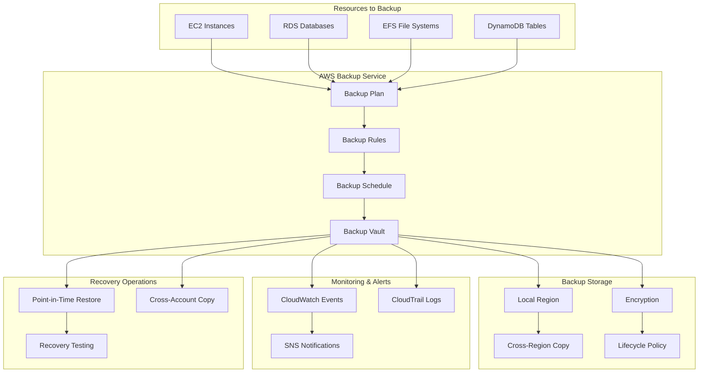

# AWS Backup - Hands-on Lab

## Prerequisites

- AWS CDK and AWS CLI configured
- Resources to backup (EC2, RDS, etc.)
- Completed IAM lab

## Lab Overview

This lab demonstrates automated backup strategies using AWS Backup. You'll create backup plans, configure backup vaults, implement cross-region backup, and set up monitoring and notifications for backup operations.

[DIAGRAM: Backup Operations Flow]



[DIAGRAM: AWS Backup Implementation]
Instructions for draw.io:

1. Create a new diagram using the AWS Architecture 2023 template
2. Use the following AWS symbols from the symbol pack:
   - AWS Backup icon
   - AWS SNS icon
   - AWS EC2 icon
   - AWS RDS icon
   - AWS CloudWatch icon
   - AWS IAM icon
3. Layout:
   - Place Backup Vault at the center
   - Add Backup Plan and Rules on the left
   - Place SNS notifications on the right
   - Show resources to backup (EC2, RDS) at the bottom
4. Use AWS's standard connector arrows to show relationships
5. Add backup flow visualization with schedules
6. Use AWS's standard color scheme:
   - Blue for AWS services
   - Green for backup components
   - Gray for infrastructure elements

## Lab Steps

### 1. Create AWS Backup Infrastructure

Create a new file `lib/backup-stack.ts`:

```typescript:lib/backup-stack.ts
import * as cdk from 'aws-cdk-lib';
import * as backup from 'aws-cdk-lib/aws-backup';
import * as iam from 'aws-cdk-lib/aws-iam';
import * as sns from 'aws-cdk-lib/aws-sns';
import * as subscriptions from 'aws-cdk-lib/aws-sns-subscriptions';
import * as ec2 from 'aws-cdk-lib/aws-ec2';
import * as rds from 'aws-cdk-lib/aws-rds';
import { Construct } from 'constructs';

export class BackupStack extends cdk.Stack {
  constructor(scope: Construct, id: string, props?: cdk.StackProps) {
    super(scope, id, props);

    // Create SNS topic for backup notifications
    const backupTopic = new sns.Topic(this, 'BackupNotificationTopic');
    backupTopic.addSubscription(
      new subscriptions.EmailSubscription('your-email@example.com')
    );

    // Create Backup Vault
    const backupVault = new backup.BackupVault(this, 'MainBackupVault', {
      backupVaultName: 'main-backup-vault',
      notifications: {
        notificationTopic: backupTopic,
        backupVaultEvents: [
          backup.BackupVaultEvents.BACKUP_JOB_COMPLETED,
          backup.BackupVaultEvents.BACKUP_JOB_FAILED,
          backup.BackupVaultEvents.RESTORE_JOB_COMPLETED,
          backup.BackupVaultEvents.RESTORE_JOB_FAILED,
        ],
      },
    });

    // Create Backup Plan
    const backupPlan = new backup.BackupPlan(this, 'MainBackupPlan', {
      backupVault: backupVault,
    });

    // Add backup rules
    backupPlan.addRule(new backup.BackupRule({
      ruleName: 'DailyBackups',
      scheduleExpression: cdk.aws_events.Schedule.cron({
        hour: '3',
        minute: '0',
      }),
      deleteAfter: cdk.Duration.days(30),
      moveToColdStorageAfter: cdk.Duration.days(7),
    }));

    backupPlan.addRule(new backup.BackupRule({
      ruleName: 'WeeklyBackups',
      scheduleExpression: cdk.aws_events.Schedule.cron({
        weekDay: 'SUN',
        hour: '5',
        minute: '0',
      }),
      deleteAfter: cdk.Duration.days(90),
      moveToColdStorageAfter: cdk.Duration.days(30),
      copyActions: [{
        destinationVault: backup.BackupVault.fromBackupVaultName(
          this,
          'CrossRegionVault',
          'cross-region-vault'
        ),
        destinationRegion: 'eu-west-1', // Change as needed
      }],
    }));

    // Create resources to backup (for demonstration)
    const vpc = new ec2.Vpc(this, 'BackupDemoVPC', {
      maxAzs: 2,
    });

    const instance = new ec2.Instance(this, 'BackupDemoEC2', {
      vpc,
      vpcSubnets: {
        subnetType: ec2.SubnetType.PUBLIC,
      },
      instanceType: ec2.InstanceType.of(
        ec2.InstanceClass.T3,
        ec2.InstanceSize.MICRO
      ),
      machineImage: new ec2.AmazonLinuxImage(),
    });

    const database = new rds.DatabaseInstance(this, 'BackupDemoDatabase', {
      vpc,
      engine: rds.DatabaseInstanceEngine.mysql({
        version: rds.MysqlEngineVersion.VER_8_0,
      }),
      instanceType: ec2.InstanceType.of(
        ec2.InstanceClass.T3,
        ec2.InstanceSize.MICRO
      ),
      databaseName: 'demodb',
      removalPolicy: cdk.RemovalPolicy.DESTROY,
    });

    // Add resources to backup plan by tag
    backupPlan.addSelection('ResourceSelection', {
      resources: [
        backup.BackupResource.fromEc2Instance(instance),
        backup.BackupResource.fromRdsDatabaseInstance(database),
      ],
      allowRestores: true,
    });

    // Outputs
    new cdk.CfnOutput(this, 'BackupVaultName', {
      value: backupVault.backupVaultName,
    });

    new cdk.CfnOutput(this, 'BackupPlanId', {
      value: backupPlan.backupPlanId,
    });

    new cdk.CfnOutput(this, 'NotificationTopicArn', {
      value: backupTopic.topicArn,
    });
  }
}
```

### 2. Create Test Scripts

1. Create a script to check backup job status:

```typescript:scripts/check-backup-jobs.ts
import {
  BackupClient,
  ListBackupJobsCommand,
  DescribeBackupJobCommand
} from '@aws-sdk/client-backup';

const backup = new BackupClient({});

async function checkBackupJobs() {
  try {
    const response = await backup.send(new ListBackupJobsCommand({
      ByState: 'COMPLETED',
      MaxResults: 10,
    }));

    console.log('Recent backup jobs:');
    for (const job of response.BackupJobs || []) {
      console.log(`
        Job ID: ${job.BackupJobId}
        Resource: ${job.ResourceArn}
        State: ${job.State}
        Created: ${job.CreationDate}
        Completed: ${job.CompletionDate}
      `);

      // Get detailed information
      const details = await backup.send(new DescribeBackupJobCommand({
        BackupJobId: job.BackupJobId,
      }));

      console.log('Job details:', JSON.stringify(details, null, 2));
    }
  } catch (error) {
    console.error('Error checking backup jobs:', error);
  }
}

checkBackupJobs();
```

2. Create a script to list recovery points:

```typescript:scripts/list-recovery-points.ts
import {
  BackupClient,
  ListRecoveryPointsByBackupVaultCommand
} from '@aws-sdk/client-backup';

const backup = new BackupClient({});

async function listRecoveryPoints() {
  const vaultName = process.env.BACKUP_VAULT_NAME;

  try {
    const response = await backup.send(new ListRecoveryPointsByBackupVaultCommand({
      BackupVaultName: vaultName,
      MaxResults: 10,
    }));

    console.log('Recovery points:');
    for (const point of response.RecoveryPoints || []) {
      console.log(`
        Recovery Point ARN: ${point.RecoveryPointArn}
        Resource Type: ${point.ResourceType}
        Status: ${point.Status}
        Created: ${point.CreationDate}
        Expires: ${point.DeleteAfter}
      `);
    }
  } catch (error) {
    console.error('Error listing recovery points:', error);
  }
}

listRecoveryPoints();
```

### 3. Deploy and Test

1. Deploy the stack:

```bash
cdk deploy BackupStack --profile your-profile-name
```

2. Set environment variables:

```bash
export BACKUP_VAULT_NAME=$(aws cloudformation describe-stacks \
  --stack-name BackupStack \
  --query 'Stacks[0].Outputs[?OutputKey==`BackupVaultName`].OutputValue' \
  --output text \
  --profile your-profile-name)
```

3. Run test scripts:

```bash
ts-node scripts/check-backup-jobs.ts
ts-node scripts/list-recovery-points.ts
```

### 4. Test Restore (Optional)

1. Identify a recovery point to restore
2. Use AWS Console or AWS CLI to initiate restore
3. Verify restored resource

[DIAGRAM: AWS Backup Testing]
Description: A detailed flowchart showing how to test the AWS Backup implementation. The diagram should:

1. Show the testing process:
   - Backup job monitoring
   - Recovery point listing
   - Restore testing
   - Validation
2. Include different backup types
3. Show the monitoring process
4. Illustrate the testing patterns
   Use AWS's standard color scheme and include clear labels for each step.

## Validation Steps

1. Backup Configuration

   - [ ] Backup vault created
   - [ ] Backup plan created
   - [ ] Backup rules configured
   - [ ] Resources tagged for backup
   - [ ] Notifications configured

2. Backup Operations

   - [ ] Daily backups running
   - [ ] Weekly backups running
   - [ ] Cross-region copies working
   - [ ] Notifications working

3. Recovery Testing
   - [ ] Recovery points available
   - [ ] Test restore successful
   - [ ] Cross-region restore working

## Troubleshooting

1. Backup Issues

   - Check IAM roles
   - Verify resource permissions
   - Review backup job logs
   - Check notification delivery

2. Restore Issues

   - Verify recovery point status
   - Check restore permissions
   - Review restore job logs
   - Validate network access

3. Cross-Region Issues
   - Check region configuration
   - Verify cross-region IAM roles
   - Review copy job status
   - Check destination vault

## Cleanup

Remove the stack:

```bash
cdk destroy BackupStack --profile your-profile-name
```

Note: Ensure all backups are no longer needed before cleanup.
