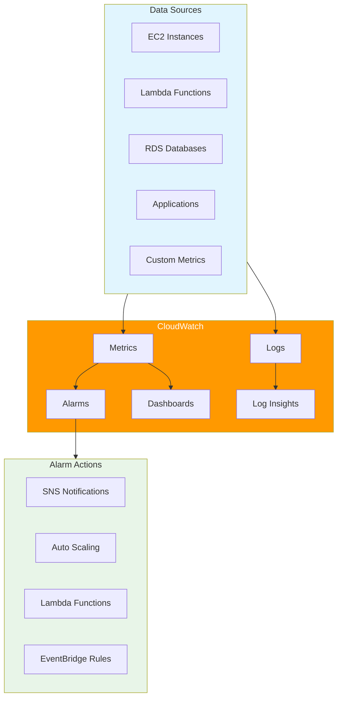

# Amazon CloudWatch - Introduction

## Overview

Amazon CloudWatch is a monitoring and observability service that provides data and actionable insights for AWS, hybrid, and on-premises applications and infrastructure resources. This lab will guide you through implementing comprehensive monitoring, logging, and alerting using CloudWatch's various features.

[DIAGRAM: CloudWatch Monitoring Architecture]

## Learning Objectives

After completing this lab, you will be able to:

- Create and manage CloudWatch metrics and dashboards
- Configure detailed monitoring for AWS resources
- Set up CloudWatch alarms with appropriate thresholds
- Implement CloudWatch Logs and Log Insights
- Create metric filters and patterns
- Configure CloudWatch Events/EventBridge rules
- Use CloudWatch Container Insights
- Implement custom metrics and dimensions
- Set up cross-account monitoring

## Core Concepts

### 1. Metrics and Monitoring

- **CloudWatch Metrics**

  - Standard metrics
  - Custom metrics
  - Metric dimensions
  - Metric math
  - Statistics and periods

- **Dashboards**
  - Widget types
  - Cross-region dashboards
  - Dashboard sharing
  - Live data monitoring

### 2. Alarms and Actions

- **Alarm Types**

  - Metric alarms
  - Composite alarms
  - Anomaly detection

- **Alarm Actions**
  - SNS notifications
  - Auto Scaling actions
  - EC2 actions
  - Systems Manager actions

### 3. Logs and Insights

- **Log Management**

  - Log groups
  - Log streams
  - Retention settings
  - Log insights queries

- **Log Processing**
  - Metric filters
  - Subscription filters
  - Cross-account logging
  - Log analytics

### 4. Events and Rules

- **EventBridge (CloudWatch Events)**
  - Event patterns
  - Schedule expressions
  - Targets and rules
  - Cross-account events

### 5. Advanced Features

- **Container Insights**

  - ECS monitoring
  - EKS monitoring
  - Performance metrics
  - Log collection

- **Synthetics**
  - Canary monitoring
  - API monitoring
  - URL monitoring
  - Script-based monitoring

## Best Practices

### Monitoring Strategy

- Define meaningful metrics
- Set appropriate thresholds
- Implement multi-level alerting
- Use composite alarms
- Configure proper retention
- Implement cost controls

### Security

- Use IAM roles and policies
- Encrypt sensitive data
- Implement log security
- Control dashboard access
- Monitor security events
- Configure audit logging

### Operations

- Standardize naming conventions
- Document alarm thresholds
- Implement escalation procedures
- Regular alarm review
- Test notification paths
- Maintain runbooks

### Cost Management

- Monitor usage and costs
- Optimize retention periods
- Use appropriate resolution
- Control API usage
- Manage dashboard count
- Review inactive alarms

## Prerequisites

Before starting this lab, ensure you have:

- AWS CDK installed and configured
- AWS CLI installed and configured
- Basic understanding of AWS services
- Completed the IAM lab
- Resources to monitor (EC2, RDS, etc.)

## What's Next

In the hands-on portion of this lab, you will:

1. Create CloudWatch dashboards
2. Configure metric alarms
3. Set up log groups and filters
4. Implement custom metrics
5. Create EventBridge rules
6. Configure Container Insights
7. Set up synthetic monitoring
8. Implement cross-account monitoring
