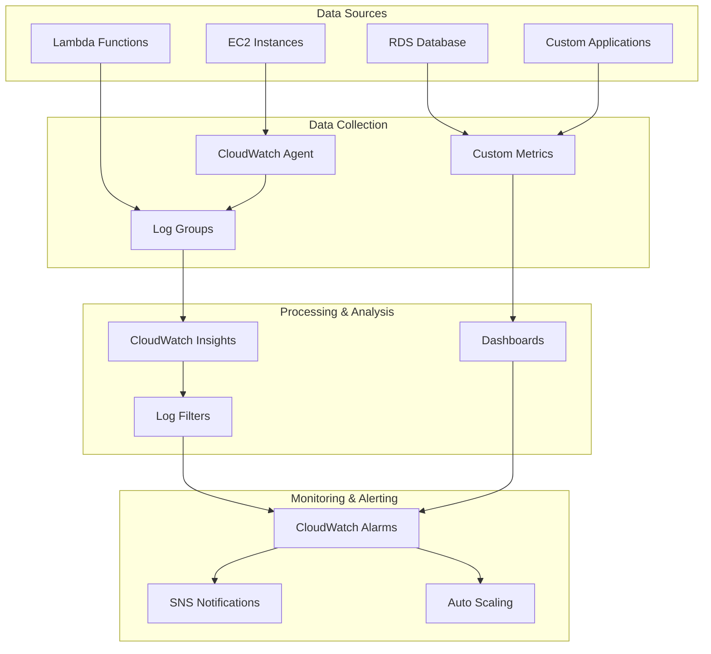

# Amazon CloudWatch - Hands-on Lab

## Prerequisites

Before starting this lab, ensure you have:

- AWS CDK and AWS CLI configured
- Node.js installed
- Resources to monitor (EC2, Lambda, etc.)

## Lab Overview

This lab demonstrates comprehensive monitoring using Amazon CloudWatch. You'll create custom dashboards, set up alarms, configure log aggregation, and implement automated responses to system events.

[DIAGRAM: CloudWatch Monitoring Flow]



## Lab Steps

### 1. Create CloudWatch Infrastructure

Create a new file `lib/cloudwatch-stack.ts`:

```typescript:lib/cloudwatch-stack.ts
import * as cdk from 'aws-cdk-lib';
import * as cloudwatch from 'aws-cdk-lib/aws-cloudwatch';
import * as sns from 'aws-cdk-lib/aws-sns';
import * as subscriptions from 'aws-cdk-lib/aws-sns-subscriptions';
import * as ec2 from 'aws-cdk-lib/aws-ec2';
import * as lambda from 'aws-cdk-lib/aws-lambda';
import * as logs from 'aws-cdk-lib/aws-logs';
import * as events from 'aws-cdk-lib/aws-events';
import * as targets from 'aws-cdk-lib/aws-events-targets';
import { Construct } from 'constructs';

export class CloudWatchStack extends cdk.Stack {
  constructor(scope: Construct, id: string, props?: cdk.StackProps) {
    super(scope, id, props);

    // Create SNS topic for alerts
    const alertTopic = new sns.Topic(this, 'AlertTopic');
    alertTopic.addSubscription(
      new subscriptions.EmailSubscription('your-email@example.com')
    );

    // Create VPC and EC2 instance to monitor
    const vpc = new ec2.Vpc(this, 'MonitoringVPC', {
      maxAzs: 2,
    });

    const instance = new ec2.Instance(this, 'MonitoredInstance', {
      vpc,
      vpcSubnets: {
        subnetType: ec2.SubnetType.PUBLIC,
      },
      instanceType: ec2.InstanceType.of(
        ec2.InstanceClass.T3,
        ec2.InstanceSize.MICRO
      ),
      machineImage: new ec2.AmazonLinuxImage(),
    });

    // Enable detailed monitoring for the instance
    instance.node.addDependency(
      new cdk.CfnResource(this, 'DetailedMonitoring', {
        type: 'AWS::EC2::Instance',
        properties: {
          Monitoring: true,
        },
      })
    );

    // Create CloudWatch Dashboard
    const dashboard = new cloudwatch.Dashboard(this, 'MonitoringDashboard', {
      dashboardName: 'monitoring-dashboard',
    });

    // Add widgets to dashboard
    dashboard.addWidgets(
      new cloudwatch.GraphWidget({
        title: 'CPU Utilization',
        left: [
          instance.metricCpuUtilization({
            period: cdk.Duration.minutes(1),
            statistic: 'Average',
          }),
        ],
      }),
      new cloudwatch.GraphWidget({
        title: 'Memory Usage',
        left: [
          new cloudwatch.Metric({
            namespace: 'AWS/EC2',
            metricName: 'MemoryUtilization',
            dimensionsMap: {
              InstanceId: instance.instanceId,
            },
            period: cdk.Duration.minutes(1),
            statistic: 'Average',
          }),
        ],
      })
    );

    // Create CPU Utilization Alarm
    const cpuAlarm = new cloudwatch.Alarm(this, 'CPUAlarm', {
      metric: instance.metricCpuUtilization(),
      threshold: 80,
      evaluationPeriods: 2,
      datapointsToAlarm: 2,
      comparisonOperator:
        cloudwatch.ComparisonOperator.GREATER_THAN_THRESHOLD,
    });

    cpuAlarm.addAlarmAction(new cloudwatch.SnsAction(alertTopic));

    // Create Lambda function for custom metrics
    const metricsFunction = new lambda.Function(this, 'MetricsFunction', {
      runtime: lambda.Runtime.NODEJS_22_X,
      handler: 'index.handler',
      code: lambda.Code.fromAsset('src/metrics-function'),
      environment: {
        INSTANCE_ID: instance.instanceId,
      },
    });

    // Create CloudWatch Log Group
    const logGroup = new logs.LogGroup(this, 'ApplicationLogs', {
      retention: logs.RetentionDays.ONE_WEEK,
    });

    // Create Metric Filter
    const errorMetricFilter = new logs.MetricFilter(this, 'ErrorMetricFilter', {
      logGroup,
      filterPattern: logs.FilterPattern.literal('ERROR'),
      metricNamespace: 'CustomMetrics',
      metricName: 'ErrorCount',
    });

    // Create Error Count Alarm
    const errorAlarm = new cloudwatch.Alarm(this, 'ErrorAlarm', {
      metric: errorMetricFilter.metric(),
      threshold: 5,
      evaluationPeriods: 1,
      comparisonOperator:
        cloudwatch.ComparisonOperator.GREATER_THAN_THRESHOLD,
    });

    errorAlarm.addAlarmAction(new cloudwatch.SnsAction(alertTopic));

    // Create EventBridge Rule
    const rule = new events.Rule(this, 'ScheduledMetricsRule', {
      schedule: events.Schedule.rate(cdk.Duration.minutes(5)),
    });

    rule.addTarget(new targets.LambdaFunction(metricsFunction));

    // Outputs
    new cdk.CfnOutput(this, 'DashboardURL', {
      value: `https://${this.region}.console.aws.amazon.com/cloudwatch/home?region=${this.region}#dashboards:name=${dashboard.dashboardName}`,
    });

    new cdk.CfnOutput(this, 'AlertTopicArn', {
      value: alertTopic.topicArn,
    });

    new cdk.CfnOutput(this, 'LogGroupName', {
      value: logGroup.logGroupName,
    });
  }
}
```

### 2. Create Lambda Function for Custom Metrics

Create a new file `src/metrics-function/index.ts`:

```typescript:src/metrics-function/index.ts
import {
  CloudWatchClient,
  PutMetricDataCommand
} from '@aws-sdk/client-cloudwatch';

const cloudwatch = new CloudWatchClient({});

export const handler = async (event: any): Promise<any> => {
  try {
    // Example custom metric
    const command = new PutMetricDataCommand({
      Namespace: 'CustomMetrics',
      MetricData: [
        {
          MetricName: 'CustomMetric',
          Value: Math.random() * 100,
          Unit: 'Count',
          Dimensions: [
            {
              Name: 'InstanceId',
              Value: process.env.INSTANCE_ID || '',
            },
          ],
        },
      ],
    });

    await cloudwatch.send(command);
    console.log('Successfully published custom metric');

    return {
      statusCode: 200,
      body: 'Metrics published successfully',
    };
  } catch (error) {
    console.error('Error publishing metrics:', error);
    throw error;
  }
};
```

### 3. Create Test Scripts

1. Create a script to publish test logs:

```typescript:scripts/publish-logs.ts
import {
  CloudWatchLogsClient,
  PutLogEventsCommand
} from '@aws-sdk/client-cloudwatch-logs';

const logs = new CloudWatchLogsClient({});

async function publishLogs() {
  const logGroupName = process.env.LOG_GROUP_NAME;
  const logStreamName = 'test-stream';

  try {
    const command = new PutLogEventsCommand({
      logGroupName,
      logStreamName,
      logEvents: [
        {
          timestamp: Date.now(),
          message: 'INFO: Test log message',
        },
        {
          timestamp: Date.now(),
          message: 'ERROR: Test error message',
        },
      ],
    });

    await logs.send(command);
    console.log('Successfully published logs');
  } catch (error) {
    console.error('Error publishing logs:', error);
  }
}

publishLogs();
```

### 4. Deploy and Test

1. Deploy the stack:

```bash
cdk deploy CloudWatchStack --profile your-profile-name
```

2. Set environment variables:

```bash
export LOG_GROUP_NAME=$(aws cloudformation describe-stacks \
  --stack-name CloudWatchStack \
  --query 'Stacks[0].Outputs[?OutputKey==`LogGroupName`].OutputValue' \
  --output text \
  --profile your-profile-name)
```

3. Run test scripts:

```bash
ts-node scripts/publish-logs.ts
ts-node scripts/check-alarms.ts
```

## Validation Steps

1. Dashboard Setup

   - [ ] Dashboard created
   - [ ] Widgets displaying data
   - [ ] Metrics updating

2. Alarms Configuration

   - [ ] CPU alarm active
   - [ ] Error count alarm active
   - [ ] SNS notifications working

3. Logs and Metrics

   - [ ] Log group created
   - [ ] Metric filter working
   - [ ] Custom metrics publishing

4. EventBridge Integration
   - [ ] Scheduled rule running
   - [ ] Lambda function executing
   - [ ] Metrics being collected

## Troubleshooting

1. Metric Issues

   - Check IAM permissions
   - Verify metric namespace
   - Review metric dimensions
   - Check metric resolution

2. Alarm Issues

   - Verify threshold values
   - Check evaluation periods
   - Review alarm actions
   - Check SNS delivery

3. Log Issues
   - Check log group permissions
   - Verify log retention
   - Review metric filters
   - Check log delivery

## Cleanup

Remove the stack:

```bash
cdk destroy CloudWatchStack --profile your-profile-name
```

Note: Ensure all monitoring data is no longer needed before cleanup.
