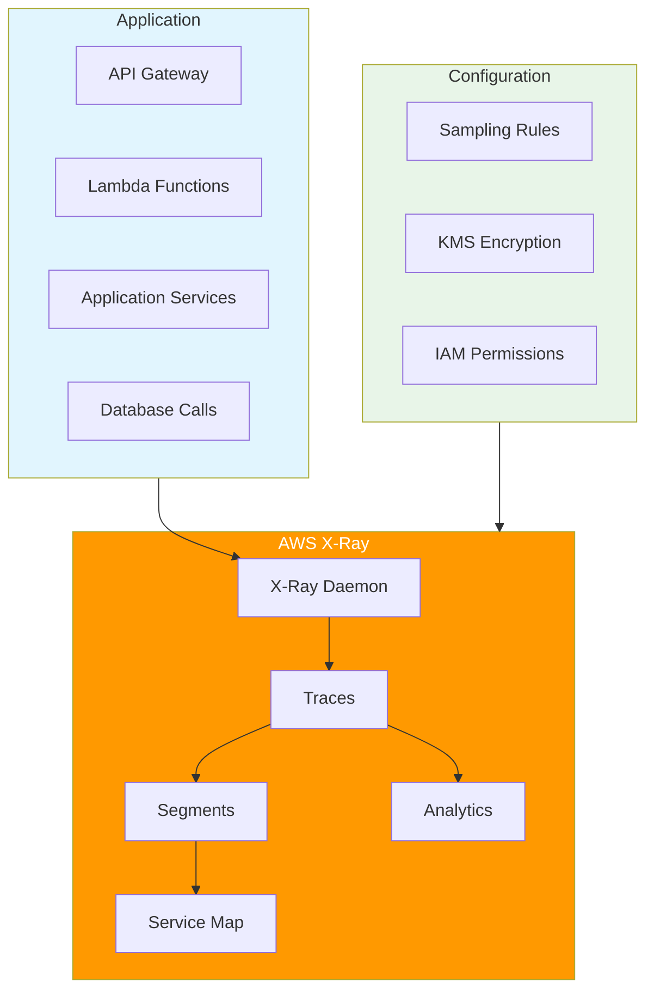

# AWS X-Ray - Introduction

## Overview

AWS X-Ray helps developers analyze and debug production, distributed applications, such as those built using a microservices architecture. With X-Ray, you can understand how your application and its underlying services are performing to identify and troubleshoot the root cause of performance issues and errors.

[DIAGRAM: X-Ray Tracing Architecture]

## Learning Objectives

After completing this lab, you will be able to:

- Instrument applications with X-Ray tracing
- Analyze service maps and trace data
- Configure sampling rules and encryption
- Implement custom subsegments and annotations
- Use X-Ray with various AWS services
- Troubleshoot application issues using traces
- Implement distributed tracing across services
- Create and analyze service graphs

## Core Concepts

### 1. X-Ray Components

- **Traces**

  - Request flow through application
  - Segments and subsegments
  - Trace header propagation
  - Sampling rules

- **Segments**
  - Service boundaries
  - Request/response data
  - Resource information
  - Custom attributes

### 2. Instrumentation

- **SDK Integration**

  - Automatic instrumentation
  - Manual instrumentation
  - Custom subsegments
  - Error handling

- **Sampling**
  - Sampling rules
  - Reservoir sampling
  - Custom sampling
  - Sampling rates

### 3. Service Integration

- **AWS Services**

  - Lambda integration
  - API Gateway
  - App Mesh
  - ECS/EKS
  - Elastic Beanstalk

- **Custom Services**
  - HTTP clients
  - Database calls
  - External APIs
  - Microservices

### 4. Analysis Features

- **Service Map**

  - Service relationships
  - Latency distribution
  - Error rates
  - Request volume

- **Trace Analysis**
  - Trace search
  - Trace timeline
  - Exception tracking
  - Performance bottlenecks

## Best Practices

### Implementation

- Use appropriate sampling rates
- Implement meaningful annotations
- Add business-relevant metadata
- Structure subsegments logically
- Handle errors appropriately
- Propagate context headers

### Security

- Encrypt sensitive data
- Use IAM roles effectively
- Implement access controls
- Monitor API activity
- Secure configuration
- Regular security reviews

### Operations

- Monitor daemon health
- Review sampling rules
- Analyze trace patterns
- Track error rates
- Monitor latency
- Set up alerts

### Cost Management

- Optimize sampling rates
- Monitor trace volume
- Clean up unused rules
- Review retention settings
- Track API usage
- Analyze cost patterns

## Prerequisites

Before starting this lab, ensure you have:

- AWS CDK installed and configured
- AWS CLI installed and configured
- Node.js development environment
- Basic understanding of distributed systems
- Completed the CloudWatch lab
- Understanding of microservices concepts

## What's Next

In the hands-on portion of this lab, you will:

1. Set up X-Ray daemon
2. Instrument a Node.js application
3. Configure sampling rules
4. Implement custom subsegments
5. Add annotations and metadata
6. Analyze trace data
7. Create service maps
8. Troubleshoot using traces
