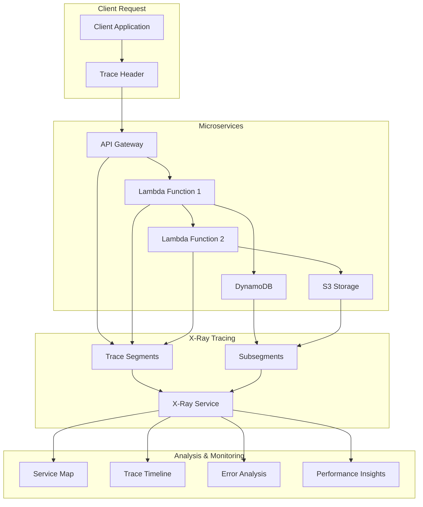

# AWS X-Ray - Hands-on Lab

## Prerequisites

Before starting this lab, ensure you have:

- AWS CDK and AWS CLI configured
- Node.js installed
- Basic understanding of distributed tracing

## Lab Overview

This lab demonstrates distributed tracing using AWS X-Ray. You'll instrument applications to trace requests across multiple services, analyze performance bottlenecks, and monitor service dependencies in distributed architectures.

[DIAGRAM: X-Ray Tracing Flow]



## Lab Steps

### 1. Create X-Ray Infrastructure

Create a new file `lib/xray-stack.ts`:

```typescript:lib/xray-stack.ts
import * as cdk from 'aws-cdk-lib';
import * as lambda from 'aws-cdk-lib/aws-lambda';
import * as apigateway from 'aws-cdk-lib/aws-apigateway';
import * as dynamodb from 'aws-cdk-lib/aws-dynamodb';
import * as iam from 'aws-cdk-lib/aws-iam';
import { Construct } from 'constructs';

export class XRayStack extends cdk.Stack {
  constructor(scope: Construct, id: string, props?: cdk.StackProps) {
    super(scope, id, props);

    // Create DynamoDB table
    const table = new dynamodb.Table(this, 'ItemsTable', {
      partitionKey: { name: 'id', type: dynamodb.AttributeType.STRING },
      billingMode: dynamodb.BillingMode.PAY_PER_REQUEST,
      removalPolicy: cdk.RemovalPolicy.DESTROY,
    });

    // Create Lambda function with X-Ray tracing enabled
    const itemsFunction = new lambda.Function(this, 'ItemsFunction', {
      runtime: lambda.Runtime.NODEJS_18_X,
      handler: 'index.handler',
      code: lambda.Code.fromAsset('src/items-function'),
      tracing: lambda.Tracing.ACTIVE, // Enable X-Ray tracing
      environment: {
        TABLE_NAME: table.tableName,
      },
    });

    // Grant DynamoDB permissions to Lambda
    table.grantReadWriteData(itemsFunction);

    // Create API Gateway with X-Ray tracing enabled
    const api = new apigateway.RestApi(this, 'ItemsApi', {
      deployOptions: {
        tracingEnabled: true, // Enable X-Ray tracing
        dataTraceEnabled: true,
        loggingLevel: apigateway.MethodLoggingLevel.INFO,
      },
    });

    // Create API resources and methods
    const items = api.root.addResource('items');

    items.addMethod('GET', new apigateway.LambdaIntegration(itemsFunction));
    items.addMethod('POST', new apigateway.LambdaIntegration(itemsFunction));

    const singleItem = items.addResource('{id}');
    singleItem.addMethod('GET', new apigateway.LambdaIntegration(itemsFunction));
    singleItem.addMethod('DELETE', new apigateway.LambdaIntegration(itemsFunction));

    // Create custom sampling rule
    new cdk.aws_xray.CfnSamplingRule(this, 'CustomSamplingRule', {
      ruleName: 'ItemsApiRule',
      priority: 1000,
      fixedRate: 0.5,
      reservoirSize: 20,
      serviceName: '*',
      serviceType: '*',
      host: '*',
      httpMethod: '*',
      urlPath: '/items/*',
      version: 1,
    });

    // Outputs
    new cdk.CfnOutput(this, 'ApiUrl', {
      value: api.url,
    });

    new cdk.CfnOutput(this, 'TableName', {
      value: table.tableName,
    });
  }
}
```

### 2. Create Lambda Function with X-Ray Instrumentation

Create a new file `src/items-function/index.ts`:

```typescript:src/items-function/index.ts
import {
  DynamoDBClient,
  PutItemCommand,
  GetItemCommand,
  DeleteItemCommand,
  ScanCommand
} from '@aws-sdk/client-dynamodb';
import {
  APIGatewayProxyEvent,
  APIGatewayProxyResult
} from 'aws-lambda';
import * as AWSXRay from 'aws-xray-sdk';

// Instrument DynamoDB client with X-Ray
const ddbClient = AWSXRay.captureAWSv3Client(new DynamoDBClient({}));

export const handler = async (
  event: APIGatewayProxyEvent
): Promise<APIGatewayProxyResult> => {
  // Create X-Ray subsegment
  const segment = AWSXRay.getSegment();
  const subsegment = segment?.addNewSubsegment('handler');

  try {
    const method = event.httpMethod;
    const id = event.pathParameters?.id;

    // Add annotation for HTTP method
    subsegment?.addAnnotation('httpMethod', method);

    switch (method) {
      case 'GET':
        if (id) {
          // Get single item
          const getResult = await ddbClient.send(new GetItemCommand({
            TableName: process.env.TABLE_NAME,
            Key: { id: { S: id } },
          }));

          return {
            statusCode: 200,
            body: JSON.stringify(getResult.Item),
          };
        } else {
          // List all items
          const scanResult = await ddbClient.send(new ScanCommand({
            TableName: process.env.TABLE_NAME,
          }));

          return {
            statusCode: 200,
            body: JSON.stringify(scanResult.Items),
          };
        }

      case 'POST':
        // Create new item
        const item = JSON.parse(event.body || '{}');
        const itemId = Date.now().toString();

        await ddbClient.send(new PutItemCommand({
          TableName: process.env.TABLE_NAME,
          Item: {
            id: { S: itemId },
            ...Object.entries(item).reduce((acc, [key, value]) => ({
              ...acc,
              [key]: { S: value as string },
            }), {}),
          },
        }));

        return {
          statusCode: 201,
          body: JSON.stringify({ id: itemId }),
        };

      case 'DELETE':
        if (!id) {
          throw new Error('ID is required for DELETE');
        }

        await ddbClient.send(new DeleteItemCommand({
          TableName: process.env.TABLE_NAME,
          Key: { id: { S: id } },
        }));

        return {
          statusCode: 204,
          body: '',
        };

      default:
        return {
          statusCode: 400,
          body: JSON.stringify({ error: 'Unsupported method' }),
        };
    }
  } catch (error) {
    // Record error in subsegment
    subsegment?.addError(error as Error);

    console.error('Error:', error);
    return {
      statusCode: 500,
      body: JSON.stringify({ error: 'Internal server error' }),
    };
  } finally {
    subsegment?.close();
  }
};
```

### 3. Create Test Scripts

1. Create a script to test the API:

```typescript:scripts/test-api.ts
import axios from 'axios';

async function testApi() {
  const apiUrl = process.env.API_URL;

  try {
    // Create item
    console.log('Creating item...');
    const createResponse = await axios.post(`${apiUrl}items`, {
      name: 'Test Item',
      description: 'This is a test item',
    });
    console.log('Created item:', createResponse.data);

    const itemId = createResponse.data.id;

    // Get item
    console.log('\nGetting item...');
    const getResponse = await axios.get(`${apiUrl}items/${itemId}`);
    console.log('Retrieved item:', getResponse.data);

    // List items
    console.log('\nListing all items...');
    const listResponse = await axios.get(`${apiUrl}items`);
    console.log('All items:', listResponse.data);

    // Delete item
    console.log('\nDeleting item...');
    await axios.delete(`${apiUrl}items/${itemId}`);
    console.log('Item deleted successfully');

  } catch (error) {
    console.error('Error testing API:', error);
  }
}

[DIAGRAM: X-Ray Testing]
Description: A detailed flowchart showing how to test the X-Ray implementation. The diagram should:

1. Show the testing process:
   - API requests
   - Trace collection
   - Segment analysis
   - Error tracking
2. Include different request types
3. Show the tracing process
4. Illustrate the testing patterns
   Use AWS's standard color scheme and include clear labels for each step.

testApi();
```

2. Create a script to analyze traces:

```typescript:scripts/analyze-traces.ts
import {
  XRayClient,
  GetTraceSummariesCommand,
  BatchGetTracesCommand
} from '@aws-sdk/client-xray';

const xray = new XRayClient({});

async function analyzeTraces() {
  try {
    // Get recent trace summaries
    const summariesResponse = await xray.send(new GetTraceSummariesCommand({
      StartTime: new Date(Date.now() - 15 * 60 * 1000), // Last 15 minutes
      EndTime: new Date(),
      FilterExpression: "service(\"ItemsApi\")",
    }));

    if (!summariesResponse.TraceSummaries?.length) {
      console.log('No traces found');
      return;
    }

    // Get detailed trace data
    const traceIds = summariesResponse.TraceSummaries.map(
      summary => summary.Id as string
    );

    const tracesResponse = await xray.send(new BatchGetTracesCommand({
      TraceIds: traceIds,
    }));

    console.log('Trace Analysis:');
    tracesResponse.Traces?.forEach(trace => {
      console.log(`\nTrace ID: ${trace.Id}`);
      console.log('Segments:');
      trace.Segments?.forEach(segment => {
        const document = JSON.parse(segment.Document as string);
        console.log(`- ${document.name}: ${document.end_time - document.start_time}s`);
      });
    });

  } catch (error) {
    console.error('Error analyzing traces:', error);
  }
}

analyzeTraces();
```

### 4. Deploy and Test

1. Deploy the stack:

```bash
cdk deploy XRayStack --profile your-profile-name
```

2. Set environment variables:

```bash
export API_URL=$(aws cloudformation describe-stacks \
  --stack-name XRayStack \
  --query 'Stacks[0].Outputs[?OutputKey==`ApiUrl`].OutputValue' \
  --output text \
  --profile your-profile-name)
```

3. Run test scripts:

```bash
ts-node scripts/test-api.ts
# Wait a few minutes for traces to be available
ts-node scripts/analyze-traces.ts
```

## Validation Steps

1. X-Ray Setup

   - [ ] X-Ray daemon running
   - [ ] Sampling rules configured
   - [ ] Tracing enabled for services

2. API Testing

   - [ ] All API endpoints working
   - [ ] Traces being generated
   - [ ] Subsegments visible

3. Trace Analysis
   - [ ] Service map available
   - [ ] Trace details accessible
   - [ ] Error tracking working

## Troubleshooting

1. Tracing Issues

   - Check IAM permissions
   - Verify daemon status
   - Review sampling rules
   - Check SDK configuration

2. API Issues

   - Check Lambda logs
   - Verify API Gateway setup
   - Review DynamoDB access
   - Check error responses

3. Analysis Issues
   - Check trace availability
   - Verify time windows
   - Review filter expressions
   - Check segment data

## Cleanup

Remove the stack:

```bash
cdk destroy XRayStack --profile your-profile-name
```

Note: Ensure all trace data is no longer needed before cleanup.
