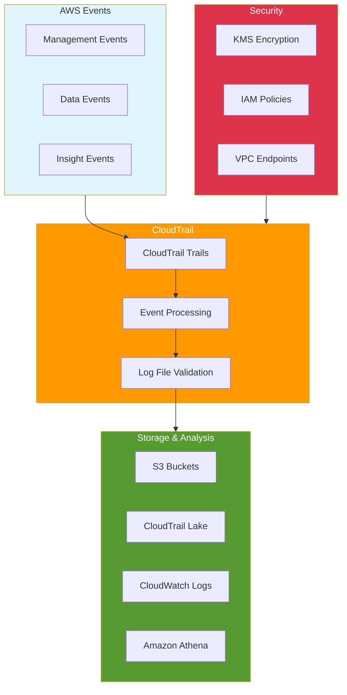

# AWS CloudTrail Audit - Introduction

## Overview

AWS CloudTrail is a service that enables governance, compliance, operational auditing, and risk auditing of your AWS account. This lab focuses on implementing comprehensive audit logging, analyzing CloudTrail logs, and setting up security controls using CloudTrail data.

[DIAGRAM: CloudTrail Audit Architecture]

## Learning Objectives

After completing this lab, you will be able to:

- Configure and manage CloudTrail trails
- Implement multi-region and organization trails
- Set up log file validation and encryption
- Create CloudWatch Logs integration
- Analyze CloudTrail logs effectively
- Implement automated compliance checks
- Configure security notifications
- Use CloudTrail Lake for advanced querying
- Implement audit and compliance controls

## Core Concepts

### 1. Trail Configuration

- **Trail Types**

  - Single-region trails
  - Multi-region trails
  - Organization trails
  - Management events
  - Data events

- **Storage Configuration**
  - S3 bucket setup
  - Log file validation
  - KMS encryption
  - Retention policies

### 2. Event Logging

- **Management Events**

  - API activity
  - Console actions
  - Service events
  - IAM events

- **Data Events**
  - S3 object-level activity
  - Lambda function execution
  - DynamoDB activity
  - Custom data events

### 3. Analysis and Integration

- **CloudTrail Lake**

  - Event data stores
  - SQL queries
  - Integration with Athena
  - Custom insights

- **CloudWatch Integration**
  - Metric filters
  - Alarms
  - Log insights
  - Dashboards

### 4. Security Controls

- **Log Security**

  - Encryption configuration
  - Access controls
  - Log file integrity
  - Cross-account logging

- **Compliance**
  - Audit requirements
  - Regulatory compliance
  - Policy enforcement
  - Evidence collection

## Best Practices

### Implementation

- Enable multi-region trails
- Configure log file validation
- Implement KMS encryption
- Set appropriate retention
- Use organization trails
- Enable CloudTrail Lake

### Security

- Secure S3 buckets
- Implement least privilege
- Monitor API activity
- Configure alerts
- Regular security reviews
- Validate log integrity

### Operations

- Monitor trail status
- Review log delivery
- Analyze usage patterns
- Implement automation
- Regular compliance checks
- Maintain documentation

### Cost Management

- Monitor storage usage
- Optimize retention
- Control API activity
- Manage Lake queries
- Review integration costs
- Clean up unused trails

## Prerequisites

Before starting this lab, ensure you have:

- AWS CDK installed and configured
- AWS CLI installed and configured
- Basic understanding of AWS services
- Completed the IAM lab
- Understanding of security concepts
- Basic SQL knowledge (for CloudTrail Lake)

## What's Next

In the hands-on portion of this lab, you will:

1. Configure CloudTrail trails
2. Set up log file validation
3. Implement CloudWatch integration
4. Create CloudTrail Lake queries
5. Configure security notifications
6. Analyze audit logs
7. Implement compliance controls
8. Set up automated monitoring

This comprehensive lab will teach you to implement robust auditing and compliance monitoring using AWS CloudTrail, essential for maintaining security and meeting regulatory requirements in enterprise environments.
